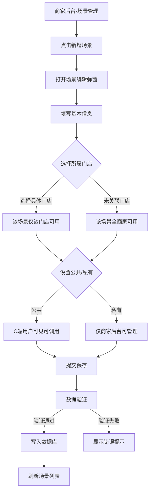
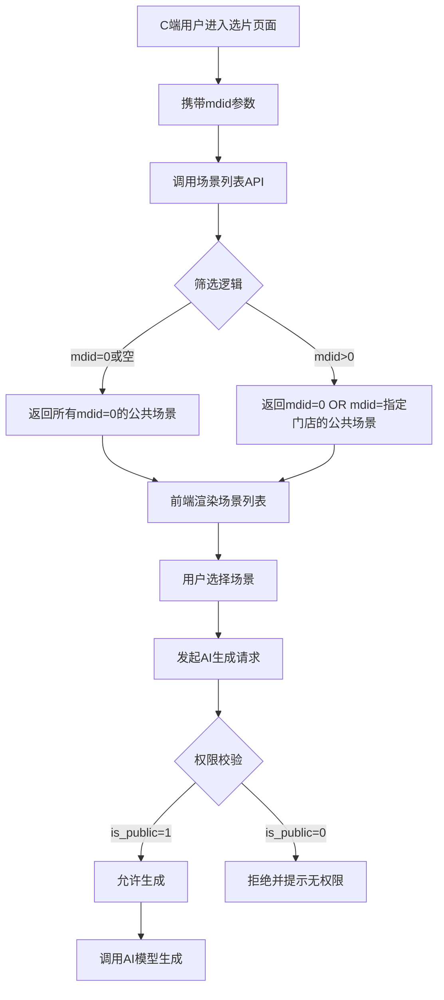
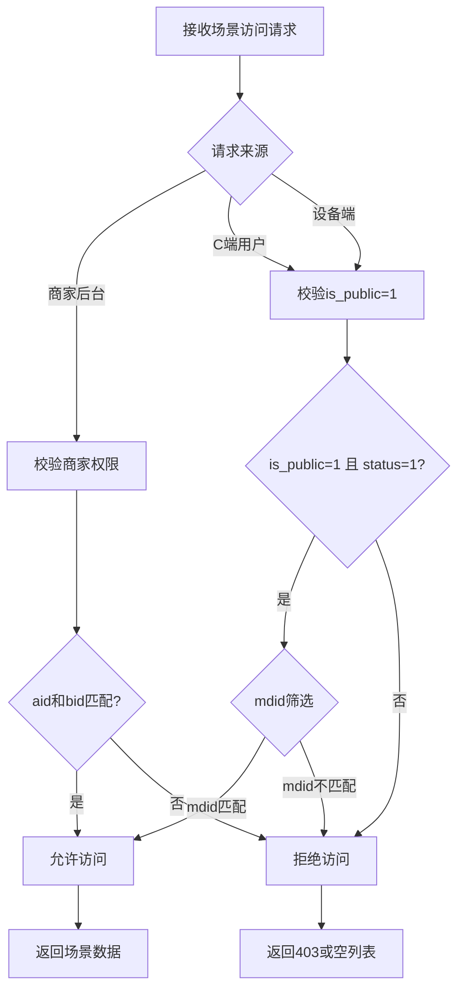

# 场景管理功能扩展设计

## 概述

### 功能背景
当前AI旅拍系统的场景管理已支持场景的基本CRUD操作，包括场景名称、分类、封面图、提示词等核心字段。现需要增强场景的权限控制能力，支持门店维度的场景管理和公共/私有场景的可见性控制。

### 核心需求
在场景管理的编辑界面增加两个核心配置项：
1. **门店选择**：支持将场景关联到特定门店，实现门店维度的场景隔离
2. **公共/私有设置**：控制场景的可见范围
   - **公共场景**：全部用户可调用（C端用户可见可使用）
   - **私有场景**：仅供商家可用（仅商家后台可管理和使用）

### 业务价值
- 实现多门店场景的独立管理，满足连锁经营需求
- 提供场景的访问权限控制，保护商家私有场景资源
- 支持总部统一配置公共场景，各门店自定义私有场景的混合模式

## 架构设计

### 数据模型扩展

#### 场景表字段现状
`ddwx_ai_travel_photo_scene` 表已包含以下相关字段：

| 字段名 | 类型 | 当前状态 | 说明 |
|--------|------|----------|------|
| `mdid` | int(11) | 已存在 | 门店ID，默认值0表示无门店 |
| `is_public` | tinyint(1) | 已存在 | 是否公共场景：0否 1是 |
| `bid` | int(11) | 已存在 | 商家ID，0为平台通用场景 |
| `aid` | int(11) | 已存在 | 平台ID |

#### 字段语义调整说明

**mdid（门店ID）字段**
- 当前为默认值0（无门店），需在编辑界面提供门店选择器
- 取值逻辑：
  - `0`：未关联门店（全商家可用）
  - `>0`：关联具体门店（仅该门店可用）

**is_public（公共/私有）字段**
- 0：私有场景，仅商家后台可管理和使用，C端用户不可见
- 1：公共场景，C端用户可见可调用，商家后台同样可管理

**权限组合逻辑**

| mdid | is_public | 业务含义 | 使用场景 |
|------|-----------|----------|----------|
| 0 | 0 | 商家私有通用场景 | 商家所有门店共享，但不对C端开放 |
| 0 | 1 | 商家公共通用场景 | 商家所有门店共享，且C端用户可见 |
| >0 | 0 | 门店私有场景 | 仅指定门店可用，不对C端开放 |
| >0 | 1 | 门店公共场景 | 仅指定门店可用，且该门店的C端用户可见 |

### 业务逻辑层设计

#### 场景列表查询逻辑

**后台管理场景列表**
```
查询条件：
- aid = 当前平台ID
- bid = 当前商家ID（超级管理员自动解析到第一个商家）
- 可按 mdid 筛选（新增门店筛选器）
- 可按 is_public 筛选（新增公共/私有筛选器）

排序规则：
- 优先级：sort DESC（排序权重高的在前）
- 次要：id DESC（新创建的在前）
```

**API场景列表（供C端和设备端调用）**
```
查询条件：
- aid = 当前平台ID
- bid = 当前商家ID
- is_public = 1（仅返回公共场景）
- status = 1（仅返回启用状态）
- 如提供 mdid 参数，则：
  - WHERE (mdid = 0 OR mdid = 指定门店ID)
  - 含义：返回通用公共场景 + 该门店的公共场景

返回字段：
- 场景基本信息（id, name, category, cover, desc）
- 提示词相关（prompt, prompt_en, negative_prompt）
- 模型配置（model_id, aspect_ratio）
- 统计数据（use_count, success_count）
```

#### 场景保存逻辑

**新增场景**
```
1. 数据验证
   - 场景名称必填
   - 分类必选
   - 封面图和背景图必填
   - 提示词（中文）必填
   - mdid 默认为0（未关联门店）
   - is_public 默认为0（私有场景）

2. 权限控制
   - aid = 当前平台ID
   - bid = 当前商家ID（超级管理员自动解析）
   - mdid = 用户选择的门店ID（可为0）
   - is_public = 用户选择的公共/私有状态

3. 自动设置
   - create_time = 当前时间戳
   - update_time = 当前时间戳
   - status = 默认启用（1）
   - sort = 默认0
```

**编辑场景**
```
1. 权限验证
   - 仅可编辑本商家的场景
   - 查询条件：id = 指定ID AND aid = 当前aid AND bid = 当前bid

2. 允许修改的字段
   - 基本信息：name, category, desc, cover, background_url
   - 提示词：prompt, prompt_en, negative_prompt, video_prompt
   - 模型配置：model_id, aspect_ratio
   - 权限配置：mdid, is_public（本次新增可编辑）
   - 其他：sort, tags, status, is_recommend

3. 自动更新
   - update_time = 当前时间戳
```

#### 场景删除逻辑

**删除前校验**
```
1. 检查场景是否被使用
   - 查询 ai_travel_photo_generation 表
   - WHERE scene_id = 待删除ID
   - 如存在关联记录，拒绝删除并提示"该场景已被使用，不能删除"

2. 权限校验
   - 仅可删除本商家的场景
   - WHERE id = 指定ID AND aid = 当前aid AND bid = 当前bid
```

### 视图层设计

#### 场景编辑表单扩展

**门店选择器位置**
插入位置：在"场景分类"字段之后

```
表单结构：
┌─────────────────────────────────────┐
│ 场景名称：[输入框]                  │
│ 场景分类：[下拉选择]                │
│ 所属门店：[下拉选择] ← 新增         │
│ 封面图：[上传组件]                  │
│ ...                                 │
│ 是否公共场景：[开关] ← 已存在但需调整位置 │
│ ...                                 │
└─────────────────────────────────────┘
```

**门店下拉选项构造**
```
选项来源：
- 查询 mendian 表
- 查询条件（考虑多租户兼容性）：
  - 超级管理员(bid=0)：
    - WHERE aid = 当前aid
    - AND (bid = 解析出的商家bid OR bid = 0)
  - 普通商家：
    - WHERE aid = 当前aid AND bid = 当前bid

选项格式：
<option value="0" selected>未关联门店（全商家可用）</option>
{foreach mendian_list}
<option value="{门店ID}">{门店名称}</option>
{/foreach}
```

**公共/私有开关位置调整**
当前位置：表单末尾附近

建议调整位置：紧随"所属门店"字段之后

```
调整后的字段顺序：
1. 场景名称
2. 场景分类
3. 所属门店（新增）
4. 是否公共场景（位置调整）← 移动到此处
5. 封面图
6. 背景图
7. 场景描述
8. 提示词（中文）
9. ...（其他字段）
```

**字段交互提示**

门店选择器提示文案：
```
辅助说明：
- 当选择"未关联门店"时：该场景对商家所有门店可用
- 当选择具体门店时：该场景仅对选中门店可用
```

公共/私有开关提示文案：
```
辅助说明：
- 开启"公共"：C端用户可见并调用此场景
- 关闭（私有）：仅商家后台可管理和使用，C端不可见
```

#### 场景列表页面扩展

**新增筛选器**

在现有筛选区域增加两个筛选项：

```
筛选区布局：
┌──────────────────────────────────────────────────┐
│ 分类：[全部▼]  状态：[全部▼]                    │
│ 门店：[全部门店▼] ← 新增                        │
│ 属性：[全部▼ / 公共场景 / 私有场景] ← 新增       │
│ [搜索] 按钮                                      │
└──────────────────────────────────────────────────┘
```

**列表字段新增**

在表格列中增加两列：

| 字段名 | 位置 | 宽度 | 显示逻辑 |
|--------|------|------|----------|
| 所属门店 | 在"分类"之后 | 120px | 显示门店名称，mdid=0时显示"-" |
| 场景属性 | 在"状态"之前 | 100px | is_public=1显示"公共"，0显示"私有" |

**表格列渲染模板**

所属门店列：
```
渲染逻辑：
- 根据 mdid 匹配 mendian_list 中的门店名称
- mdid = 0 时显示"-"或"未关联"
- mdid > 0 且找不到门店时显示"门店不存在(ID:{mdid})"
```

场景属性列：
```
渲染逻辑：
- is_public = 1：<span style="color:#16b777">公共</span>
- is_public = 0：<span style="color:#999">私有</span>
```

## API接口设计

### 场景列表API（供C端调用）

**接口路径**
```
GET /api/ai_travel_photo/scene/list
```

**请求参数**

| 参数名 | 类型 | 必填 | 说明 |
|--------|------|------|------|
| mdid | int | 否 | 门店ID，传入后筛选该门店可用的场景 |
| category | string | 否 | 分类筛选 |
| page | int | 否 | 页码，默认1 |
| limit | int | 否 | 每页数量，默认20 |

**查询逻辑**
```
基础条件：
- aid = 当前平台ID（从设备令牌或用户会话中获取）
- bid = 当前商家ID
- is_public = 1（仅返回公共场景）
- status = 1（仅返回启用状态）

门店筛选逻辑：
- 如 mdid 参数为空或0：
  - 返回所有 mdid=0 的公共场景
- 如 mdid 参数 > 0：
  - WHERE (mdid = 0 OR mdid = 传入的门店ID)
  - 含义：返回通用公共场景 + 该门店的专属公共场景
```

**响应数据**
```
{
  "status": 1,
  "msg": "获取成功",
  "data": {
    "list": [
      {
        "id": 1,
        "name": "北京故宫",
        "category": "风景",
        "cover": "https://...",
        "background_url": "https://...",
        "desc": "...",
        "prompt": "...",
        "prompt_en": "...",
        "negative_prompt": "...",
        "model_id": 1,
        "aspect_ratio": "1:1",
        "use_count": 120,
        "success_count": 115,
        "tags": "古建筑,红墙"
      }
    ],
    "total": 10,
    "page": 1,
    "limit": 20
  }
}
```

### 场景详情API

**接口路径**
```
GET /api/ai_travel_photo/scene/detail
```

**请求参数**

| 参数名 | 类型 | 必填 | 说明 |
|--------|------|------|------|
| id | int | 是 | 场景ID |

**权限控制**
```
1. C端用户访问：
   - 仅可查看 is_public=1 且 status=1 的场景
   
2. 商家后台访问：
   - 可查看本商家所有场景（不受 is_public 限制）
```

**响应数据**
```
{
  "status": 1,
  "msg": "获取成功",
  "data": {
    "id": 1,
    "name": "北京故宫",
    "category": "风景",
    "mdid": 0,
    "mdname": "未关联",
    "is_public": 1,
    "cover": "https://...",
    "prompt": "...",
    "model_id": 1,
    ...
  }
}
```

## 业务流程设计

### 场景创建流程



### 场景调用流程（C端）



### 场景权限校验流程



## 数据字典

### 场景表关键字段

| 字段名 | 类型 | 默认值 | 索引 | 说明 |
|--------|------|--------|------|------|
| id | int(11) | AUTO_INCREMENT | PRIMARY | 主键ID |
| aid | int(11) | 0 | KEY | 平台ID |
| bid | int(11) | 0 | KEY | 商家ID，0为平台通用 |
| mdid | int(11) | 0 | 建议新增 | 门店ID，0为未关联 |
| name | varchar(100) | - | - | 场景名称 |
| category | varchar(50) | - | KEY | 分类 |
| is_public | tinyint(1) | 0 | KEY | 公共场景：0私有 1公共 |
| status | tinyint(1) | 1 | KEY | 状态：0禁用 1启用 |

### 枚举值定义

**is_public（场景属性）**
| 值 | 名称 | 说明 |
|----|------|------|
| 0 | 私有场景 | 仅商家后台可管理和使用，C端不可见 |
| 1 | 公共场景 | C端用户可见可调用，商家后台同样可管理 |

**mdid（门店关联）**
| 值 | 含义 | 使用场景 |
|----|------|----------|
| 0 | 未关联门店 | 该场景对商家所有门店可用 |
| >0 | 关联具体门店 | 该场景仅对指定门店可用 |

## 兼容性设计

### 历史数据兼容

**现有场景数据处理**
```
场景：
- mdid 字段已存在，默认值为0
- is_public 字段已存在，默认值为0

兼容策略：
1. 历史场景的 mdid 默认为0（未关联门店）
2. 历史场景的 is_public 默认为0（私有场景）
3. 商家可通过编辑界面逐步调整场景权限
4. 不需要执行数据迁移脚本
```

### 多租户数据隔离

**超级管理员（bid=0）处理**
```
问题：
- 超级管理员 bid=0，但测试数据 bid=1
- 查询 WHERE bid=0 无法获取数据

解决方案（已有成熟方案）：
在查询前判断：
  如果 bid = 0：
    targetBid = 从business表查询aid对应的第一个商家ID
  否则：
    targetBid = 当前bid
  
后续查询使用 targetBid
```

**门店列表查询兼容**
```
超级管理员门店列表：
WHERE aid = 当前aid
  AND (bid = 解析出的商家bid OR bid = 0)

普通商家门店列表：
WHERE aid = 当前aid
  AND bid = 当前bid

说明：
- bid=0 的门店为历史公共门店（如"绿万鸿花卉园艺"）
- 超级管理员需同时看到商家门店和公共门店
- 普通商家仅看到自己的门店
```

## 测试策略

### 功能测试场景

**场景1：门店场景隔离测试**
```
测试步骤：
1. 商家A创建场景S1，mdid=门店M1，is_public=1
2. 商家A创建场景S2，mdid=0，is_public=1
3. C端用户携带mdid=M1访问场景列表API
4. 验证返回：S1（门店M1专属）+ S2（通用场景）

预期结果：
- C端用户仅看到门店M1的场景和通用场景
- C端用户携带mdid=M2访问，仅看到S2（通用场景）
```

**场景2：公共/私有权限测试**
```
测试步骤：
1. 商家A创建场景S1，is_public=1（公共）
2. 商家A创建场景S2，is_public=0（私有）
3. C端用户访问场景列表API
4. 商家后台访问场景列表

预期结果：
- C端仅看到S1（公共场景）
- 商家后台可看到S1和S2
- C端用户尝试直接调用S2的ID生成，应被拒绝
```

**场景3：超级管理员权限测试**
```
测试步骤：
1. 使用admin账户（bid=0）登录
2. 进入场景管理
3. 新增场景
4. 查看门店下拉选项

预期结果：
- 自动解析到第一个商家的门店列表
- 可正常保存和查看场景
- 保存的场景bid为解析出的商家ID
```

**场景4：编辑界面字段显示测试**
```
测试数据：
场景ID=1, mdid=3, is_public=1

测试步骤：
1. 点击编辑场景ID=1
2. 检查门店下拉选中状态
3. 检查公共/私有开关状态

预期结果：
- 门店下拉默认选中ID=3的门店
- 公共场景开关为开启状态
- 修改后保存，数据库正确更新
```

### 性能测试考虑

**索引优化建议**
```
建议新增组合索引：
- idx_mdid (mdid)
- idx_public_status (is_public, status)
- idx_bid_mdid (bid, mdid)

理由：
- API场景列表查询频繁使用 is_public=1 AND status=1 条件
- 门店筛选会使用 mdid 字段
```

**查询性能评估**
```
场景列表API典型查询：
SELECT * FROM ai_travel_photo_scene 
WHERE aid=1 AND bid=1 
  AND is_public=1 
  AND status=1 
  AND (mdid=0 OR mdid=5)
ORDER BY sort DESC, id DESC
LIMIT 20;

预估性能：
- 数据量：1000条场景记录
- 查询时间：<10ms（有索引）
- 并发能力：>500 QPS
```

## 注意事项

### 开发规范

1. **数据库字段已存在**：mdid 和 is_public 字段无需新增，仅需在代码层面完善逻辑
2. **多租户隔离**：所有查询必须带 aid 和 bid 条件，防止数据越权访问
3. **超级管理员兼容**：参考 portrait_list 等模块的成熟方案处理 bid=0 情况
4. **前端验证**：门店选择器和公共开关的值需在提交前验证合法性
5. **API安全**：C端API必须校验 is_public=1，不可仅依赖前端过滤

### 部署要求

1. **无需数据库迁移**：字段已存在，直接修改代码即可
2. **前端模板更新**：需更新 scene_edit.html 和 scene_list.html
3. **API兼容性**：新增的 mdid 筛选参数为可选，不影响现有API调用
4. **后向兼容**：历史场景 mdid 默认0、is_public 默认0，语义明确

### 用户使用指引

**商家操作流程**
```
1. 进入"旅拍"→"场景管理"
2. 点击"新增场景"或编辑已有场景
3. 在"所属门店"下拉选择：
   - 选择具体门店：该场景仅该门店可用
   - 选择"未关联门店"：该场景全商家可用
4. 在"是否公共场景"开关设置：
   - 开启：C端用户可见可使用
   - 关闭：仅商家后台可管理
5. 保存场景
```

**C端用户体验**
```
1. 用户扫码进入选片页面
2. 系统自动识别门店ID（从二维码或设备信息）
3. 场景列表仅显示：
   - 该门店的公共场景
   - 商家的通用公共场景
4. 用户选择场景后发起AI生成
```
