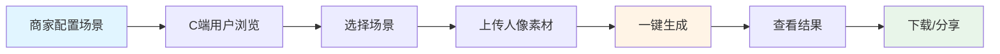
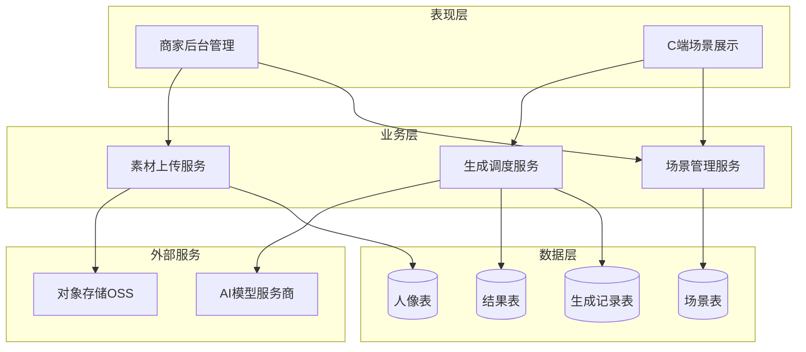
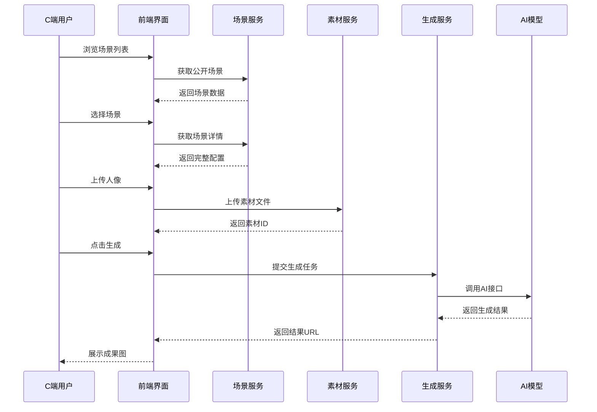
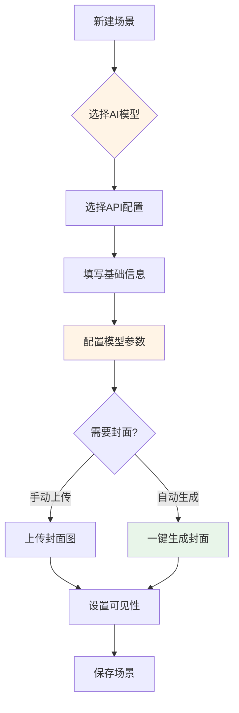
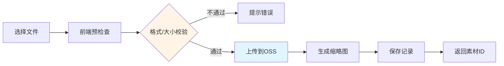
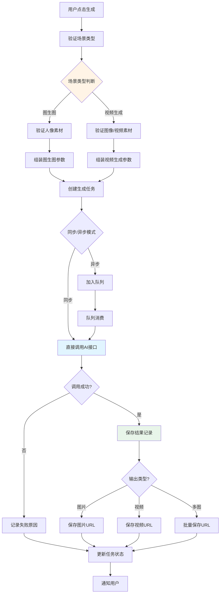
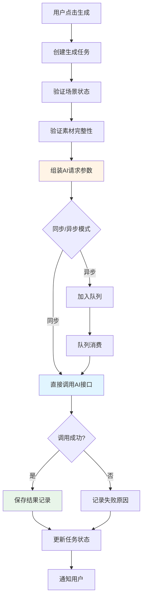
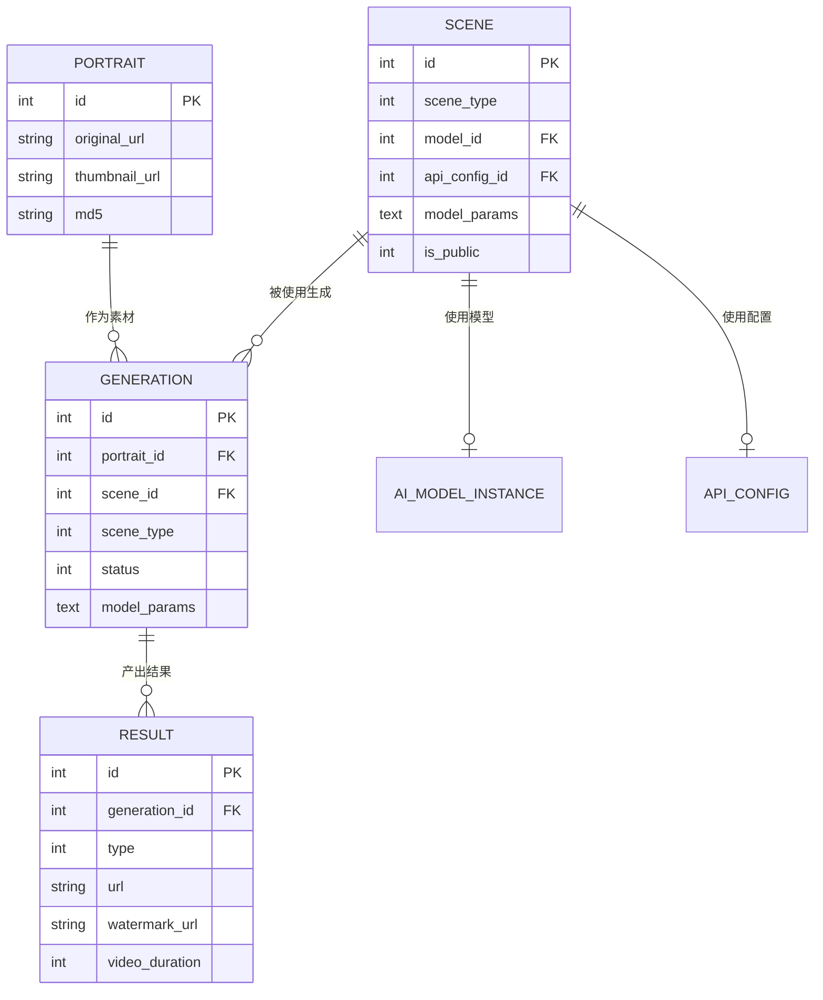
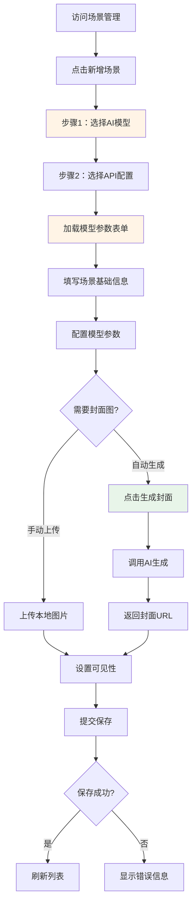
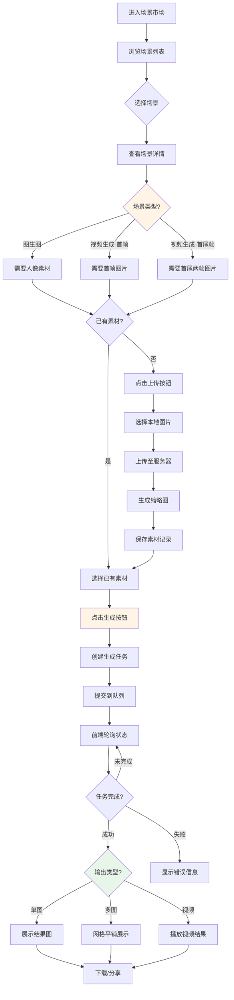

# 场景管理功能重构设计

## 一、概述

### 1.1 功能定位

场景管理是AI旅拍系统的核心功能模块，为用户提供"选场景 → 传素材 → 一键生成同款"的完整体验流程。通过预设场景模板，将复杂的AI参数配置封装为用户友好的操作界面。

### 1.2 核心价值

| 价值维度 | 说明 |
|---------|------|
| **降低使用门槛** | 用户无需理解AI模型参数，通过场景选择即可生成专业效果 |
| **提升生成质量** | 预设经过验证的Prompt和参数组合，确保输出稳定性 |
| **提高运营效率** | 商家可快速配置场景库，支持门店级个性化场景 |
| **支持业务扩展** | 场景与API配置解耦，便于接入多种AI服务商 |

### 1.3 业务场景



---

## 二、系统架构

### 2.1 分层架构



### 2.2 数据流转



---

## 三、场景类型与生成能力

### 3.1 场景类型分类

场景管理支持多种AI生成类型，满足不同业务场景需求：

#### 3.1.1 图生图场景

**功能定位**：基于用户上传的人像素材，结合场景配置的Prompt和参数，生成风格化图像。

**核心能力**：

| 能力维度 | 功能描述 | 参数支持 |
|---------|---------|----------|
| **单图编辑** | 对单张人像进行风格化处理、背景替换 | prompt、negative_prompt、size |
| **多图融合** | 将多张素材融合到同一场景中 | input.ref_img（参考图数组） |
| **批量生成** | 一次调用输出1-6张不同效果图 | parameters.n（输出数量1-6） |
| **自定义分辨率** | 支持512-2048像素宽高自由配置 | parameters.size（格式：宽*高） |
| **提示词智能改写** | 自动优化用户输入的Prompt | parameters.prompt_extend（默认true） |
| **水印控制** | 可选是否添加模型水印 | parameters.watermark（默认false） |

**典型模型**：
- `qwen-image-edit-max`（通义千问图像编辑增强版）
- `wanx-image-editing-enhancement`（万相图像编辑）

**参数配置示例**：
```json
{
  "input": {
    "image_url": "https://example.com/portrait.jpg",
    "ref_img": ["https://example.com/ref1.jpg"],
    "prompt": "身穿红色旗袍，背景是巴黎铁塔"
  },
  "parameters": {
    "n": 4,
    "size": "1024*1536",
    "prompt_extend": true,
    "watermark": false
  }
}
```

#### 3.1.2 视频生成场景

**功能定位**：基于图像生成动态视频内容，为静态照片赋予生命力。

**核心能力**：

| 生成模式 | 功能描述 | 输入要求 | 输出规格 |
|---------|---------|---------|----------|
| **基于首帧生成** | 输入首帧图像，生成5秒动态视频 | 单张图片 | 5s视频 |
| **基于首尾帧生成** | 输入首尾两帧，生成平滑过渡视频 | 2张图片 | 5s视频 |
| **视频特效** | 对现有视频添加特效（慢动作、时间倒流等） | 视频文件 | 处理后视频 |
| **参考生视频** | 基于参考视频的运动轨迹生成新视频 | 图片+参考视频 | 5s视频 |

**典型模型**：
- `kling-v1`（可灵AI视频生成）
- `cogvideox-v1`（智谱CogVideoX）

**参数配置示例**：
```json
{
  "model": "kling-v1",
  "input": {
    "prompt": "一位穿红色旗袍的女士在巴黎铁塔前微笑挥手",
    "image_url": "https://example.com/portrait.jpg",
    "mode": "std"
  },
  "parameters": {
    "duration": "5",
    "aspect_ratio": "16:9",
    "cfg_scale": 0.5
  }
}
```

#### 3.1.3 场景类型字段设计

在场景表中新增`scene_type`字段区分场景类型：

| 类型值 | 类型名称 | 说明 |
|-------|---------|------|
| 1 | 图生图-单图编辑 | 对单张人像进行风格化处理 |
| 2 | 图生图-多图融合 | 将多张素材融合到同一场景 |
| 3 | 视频生成-首帧 | 基于首帧图像生成视频 |
| 4 | 视频生成-首尾帧 | 基于首尾帧生成过渡视频 |
| 5 | 视频生成-特效 | 对现有视频添加特效 |
| 6 | 视频生成-参考生成 | 基于参考视频生成新视频 |

---

## 四、核心功能设计

### 4.1 场景配置管理

#### 4.1.1 场景属性模型

| 属性分类 | 字段名称 | 字段说明 | 是否必填 |
|---------|---------|---------|---------|
| **场景类型** | scene_type | 场景类型（1-6见上节） | 是 |
| **基础信息** | name | 场景名称 | 是 |
| | category | 场景分类（风景/人物/创意等） | 是 |
| | cover | 封面图URL | 是 |
| | desc | 场景描述 | 否 |
| **AI配置** | model_id | 关联AI模型实例ID | 是 |
| | api_config_id | 关联API配置ID | 是 |
| | model_params | 模型参数JSON | 是 |
| **可见性控制** | is_public | 是否公开（C端可见） | 是 |
| | mdid | 所属门店ID（0表示通用） | 是 |
| | status | 启用状态 | 是 |
| **运营数据** | sort | 排序权重 | 否 |
| | is_recommend | 是否推荐 | 否 |
| | tags | 标签（逗号分隔） | 否 |

#### 4.1.2 场景配置流程



**关键规则**：
- AI模型与API配置必须匹配（同一服务商）
- 模型参数根据所选模型动态渲染表单
- 封面图可手动上传或使用当前配置一键生成
- 门店场景仅对指定门店可见

#### 4.1.3 动态参数表单机制

场景编辑页面通过查询`ddwx_ai_model_parameter`表，根据所选模型ID动态渲染参数表单：

| 参数类型 | UI组件 | 示例 |
|---------|--------|------|
| text | 单行文本框 | 场景名称 |
| textarea | 多行文本框 | Prompt提示词 |
| number | 数字输入框 | 生成步数（1-100） |
| select | 下拉选择框 | 图像尺寸（512×512/1024×1024） |
| switch | 开关按钮 | 是否启用某功能 |

**渲染逻辑**：
1. 监听模型选择事件
2. 查询该模型的参数定义列表
3. 按`sort`字段排序
4. 根据`param_type`渲染对应组件
5. 设置默认值和验证规则
6. 保存时将参数值序列化为JSON

---

#### 4.1.4 图生图模型参数规范

以`qwen-image-edit-max`模型为例，参数定义如下：

| 参数名 | 类型 | 必填 | 取值范围 | 默认值 | 说明 |
|-------|------|------|---------|-------|------|
| prompt | string | 是 | - | - | 正向提示词，描述期望的图像内容 |
| negative_prompt | string | 否 | - | - | 负向提示词，描述不希望出现的元素 |
| n | integer | 否 | 1-6 | 1 | 输出图像数量 |
| size | string | 否 | 宽高512-2048 | 1024*1024 | 图像尺寸，格式：宽*高 |
| prompt_extend | boolean | 否 | true/false | true | 是否启用提示词智能改写 |
| watermark | boolean | 否 | true/false | false | 是否添加模型水印 |

**参数验证规则**：
- `size`参数格式必须为`宽*高`，如`1024*1536`
- 宽和高的取值范围均为`[512, 2048]`像素
- `n`参数表示一次生成多张图片，商家可用于给用户提供多个选项

**UI渲染规则**：
- `prompt`和`negative_prompt`渲染为高度120px的多行文本框
- `n`渲染为数字输入框，步进值为1
- `size`渲染为下拉选择框，预设常用尺寸
- `prompt_extend`和`watermark`渲染为开关按钮

#### 4.1.5 视频生成模型参数规范

以`kling-v1`模型为例，参数定义如下：

| 参数名 | 类型 | 必填 | 取值范围 | 默认值 | 说明 |
|-------|------|------|---------|-------|------|
| prompt | string | 是 | - | - | 视频生成的描述性文本 |
| image_url | string | 否 | - | - | 首帧图像URL（首帧模式必填） |
| tail_image_url | string | 否 | - | - | 尾帧图像URL（首尾帧模式必填） |
| ref_video_url | string | 否 | - | - | 参考视频URL（参考生成模式必填） |
| mode | string | 否 | std/pro | std | 生成模式（标准/专业） |
| duration | string | 否 | 5/10 | 5 | 视频时长（秒） |
| aspect_ratio | string | 否 | 16:9/9:16/1:1 | 16:9 | 视频宽高比 |
| cfg_scale | float | 否 | 0-1 | 0.5 | 提示词引导强度 |
| camera_control | object | 否 | - | - | 相机运动控制参数 |

**不同模式的输入要求**：

| 生成模式 | 必需输入 | 可选输入 |
|---------|---------|----------|
| 基于首帧 | prompt + image_url | mode, duration, aspect_ratio |
| 基于首尾帧 | prompt + image_url + tail_image_url | mode, duration |
| 参考生成 | prompt + image_url + ref_video_url | cfg_scale |
| 视频特效 | video_url + effect_type | effect_params |

### 4.2 素材上传管理

#### 4.2.1 上传流程



#### 4.2.2 素材属性模型

| 属性 | 说明 | 约束 |
|-----|------|-----|
| original_url | 原图URL | 必填 |
| thumbnail_url | 缩略图URL | 自动生成 |
| file_size | 文件大小（字节） | 自动计算 |
| width / height | 图像尺寸 | 自动提取 |
| md5 | 文件唯一标识 | 用于去重 |
| mdid | 所属门店ID | 可选 |
| type | 上传类型（商家/用户） | 必填 |

#### 4.2.3 文件存储策略

**目录结构**：
```
/upload/{aid}/{YYYYMMDD}/
  ├── original_{uniqueId}.{ext}    # 原图
  ├── thumbnail_{uniqueId}.jpg     # 缩略图（固定JPG格式）
  └── video_{uniqueId}.mp4         # 视频文件（如果有）
```

**缩略图生成规则**：
- 宽度固定为200像素
- 高度等比例缩放
- 格式统一转为JPG
- 压缩质量80%

**视频文件支持**：
- 支持格式：MP4、MOV、AVI
- 最大文件大小：100MB
- 生成的视频统一转为MP4格式

---

### 4.3 一键生成机制

#### 4.3.1 生成任务流程



#### 4.3.2 参数组装规则

**图生图场景参数组装**：

```
最终参数 = 场景预设参数 + 用户实时输入 + 素材信息

示例：
场景预设: { "prompt": "巴黎铁塔背景", "n": 4, "size": "1024*1536" }
素材信息: { "image_url": "https://...", "portrait_id": 123 }
用户输入: { "prompt": "身穿红色旗袍，巴黎铁塔背景" } (如果允许自定义)

最终请求:
{
  "model": "qwen-image-edit-max",
  "input": {
    "image_url": "https://...",
    "prompt": "身穿红色旗袍，巴黎铁塔背景"  // 用户输入覆盖预设
  },
  "parameters": {
    "n": 4,
    "size": "1024*1536",
    "prompt_extend": true
  }
}
```

**视频生成场景参数组装**：

```
根据scene_type决定输入结构：

1. 首帧模式 (scene_type=3):
{
  "model": "kling-v1",
  "input": {
    "prompt": "场景预设的prompt",
    "image_url": "用户上传的首帧图片",
    "mode": "std"
  },
  "parameters": {
    "duration": "5",
    "aspect_ratio": "16:9"
  }
}

2. 首尾帧模式 (scene_type=4):
{
  "input": {
    "prompt": "...",
    "image_url": "首帧图片",
    "tail_image_url": "尾帧图片"
  }
}

3. 参考生成模式 (scene_type=6):
{
  "input": {
    "prompt": "...",
    "image_url": "目标人像",
    "ref_video_url": "参考视频"
  }
}
```

#### 4.3.3 任务状态机

| 状态码 | 状态名称 | 说明 |
|-------|---------|------|
| 0 | 待处理 | 任务已创建，等待执行 |
| 1 | 处理中 | 正在调用AI接口 |
| 2 | 成功 | 生成完成并保存结果 |
| 3 | 失败 | 调用异常或返回错误 |
| 4 | 已取消 | 用户手动取消 |

**状态流转**：
```
待处理(0) → 处理中(1) → 成功(2)/失败(3)
待处理(0) → 已取消(4)
```

#### 4.3.4 多图输出处理

当`parameters.n > 1`时，一次调用返回多张图片：

**响应示例**：
```json
{
  "output": {
    "task_id": "abc123",
    "results": [
      {"url": "https://example.com/result_1.jpg"},
      {"url": "https://example.com/result_2.jpg"},
      {"url": "https://example.com/result_3.jpg"},
      {"url": "https://example.com/result_4.jpg"}
    ]
  }
}
```

**存储策略**：
- 创建1个`generation`记录（父任务）
- 创建n个`result`记录，每个对应一张图片
- `result.type`字段区分不同输出：1-6分别对应第1-6张图

**前端展示**：
- 以网格形式平铺展示所有结果
- 用户可选择单张下载或批量下载
- 支持对比查看（并排展示）

---

#### 3.3.1 生成任务流程



#### 3.3.2 参数组装规则

生成请求的参数来源优先级：
1. **用户实时输入**（如果C端提供自定义入口）
2. **场景预设参数**（`scene.model_params` JSON字段）
3. **模型默认值**（`ai_model_parameter.default_value`）

**参数合并示例**：
```
场景预设: { "prompt": "巴黎铁塔背景", "steps": 50 }
模型默认: { "steps": 30, "size": "1024*1024" }
最终参数: { "prompt": "巴黎铁塔背景", "steps": 50, "size": "1024*1024" }
```

#### 3.3.3 任务状态机

| 状态码 | 状态名称 | 说明 |
|-------|---------|------|
| 0 | 待处理 | 任务已创建，等待执行 |
| 1 | 处理中 | 正在调用AI接口 |
| 2 | 成功 | 生成完成并保存结果 |
| 3 | 失败 | 调用异常或返回错误 |
| 4 | 已取消 | 用户手动取消 |

**状态流转**：
```
待处理 → 处理中 → 成功/失败
待处理 → 已取消
```

---

## 五、数据模型设计

### 5.1 核心数据表

#### 5.1.1 场景表（ddwx_ai_travel_photo_scene）

| 字段名 | 类型 | 说明 | 索引 |
|-------|------|------|------|
| id | int | 主键 | PK |
| aid | int | 平台ID | idx_aid |
| bid | int | 商家ID | idx_bid |
| mdid | int | 门店ID（0=通用） | idx_mdid |
| scene_type | tinyint | 场景类型（1-6） | idx_scene_type |
| name | varchar(200) | 场景名称 | - |
| category | varchar(50) | 场景分类 | idx_category |
| model_id | int | AI模型实例ID | idx_model_id |
| api_config_id | int | API配置ID | idx_api_config_id |
| model_params | text | 模型参数JSON | - |
| cover | varchar(500) | 封面图URL | - |
| is_public | tinyint | 是否公开 | idx_is_public |
| status | tinyint | 启用状态 | idx_status |
| sort | int | 排序权重 | - |
| create_time | int | 创建时间 | - |
| update_time | int | 更新时间 | - |

**新增字段说明**：
- `scene_type`：区分图生图和视频生成等不同类型场景

**复合索引**：
- `idx_public_status_mdid` (is_public, status, mdid) - 用于C端场景查询
- `idx_scene_type_status` (scene_type, status) - 按类型筛选场景

#### 5.1.2 人像素材表（ddwx_ai_travel_photo_portrait）

| 字段名 | 类型 | 说明 | 索引 |
|-------|------|------|------|
| id | int | 主键 | PK |
| aid | int | 平台ID | idx_aid |
| bid | int | 商家ID | idx_bid |
| mdid | int | 门店ID | idx_mdid |
| type | tinyint | 上传类型（1商家2用户） | - |
| original_url | varchar(500) | 原图URL | - |
| thumbnail_url | varchar(500) | 缩略图URL | - |
| cutout_url | varchar(500) | 抠图URL | - |
| file_size | int | 文件大小 | - |
| width | int | 图像宽度 | - |
| height | int | 图像高度 | - |
| md5 | varchar(32) | 文件MD5 | idx_md5 |
| status | tinyint | 状态 | idx_status |
| create_time | int | 创建时间 | idx_create_time |

#### 5.1.3 生成记录表（ddwx_ai_travel_photo_generation）

| 字段名 | 类型 | 说明 | 索引 |
|-------|------|------|------|
| id | int | 主键 | PK |
| aid | int | 平台ID | idx_aid |
| portrait_id | int | 人像ID | idx_portrait_id |
| scene_id | int | 场景ID | idx_scene_id |
| bid | int | 商家ID | idx_bid |
| mdid | int | 门店ID | idx_mdid |
| generation_type | tinyint | 生成方式（0抠图1图生图2多镜头3图生视频） | idx_generation_type |
| scene_type | tinyint | 场景类型（冗余字段，便于查询） | idx_scene_type |
| model_type | varchar(50) | 模型类型 | - |
| model_name | varchar(100) | 模型名称 | - |
| model_params | text | 实际使用参数JSON | - |
| task_id | varchar(100) | 第三方任务ID | idx_task_id |
| status | tinyint | 任务状态（0待处理1处理中2成功3失败4已取消） | idx_status |
| cost_time | int | 耗时（毫秒） | - |
| error_msg | text | 错误信息 | - |
| create_time | int | 创建时间 | idx_create_time |
| update_time | int | 更新时间 | - |

**新增字段说明**：
- `scene_type`：冗余场景类型字段，方便统计不同类型任务的执行情况

**复合索引**：
- `idx_portrait_scene` (portrait_id, scene_id) - 查询某素材在某场景的生成记录
- `idx_status_update_time` (status, update_time) - 查询待处理任务

#### 5.1.4 结果表（ddwx_ai_travel_photo_result）

| 字段名 | 类型 | 说明 | 索引 |
|-------|------|------|------|
| id | int | 主键 | PK |
| aid | int | 平台ID | idx_aid |
| generation_id | int | 生成记录ID | idx_generation_id |
| portrait_id | int | 人像ID | idx_portrait_id |
| scene_id | int | 场景ID | idx_scene_id |
| type | tinyint | 类型（1-6表示第1-6张图，19表示视频） | - |
| url | varchar(500) | 原图/原视频URL（无水印） | - |
| watermark_url | varchar(500) | 带水印预览URL | - |
| video_duration | int | 视频时长（秒） | - |
| file_size | bigint | 文件大小（字节） | - |
| width | int | 图像/视频宽度 | - |
| height | int | 图像/视频高度 | - |
| status | tinyint | 状态 | idx_status |
| create_time | int | 创建时间 | idx_create_time |

**type字段说明**：
- 1-6：对应多图输出时的第1-6张图片
- 19：视频类型结果
- 其他值可扩展用于特殊类型（如全景图、3D模型等）

### 5.2 数据关联关系



---

## 六、接口设计

### 6.1 商家后台接口

#### 6.1.1 场景列表查询

**接口路径**：`/AiTravelPhoto/scene_list`（AJAX请求）

**请求方式**：GET

**请求参数**：

| 参数名 | 类型 | 必填 | 说明 |
|-------|------|------|------|
| page | int | 否 | 页码，默认1 |
| limit | int | 否 | 每页数量，默认20 |
| scene_type | int | 否 | 场景类型筛选（1-6） |
| category | string | 否 | 分类筛选 |
| status | int | 否 | 状态筛选（0禁用1启用） |
| mdid | int | 否 | 门店筛选 |
| is_public | int | 否 | 公开性筛选（0私有1公开） |

**响应示例**：
```json
{
  "code": 0,
  "msg": "",
  "count": 25,
  "data": [
    {
      "id": 1,
      "name": "巴黎铁塔风景",
      "scene_type": 1,
      "scene_type_text": "图生图-单图编辑",
      "category": "风景",
      "cover": "https://example.com/cover.jpg",
      "is_public": 1,
      "status": 1,
      "mendian_name": "总店",
      "create_time": 1704067200
    }
  ]
}
```

#### 6.1.2 场景保存

**接口路径**：`/AiTravelPhoto/scene_save`

**请求方式**：POST

**请求参数**：

| 参数名 | 类型 | 必填 | 说明 |
|-------|------|------|------|
| id | int | 否 | 场景ID（编辑时传） |
| scene_type | int | 是 | 场景类型（1-6） |
| name | string | 是 | 场景名称 |
| category | string | 是 | 场景分类 |
| model_id | int | 是 | AI模型实例ID |
| api_config_id | int | 是 | API配置ID |
| model_params | json | 是 | 模型参数（JSON字符串） |
| cover | string | 是 | 封面图URL |
| mdid | int | 否 | 门店ID，默认0 |
| is_public | int | 否 | 是否公开，默认0 |
| status | int | 否 | 状态，默认1 |
| sort | int | 否 | 排序，默认0 |

**响应示例**：
```json
{
  "code": 0,
  "msg": "保存成功",
  "data": {
    "scene_id": 1
  }
}
```

#### 6.1.3 一键生成封面图

**接口路径**：`/AiTravelPhoto/generate_scene_cover`

**请求方式**：POST

**请求参数**：

| 参数名 | 类型 | 必填 | 说明 |
|-------|------|------|------|
| scene_id | int | 是 | 场景ID |

**业务逻辑**：
1. 查询场景的完整配置（model_id、api_config_id、model_params）
2. 调用AI模型生成图像
3. 将生成的图像URL保存到场景的cover字段
4. 返回图像URL供前端预览

**响应示例**：
```json
{
  "code": 0,
  "msg": "生成成功",
  "data": {
    "cover_url": "https://example.com/generated_cover.jpg"
  }
}
```

### 6.2 C端API接口

#### 6.2.1 获取公开场景列表

**接口路径**：`/api/ai-travel-photo/scenes`

**请求方式**：GET

**请求参数**：

| 参数名 | 类型 | 必填 | 说明 |
|-------|------|------|------|
| mdid | int | 否 | 门店ID（传入则返回通用场景+该门店场景） |
| scene_type | int | 否 | 场景类型筛选（1-6） |
| category | string | 否 | 分类筛选 |
| page | int | 否 | 页码 |
| limit | int | 否 | 每页数量 |

**查询规则**：
- 仅返回 `is_public=1` 且 `status=1` 的场景
- 若传入mdid，返回 `mdid=0` 或 `mdid=指定门店` 的场景
- 若未传mdid，仅返回 `mdid=0` 的通用场景

**响应示例**：
```json
{
  "status": 1,
  "data": {
    "list": [
      {
        "id": 1,
        "name": "巴黎铁塔风景",
        "scene_type": 1,
        "category": "风景",
        "cover": "https://example.com/cover.jpg",
        "desc": "经典巴黎铁塔背景"
      }
    ],
    "total": 10
  }
}
```

#### 6.2.2 获取场景详情

**接口路径**：`/api/ai-travel-photo/scene-detail`

**请求方式**：GET

**请求参数**：

| 参数名 | 类型 | 必填 | 说明 |
|-------|------|------|------|
| scene_id | int | 是 | 场景ID |

**权限校验**：
- 必须是 `is_public=1` 且 `status=1` 的场景
- 否则返回"场景不可用或无权限访问"

**响应示例**：
```json
{
  "status": 1,
  "data": {
    "id": 1,
    "name": "巴黎铁塔风景",
    "scene_type": 1,
    "category": "风景",
    "cover": "https://example.com/cover.jpg",
    "desc": "经典巴黎铁塔背景",
    "model_params": {
      "prompt": "Eiffel Tower background, professional photography",
      "size": "1024*1024",
      "n": 4
    }
  }
}
```

#### 6.2.3 提交生成任务

**接口路径**：`/api/ai-travel-photo/generate`

**请求方式**：POST

**请求参数**：

| 参数名 | 类型 | 必填 | 说明 |
|-------|------|------|------|
| scene_id | int | 是 | 场景ID |
| portrait_id | int | 是 | 人像素材ID |
| bid | int | 是 | 商家ID |
| mdid | int | 否 | 门店ID |

**业务流程**：
1. 验证场景可用性（is_public=1 且 status=1）
2. 验证素材存在性和归属权
3. 创建生成记录（status=0）
4. 加入异步队列或同步调用AI接口
5. 返回任务ID供前端轮询

**响应示例**：
```json
{
  "status": 1,
  "msg": "任务已提交",
  "data": {
    "generation_id": 123,
    "task_status": 0
  }
}
```

#### 6.2.4 查询生成结果

**接口路径**：`/api/ai-travel-photo/generation-result`

**请求方式**：GET

**请求参数**：

| 参数名 | 类型 | 必填 | 说明 |
|-------|------|------|------|
| generation_id | int | 是 | 生成记录ID |

**响应示例**：

**单图输出**：
```json
{
  "status": 1,
  "data": {
    "generation_id": 123,
    "status": 2,
    "result_url": "https://example.com/result.jpg",
    "watermark_url": "https://example.com/result_watermark.jpg",
    "cost_time": 3500
  }
}
```

**多图输出**：
```json
{
  "status": 1,
  "data": {
    "generation_id": 123,
    "status": 2,
    "results": [
      {
        "type": 1,
        "url": "https://example.com/result_1.jpg",
        "watermark_url": "https://example.com/result_1_wm.jpg"
      },
      {
        "type": 2,
        "url": "https://example.com/result_2.jpg",
        "watermark_url": "https://example.com/result_2_wm.jpg"
      }
    ],
    "cost_time": 5200
  }
}
```

**视频输出**：
```json
{
  "status": 1,
  "data": {
    "generation_id": 124,
    "status": 2,
    "video_url": "https://example.com/video.mp4",
    "video_duration": 5,
    "cover_url": "https://example.com/video_cover.jpg",
    "cost_time": 12000
  }
}
```

---

## 七、业务流程详述

### 7.1 商家配置场景流程



**关键交互点**：
1. **模型选择联动**：选择模型后，自动筛选该模型对应的API配置列表
2. **场景类型选择**：根据所选模型的能力，选择合适的场景类型（图生图/视频生成）
3. **参数表单动态渲染**：根据模型ID查询参数定义，动态生成表单控件
4. **封面生成反馈**：生成过程显示Loading状态，完成后实时预览

### 7.2 C端用户生成流程



**用户体验优化**：
- 场景列表支持按类型筛选（图生图/视频生成）
- 素材上传显示进度条
- 生成过程显示预估时间（基于历史平均耗时）
- 多图结果支持对比查看（并排展示）
- 视频结果支持在线预览和下载

---

## 八、权限与可见性控制

### 8.1 场景可见性规则

| 场景配置 | C端可见性 | 后台可见性 | 说明 |
|---------|----------|----------|------|
| is_public=1, mdid=0 | 所有用户 | 所有商家 | 通用公开场景 |
| is_public=1, mdid>0 | 指定门店用户 | 所属商家 | 门店专属公开场景 |
| is_public=0, mdid=0 | 不可见 | 所有商家 | 通用私有场景（仅管理用） |
| is_public=0, mdid>0 | 不可见 | 所属商家 | 门店私有场景 |

### 8.2 数据隔离机制

**商家维度隔离**：
- 所有查询必须带 `aid`（平台ID）和 `bid`（商家ID）条件
- 超级管理员（bid=0）可查看所有商家数据

**门店维度隔离**：
- 门店场景（mdid>0）仅对所属商家可见
- C端查询时，若传入mdid，返回通用场景（mdid=0）+ 该门店场景

**素材访问控制**：
- 商家只能使用自己上传的素材
- C端用户只能使用关联门店的素材或公开素材库

---

## 九、性能优化策略

### 9.1 查询优化

**索引设计原则**：
- 高频查询字段建立单列索引（aid, bid, status）
- C端场景查询建立复合索引（is_public, status, mdid）
- 生成记录查询建立复合索引（portrait_id, scene_id）

**缓存策略**：

| 数据类型 | 缓存时长 | 更新触发 |
|---------|---------|---------|
| 公开场景列表 | 1小时 | 场景编辑/删除时清除 |
| 场景详情 | 30分钟 | 场景编辑时清除 |
| AI模型参数定义 | 24小时 | 手动清除 |

### 9.2 生成任务优化

**异步队列机制**：
- 生成任务统一加入队列，避免阻塞用户请求
- 支持任务优先级（VIP用户优先处理）
- 失败任务自动重试3次

**并发控制**：
- 限制同一用户同时提交的任务数量（默认5个）
- 限制单个API配置的并发调用数（防止超额）

### 9.3 资源存储优化

**图片压缩**：
- 封面图压缩至500KB以内
- 缩略图宽度固定200px
- 使用WebP格式（支持的浏览器）

**CDN加速**：
- 静态资源（场景封面、结果图）分发到CDN
- 使用图片懒加载技术

---

## 十、异常处理与容错

### 10.1 场景配置校验

**保存前校验**：
- 模型ID与API配置ID的服务商必须一致
- model_params必须符合JSON格式
- 必填参数不能为空
- 数值类型参数需在有效范围内

**校验失败响应**：
```
{
  "code": 1,
  "msg": "参数校验失败",
  "errors": {
    "prompt": "正向提示词不能为空",
    "steps": "生成步数必须在1-100之间"
  }
}
```

### 10.2 生成任务容错

**常见失败场景**：

| 失败原因 | 错误码 | 处理策略 |
|---------|-------|---------|
| API密钥无效 | 401 | 提示商家更新配置 |
| 服务商限流 | 429 | 自动延迟重试 |
| 超时未响应 | 504 | 重试3次后标记失败 |
| 素材格式不支持 | 400 | 提示用户重新上传 |

**失败重试机制**：
```
首次失败 → 等待5秒 → 第1次重试
第1次失败 → 等待15秒 → 第2次重试
第2次失败 → 等待30秒 → 第3次重试
第3次失败 → 标记为永久失败
```

### 10.3 数据一致性保障

**事务处理**：
- 场景保存、删除操作使用数据库事务
- 生成任务与结果记录关联使用事务

**数据回滚**：
- 生成失败时，自动清理中间文件
- API调用失败不影响素材记录

---

## 十一、扩展性设计

### 11.1 多模型支持

**架构解耦**：
- 场景与模型通过`model_id`松耦合
- 参数定义存储在独立的`ai_model_parameter`表
- 新增模型无需修改场景业务代码

**新增模型流程**：
1. 在模型管理模块添加模型实例
2. 定义该模型的参数列表
3. 配置对应的API配置
4. 场景编辑页面自动识别新模型

### 11.2 多服务商接入

**统一调用接口**：
- 通过`AiModelInvokeService`统一调用入口
- 服务商差异通过配置适配
- 支持同一模型对接多个服务商（备用切换）

**响应解析适配**：
- 使用`ModelResponseParser`解析不同服务商的响应格式
- 通过配置映射字段路径（如 `$.output.task_id`）

### 11.3 业务场景扩展

**当前支持**：
- 图生图（单图编辑、多图融合）
- 视频生成（首帧、首尾帧、参考生成、特效）
- 多图输出（1-6张图片）

**未来扩展方向**：
- 文生图（纯Prompt生成）
- 图像编辑（局部修改、擦除、修复）
- 风格迁移（参考图+素材）
- 视频编辑（剪辑、转场、特效）
- 3D模型生成（从图片生成3D）
- 全景图生成（360度全景）

---

## 十二、测试验证策略

### 11.1 功能测试

**场景管理测试**：

| 测试项 | 测试场景 | 预期结果 |
|-------|---------|---------|
| 场景创建 | 填写完整信息并保存 | 保存成功，列表显示新场景 |
| 参数动态渲染 | 切换不同模型 | 表单控件自动更新 |
| 封面生成 | 点击一键生成 | 调用AI返回封面URL |
| 可见性控制 | 设置私有场景 | C端查询不到该场景 |

**生成流程测试**：

| 测试项 | 测试场景 | 预期结果 |
|-------|---------|---------|
| 素材上传 | 上传JPG图片 | 生成缩略图并返回ID |
| 格式校验 | 上传BMP图片 | 提示格式不支持 |
| 任务提交 | 选择场景和素材 | 创建生成记录并返回任务ID |
| 结果轮询 | 定时查询任务状态 | 成功返回结果URL |

### 11.2 性能测试

**并发测试**：
- 模拟100个用户同时提交生成任务
- 验证队列处理能力和响应时间

**压力测试**：
- 持续提交任务达到API配额上限
- 验证限流机制和降级策略

### 12.3 兼容性测试

**浏览器兼容**：
- Chrome（最新版）
- Safari（iOS/macOS）
- 微信内置浏览器

**设备兼容**：
- PC端（1920×1080）
- 平板（768×1024）
- 手机端（375×667）

---

## 十三、运维监控

### 13.1 关键指标

**业务指标**：
- 场景使用量（按场景ID统计）
- 素材上传量（按日统计）
- 生成成功率（成功数/总数）
- 平均生成耗时（毫秒）

**技术指标**：
- API调用次数
- API调用成功率
- 队列堆积量
- 数据库查询耗时

### 13.2 日志记录

**操作日志**：
```
[2026-02-04 10:30:25] 商家123 创建场景：巴黎铁塔风景
[2026-02-04 10:35:10] 用户456 上传素材：portrait_789.jpg
[2026-02-04 10:36:00] 任务101 生成成功，耗时3500ms
```

**错误日志**：
```
[2026-02-04 11:20:15] [ERROR] 任务102 生成失败：API Key无效
[2026-02-04 11:25:30] [WARN] 任务103 重试第2次
```

### 13.3 告警机制

**告警规则**：
- 生成成功率低于90% → 发送邮件通知
- API调用失败率超过10% → 短信告警
- 队列堆积超过100条 → 钉钉群通知

---

## 十四、安全与合规

### 14.1 数据安全

**敏感信息保护**：
- API密钥加密存储
- 日志中脱敏API密钥（仅显示前4后4位）
- 用户上传图片自动检测违规内容

**访问控制**：
- 后台操作需要登录验证
- API接口需要Token验证
- 跨商家数据隔离

### 14.2 内容合规

**图片审核**：
- 上传素材自动调用内容安全API
- 检测色情、暴力、政治敏感内容
- 违规内容自动拦截并记录

**生成结果审核**：
- AI生成图片自动审核
- 疑似违规内容标记为待审核
- 人工复审机制

---

## 十五、迁移与部署

### 15.1 数据库变更

**新增字段**：
- `ddwx_ai_travel_photo_scene` 表添加 `scene_type` 字段（tinyint）
- `ddwx_ai_travel_photo_generation` 表添加 `scene_type` 字段（tinyint）
- `ddwx_ai_travel_photo_result` 表添加 `file_size`、`width`、`height` 字段

**执行脚本**：
```sql
-- 场景表新增类型字段
ALTER TABLE `ddwx_ai_travel_photo_scene` 
ADD COLUMN `scene_type` tinyint(1) NOT NULL DEFAULT '1' COMMENT '场景类型（1图生图-单图 2图生图-多图 3视频-首帧 4视频-首尾帧 5视频-特效 6视频-参考生成）' AFTER `mdid`,
ADD INDEX `idx_scene_type` (`scene_type`),
ADD INDEX `idx_scene_type_status` (`scene_type`, `status`);

-- 生成记录表新增类型字段
ALTER TABLE `ddwx_ai_travel_photo_generation`
ADD COLUMN `scene_type` tinyint(1) NOT NULL DEFAULT '0' COMMENT '场景类型（冗余字段）' AFTER `generation_type`,
ADD INDEX `idx_scene_type` (`scene_type`);

-- 结果表新增字段
ALTER TABLE `ddwx_ai_travel_photo_result`
ADD COLUMN `file_size` bigint(20) DEFAULT '0' COMMENT '文件大小（字节）' AFTER `video_duration`,
ADD COLUMN `width` int(11) DEFAULT '0' COMMENT '图像/视频宽度' AFTER `file_size`,
ADD COLUMN `height` int(11) DEFAULT '0' COMMENT '图像/视频高度' AFTER `width`;
```

### 15.2 依赖服务

**必需服务**：
- 对象存储OSS（阿里云/腾讯云）
- 消息队列（Redis Queue）
- AI模型API（阿里云通义千问/可灵AI等）

**可选服务**：
- 内容安全API
- CDN加速服务

### 15.3 配置检查清单

- [ ] 数据库迁移脚本已执行
- [ ] OSS存储桶已创建并配置权限
- [ ] AI模型API密钥已配置
- [ ] 消息队列已启动
- [ ] 目录权限已设置（upload目录可写）
- [ ] PHP扩展已安装（GD库、curl）

---

## 十六、后续优化方向

### 16.1 功能增强

- 场景模板市场（支持导入/导出场景配置）
- 批量生成（一次上传多张素材）
- 智能推荐场景（基于用户历史喜好）
- 场景组合（多个场景组合套餐）
- AI智能评分（对生成结果自动评分）
- 视频转场效果（多场景自动剂辑）

### 16.2 性能提升

- 引入Redis缓存层
- 数据库读写分离
- 图片处理任务异步化
- WebSocket推送生成结果

### 16.3 体验优化

- 移动端原生App
- 小程序版本
- 实时预览功能（生成前预览效果）
- 社交分享优化（一键分享到微信、微博）
- AR实时预览（摄像头实时合成场景）
- 多语言支持（中英文界面）
