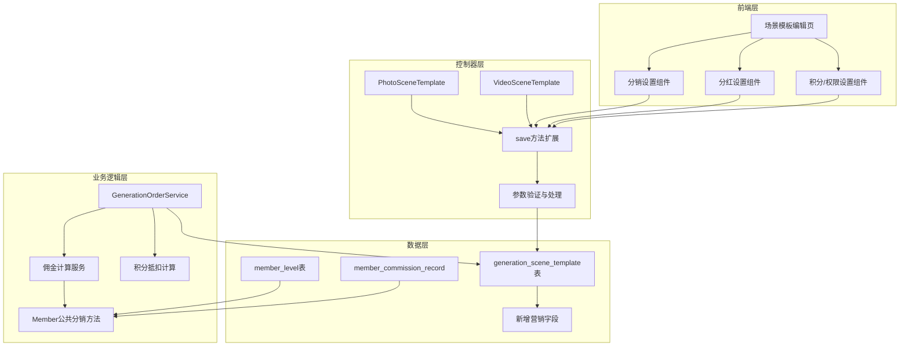
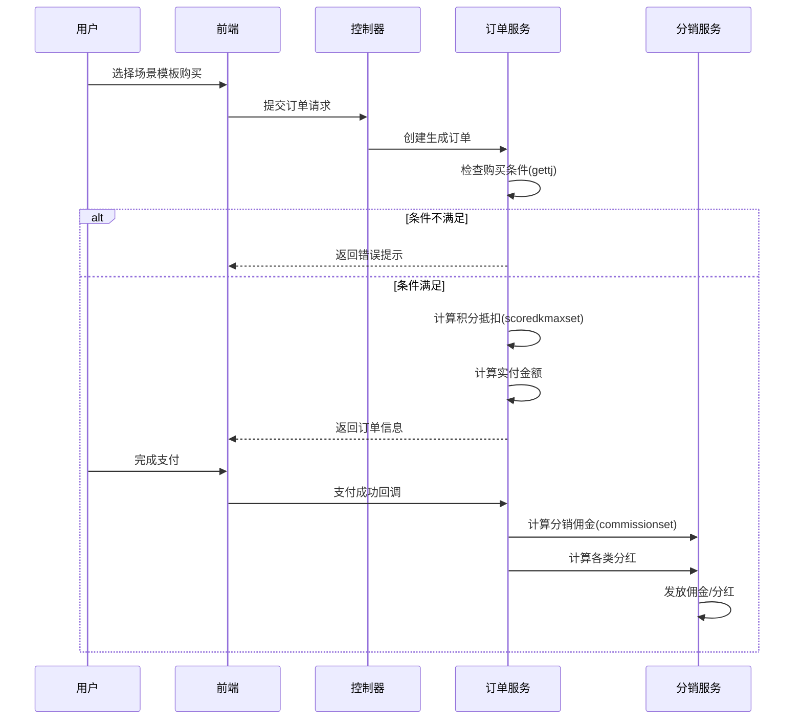
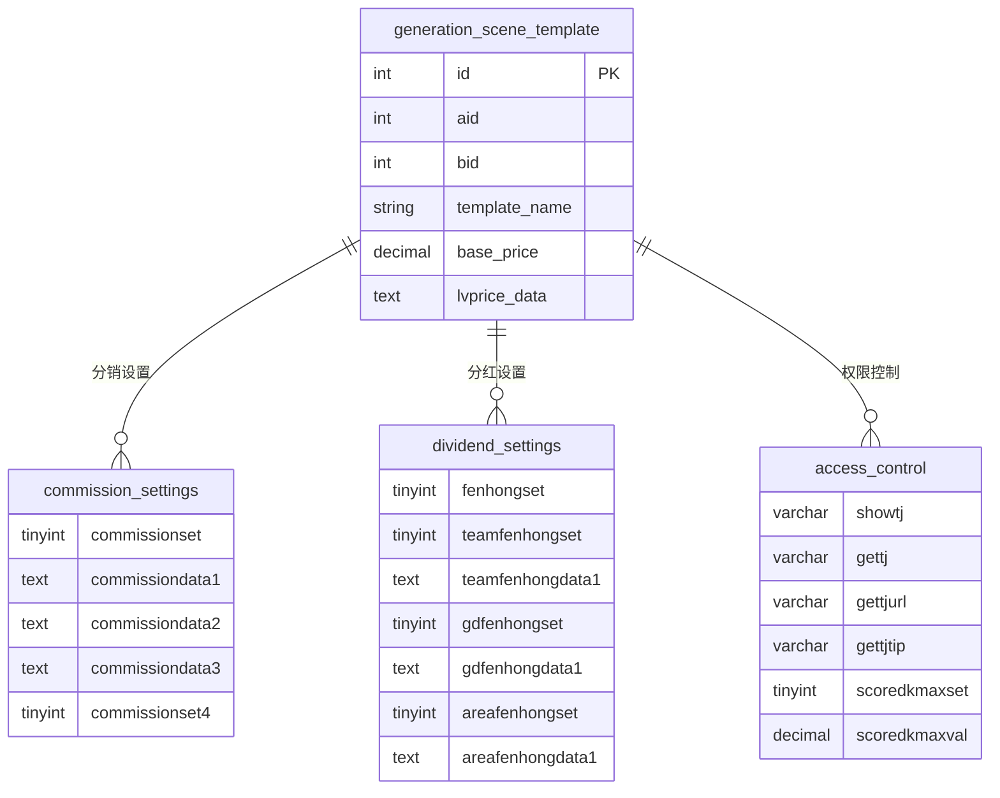
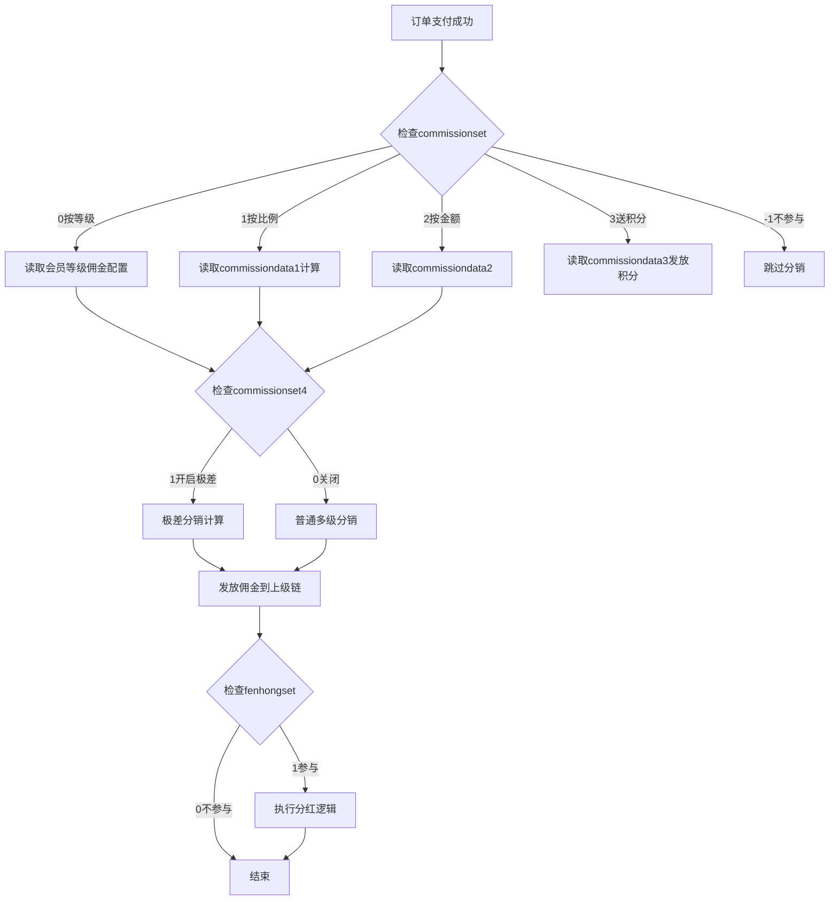
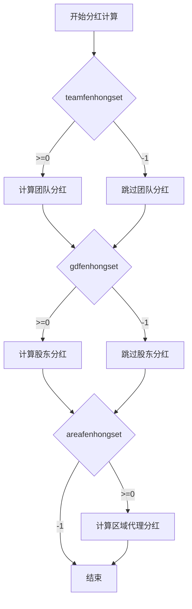
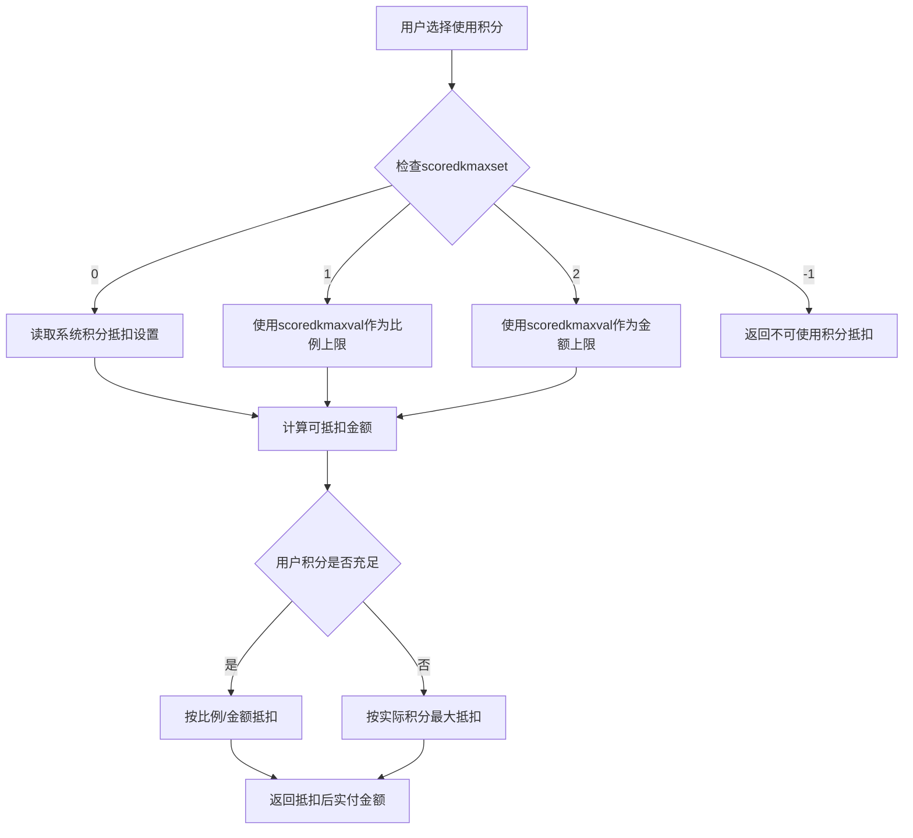
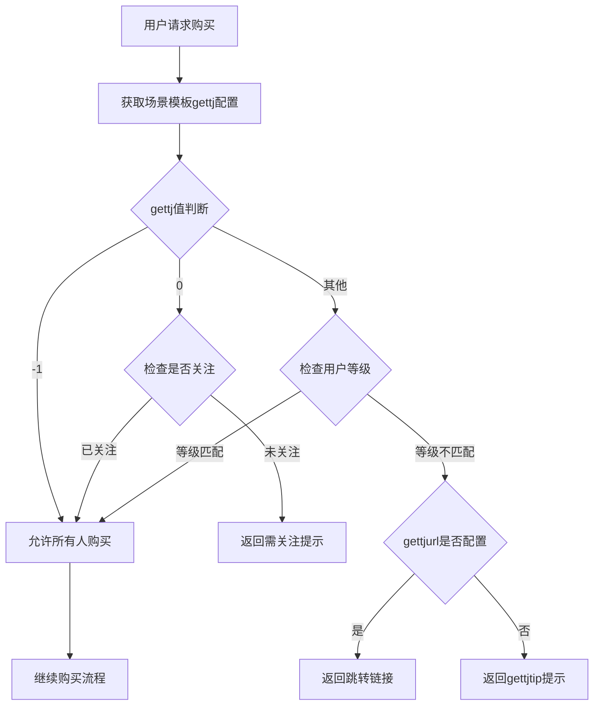
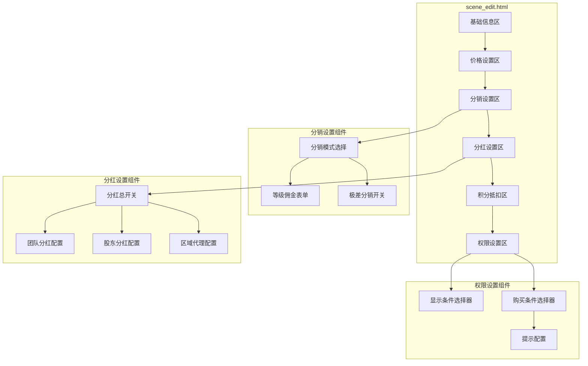

# 场景模板商品化设置功能扩展设计

## 1. 概述

### 1.1 背景
当前场景模板（ddwx_generation_scene_template）已具备基础价格和会员等级价格功能，但缺乏完整的商品销售配套功能。为支持场景模板的商业化运营，需要将商品管理中的分销、分红、积分抵扣、购买条件等核心功能引入场景模板，实现与商品一致的营销能力。

### 1.2 目标
- 场景模板具备完整的分销佣金结算能力
- 支持多级分红体系（团队/股东/区域代理）
- 实现积分抵扣购买功能
- 支持基于会员等级的显示与购买权限控制

### 1.3 功能清单

| 功能模块 | 功能说明 | 优先级 |
|---------|---------|--------|
| 分销设置 | 支持按等级/比例/固定金额等多种分销模式 | P0 |
| 极差分销 | 支持多层级极差分销佣金计算 | P1 |
| 团队分红 | 支持团队层级分红奖励 | P1 |
| 股东分红 | 支持股东等级分红奖励 | P1 |
| 区域代理分红 | 支持按区域代理层级分红 | P2 |
| 积分抵扣 | 支持积分抵扣部分金额 | P1 |
| 显示条件 | 控制场景模板对不同等级用户的可见性 | P1 |
| 购买条件 | 限制特定等级用户可购买 | P1 |

## 2. 架构设计

### 2.1 系统架构图

### 2.2 业务流程

## 3. 数据模型

### 3.1 场景模板表新增字段

在 `ddwx_generation_scene_template` 表中新增以下字段：

| 字段名 | 类型 | 默认值 | 说明 |
|-------|------|-------|------|
| **分销设置** ||||
| commissionset | tinyint(2) | 0 | 分销模式：0按会员等级 1价格比例 2固定金额 3分销送积分 -1不参与分销 |
| commissiondata1 | text | NULL | 按比例分销参数（JSON序列化） |
| commissiondata2 | text | NULL | 按固定金额参数（JSON序列化） |
| commissiondata3 | text | NULL | 分销送积分参数（JSON序列化） |
| commissionset4 | tinyint(1) | 0 | 是否开启极差分销：0关闭 1开启 |
| **分红设置** ||||
| fenhongset | tinyint(1) | 1 | 是否参与分红：0不参与 1参与 |
| **团队分红** ||||
| teamfenhongset | tinyint(2) | 0 | 团队分红模式：0按等级 1比例 2金额 3送积分 -1不参与 |
| teamfenhongdata1 | text | NULL | 团队分红比例参数 |
| teamfenhongdata2 | text | NULL | 团队分红金额参数 |
| **股东分红** ||||
| gdfenhongset | tinyint(2) | 0 | 股东分红模式：0按等级 1比例 2金额 3送积分 -1不参与 |
| gdfenhongdata1 | text | NULL | 股东分红比例参数 |
| gdfenhongdata2 | text | NULL | 股东分红金额参数 |
| **区域代理分红** ||||
| areafenhongset | tinyint(2) | 0 | 区域分红模式：0按等级 1比例 2金额 -1不参与 |
| areafenhongdata1 | text | NULL | 区域分红比例参数 |
| areafenhongdata2 | text | NULL | 区域分红金额参数 |
| **积分抵扣** ||||
| scoredkmaxset | tinyint(1) | 0 | 积分抵扣设置：0按系统设置 1单独设置比例 2单独设置金额 -1不可抵扣 |
| scoredkmaxval | decimal(11,2) | 0.00 | 积分抵扣最大值（比例/金额） |
| **显示/购买条件** ||||
| showtj | varchar(255) | -1 | 显示条件：-1不限 其他为等级ID逗号分隔 |
| gettj | varchar(255) | -1 | 购买条件：-1不限 0关注用户 其他为等级ID |
| gettjurl | varchar(255) | NULL | 不满足购买条件时的跳转链接 |
| gettjtip | varchar(255) | NULL | 不满足购买条件时的提示文案 |

### 3.2 字段关系图

## 4. API 设计

### 4.1 场景模板保存接口扩展

**端点**: `POST /photo_generation/scene_save` 或 `POST /video_generation/scene_save`

**请求参数扩展**:

| 参数路径 | 类型 | 必填 | 说明 |
|---------|------|-----|------|
| info[commissionset] | int | 否 | 分销模式 |
| info[commissionset4] | int | 否 | 极差分销开关 |
| commissiondata1[等级ID][bl] | float | 否 | 各等级分销比例 |
| commissiondata2[等级ID][money] | float | 否 | 各等级分销金额 |
| info[fenhongset] | int | 否 | 分红开关 |
| info[teamfenhongset] | int | 否 | 团队分红模式 |
| teamfenhongdata1[等级ID][bl] | float | 否 | 团队分红比例 |
| info[gdfenhongset] | int | 否 | 股东分红模式 |
| gdfenhongdata1[等级ID][bl] | float | 否 | 股东分红比例 |
| info[areafenhongset] | int | 否 | 区域分红模式 |
| areafenhongdata1[等级ID][bl] | float | 否 | 区域分红比例 |
| info[scoredkmaxset] | int | 否 | 积分抵扣设置 |
| info[scoredkmaxval] | decimal | 否 | 积分抵扣值 |
| info[showtj][] | array | 否 | 显示条件等级ID数组 |
| info[gettj][] | array | 否 | 购买条件等级ID数组 |
| info[gettjurl] | string | 否 | 条件不满足跳转链接 |
| info[gettjtip] | string | 否 | 条件不满足提示 |

### 4.2 场景模板详情接口扩展

**响应数据扩展**:

| 字段 | 类型 | 说明 |
|-----|------|-----|
| commissionset | int | 分销模式 |
| commissionset_text | string | 分销模式文本描述 |
| commissiondata1 | object | 分销比例配置 |
| commissiondata2 | object | 分销金额配置 |
| fenhongset | int | 分红开关 |
| teamfenhongset | int | 团队分红模式 |
| gdfenhongset | int | 股东分红模式 |
| areafenhongset | int | 区域分红模式 |
| scoredkmaxset | int | 积分抵扣设置 |
| scoredkmaxval | decimal | 积分抵扣值 |
| showtj | array | 显示条件等级列表 |
| gettj | array | 购买条件等级列表 |

## 5. 业务逻辑层

### 5.1 佣金计算流程

### 5.2 分红计算流程

### 5.3 积分抵扣计算逻辑

### 5.4 购买条件校验流程

## 6. 前端组件架构

### 6.1 编辑页面组件结构

### 6.2 组件交互说明

| 组件 | 触发条件 | 交互行为 |
|-----|---------|---------|
| 分销模式单选组 | 切换选项 | 显示/隐藏对应的参数配置表单 |
| 极差分销开关 | 开启 | 展示极差等级配置区域 |
| 分红总开关 | 关闭 | 隐藏所有分红子配置 |
| 团队/股东/区域分红模式 | 切换 | 根据模式显示对应输入框 |
| 积分抵扣模式 | 选择非默认 | 显示抵扣值输入框 |
| 购买条件选择 | 选择非"所有人" | 显示跳转链接和提示配置 |

## 7. 测试策略

### 7.1 单元测试范围

| 测试模块 | 测试点 |
|---------|-------|
| 分销计算服务 | 各模式下佣金计算准确性 |
| 极差分销计算 | 多级极差佣金递减逻辑 |
| 分红计算服务 | 团队/股东/区域分红独立性 |
| 积分抵扣计算 | 边界值处理、积分不足场景 |
| 权限校验服务 | 等级匹配逻辑、提示返回 |

### 7.2 测试场景矩阵

| 场景 | 分销设置 | 分红设置 | 积分抵扣 | 预期结果 |
|-----|---------|---------|---------|---------|
| 普通购买 | 按等级 | 参与 | 系统默认 | 正常分销分红 |
| 不参与分销 | -1 | 参与 | 系统默认 | 仅分红 |
| 不参与分红 | 按比例 | 不参与 | 单独设置 | 仅分销 |
| 不可抵扣 | 按金额 | 参与 | -1 | 全额支付+分销分红 |
| 极差分销 | 极差开启 | 不参与 | 不可抵扣 | 极差佣金计算 |
