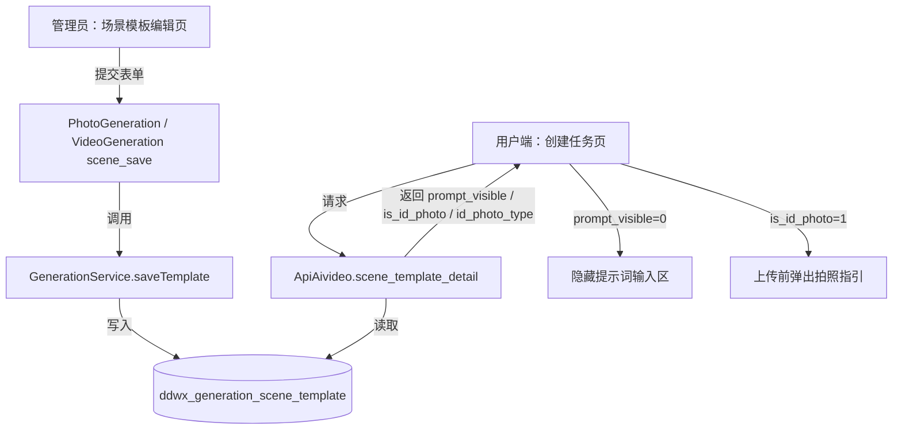
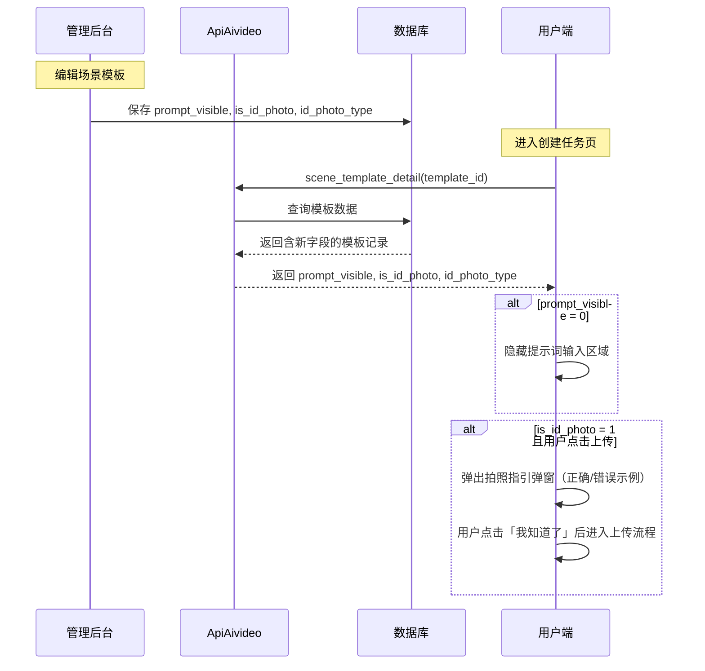
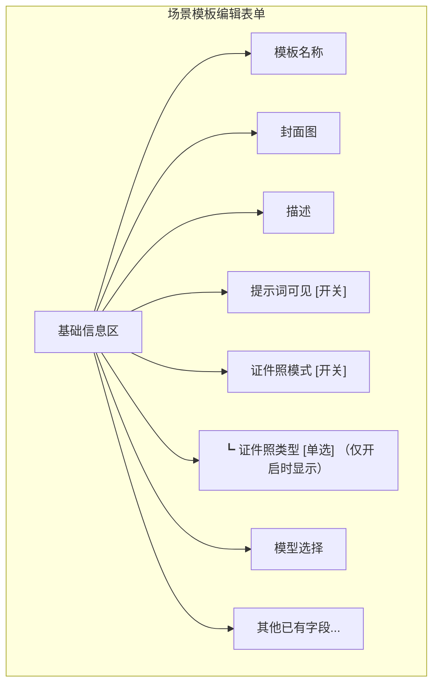
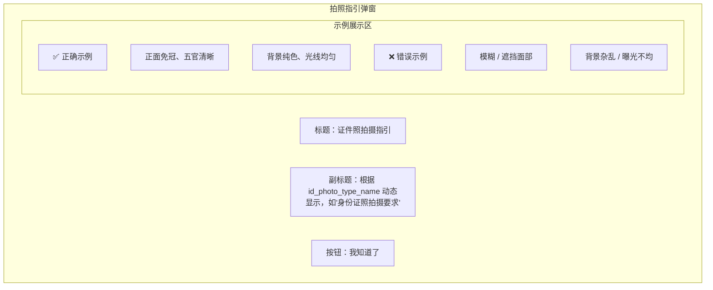
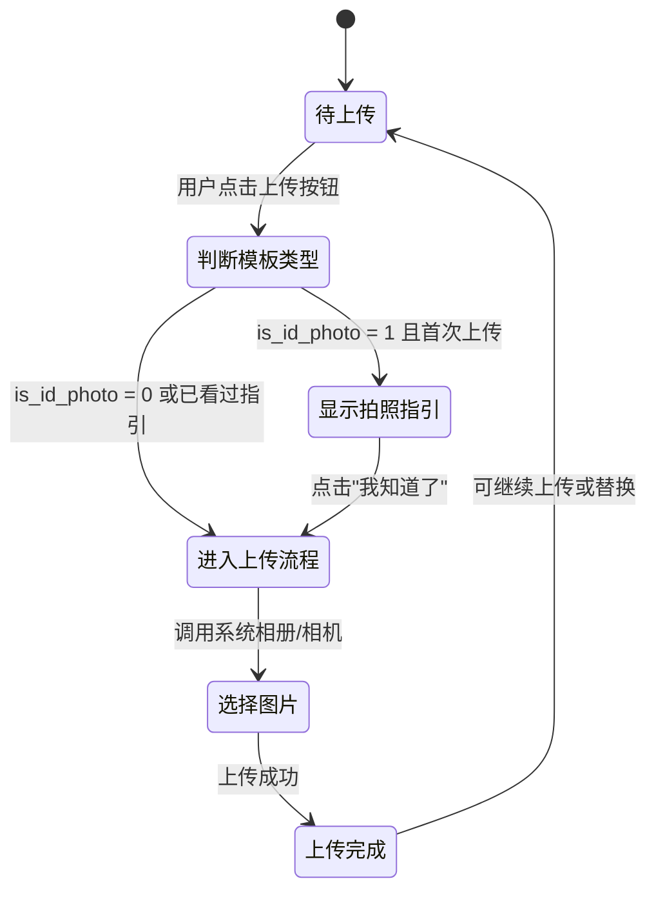

# 场景模板功能扩展：提示词可见性 & 证件照模式

## 1. 概述

本设计为场景模板编辑新增两项功能：

- **提示词可见性开关**：控制用户端生成页面中提示词输入区域的显示/隐藏，默认开启（可见）。
- **证件照模式开关**：标记模板是否属于证件照类型，默认关闭。开启后需选择证件照子类型，并在用户上传图片前展示拍照指引弹窗。

涉及的关键文件/模块：

| 层级 | 文件/模块 | 职责 |
|------|-----------|------|
| 数据库 | `ddwx_generation_scene_template` 表 | 存储新增字段 |
| 服务层 | `GenerationService.saveTemplate()` | 保存新增字段 |
| 后台控制器 | `PhotoGeneration.scene_edit()` / `scene_save()` | 图片模板编辑与保存 |
| 后台控制器 | `VideoGeneration.scene_edit()` / `scene_save()` | 视频模板编辑与保存 |
| 后台视图 | `photo_generation/scene_edit.html` | 图片模板编辑表单 |
| 后台视图 | `video_generation/scene_edit.html` | 视频模板编辑表单 |
| 前端API | `ApiAivideo.scene_template_detail()` | 返回模板详情（含新字段） |
| 用户端 | `uniapp/pagesZ/generation/create.vue` | UniApp 生成任务页 |
| 用户端 | `mp-weixin/pagesZ/generation/create.js/.wxml` | 微信小程序生成任务页 |

## 2. 架构

### 2.1 整体数据流

### 2.2 功能模块交互

## 3. 数据模型

### 3.1 `ddwx_generation_scene_template` 表新增字段

| 字段名 | 类型 | 默认值 | 说明 |
|--------|------|--------|------|
| `prompt_visible` | tinyint(1) | 1 | 提示词是否对用户可见：1=可见，0=隐藏 |
| `is_id_photo` | tinyint(1) | 0 | 是否为证件照模式：0=否，1=是 |
| `id_photo_type` | tinyint(2) | 0 | 证件照类型：0=未设置，1=身份证照，2=护照/港澳通行证，3=驾驶证，4=一寸照，5=二寸照 |

建议将新字段追加在 `output_quantity` 之后、`base_price` 之前。

### 3.2 证件照类型枚举定义

| 枚举值 | 名称 | 说明 |
|--------|------|------|
| 0 | 未设置 | is_id_photo 为 0 时的默认值 |
| 1 | 身份证照 | 用于身份证件 |
| 2 | 护照/港澳通行证 | 用于护照、港澳通行证 |
| 3 | 驾驶证 | 用于驾驶证件 |
| 4 | 一寸照 | 入职、体检、资格证通用（尺寸 25mm×35mm） |
| 5 | 二寸照 | 毕业证、学位证、部分签证用（尺寸 35mm×49mm） |

## 4. 业务逻辑层

### 4.1 GenerationService.saveTemplate() 扩展

在现有 `saveTemplate()` 方法的 `$saveData` 数组中追加以下字段的处理：

| 字段 | 取值逻辑 |
|------|----------|
| `prompt_visible` | 从提交数据读取，缺省默认为 1 |
| `is_id_photo` | 从提交数据读取，缺省默认为 0 |
| `id_photo_type` | 当 `is_id_photo=1` 时从提交数据读取，否则强制置为 0 |

**校验规则**：
- `prompt_visible` 仅接受 0 或 1
- `is_id_photo` 仅接受 0 或 1
- 当 `is_id_photo=1` 时，`id_photo_type` 必须为 1~5 中的一个值，否则返回错误提示"请选择证件照类型"
- 当 `is_id_photo=0` 时，自动将 `id_photo_type` 重置为 0

### 4.2 后台控制器 scene_save() 扩展

`PhotoGeneration.scene_save()` 和 `VideoGeneration.scene_save()` 无需特殊处理，因为这两个方法通过 `input('post.info/a')` 获取全部表单字段后直接传给 `saveTemplate()`，新字段自然随表单提交流入。

### 4.3 后台控制器 scene_edit() 扩展

`PhotoGeneration.scene_edit()` 和 `VideoGeneration.scene_edit()` 在编辑模式下通过 `getTemplateDetail($id)` 获取现有数据，新字段已包含在查询结果中，无需额外处理，直接赋值给视图即可。

## 5. 后台视图设计（scene_edit.html）

以下设计同时适用于 `photo_generation/scene_edit.html` 和 `video_generation/scene_edit.html`。

### 5.1 提示词可见性开关

在模板编辑表单中（建议放在"基础信息"区域内，"描述"字段之后）新增一行：

| 表单项 | 控件类型 | 字段名 | 说明 |
|--------|----------|--------|------|
| 提示词可见 | layui 开关（lay-switch） | `info[prompt_visible]` | 开启=1（默认勾选），关闭=0；关闭后用户端将隐藏提示词输入框 |

### 5.2 证件照模式区域

在"提示词可见"之后新增证件照设置区域：

| 表单项 | 控件类型 | 字段名 | 说明 |
|--------|----------|--------|------|
| 证件照模式 | layui 开关（lay-switch） | `info[is_id_photo]` | 开启=1，关闭=0（默认） |
| 证件照类型 | layui 单选按钮组（radio） | `info[id_photo_type]` | 仅在证件照模式开启时显示；选项见 3.2 枚举定义 |

**交互逻辑**：
- 证件照模式开关切换时，通过 JS 监听 `switch` 事件，动态显示/隐藏证件照类型单选区域
- 当开关关闭时，清空已选的证件照类型值

### 5.3 后台表单布局示意

## 6. 前端API接口扩展

### 6.1 ApiAivideo.scene_template_detail() 响应扩展

在现有返回的 `$result` 数组中追加以下字段：

| 字段 | 类型 | 说明 |
|------|------|------|
| `prompt_visible` | int | 提示词是否可见：1=可见，0=隐藏 |
| `is_id_photo` | int | 是否为证件照模式：0=否，1=是 |
| `id_photo_type` | int | 证件照类型编号（0~5） |
| `id_photo_type_name` | string | 证件照类型名称（如"身份证照"、"一寸照"等），`is_id_photo=0` 时为空字符串 |

类型名称映射表（在服务端完成转换）：

| id_photo_type 值 | id_photo_type_name |
|-------------------|--------------------|
| 0 | "" |
| 1 | "身份证照" |
| 2 | "护照/港澳通行证" |
| 3 | "驾驶证" |
| 4 | "一寸照" |
| 5 | "二寸照" |

### 6.2 ApiAivideo.scene_template_list() 响应扩展

列表接口在每条模板记录中也需包含 `prompt_visible`、`is_id_photo`、`id_photo_type` 字段，以便用户端在模板切换时无需额外请求即可判断状态。

## 7. 用户端交互设计

以下设计同时适用于 UniApp（`create.vue`）和微信小程序（`create.js`/`create.wxml`）。

### 7.1 提示词可见性控制

**行为规则**：
- 当模板详情中 `prompt_visible = 1` 时，正常显示提示词输入区域（当前默认行为）
- 当 `prompt_visible = 0` 时，隐藏整个"提示词"区块（包括标题和输入框）
- 提交生成任务时，若 `prompt_visible = 0`，则使用模板的 `default_params.prompt` 作为提示词值透传至后端，不再要求用户填写
- 切换模板时需根据新模板的 `prompt_visible` 值动态切换显隐状态

**提交校验调整**：
- 当 `prompt_visible = 0` 时，跳过前端提示词非空校验（原代码中 "请填写提示词" 的校验）

### 7.2 证件照模式 — 拍照指引弹窗

**触发条件**：当模板 `is_id_photo = 1` 时，用户首次点击"上传图片"按钮时弹出拍照指引。

**弹窗内容结构**：

**弹窗 UI 布局**（表格描述）：

| 区域 | 内容 | 样式说明 |
|------|------|----------|
| 顶部标题 | "证件照拍摄指引" | 居中，加粗 |
| 副标题 | "{id_photo_type_name} 拍摄要求" | 居中，次要字色 |
| 正确示例区 | 左侧展示 1~2 张正确拍照示意图 + 文字说明 | 绿色边框/标签 |
| 错误示例区 | 右侧展示 1~2 张错误拍照示意图 + 文字说明 | 红色边框/标签 |
| 底部按钮 | "我知道了" | 主色调，点击后关闭弹窗并进入上传流程 |

**各证件照类型的指引要点**：

| 类型 | 正确示例要点 | 错误示例要点 |
|------|-------------|-------------|
| 身份证照 | 正面免冠、白色背景、五官清晰完整 | 戴帽/墨镜、背景杂乱、照片模糊 |
| 护照/港澳通行证 | 白色背景、不露齿、露双耳 | 背景非白色、表情夸张、头发遮脸 |
| 驾驶证 | 白色背景、免冠、面部居中 | 侧脸、逆光、分辨率过低 |
| 一寸照 | 纯色背景（红/蓝/白）、肩部以上 | 半身照、背景渐变、化妆过度 |
| 二寸照 | 纯色背景（红/蓝/白）、肩部以上 | 半身照、光线不均、表情不自然 |

**交互状态机**：

**"首次"判定**：
- 在当前页面会话周期内，同一模板仅首次点击上传时弹出指引
- 切换到其他证件照模板后，重新计为"首次"
- 使用页面级变量（如 `idPhotoGuideShownMap[templateId]`）记录已展示状态

### 7.3 提示词隐藏时的提交参数处理

当 `prompt_visible = 0` 时，前端提交 `create_generation_order` 请求的参数中：
- `prompt` 字段传递模板默认提示词（`detail.prompt` 或 `detail.default_params.prompt`）
- 后端无需感知此逻辑变化，正常接收 `prompt` 参数即可

## 8. 数据库迁移

需创建迁移脚本 `migrate_scene_template_expansion.php`，执行以下操作：

| 步骤 | 操作 | 条件 |
|------|------|------|
| 1 | 检查 `prompt_visible` 字段是否存在 | 不存在则添加 |
| 2 | 添加 `prompt_visible` 字段（tinyint(1), 默认1） | 追加在 `output_quantity` 之后 |
| 3 | 检查 `is_id_photo` 字段是否存在 | 不存在则添加 |
| 4 | 添加 `is_id_photo` 字段（tinyint(1), 默认0） | 追加在 `prompt_visible` 之后 |
| 5 | 检查 `id_photo_type` 字段是否存在 | 不存在则添加 |
| 6 | 添加 `id_photo_type` 字段（tinyint(2), 默认0） | 追加在 `is_id_photo` 之后 |

迁移脚本应遵循项目现有的迁移模式（使用 `pdo_fieldexists2` 检查字段是否存在，使用 ThinkPHP Db facade 执行 DDL）。

## 9. 修改文件清单

| 文件路径 | 修改内容 |
|----------|----------|
| `app/service/GenerationService.php` | `saveTemplate()` 方法扩展：新增 `prompt_visible`、`is_id_photo`、`id_photo_type` 字段保存与校验 |
| `app/controller/PhotoGeneration.php` | `scene_save()` 无需改动（字段随表单自动流入）；确认 `scene_edit()` 数据正常传递 |
| `app/controller/VideoGeneration.php` | 同上 |
| `app/view/photo_generation/scene_edit.html` | 新增"提示词可见"开关、"证件照模式"开关及类型单选 UI |
| `app/view/video_generation/scene_edit.html` | 同上 |
| `app/controller/ApiAivideo.php` | `scene_template_detail()` 返回新增 `prompt_visible`、`is_id_photo`、`id_photo_type`、`id_photo_type_name` 字段 |
| `uniapp/pagesZ/generation/create.vue` | 提示词区域条件渲染；证件照上传指引弹窗；提交逻辑调整 |
| `mp-weixin/pagesZ/generation/create.js` | 同上（小程序端实现） |
| `mp-weixin/pagesZ/generation/create.wxml` | 同上（小程序端模板） |
| `migrate_scene_template_expansion.php`（新建） | 数据库迁移脚本 |

## 10. 测试

### 10.1 单元测试用例

| 用例编号 | 测试目标 | 输入 | 预期结果 |
|----------|----------|------|----------|
| UT-01 | saveTemplate 保存 prompt_visible=1 | prompt_visible=1 | 数据库字段值为 1 |
| UT-02 | saveTemplate 保存 prompt_visible=0 | prompt_visible=0 | 数据库字段值为 0 |
| UT-03 | saveTemplate 缺省 prompt_visible | 不传该字段 | 数据库字段值为 1（默认开启） |
| UT-04 | saveTemplate 开启证件照但未选类型 | is_id_photo=1, id_photo_type=0 | 返回错误"请选择证件照类型" |
| UT-05 | saveTemplate 开启证件照并选类型 | is_id_photo=1, id_photo_type=3 | 保存成功，字段值分别为 1 和 3 |
| UT-06 | saveTemplate 关闭证件照时自动清除类型 | is_id_photo=0, id_photo_type=3 | 保存成功，id_photo_type 被重置为 0 |
| UT-07 | scene_template_detail 返回新字段 | 查询已保存模板 | 返回数据包含 prompt_visible、is_id_photo、id_photo_type、id_photo_type_name |
| UT-08 | id_photo_type_name 映射正确性 | id_photo_type=4 | id_photo_type_name="一寸照" |

### 10.2 集成/交互测试用例

| 用例编号 | 测试场景 | 操作步骤 | 预期结果 |
|----------|----------|----------|----------|
| IT-01 | 后台关闭提示词可见 → 用户端验证 | 1. 后台编辑模板关闭提示词可见开关 2. 保存 3. 用户端打开该模板 | 用户端不显示提示词输入区域 |
| IT-02 | 用户端提交（提示词隐藏） | 1. 使用提示词隐藏的模板 2. 直接提交生成 | 请求参数中 prompt 使用模板默认值，无需用户填写 |
| IT-03 | 后台开启证件照模式 → 用户端上传 | 1. 后台开启证件照模式，选择"身份证照" 2. 保存 3. 用户端点击上传 | 弹出"身份证照拍摄指引"弹窗 |
| IT-04 | 拍照指引弹窗确认后上传 | 1. 弹窗出现 2. 点击"我知道了" | 弹窗关闭，进入图片选择流程 |
| IT-05 | 同一模板再次上传不重复弹窗 | 1. 首次上传已看过指引 2. 再次点击上传 | 直接进入上传流程，不再弹窗 |
| IT-06 | 切换模板后重新弹窗 | 1. 模板A（证件照）已看过指引 2. 切换到模板B（也是证件照） 3. 点击上传 | 重新弹出模板B对应类型的指引弹窗 |
| IT-07 | 非证件照模板上传 | 使用普通模板点击上传 | 直接进入上传流程，无弹窗 |
