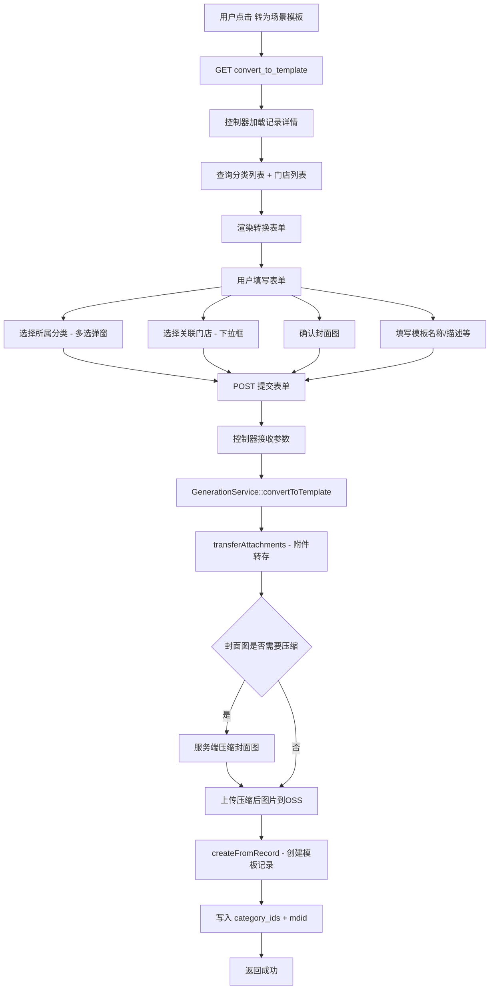
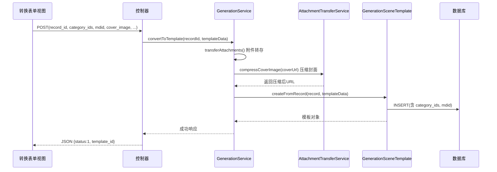
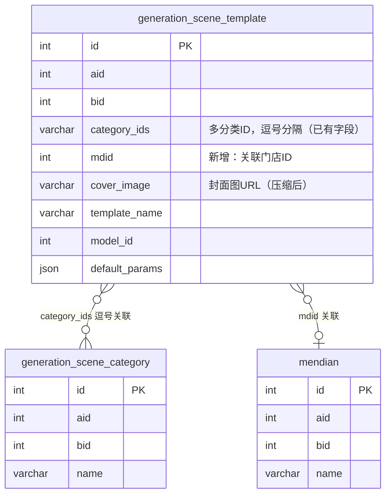
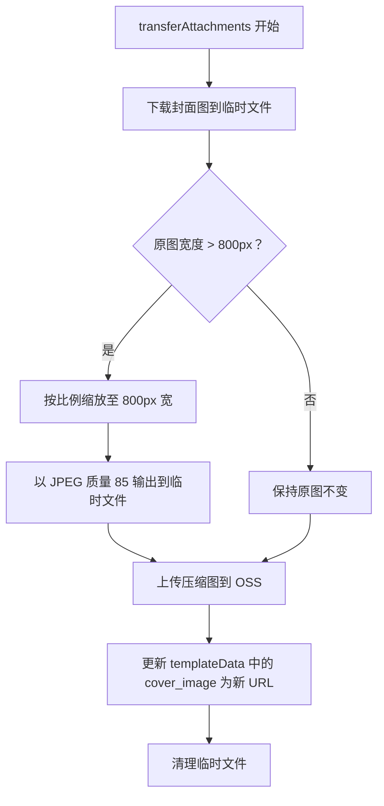
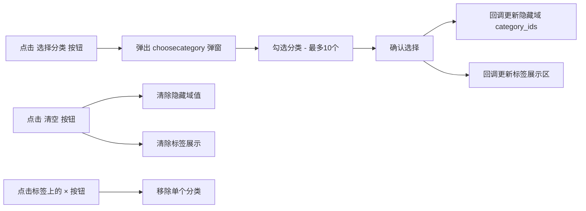

# 场景模板转换优化设计

## 1. 概述

对「转为场景模板」功能进行三项优化：在转换表单中增加**所属分类多选**、增加**关联门店选择**，以及对封面图执行**服务端压缩**。优化同时适用于照片生成（PhotoGeneration）和视频生成（VideoGeneration）两个模块。

### 1.1 现状分析

| 维度 | 当前实现 | 问题 |
|------|----------|------|
| 分类选择 | convert_to_template 表单仅有文本输入框（category字段），用户手动填写分类标签 | 与 scene_edit 页面的多选分类组件不一致，缺少与 `ddwx_generation_scene_category` 表的结构化关联 |
| 门店关联 | convert_to_template 表单无任何门店选项，模板表无 mdid 字段 | 无法指定模板归属门店，多门店场景下无法按门店筛选模板 |
| 封面图压缩 | 封面图直接使用生成结果的原始 URL 转存，未做任何尺寸/质量压缩 | 封面图可能过大（如 2048×2048），影响前端列表加载性能 |

### 1.2 涉及文件

| 层级 | 文件 | 说明 |
|------|------|------|
| 视图 | photo_generation/convert_to_template.html | 照片模板转换表单 |
| 视图 | video_generation/convert_to_template.html | 视频模板转换表单 |
| 控制器 | PhotoGeneration.php → convert_to_template() | 照片转换控制器方法 |
| 控制器 | VideoGeneration.php → convert_to_template() | 视频转换控制器方法 |
| 服务层 | GenerationService.php → convertToTemplate() | 转换核心业务逻辑 |
| 服务层 | GenerationService.php → transferAttachments() | 附件转存逻辑 |
| 模型 | GenerationSceneTemplate.php → createFromRecord() | 模板创建方法 |
| 数据库 | ddwx_generation_scene_template | 场景模板表 |

---

## 2. 架构

### 2.1 整体流程

### 2.2 数据流向

---

## 3. 数据模型变更

### 3.1 ddwx_generation_scene_template 表新增字段

| 字段名 | 类型 | 默认值 | 说明 |
|--------|------|--------|------|
| mdid | int(11) unsigned | 0 | 关联门店ID，0 表示不限门店/通用模板 |

> **说明：** `category_ids` 字段（varchar(500)）已存在于表中，当前 convert_to_template 流程未写入该字段，本次优化将补齐。`mdid` 字段为新增。

### 3.2 字段关系

---

## 4. 业务逻辑层

### 4.1 功能一：所属分类多选

**目标：** 在转换表单中增加与 scene_edit 页面一致的分类多选组件，将选中的分类 ID 写入模板的 `category_ids` 字段。

**控制器变更（PhotoGeneration / VideoGeneration 的 convert_to_template 方法）：**

GET 请求时需额外查询场景分类列表并传递到视图：

| 变量名 | 数据来源 | 说明 |
|--------|----------|------|
| categories | ddwx_generation_scene_category 表，按 aid + bid + generation_type 筛选 | 分类选项列表 |

POST 请求时需接收新增参数：

| 参数名 | 类型 | 说明 |
|--------|------|------|
| category_ids | string | 逗号分隔的分类ID字符串 |

**视图变更（convert_to_template.html）：**

在"分类标签"文本输入框**之前**新增一个「所属分类」表单项，交互方式与 scene_edit 页面保持一致：
- 隐藏域存储 `category_ids` 值
- 标签展示区域显示已选分类名称标签
- "选择分类"按钮打开 choosecategory 弹窗（复用现有 PhotoSceneCategory/choosecategory 或 VideoSceneCategory/choosecategory）
- "清空"按钮清除所有已选分类
- 最多选择 10 个分类（`selmore=true`, `maxselect=10`）

**服务层变更（GenerationService::convertToTemplate）：**

将 `category_ids` 透传到 templateData 中。

**模型层变更（GenerationSceneTemplate::createFromRecord）：**

在创建模板记录时写入 `category_ids` 字段。

### 4.2 功能二：关联门店选择

**目标：** 在转换表单中增加门店下拉选择框，指定模板归属的门店。

**控制器变更（PhotoGeneration / VideoGeneration 的 convert_to_template 方法）：**

GET 请求时需额外查询门店列表并传递到视图：

| 变量名 | 数据来源 | 说明 |
|--------|----------|------|
| mendian_list | ddwx_mendian 表，按 aid + bid 筛选，取 id 和 name 字段 | 门店选项列表 |

POST 请求时需接收新增参数：

| 参数名 | 类型 | 说明 |
|--------|------|------|
| mdid | int | 选中的门店ID，0 表示通用（不限门店） |

**视图变更（convert_to_template.html）：**

在"是否公开"之前新增一个「关联门店」表单项：
- 使用 select 下拉框
- 第一项为"不限门店"（值为 0）
- 动态渲染门店列表选项
- 显示门店名称，值为门店 ID

**服务层变更（GenerationService::convertToTemplate）：**

将 `mdid` 透传到 templateData 中。

**模型层变更（GenerationSceneTemplate::createFromRecord）：**

在创建模板记录时写入 `mdid` 字段。

### 4.3 功能三：封面图压缩

**目标：** 在模板转换的附件转存流程中，对封面图进行服务端压缩处理，生成适合前端列表展示的缩略图。

**压缩策略：**

| 参数 | 值 | 说明 |
|------|-----|------|
| 最大宽度 | 800px | 按比例缩放，保持宽高比 |
| 输出质量 | 85 | JPEG 质量参数（0-100） |
| 输出格式 | JPEG | 统一转换为 JPEG 格式以减小体积 |
| 触发条件 | 原图宽度 > 800px | 宽度不超过 800px 的图片跳过压缩 |

**处理流程：**

**服务层变更（GenerationService 或 AttachmentTransferService）：**

在 `transferAttachments` 方法中，对封面图类型的附件增加压缩处理步骤。具体方式为：在执行 `transferBatch` 之前或之后，对 cover_image 对应的 URL 执行压缩处理。

压缩逻辑可参考已有实现 `AiTravelPhotoPortraitService::generateThumbnail` 的模式：
- 使用 GD 库的 `imagecreatefromjpeg` / `imagecreatefrompng` 读取源图
- 使用 `imagecopyresampled` 等比缩放
- 使用 `imagejpeg` 以指定质量输出

---

## 5. 接口变更

### 5.1 convert_to_template 接口

**路径：** PhotoGeneration/convert_to_template、VideoGeneration/convert_to_template

#### GET 请求 - 渲染表单

新增视图变量：

| 变量 | 类型 | 说明 |
|------|------|------|
| categories | array | 场景分类列表，每项含 id、name |
| mendian_list | array | 门店列表，每项含 id、name |

#### POST 请求 - 提交创建

新增请求参数：

| 参数 | 类型 | 必填 | 说明 |
|------|------|------|------|
| category_ids | string | 否 | 逗号分隔的分类ID |
| mdid | int | 否 | 关联门店ID，默认0 |

响应格式不变：

| 字段 | 类型 | 说明 |
|------|------|------|
| status | int | 1=成功，0=失败 |
| msg | string | 提示信息 |
| template_id | int | 创建的模板ID（成功时） |

---

## 6. 视图表单结构

### 6.1 convert_to_template.html 表单项顺序（优化后）

| 序号 | 表单项 | 类型 | 变更状态 |
|------|--------|------|----------|
| 1 | 来源记录 | 只读展示 | 保持不变 |
| 2 | 提示词 | textarea | 保持不变 |
| 3 | 模板名称 | text（必填） | 保持不变 |
| 4 | **所属分类** | **多选弹窗 + 标签展示** | **新增** |
| 5 | 分类标签 | text | 保持不变 |
| 6 | 封面图 | 图片预览 + hidden | 保持不变（后端压缩透明处理） |
| 7 | 模板描述 | textarea | 保持不变 |
| 8 | **关联门店** | **select 下拉框** | **新增** |
| 9 | 是否公开 | radio | 保持不变 |
| 10 | 确认创建/取消 | button | 保持不变 |

### 6.2 所属分类组件交互

弹窗调用方式需区分生成类型：
- 照片生成：调用 PhotoSceneCategory/choosecategory
- 视频生成：调用 VideoSceneCategory/choosecategory

---

## 7. 测试

### 7.1 单元测试

| 测试场景 | 验证点 |
|----------|--------|
| 转模板时选择多个分类 | 验证 category_ids 正确写入数据库，格式为逗号分隔的 ID 字符串 |
| 转模板时不选择分类 | 验证 category_ids 为空字符串，不影响模板创建 |
| 转模板时选择门店 | 验证 mdid 正确写入数据库 |
| 转模板时不选择门店 | 验证 mdid 默认为 0 |
| 封面图宽度 > 800px | 验证封面图被压缩，压缩后宽度 ≤ 800px |
| 封面图宽度 ≤ 800px | 验证封面图不被压缩，保持原样 |
| 封面图为视频 URL（视频模板） | 验证视频类型封面不执行图片压缩 |
| 选择超过 10 个分类 | 验证前端阻止超选，后端做兜底校验 |
| 分类选择后表单回显 | 验证标签展示区正确显示分类名称 |
| 转换后在 scene_edit 页面编辑 | 验证 category_ids 和 mdid 在编辑页正确回显 |
