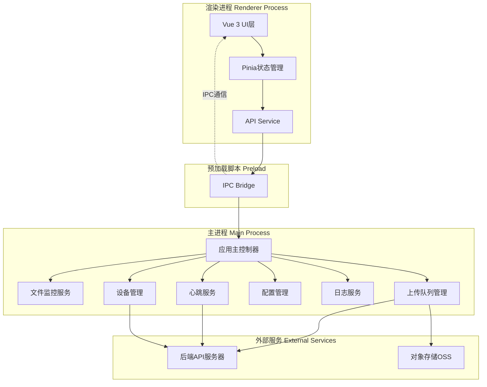
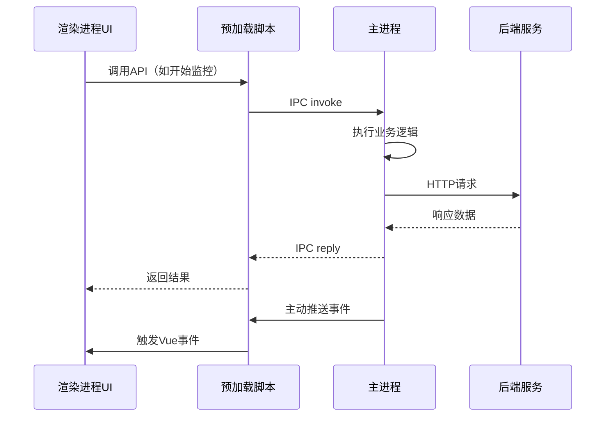
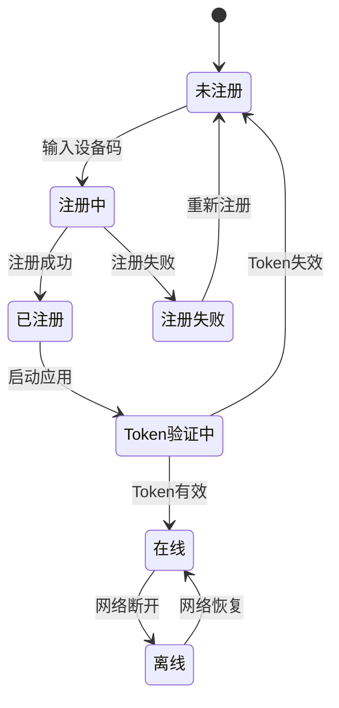
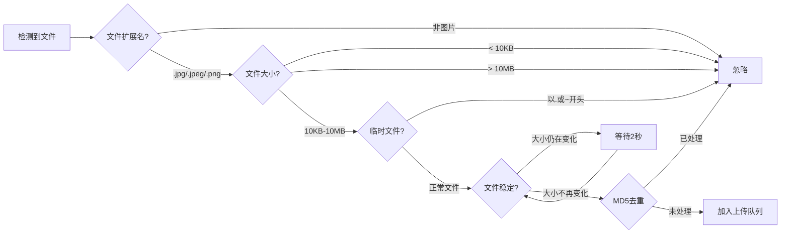
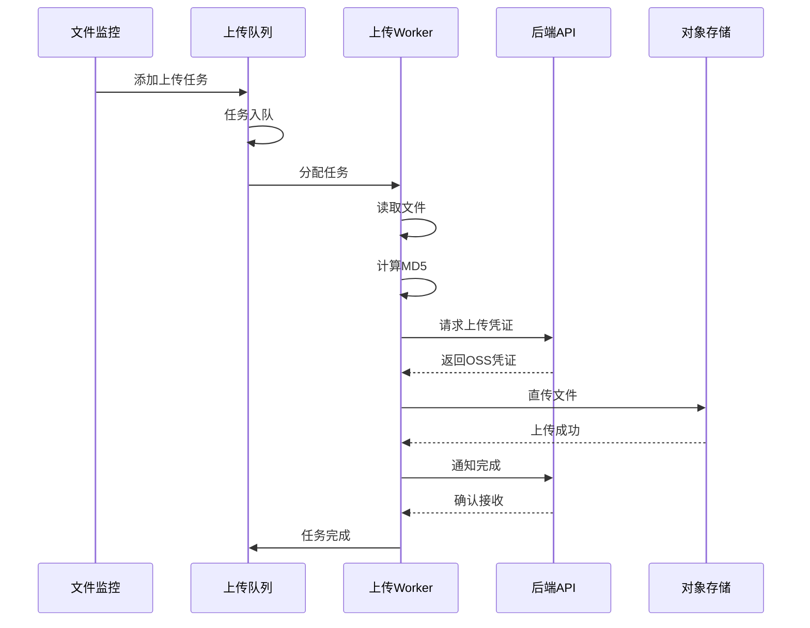
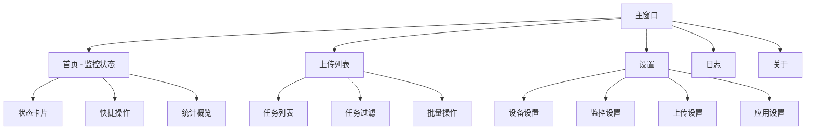
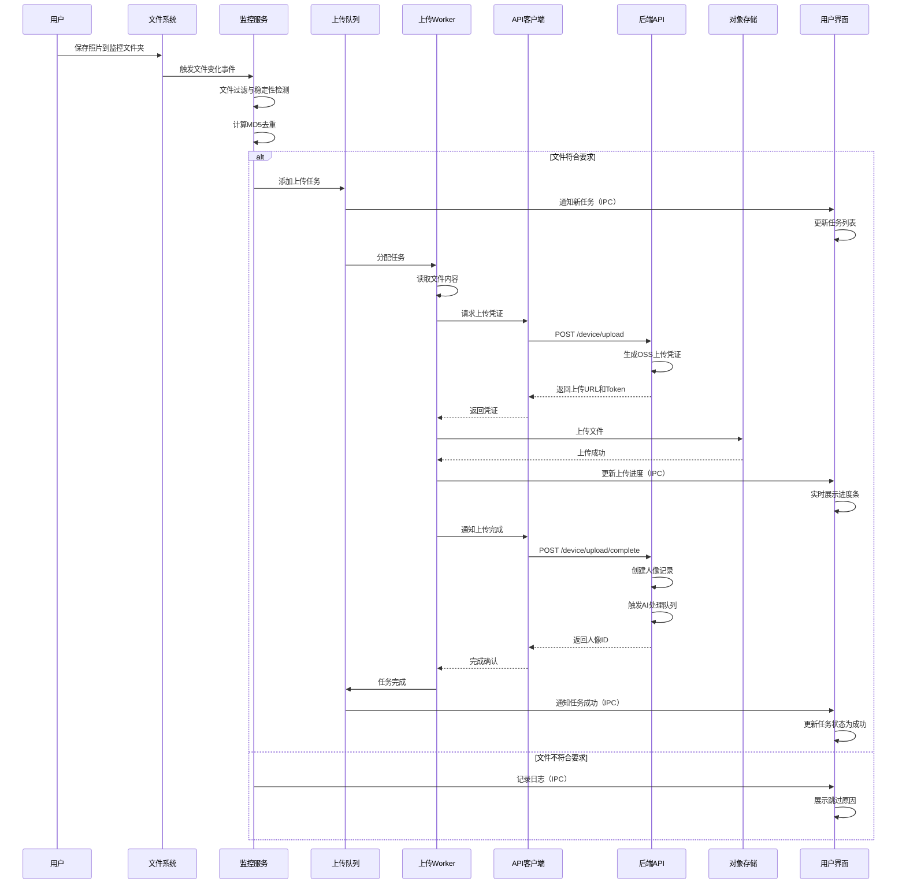
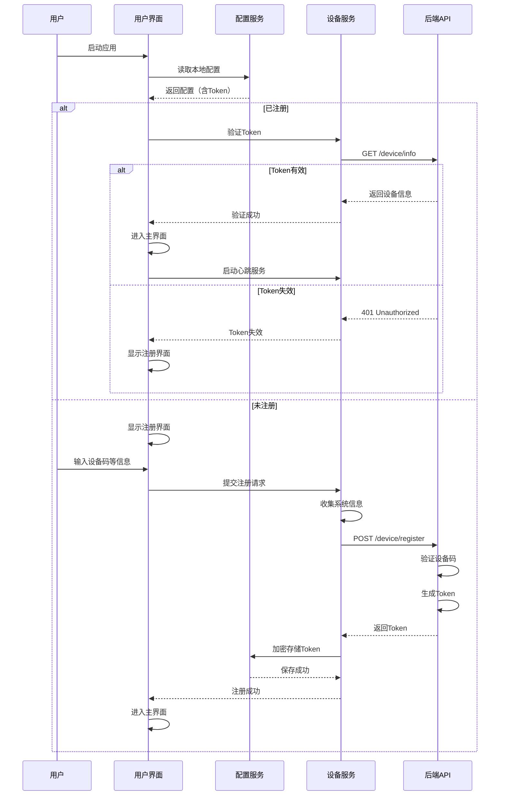

# AI旅拍商家客户端 - Electron重构设计文档

## 概述

### 项目背景
现有AI旅拍商家客户端基于 .NET Framework 4.7.2 + WPF 技术栈开发，位于 `/www/wwwroot/eivie/khd/AiTravelClient/` 目录，已实现完整的核心服务层（Models、Services、Utils），但存在以下局限性：
- 仅支持 Windows 平台，无法跨平台部署
- 开发维护需要 .NET 技术栈，技术门槛较高
- UI 更新与现代化改造困难
- 依赖 .NET Framework 运行时环境
- 缺少用户界面层（ViewModels 和 Views 已定义但功能不完整）

为解决上述问题，决定采用 Electron 技术栈重新构建客户端，将新项目放置于 `/www/wwwroot/eivie/sjkhd/` 目录，实现跨平台支持、降低开发维护成本、提升用户体验。

### 设计目标
- **跨平台支持**：支持 Windows、macOS、Linux 三大主流操作系统
- **技术栈统一**：采用主流 Web 技术栈（JavaScript/TypeScript、HTML、CSS），与团队现有技术栈保持一致
- **功能对等**：完整保留现有客户端所有核心功能
- **体验提升**：现代化 UI 设计，更友好的交互体验
- **易于维护**：模块化架构，清晰的代码组织，完善的文档
- **文档完整**：配套完整的文档体系（README.md、开发文档、部署指南、用户手册、项目总结）

### 核心功能范围
1. 设备注册与认证管理
2. 文件夹实时监控
3. 图片自动上传
4. 心跳保活机制
5. 配置管理
6. 日志记录与查看
7. 统计信息展示
8. 系统托盘集成

### 技术选型

| 技术领域 | 技术选型 | 选型理由 |
|---------|---------|----------|
| 框架 | Electron 最新稳定版 | 成熟的跨平台桌面应用框架，生态丰富 |
| UI框架 | Vue 3 + Element Plus | 现代化组件库，开发效率高，与团队技术栈一致 |
| 语言 | TypeScript | 类型安全，代码可维护性强 |
| 构建工具 | Vite + electron-builder | 快速构建，优秀的开发体验 |
| 状态管理 | Pinia | Vue 3 官方推荐，轻量级状态管理 |
| HTTP客户端 | Axios | 功能完善的 HTTP 库 |
| 文件监控 | Chokidar | 跨平台文件系统监控库 |
| 日志管理 | Electron-log | 专为 Electron 设计的日志库 |
| 配置存储 | electron-store | 持久化配置存储方案 |

---

## 系统架构

### 整体架构设计



### Electron 进程架构

#### 主进程职责（Main Process）
- 应用生命周期管理
- 窗口创建与管理
- 系统级操作（文件系统、系统托盘）
- 文件监控服务
- 上传队列调度
- 心跳保活
- 配置持久化
- 日志记录

#### 渲染进程职责（Renderer Process）
- 用户界面展示
- 用户交互处理
- 状态管理
- 数据展示与格式化
- 通过 IPC 调用主进程服务

#### 预加载脚本职责（Preload Script）
- 提供安全的 IPC 通信桥接
- 暴露受控的主进程 API 给渲染进程
- 实现进程间数据传递

### 进程间通信设计



#### IPC 通信通道定义

| 通道名称 | 方向 | 用途 | 参数 |
|---------|------|------|------|
| `device:register` | 双向 | 设备注册 | deviceCode, deviceName, bid, mdid |
| `device:info` | 双向 | 获取设备信息 | - |
| `watcher:start` | 双向 | 启动文件监控 | paths[] |
| `watcher:stop` | 双向 | 停止文件监控 | - |
| `watcher:file-detected` | 主→渲染 | 检测到新文件 | filePath, fileInfo |
| `upload:add` | 双向 | 添加上传任务 | filePath |
| `upload:pause` | 双向 | 暂停上传 | taskId |
| `upload:resume` | 双向 | 恢复上传 | taskId |
| `upload:progress` | 主→渲染 | 上传进度更新 | taskId, progress, speed |
| `upload:success` | 主→渲染 | 上传成功 | taskId, result |
| `upload:failed` | 主→渲染 | 上传失败 | taskId, error |
| `heartbeat:start` | 双向 | 启动心跳 | - |
| `heartbeat:stop` | 双向 | 停止心跳 | - |
| `heartbeat:status` | 主→渲染 | 心跳状态更新 | isOnline, failedCount |
| `config:get` | 双向 | 获取配置 | key |
| `config:set` | 双向 | 设置配置 | key, value |
| `log:get` | 双向 | 获取日志 | level, limit |
| `statistics:get` | 双向 | 获取统计信息 | - |

---

## 目录结构设计

```
/www/wwwroot/eivie/sjkhd/
├── package.json                    # 项目依赖配置
├── tsconfig.json                   # TypeScript配置
├── vite.config.ts                  # Vite构建配置
├── electron-builder.json           # 打包配置
├── README.md                       # 项目说明文档
├── .gitignore                      # Git忽略配置
├── .env.example                    # 环境变量示例
│
├── main/                           # 主进程代码
│   ├── index.ts                    # 主进程入口
│   ├── app.ts                      # 应用主控制器
│   ├── window.ts                   # 窗口管理
│   ├── tray.ts                     # 系统托盘
│   ├── ipc-handlers.ts             # IPC处理器注册
│   │
│   ├── services/                   # 主进程服务层
│   │   ├── device.service.ts       # 设备管理服务
│   │   ├── file-watcher.service.ts # 文件监控服务
│   │   ├── upload.service.ts       # 上传服务
│   │   ├── heartbeat.service.ts    # 心跳服务
│   │   ├── config.service.ts       # 配置管理服务
│   │   ├── log.service.ts          # 日志服务
│   │   └── api-client.service.ts   # API客户端服务
│   │
│   ├── models/                     # 数据模型
│   │   ├── config.model.ts         # 配置模型
│   │   ├── device.model.ts         # 设备模型
│   │   ├── upload-task.model.ts    # 上传任务模型
│   │   └── statistics.model.ts     # 统计模型
│   │
│   └── utils/                      # 工具函数
│       ├── crypto.util.ts          # 加密工具
│       ├── file.util.ts            # 文件工具
│       ├── system-info.util.ts     # 系统信息工具
│       └── retry.util.ts           # 重试策略工具
│
├── preload/                        # 预加载脚本
│   └── index.ts                    # 预加载入口，暴露API给渲染进程
│
├── renderer/                       # 渲染进程代码（Vue应用）
│   ├── index.html                  # HTML入口
│   ├── main.ts                     # Vue应用入口
│   ├── App.vue                     # 根组件
│   │
│   ├── views/                      # 页面视图
│   │   ├── Home.vue                # 首页（监控状态）
│   │   ├── Upload.vue              # 上传列表
│   │   ├── Settings.vue            # 设置页面
│   │   ├── Logs.vue                # 日志查看
│   │   └── About.vue               # 关于页面
│   │
│   ├── components/                 # 通用组件
│   │   ├── StatusCard.vue          # 状态卡片
│   │   ├── FileList.vue            # 文件列表
│   │   ├── UploadProgress.vue      # 上传进度条
│   │   ├── LogViewer.vue           # 日志查看器
│   │   └── StatisticsPanel.vue     # 统计面板
│   │
│   ├── stores/                     # Pinia状态管理
│   │   ├── device.store.ts         # 设备状态
│   │   ├── upload.store.ts         # 上传状态
│   │   ├── config.store.ts         # 配置状态
│   │   ├── log.store.ts            # 日志状态
│   │   └── statistics.store.ts     # 统计状态
│   │
│   ├── api/                        # API封装（IPC调用）
│   │   ├── device.api.ts           # 设备相关API
│   │   ├── watcher.api.ts          # 监控相关API
│   │   ├── upload.api.ts           # 上传相关API
│   │   ├── config.api.ts           # 配置相关API
│   │   └── log.api.ts              # 日志相关API
│   │
│   ├── types/                      # TypeScript类型定义
│   │   ├── config.types.ts         # 配置类型
│   │   ├── device.types.ts         # 设备类型
│   │   ├── upload.types.ts         # 上传类型
│   │   └── ipc.types.ts            # IPC通信类型
│   │
│   ├── styles/                     # 样式文件
│   │   ├── main.css                # 全局样式
│   │   ├── variables.css           # CSS变量
│   │   └── themes/                 # 主题样式
│   │       ├── light.css           # 明亮主题
│   │       └── dark.css            # 暗黑主题
│   │
│   └── assets/                     # 静态资源
│       ├── images/                 # 图片资源
│       └── icons/                  # 图标资源
│
├── resources/                      # 应用资源
│   ├── icon.png                    # 应用图标
│   ├── icon.icns                   # macOS图标
│   ├── icon.ico                    # Windows图标
│   └── tray-icon.png               # 托盘图标
│
├── docs/                           # 文档目录
│   ├── README.md                   # 项目说明文档
│   ├── 开发文档.md                # 开发指南
│   ├── 部署指南.md                # 部署指南
│   ├── 用户手册.md                # 用户使用手册
│   └── PROJECT_SUMMARY.md          # 项目总结文档
│
└── dist/                           # 构建输出目录（自动生成）
    ├── main/                       # 主进程构建产物
    ├── preload/                    # 预加载脚本构建产物
    ├── renderer/                   # 渲染进程构建产物
    └── release/                    # 应用安装包
```

---

## 核心模块设计

### 设备管理模块

#### 功能定位
负责设备注册、设备信息管理、设备认证Token维护。

#### 核心流程



#### 数据模型

**设备配置模型（DeviceConfig）**

| 字段名 | 类型 | 说明 |
|-------|------|------|
| deviceId | string | 设备唯一标识（MAC地址） |
| deviceToken | string | 设备认证令牌（加密存储） |
| deviceName | string | 设备名称 |
| aid | number | 应用ID |
| bid | number | 商家ID |
| mdid | number | 门店ID |
| registeredAt | number | 注册时间戳 |
| lastSyncAt | number | 最后同步时间 |

**设备信息模型（DeviceInfo）**

| 字段名 | 类型 | 说明 |
|-------|------|------|
| osType | string | 操作系统类型（Windows/macOS/Linux） |
| osVersion | string | 操作系统版本 |
| pcName | string | 计算机名称 |
| cpuModel | string | CPU型号 |
| totalMemory | number | 总内存（MB） |
| macAddress | string | MAC地址 |
| clientVersion | string | 客户端版本号 |

#### 核心业务逻辑

**设备注册流程**
1. 用户输入设备码、设备名称、商家ID、门店ID
2. 收集系统信息（MAC地址、操作系统、计算机名等）
3. 向后端发起注册请求 `POST /api/ai_travel_photo/device/register`
4. 后端验证设备码，生成设备Token
5. 将设备Token加密存储到本地配置
6. 更新UI状态为已注册

**Token验证流程**
1. 应用启动时从本地配置读取设备Token
2. 向后端发起验证请求 `GET /api/ai_travel_photo/device/info`（携带Token）
3. 后端验证Token有效性
4. 若Token有效，更新设备在线状态
5. 若Token失效，清除本地配置，要求重新注册

### 文件监控模块

#### 功能定位
实时监控指定文件夹，检测新增图片文件，触发上传流程。

#### 监控策略

**双重监控机制**
1. **事件驱动监控**：使用 Chokidar 监听文件系统事件，实时响应文件变化
2. **定时轮询监控**：每隔固定时间扫描目标文件夹，避免遭漏文件（事件监听失效时的兜底方案）

#### 文件过滤规则



#### 数据模型

**监控配置模型（WatcherConfig）**

| 字段名 | 类型 | 说明 |
|-------|------|------|
| watchPaths | string[] | 监控路径列表 |
| scanInterval | number | 轮询扫描间隔（秒） |
| fileStableTime | number | 文件稳定等待时间（秒） |
| allowedExtensions | string[] | 允许的文件扩展名 |
| minFileSize | number | 最小文件大小（KB） |
| maxFileSize | number | 最大文件大小（MB） |

### 上传管理模块

#### 功能定位
管理文件上传队列，执行并发上传，处理上传失败重试。

#### 上传流程



#### 重试策略

| 重试次数 | 延迟时间 | 说明 |
|---------|---------|------|
| 第1次 | 5秒 | 快速重试 |
| 第2次 | 10秒 | 渐进延迟 |
| 第3次 | 20秒 | 继续延长 |
| 第4次 | 40秒 | 显著延长 |
| 第5次 | 60秒 | 最大延迟 |
| 超过5次 | 标记失败 | 停止重试 |

#### 数据模型

**上传任务模型（UploadTask）**

| 字段名 | 类型 | 说明 |
|-------|------|------|
| id | string | 任务ID（UUID） |
| filePath | string | 文件路径 |
| fileName | string | 文件名 |
| fileSize | number | 文件大小（字节） |
| fileMd5 | string | 文件MD5 |
| status | TaskStatus | 任务状态 |
| progress | number | 上传进度（0-100） |
| speed | number | 上传速度（KB/s） |
| retryCount | number | 重试次数 |
| errorMessage | string | 错误信息 |
| createdAt | number | 创建时间 |
| startedAt | number | 开始时间 |
| completedAt | number | 完成时间 |

**任务状态：** pending, uploading, paused, success, failed, retrying

### 心跳保活模块

#### 功能定位
定期向后端发送心跳包，维持设备在线状态。

#### 心跳配置

| 配置项 | 默认值 | 说明 |
|-------|-------|------|
| 心跳间隔 | 60秒 | 发送间隔 |
| 心跳超时 | 10秒 | 请求超时 |
| 告警阈值 | 3次 | 连续失败次数 |

### 配置管理模块

#### 功能定位
管理应用配置的持久化存储、读取、更新，支持敏感信息加密。

#### 配置类型

**服务器配置（ServerConfig）**

| 字段名 | 类型 | 默认值 | 说明 |
|-------|------|-------|------|
| apiBaseUrl | string | - | API服务器地址 |
| timeout | number | 120 | 请求超时（秒） |
| retryTimes | number | 3 | 重试次数 |

**应用配置（AppConfig）**

| 字段名 | 类型 | 默认值 | 说明 |
|-------|------|-------|------|
| language | string | zh-CN | 界面语言 |
| theme | string | light | 主题 |
| autoStart | boolean | false | 开机自启 |
| minimizeToTray | boolean | true | 最小化到托盘 |
| closeToTray | boolean | true | 关闭到托盘 |

#### 加密策略
对敏感信息（deviceToken）进行 AES-256 加密存储：
1. 使用设备MAC地址作为密钥种子
2. 生成固定的AES密钥
3. 配置写入时加密，读取时解密

### 日志管理模块

#### 功能定位
记录应用运行日志，支持日志分级、文件切分、过期清理、日志查询。

#### 日志级别

| 级别 | 说明 | 使用场景 |
|-----|------|----------|
| debug | 调试信息 | 开发调试 |
| info | 一般信息 | 关键操作记录 |
| warn | 警告信息 | 非致命错误 |
| error | 错误信息 | 严重错误 |

#### 日志文件管理
- 文件命名：`runtime_YYYYMMDD.log`、`error_YYYYMMDD.log`
- 自动切分：单文件超过50MB自动切分
- 过期清理：保留30天，每天凌晨执行

---

## 用户界面设计

### 界面结构



### 主要页面功能

#### 首页（Home）

**功能定位**：快速查看设备状态和关键指标

**核心内容**：
- **设备状态卡片**：设备名称、在线/离线状态、最后心跳时间、注册信息
- **监控状态卡片**：监控文件夹数量、监控状态、检测文件总数
- **上传状态卡片**：上传队列长度、当前并发数、成功/失败数量
- **统计概览**：今日上传文件数、今日上传流量、平均上传速度、成功率

**快捷操作**：启动/停止监控、打开设置、查看日志

#### 上传列表页（Upload）

**功能定位**：查看和管理上传任务

**核心内容**：
- **任务列表**（表格展示）：文件名、文件大小、上传进度、上传速度、任务状态、创建时间、操作按钮
- **任务筛选**：按状态筛选（全部/上传中/成功/失败）、按日期筛选、搜索文件名
- **批量操作**：批量暂停、批量恢复、批量删除、清空已完成

#### 设置页（Settings）

**功能定位**：配置应用各项参数

**设置分组**：

1. **设备设置**：设备名称、设备码、商家ID、门店ID、重新注册按钮
2. **监控设置**：监控文件夹列表（可添加/删除）、文件过滤规则、轮询扫描间隔、文件稳定等待时间
3. **上传设置**：并发上传数、自动上传开关、最大重试次数、上传超时时间
4. **应用设置**：界面语言、主题切换、开机自启、最小化到托盘、关闭到托盘、检查更新

#### 日志页（Logs）

**功能定位**：查看和分析运行日志

**核心内容**：
- **日志筛选**：按级别筛选、按模块筛选、按日期范围筛选、关键词搜索
- **日志查看器**：日志列表展示（虚拟滚动）、日志详情弹窗、日志高亮
- **日志操作**：实时刷新开关、清空当前显示、导出日志文件

#### 关于页（About）

**功能定位**：展示应用信息

**核心内容**：应用名称和LOGO、版本号、更新日志、开发团队信息、技术支持联系方式

### 系统托盘功能

**托盘菜单**：
- 显示主窗口
- 启动/停止监控
- 上传队列（显示当前队列长度）
- 设置
- 退出应用

**托盘图标状态**：
- 绿色图标：监控中，一切正常
- 黄色图标：监控暂停或设备离线
- 红色图标：出现错误

---

## API接口对接

### 后端API端点

| 接口路径 | 方法 | 功能 | 认证方式 |
|---------|------|------|----------|
| `/api/ai_travel_photo/device/register` | POST | 设备注册 | 无需认证 |
| `/api/ai_travel_photo/device/info` | GET | 获取设备信息 | Device-Token |
| `/api/ai_travel_photo/device/heartbeat` | POST | 设备心跳 | Device-Token |
| `/api/ai_travel_photo/device/upload` | POST | 获取上传凭证 | Device-Token |
| `/api/ai_travel_photo/device/upload/complete` | POST | 通知上传完成 | Device-Token |

### 设备注册接口

**请求模型**
```
POST /api/ai_travel_photo/device/register
Content-Type: application/json

{
  deviceCode: string        // 设备码（必填）
  deviceName: string        // 设备名称（必填）
  bid: number              // 商家ID（必填）
  mdid: number             // 门店ID（可选）
  deviceId: string         // 设备ID（MAC地址）
  osVersion: string        // 操作系统版本
  clientVersion: string    // 客户端版本
  pcName: string          // 计算机名称
}
```

**响应模型**
```
{
  code: number           // 状态码（200成功）
  msg: string           // 提示信息
  data: {
    deviceToken: string   // 设备Token
    deviceId: string      // 设备ID
    status: string       // 状态（new/exists）
  }
}
```

### 设备信息接口

**请求模型**
```
GET /api/ai_travel_photo/device/info
Headers:
  Device-Token: {设备Token}
```

**响应模型**
```
{
  code: number
  msg: string
  data: {
    deviceId: string
    deviceName: string
    bid: number
    mdid: number
    status: number        // 设备状态（1启用，0禁用）
    createdAt: number
    updatedAt: number
  }
}
```

### 心跳接口

**请求模型**
```
POST /api/ai_travel_photo/device/heartbeat
Headers:
  Device-Token: {设备Token}
Content-Type: application/json

{
  deviceId: string
  timestamp: number      // 当前时间戳
}
```

**响应模型**
```
{
  code: number
  msg: string
  data: {
    serverTime: number   // 服务器时间
    status: string      // 设备状态
  }
}
```

### 获取上传凭证接口

**请求模型**
```
POST /api/ai_travel_photo/device/upload
Headers:
  Device-Token: {设备Token}
Content-Type: application/json

{
  fileName: string       // 文件名
  fileSize: number      // 文件大小（字节）
  fileMd5: string       // 文件MD5
  fileType: string      // 文件类型
}
```

**响应模型**
```
{
  code: number
  msg: string
  data: {
    uploadUrl: string    // OSS上传地址
    uploadToken: string  // 上传凭证
    objectKey: string   // OSS对象键
    expireTime: number  // 凭证过期时间
  }
}
```

### 通知上传完成接口

**请求模型**
```
POST /api/ai_travel_photo/device/upload/complete
Headers:
  Device-Token: {设备Token}
Content-Type: application/json

{
  objectKey: string      // OSS对象键
  fileMd5: string       // 文件MD5
  fileUrl: string       // 文件访问URL
}
```

**响应模型**
```
{
  code: number
  msg: string
  data: {
    portraitId: number   // 生成的人像ID
    success: boolean
  }
}
```

### 错误码定义

| 错误码 | 说明 | 处理建议 |
|-------|------|----------|
| 200 | 成功 | - |
| 400 | 请求参数错误 | 检查请求参数格式 |
| 401 | Token无效或过期 | 重新注册设备 |
| 403 | 设备已禁用 | 联系管理员启用设备 |
| 404 | 资源不存在 | 检查请求路径 |
| 429 | 请求频率超限 | 降低请求频率 |
| 500 | 服务器错误 | 稍后重试 |

---

## 数据流设计

### 文件上传完整流程



### 设备注册与启动流程



---

## 与现有系统差异对比

### 技术栈对比

| 维度 | 现有（WPF） | 新版（Electron） |
|-----|-----------|----------------|
| 开发语言 | C# | TypeScript/JavaScript |
| UI框架 | WPF + XAML | Vue 3 + Element Plus |
| 运行时 | .NET Framework 4.7.2 | Electron（Chromium + Node.js） |
| 平台支持 | 仅Windows | Windows/macOS/Linux |
| 包大小 | 约30MB（需.NET运行时） | 约90MB（包含运行时） |
| 启动速度 | 快（约1-2秒） | 中等（约2-3秒） |

### 功能差异

| 功能模块 | 现有系统 | Electron版本 | 说明 |
|---------|---------|-------------|------|
| 设备注册 | ✅ 支持 | ✅ 支持 | 功能对等 |
| 文件监控 | ✅ 支持 | ✅ 支持 | 功能对等，性能优化 |
| 并发上传 | ✅ 支持（3并发） | ✅ 支持（可配置） | 增加动态调整 |
| 心跳保活 | ✅ 支持 | ✅ 支持 | 功能对等 |
| 配置管理 | ✅ 支持 | ✅ 支持 | 增加UI配置界面 |
| 日志管理 | ✅ 支持 | ✅ 支持 | 增加日志查看器 |
| 系统托盘 | ✅ 支持 | ✅ 支持 | 功能对等 |
| 主题切换 | ❌ 不支持 | ✅ 支持 | 新增暗黑模式 |
| 跨平台 | ❌ 不支持 | ✅ 支持 | 新墝macOS/Linux支持 |
| 自动更新 | ❌ 不支持 | ✅ 支持 | 新增自动更新 |

### 迁移建议

**配置迁移**
- 提供配置导入工具，读取现有WPF客户端的配置文件
- 自动转换配置格式到新版本
- 保留原配置文件作为备份

**用户体验平滑过渡**
- 界面布局保持类似，降低学习成本
- 提供用户指南，说明新功能
- 支持同时安装两个版本（不同安装路径）

---

## 项目文件放置规范

### 目录结构

```
/www/wwwroot/eivie/
├── sjkhd/                          # Electron客户端项目（新建）
│   ├── main/                       # 主进程
│   ├── preload/                    # 预加载脚本
│   ├── renderer/                   # 渲染进程
│   ├── resources/                  # 应用资源
│   ├── docs/                       # 项目文档
│   ├── dist/                       # 构建输出
│   └── package.json
│
├── khd/                            # 现有项目目录（保留）
│   └── AiTravelClient/             # 现有WPF客户端（保留）
│       ├── Models/
│       ├── Services/
│       ├── ViewModels/
│       ├── Views/
│       └── ...
│
└── ...其他项目文件
```

### 命名规范

- **项目目录**：`sjkhd`（商家客户端拼音首字母）
- **主进程文件**：采用 kebab-case 命名（如 `file-watcher.service.ts`）
- **组件文件**：采用 PascalCase 命名（如 `StatusCard.vue`）
- **工具函数**：采用 camelCase 命名（如 `cryptoUtil.ts`）
- **类型文件**：采用 kebab-case 命名（如 `upload.types.ts`）

### Git管理

**仓库结构廿8bae**
- 在现有仓库中创建 `sjkhd` 子目录
- 或创建独立仓库 `ai-travel-client-electron`

**.gitignore 配置**
```
# 依赖
node_modules/

# 构建产物
dist/
build/
out/

# 日志
logs/
*.log

# 配置
.env
config.local.json

# IDE
.vscode/
.idea/

# 系统文件
.DS_Store
Thumbs.db
```

---

## 开发路线图

### 阶段一：基础架构搭建（预计2周）
- 项目脚手架搭建
- Electron + Vue 3 + TypeScript 环境配置
- 主进程、渲染进程、预加载脚本基础结构
- IPC通信框架搭建
- 基础UI框架集成（Element Plus）

### 阶段二：核心服务实现（预计3周）
- 配置管理服务
- 设备管理服务（注册、认证）
- 文件监控服务
- 上传队列管理服务
- 心跳保活服务
- 日志管理服务

### 阶段三：用户界面开发（预计2周）
- 主窗口与导航
- 首页（监控状态）
- 上传列表页
- 设置页
- 日志查看页
- 关于页
- 系统托盘功能

### 阶段四：功能集成与测试（预计2周）
- 端到端流程打通
- 单元测试编写
- 集成测试
- 性能测试与优化
- Bug修复

### 阶段五：打包与发布（预计1周）
- 各平台打包配置
- 代码签名配置
- 自动更新服务搭建
- 安装程序测试
- 用户文档编写

**总计：约10周（2.5个月）**

---

## 性能指标

### 预期性能

| 指标 | 目标值 |
|------|--------|
| 应用启动时间 | ≤3秒 |
| 内存占用（空闲） | ≤150MB |
| 内存占用（上传中） | ≤300MB |
| CPU占用（空闲） | ≤5% |
| CPU占用（上传中） | ≤25% |
| 文件检测延迟 | ≤2秒 |
| 心跳间隔 | 60秒 |
| 上传并发数 | 3个文件 |

### 优化建议

1. **根据网络带宽调整并发数**
   - 网络好：增加到5-10个并发
   - 网络差：减少到1-2个并发

2. **根据文件大小调整重试策略**
   - 小文件（<1MB）：快速重试
   - 大文件（>5MB）：延长重试间隔

3. **定期清理日志文件**
   - 保留时间：7-30天
   - 自动清理：每天凌晨执行