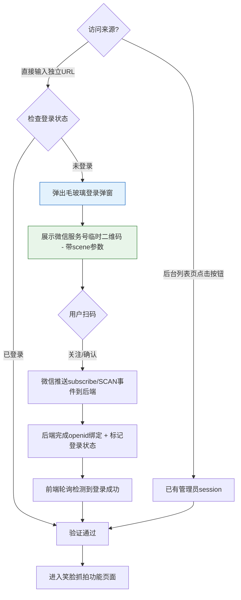
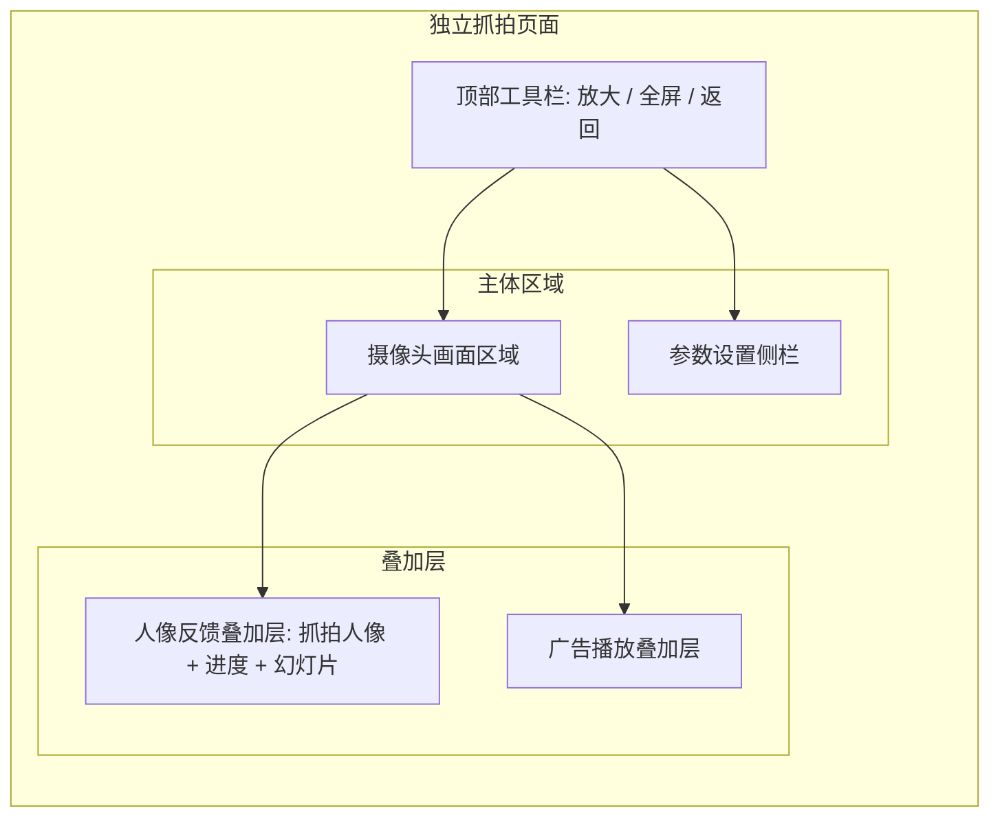
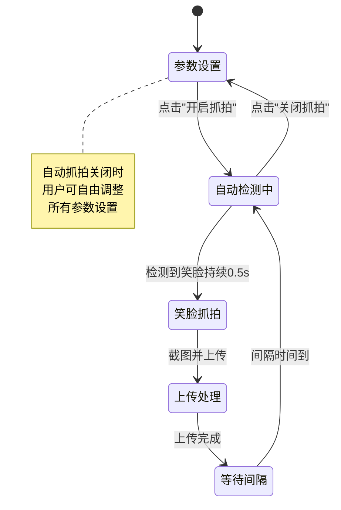
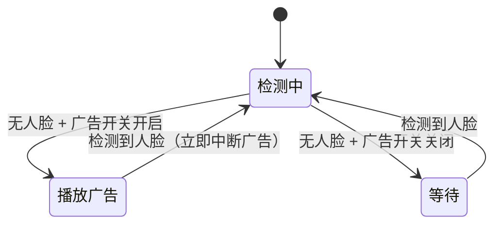
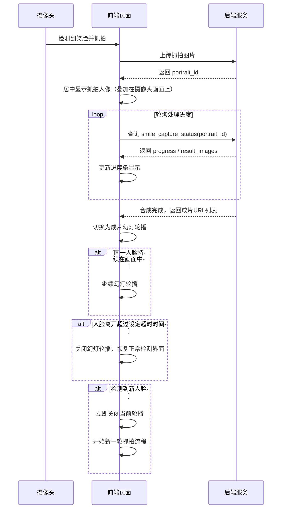
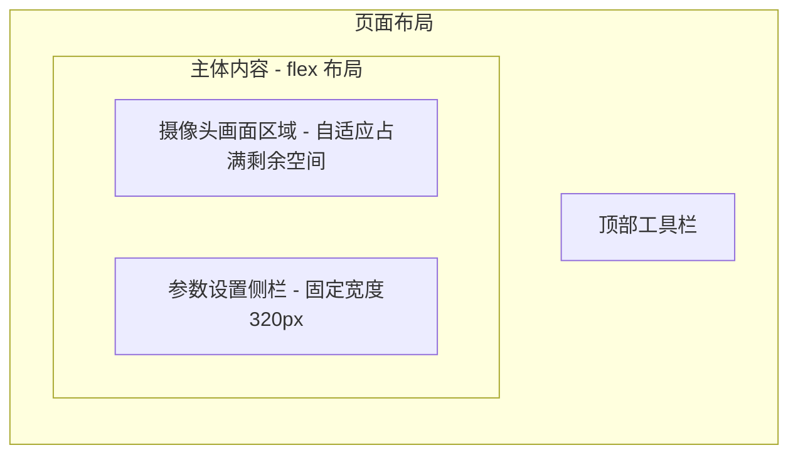
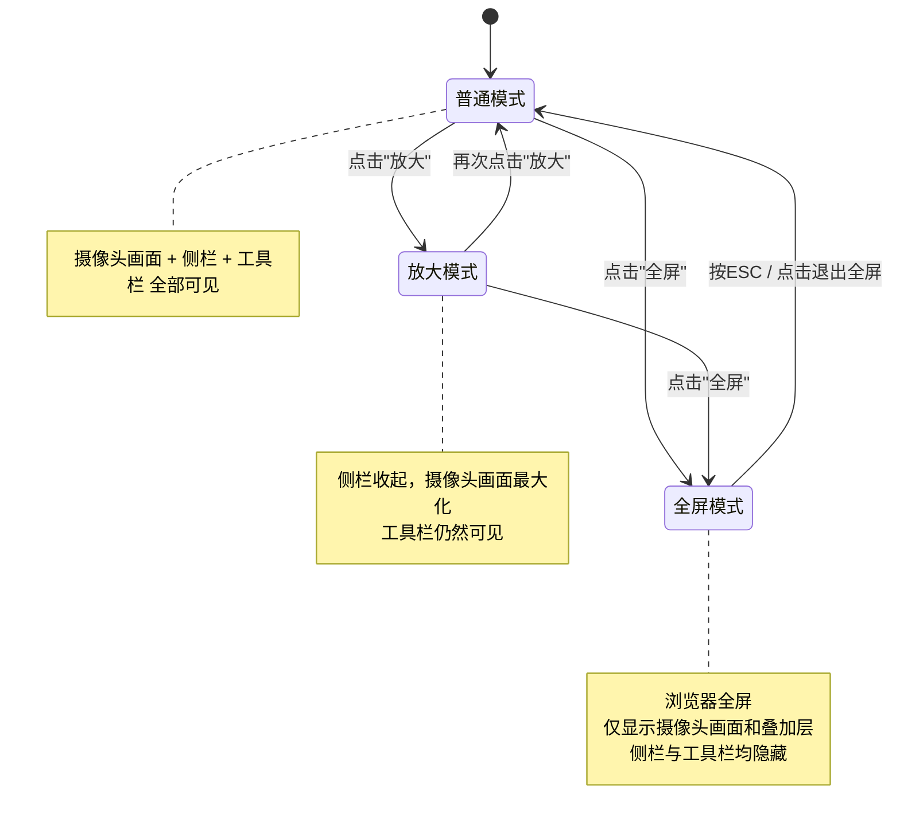

# 笑脸抓拍功能优化设计

## 1. 概述

本设计基于现有 AI 旅拍系统中的笑脸抓拍功能（`portrait_list.html` 内嵌 layer 弹窗实现），进行四大方向的优化升级：

- **抓拍图片参数可配**：支持用户自定义抓拍图片的尺寸（1K / 2K）与画面比例（6种预设比例）
- **抓拍流程精细化控制**：新增自动抓拍开关、广告播放开关、人像实时反馈开关，使抓拍流程更智能、可控
- **独立页面与全屏模式**：将现有 layer 弹窗改为独立新页面打开，支持放大和全屏浏览
- **独立URL访问与认证**：笑脸抓拍页面拥有独立可分享的网址链接，未登录用户访问时弹出毛玻璃登录弹窗（微信扫码认证），认证通过后方可使用

### 涉及文件

| 层级 | 现有文件 | 说明 |
|------|---------|------|
| 视图层 | `app/view/ai_travel_photo/portrait_list.html` | 人像管理列表页，现有笑脸抓拍弹窗逻辑所在 |
| 视图层 | **新增** `app/view/ai_travel_photo/smile_capture.html` | 笑脸抓拍独立页面（含登录弹窗） |
| 控制器 | `app/controller/AiTravelPhoto.php` | 包含 `smile_capture_upload` 等后端接口（继承 Common） |
| 控制器 | **新增** `app/controller/SmileCapture.php` | 独立URL入口控制器（继承 Base，自行管理认证） |

---

## 2. 架构

### 2.1 独立URL访问与认证流程



**独立URL格式**：`https://{域名}/index.php?s=/SmileCapture/index&aid={aid}&bid={bid}`

**认证规则**：
- 从后台管理列表页打开时，复用现有 `ADMIN_LOGIN` session，直接可用
- 通过独立URL直接访问时，后端检查 session 状态；未登录则页面正常加载但功能区域被遮罩覆盖，显示毛玻璃效果（`backdrop-filter: blur(12px)`）的居中登录弹窗
- 登录弹窗内展示微信服务号带 scene 值的临时二维码，用户扫码后由微信推送事件至后端完成认证，禁止跳转至其他页面
- 前端每 2 秒轮询登录状态接口，检测到登录成功后自动关闭弹窗、移除遮罩，页面即可操作

### 2.2 抓拍业务流程

```mermaid
flowchart TD
    A[人像管理列表页] -->|点击"笑脸抓拍"按钮| B[在新标签页/iframe打开独立抓拍页面]
    B --> C[参数设置阶段]
    C -->|用户配置尺寸/比例/开关| C
    C -->|点击"开启抓拍"| D{自动抓拍已开启?}
    D -->|是| E[启动人脸检测循环]
    D -->|否| C
    E --> F{检测到人脸?}
    F -->|否 且 广告开关开启| G[加载广告播放]
    F -->|否 且 广告开关关闭| H[持续等待检测]
    F -->|是| I{是否微笑?}
    G -->|检测到人脸| I
    I -->|是 持续0.5秒| J[按设定尺寸/比例抓拍]
    I -->|否| E
    J --> K[上传服务器]
    K --> L{人像反馈开关开启?}
    L -->|是| M[居中显示抓拍人像 + 处理进度]
    L -->|否| N[仅更新抓拍计数]
    M --> O[处理完成后幻灯轮播成片]
    O --> P{人脸离开超时?}
    P -->|超时 30s/1min/2min| Q[关闭幻灯轮播]
    P -->|检测到新人脸| R[立即关闭轮播 开始新抓拍]
    Q --> E
    R --> J
    N --> E
```

### 2.3 页面架构



> **全屏模式**：进入全屏后，参数设置侧栏隐藏，仅保留摄像头画面区域（及叠加层）。退出全屏后侧栏恢复显示。

> **登录遮罩层**：未登录状态下，整个页面覆盖毛玻璃遮罩（`backdrop-filter: blur(12px)`），遮罩上方居中悬浮登录弹窗，禁止操作下方任何功能控件。

---

## 3. API 端点

### 3.1 现有接口（需调整）

#### 笑脸抓拍上传 `smile_capture_upload`

需新增请求参数以支持尺寸与比例配置：

| 参数名 | 类型 | 必填 | 说明 |
|--------|------|------|------|
| image | string | 是 | Base64 编码的图片数据 |
| mdid | int | 否 | 门店ID，默认0 |
| is_manual | int | 否 | 是否手动抓拍（0自动 / 1手动） |
| face_embedding | string | 否 | 人脸特征向量JSON |
| **capture_size** | string | 否 | 抓拍尺寸，可选值：`1K`、`2K`，默认 `1K` |
| **aspect_ratio** | string | 否 | 画面比例，可选值：`1:1`、`2:3`、`3:4`、`4:3`、`9:16`、`16:9`，默认 `3:4` |

后端在接收到 `capture_size` 和 `aspect_ratio` 后，将根据以下规则计算实际输出尺寸并对原始抓拍图进行裁剪/缩放：

| 尺寸档位 | 基准长边像素 |
|----------|-------------|
| 1K | 1024px |
| 2K | 2048px |

### 3.2 新增接口

#### 独立URL入口 `SmileCapture/index`

| 属性 | 值 |
|------|-----|
| 路径 | `SmileCapture/index` |
| 方法 | GET |
| 说明 | 独立URL入口，渲染笑脸抓拍页面。不继承 Common 控制器（避免强制重定向），而是继承 Base 控制器，自行检查登录状态并将状态注入视图变量 |
| 参数 | `aid`（必填，账户ID）、`bid`（可选，商家ID）、`mdid`（可选，门店ID预选） |

后端行为：
- 从 session 中读取 `ADMIN_LOGIN`、`ADMIN_AID`、`ADMIN_BID` 等状态
- 将 `is_logged_in`（布尔值）注入视图，前端据此决定是否显示登录遮罩
- 若已登录，正常查询门店列表、商户信息等数据注入视图
- 若未登录，仍然渲染页面结构，但不查询业务数据，前端自动展示登录弹窗

#### 后台内嵌入口 `AiTravelPhoto/smile_capture_page`

| 属性 | 值 |
|------|-----|
| 路径 | `AiTravelPhoto/smile_capture_page` |
| 方法 | GET |
| 说明 | 后台管理框架内的入口，复用 Common 控制器的认证体系，直接渲染同一视图模板 |
| 参数 | `mdid`（可选，门店ID预选） |

#### 登录状态轮询 `SmileCapture/check_login`

| 属性 | 值 |
|------|-----|
| 路径 | `SmileCapture/check_login` |
| 方法 | GET |
| 说明 | 前端轮询此接口检测扫码登录是否完成 |

请求参数：

| 参数名 | 类型 | 必填 | 说明 |
|--------|------|------|------|
| scene | string | 是 | 二维码中携带的 scene 值 |

响应结构：

| 字段 | 类型 | 说明 |
|------|------|------|
| status | int | 0未登录 1已登录 |
| data.aid | int | 登录成功时返回账户ID |
| data.bid | int | 登录成功时返回商家ID |
| data.username | string | 登录成功时返回管理员名称 |

#### 获取登录二维码 `SmileCapture/get_login_qrcode`

| 属性 | 值 |
|------|-----|
| 路径 | `SmileCapture/get_login_qrcode` |
| 方法 | GET |
| 说明 | 生成微信服务号带 scene 值的临时二维码，用于扫码登录 |

请求参数：

| 参数名 | 类型 | 必填 | 说明 |
|--------|------|------|------|
| aid | int | 是 | 账户ID |

响应结构：

| 字段 | 类型 | 说明 |
|------|------|------|
| status | int | 0失败 1成功 |
| data.qrcode_url | string | 二维码图片URL |
| data.scene | string | scene标识，用于后续轮询 |
| data.expire_seconds | int | 二维码有效期（秒） |

#### 查询抓拍处理状态 `smile_capture_status`

| 属性 | 值 |
|------|-----|
| 路径 | `AiTravelPhoto/smile_capture_status` |
| 方法 | GET |
| 说明 | 轮询某次抓拍的合成处理进度，用于人像实时反馈功能 |

请求参数：

| 参数名 | 类型 | 必填 | 说明 |
|--------|------|------|------|
| portrait_id | int | 是 | 人像记录ID |

响应结构：

| 字段 | 类型 | 说明 |
|------|------|------|
| status | int | 0失败 1成功 |
| data.synthesis_status | int | 合成状态：0未处理 1已提交 2处理中 3成功 4失败 |
| data.progress | int | 处理进度百分比（0-100） |
| data.result_images | array | 成片图片URL列表（合成成功时返回） |

---

## 4. 数据模型

### 4.1 抓拍配置数据结构（前端状态）

页面级维护的配置对象，不持久化到数据库：

| 字段 | 类型 | 默认值 | 说明 |
|------|------|--------|------|
| captureSize | string | `1K` | 抓拍尺寸 |
| aspectRatio | string | `3:4` | 画面比例 |
| autoCaptureEnabled | boolean | false | 是否开启自动抓拍 |
| adPlaybackEnabled | boolean | false | 是否开启广告播放（预置） |
| portraitFeedbackEnabled | boolean | true | 是否开启人像实时反馈 |
| feedbackTimeout | int | 60 | 人脸离开后关闭轮播的超时秒数 |
| captureInterval | int | 1 | 抓拍间隔（秒） |
| dedupMinutes | int | 1 | 去重时间（分钟） |

### 4.2 现有数据表无需新增字段

`ai_travel_photo_portrait` 表已有 `width`、`height` 字段，后端根据前端传入的 `capture_size` 和 `aspect_ratio` 在裁剪缩放后写入实际尺寸值即可。

---

## 5. 业务逻辑层

### 5.1 功能模块一：抓拍图片尺寸与比例设置

#### 5.1.1 比例预设定义

| 比例 | 标签 | 典型用途 | 宽高计算示例（1K档） | 宽高计算示例（2K档） |
|------|------|----------|---------------------|---------------------|
| 1:1 | 正方形·头像 | 头像 | 1024 × 1024 | 2048 × 2048 |
| 2:3 | 社交媒体·自拍 | 社交媒体 | 683 × 1024 | 1365 × 2048 |
| 3:4 | 经典比例·拍照 | 拍照 | 768 × 1024 | 1536 × 2048 |
| 4:3 | 文章配图·插画 | 插画 | 1024 × 768 | 2048 × 1536 |
| 9:16 | 手机壁纸·人像 | 人像 | 576 × 1024 | 1152 × 2048 |
| 16:9 | 桌面壁纸·风景 | 风景 | 1024 × 576 | 2048 × 1152 |

#### 5.1.2 前端裁剪逻辑

1. 摄像头画面区域按所选比例显示裁剪框（半透明遮罩标示有效取景范围）
2. 抓拍时，从 canvas 中按比例裁剪出目标区域
3. 根据所选尺寸档位，将裁剪后的图像缩放至目标分辨率
4. 转为 JPEG Base64 后上传

#### 5.1.3 后端处理逻辑

在 `smile_capture_upload` 方法中新增尺寸校验与处理步骤：
- 接收 `capture_size` 和 `aspect_ratio` 参数
- 校验接收到的图片是否符合预期尺寸，若偏差过大则使用 GD 库进行二次裁剪缩放
- 写入 `width` / `height` 为最终实际像素值

### 5.2 功能模块二：抓拍流程控制

#### 5.2.1 自动抓拍开关



**行为规则**：
- 页面打开默认处于"参数设置"状态，自动抓拍关闭
- 点击"开启抓拍"后，启动摄像头人脸检测循环，参数设置区变为只读
- 点击"关闭抓拍"后，停止检测循环，参数设置区恢复可编辑
- 手动抓拍按钮在自动抓拍开启/关闭时均可使用

#### 5.2.2 广告播放开关（预置功能）



**行为规则**：
- 仅在自动抓拍开启时生效
- 无人脸检测期间，若广告开关为开启状态，则在摄像头画面上叠加显示广告内容
- 检测到人脸后立即中断广告，切回抓拍流程
- 广告内容数据源为预留接口，后期开发时对接广告素材管理模块

#### 5.2.3 人像实时反馈功能



**人脸离开超时设置**：

| 选项 | 值 |
|------|-----|
| 30秒 | 30 |
| 1分钟 | 60 |
| 2分钟 | 120 |

**判断逻辑**：
- "人脸离开"定义：连续N帧（约3秒）未检测到与当前已抓拍人脸相匹配的面部特征（欧氏距离 > 0.6 阈值）
- "新人脸"定义：检测到面部且与当前轮播对应的人脸特征距离 > 0.6

**轮播显示规则**：
- 抓拍人像居中叠加在摄像头画面上方（半透明蒙层背景）
- 处理中阶段显示圆形进度指示器
- 成片就绪后以 3秒/张 的间隔自动幻灯轮播
- 轮播区域可点击关闭（手动干预）

### 5.3 功能模块三：独立页面与全屏模式

#### 5.3.1 页面跳转方式

现有 `portrait_list.html` 中的"笑脸抓拍"按钮，点击后行为从 `layer.open()` 弹窗改为：
- 使用 `openmax()` 方法在后台管理框架的 iframe 中打开新页面
- 目标地址为 `AiTravelPhoto/smile_capture_page`

#### 5.3.2 独立页面布局



**顶部工具栏**包含：

| 按钮 | 功能 |
|------|------|
| ← 返回 | 关闭当前页面，回到人像管理列表 |
| ⛶ 放大 | 侧栏收起，摄像头画面最大化（仍在页面内） |
| ⛶ 全屏 | 调用浏览器 Fullscreen API，全屏显示。隐藏参数设置侧栏及顶部工具栏，仅保留摄像头画面与叠加层。按 ESC 退出全屏 |

#### 5.3.3 参数设置侧栏内容

侧栏分为以下卡片区块：

| 区块 | 包含控件 |
|------|---------|
| 门店选择 | 门店下拉框 |
| 图片设置 | 尺寸选择（1K / 2K）、比例选择（6种预设，卡片式选择） |
| 抓拍控制 | 开启/关闭自动抓拍按钮、抓拍间隔下拉框、去重时间下拉框 |
| 功能开关 | 广告播放开关（预置）、人像实时反馈开关、反馈超时时间选择 |
| 抓拍统计 | 已抓拍数量、上次抓拍时间 |
| 手动抓拍 | 手动抓拍按钮 |

#### 5.3.4 全屏模式状态切换



---

## 6. 中间件与拦截器

### 6.1 认证策略分离

笑脸抓拍功能存在两种访问入口，采用不同的认证策略：

| 入口 | 控制器 | 继承关系 | 认证方式 |
|------|--------|---------|----------|
| 后台管理列表页跳转 | `AiTravelPhoto` | 继承 `Common` → `Base` | 复用现有 session 认证，未登录时自动重定向到 `login/index` |
| 独立URL直接访问 | `SmileCapture` | 继承 `Base` | **不强制重定向**，页面正常渲染，未登录时前端显示毛玻璃登录弹窗 |

### 6.2 独立URL控制器认证逻辑

`SmileCapture` 控制器的 `initialize()` 方法行为：
1. 读取 `session('ADMIN_LOGIN')`，判断是否已登录
2. **不执行重定向**，仅将登录状态作为变量传递给视图
3. 已登录状态下，正常初始化 `aid`、`bid`、`uid` 等业务变量
4. 未登录状态下，仅从 URL 参数中获取 `aid` 用于生成登录二维码

### 6.3 接口权限控制

| 接口 | 是否要求登录 | 说明 |
|------|------------|------|
| `SmileCapture/index` | 否（页面可渲染，功能需登录） | 页面渲染不拦截，前端通过遮罩控制可操作性 |
| `SmileCapture/get_login_qrcode` | 否 | 登录前需要调用此接口获取二维码 |
| `SmileCapture/check_login` | 否 | 登录前需要轮询此接口 |
| `AiTravelPhoto/smile_capture_upload` | 是 | 抓拍上传必须已登录 |
| `AiTravelPhoto/smile_capture_status` | 是 | 状态查询必须已登录 |

---

## 7. 测试

### 7.1 单元测试

| 测试项 | 测试目标 | 验证要点 |
|--------|---------|---------|
| 尺寸比例裁剪计算 | 后端 `smile_capture_upload` 中的尺寸校验与裁剪缩放逻辑 | 对每种比例和尺寸档位组合，验证输出图片的宽高是否正确 |
| 人脸去重判断 | 前端 `isFaceRecentlyCaptured` 函数 | 相同人脸在去重窗口内返回 true；不同人脸返回 false；过期记录被正确清理 |
| 抓拍状态轮询 | `smile_capture_status` 接口 | 各合成状态（0-4）正确返回；成功时返回 result_images 列表 |

### 7.2 集成测试

| 测试场景 | 步骤 | 预期结果 |
|----------|------|---------|
| 自动抓拍开关流程 | 打开页面 → 设置参数 → 开启自动抓拍 → 面对摄像头微笑 | 自动抓拍后按设定比例尺寸上传成功 |
| 广告播放切换 | 开启自动抓拍 + 开启广告 → 移开面部 → 再出现 | 无人脸时广告区域展示占位提示；人脸出现后广告立即消失 |
| 人像反馈全流程 | 开启反馈 → 抓拍 → 等待合成 → 查看轮播 → 离开 | 抓拍后显示进度 → 完成后幻灯轮播 → 超时后自动关闭 |
| 新人脸中断轮播 | 正在轮播A的成片 → B出现在摄像头前 | 立即关闭A的轮播，开始B的抓拍 |
| 全屏模式 | 点击全屏 → ESC退出 | 全屏时仅显示摄像头画面；退出后侧栏恢复 |
| 放大模式 | 点击放大 → 再点击放大 | 侧栏收起/展开切换正常 |
| 各比例抓拍 | 分别选择6种比例 + 2种尺寸 → 抓拍 | 摄像头画面上裁剪框正确显示；上传图片尺寸符合预期 |
| 独立URL未登录访问 | 直接输入独立URL → 页面加载 | 页面渲染正常，毛玻璃遮罩覆盖，登录弹窗显示微信二维码 |
| 扫码登录流程 | 未登录 → 扫描二维码 → 关注/确认 | 前端轮询检测到登录 → 遮罩消失 → 功能可用 |
| 已登录独立URL访问 | 已登录状态下输入独立URL | 页面直接可用，无登录弹窗 |
| 后台入口访问 | 后台列表页点击"笑脸抓拍" | 复用管理员session，直接进入功能页面 |
| 登录过期处理 | 使用中session过期 → 尝试抓拍上传 | 接口返回登录失效提示，前端重新弹出登录弹窗 |


