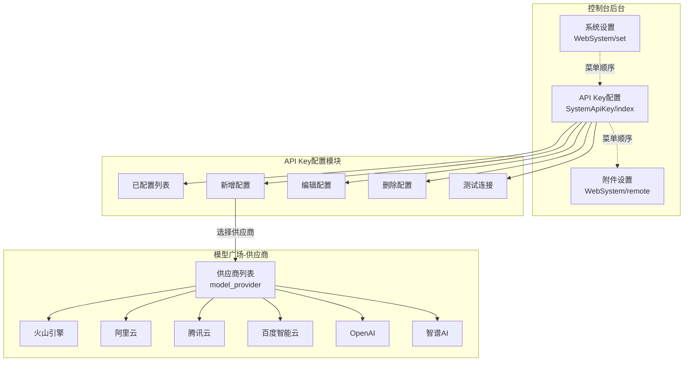
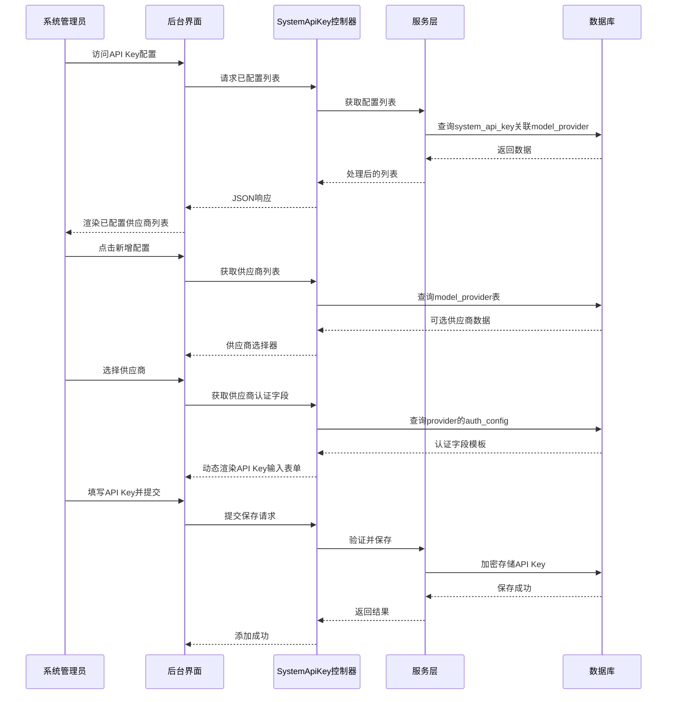
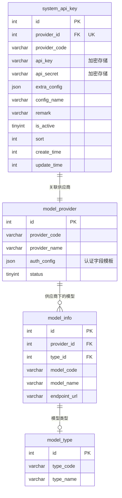
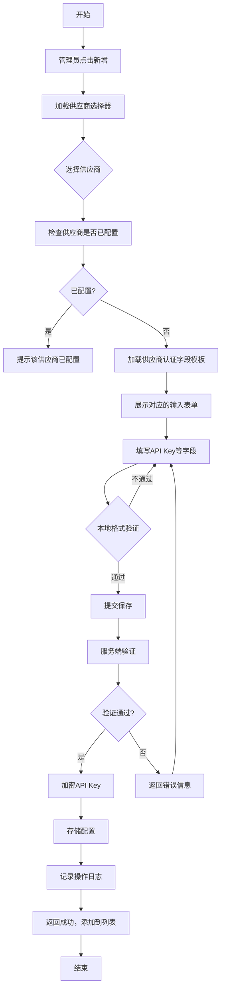
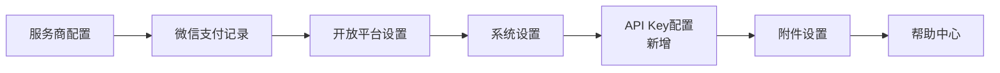

# 系统API Key配置功能设计文档

## 1. 概述

### 1.1 功能背景
在后台系统（控制台）的"系统设置"与"门店管理"菜单之间增加"API Key配置"功能模块。管理员可从模型广场的**供应商列表**中选择供应商，填写对应的API Key，即可启用该供应商下所有大模型的调用能力。

### 1.2 核心价值
| 价值维度 | 描述 |
|---------|------|
| 统一管理 | 在系统层级集中管理各AI供应商的API密钥，一个供应商配置一次即可 |
| 快速接入 | 从模型广场选择供应商，自动加载该供应商的认证字段模板 |
| 安全存储 | API密钥加密存储，支持敏感信息脱敏展示 |
| 全局生效 | 配置一个供应商的API Key后，该供应商下所有模型均可调用 |

### 1.3 目标用户
- 系统管理员（控制台级别，isadmin=2）

---

## 2. 架构设计

### 2.1 模块架构图

### 2.2 数据流架构

---

## 3. 数据模型

### 3.1 核心数据表设计

#### system_api_key（系统API Key配置表）

| 字段名 | 类型 | 必填 | 说明 |
|-------|------|------|------|
| id | int(11) unsigned | 是 | 主键ID，自增 |
| provider_id | int(11) unsigned | 是 | 关联供应商ID（model_provider.id） |
| provider_code | varchar(50) | 是 | 供应商标识（冗余字段，方便查询） |
| api_key | varchar(500) | 是 | API密钥（AES-256-CBC加密存储） |
| api_secret | varchar(500) | 否 | API密钥Secret（部分供应商需要） |
| extra_config | json | 否 | 扩展配置参数（如endpoint等） |
| config_name | varchar(100) | 否 | 配置名称（便于识别） |
| remark | varchar(255) | 否 | 备注说明 |
| is_active | tinyint(1) | 是 | 启用状态：1-启用，0-停用 |
| sort | int(11) | 是 | 排序权重，默认0 |
| create_time | int(11) unsigned | 是 | 创建时间戳 |
| update_time | int(11) unsigned | 是 | 更新时间戳 |

#### 表索引设计

| 索引名 | 字段 | 类型 | 说明 |
|-------|------|------|------|
| PRIMARY | id | 主键 | 主键索引 |
| uk_provider_id | provider_id | 唯一 | 一个供应商只能配置一次 |
| idx_provider_code | provider_code | 普通 | 供应商查询优化 |
| idx_is_active | is_active | 普通 | 状态筛选优化 |

### 3.2 实体关系图

### 3.3 供应商auth_config字段说明

模型广场的`model_provider`表中，`auth_config`字段定义了该供应商所需的认证字段，系统根据此模板动态生成表单。

| 供应商 | auth_config字段配置 |
|---------|-------------------|
| 火山引擎 | api_key(必填), api_secret(可选) |
| 阿里云 | api_key(必填) |
| 腾讯云 | api_key/SecretId(必填), api_secret/SecretKey(必填) |
| 百度智能云 | api_key(必填), api_secret(必填) |
| OpenAI | api_key(必填) |
| 智谱AI | api_key(必填) |

---

## 4. API接口设计

### 4.1 接口总览

| 接口路径 | 方法 | 功能 | 权限 |
|---------|------|------|------|
| SystemApiKey/index | GET/AJAX | 获取已配置列表 | 系统管理员 |
| SystemApiKey/edit | GET | 编辑/新增页面 | 系统管理员 |
| SystemApiKey/save | POST | 保存配置 | 系统管理员 |
| SystemApiKey/delete | POST | 删除配置 | 系统管理员 |
| SystemApiKey/setst | POST | 切换启用状态 | 系统管理员 |
| SystemApiKey/test | POST | 测试API连接 | 系统管理员 |
| SystemApiKey/get_providers | GET | 获取可选供应商列表 | 系统管理员 |
| SystemApiKey/get_auth_fields | GET | 获取供应商认证字段 | 系统管理员 |

### 4.2 核心接口详情

#### 4.2.1 获取配置列表

**请求参数**

| 参数名 | 类型 | 必填 | 说明 |
|-------|------|------|------|
| page | int | 否 | 页码，默认1 |
| limit | int | 否 | 每页条数，默认20 |
| keyword | string | 否 | 搜索关键词（配置名称/供应商名称） |
| is_active | int | 否 | 状态筛选 |

**响应数据**

| 字段 | 类型 | 说明 |
|------|------|------|
| code | int | 状态码：0-成功 |
| msg | string | 提示信息 |
| count | int | 总记录数 |
| data | array | 配置列表数据 |
| data[].id | int | 配置ID |
| data[].config_name | string | 配置名称 |
| data[].provider_name | string | 供应商名称 |
| data[].provider_code | string | 供应商标识 |
| data[].api_key_masked | string | 脱敏后的API Key |
| data[].model_count | int | 该供应商下可用模型数 |
| data[].is_active | int | 启用状态 |
| data[].create_time_text | string | 创建时间 |

#### 4.2.2 保存配置

**请求参数**

| 参数名 | 类型 | 必填 | 说明 |
|-------|------|------|------|
| info[id] | int | 否 | 配置ID（编辑时传入） |
| info[provider_id] | int | 是 | 关联供应商ID |
| info[api_key] | string | 是 | API密钥 |
| info[api_secret] | string | 否 | API密钥Secret（部分供应商需要） |
| info[extra_config] | json | 否 | 扩展配置 |
| info[config_name] | string | 否 | 配置名称 |
| info[remark] | string | 否 | 备注 |
| info[is_active] | int | 否 | 启用状态，默认1 |

**响应数据**

| 字段 | 类型 | 说明 |
|------|------|------|
| status | int | 状态：1-成功，0-失败 |
| msg | string | 提示信息 |
| url | string/bool | 跳转地址或true |

#### 4.2.3 测试API连接

**请求参数**

| 参数名 | 类型 | 必填 | 说明 |
|-------|------|------|------|
| id | int | 是 | 配置ID |

**响应数据**

| 字段 | 类型 | 说明 |
|------|------|------|
| status | int | 状态：1-成功，0-失败 |
| msg | string | 测试结果描述 |

---

## 5. 业务逻辑层

### 5.1 核心业务流程

#### 5.1.1 新增API Key配置流程

#### 5.1.2 API Key验证规则

| 验证项 | 规则 | 说明 |
|-------|------|------|
| provider_id | 必填且存在 | 必须选择有效的供应商 |
| api_key | 必填、长度≥20字符 | 基本格式验证 |
| api_secret | 按供应商要求 | 部分供应商必填 |
| 唯一性 | 同provider_id不重复 | 一个供应商只能配置一次 |

### 5.2 安全设计

#### 5.2.1 API Key加密存储

| 项目 | 说明 |
|------|------|
| 算法 | AES-256-CBC |
| 密钥来源 | 系统配置authkey |
| IV生成 | md5(authkey)前16位 |
| 存储格式 | base64编码后的密文 |

#### 5.2.2 API Key脱敏展示

| 展示场景 | 脱敏规则 | 示例 |
|---------|---------|------|
| 列表页 | 仅显示前4位+****+后4位 | sk-a***abcd |
| 编辑页 | 输入框显示占位符 | 已配置（点击重新输入） |

---

## 6. 组件架构

### 6.1 控制器设计

**SystemApiKey控制器**

| 方法 | 功能 | 依赖 |
|------|------|------|
| index() | 配置列表页面与数据 | SystemApiKeyService |
| edit() | 编辑/新增页面 | ModelSquareService |
| save() | 保存配置 | SystemApiKeyService |
| delete() | 删除配置 | SystemApiKeyService |
| setst() | 切换状态 | 数据库操作 |
| test() | 测试连接 | AI服务适配器 |
| get_providers() | 获取供应商列表 | ModelSquareService |
| get_auth_fields() | 获取供应商认证字段 | ModelSquareService |

### 6.2 服务层设计

**SystemApiKeyService服务**

| 方法 | 功能 |
|------|------|
| getList() | 获取配置列表（含关联供应商查询） |
| getDetail() | 获取配置详情 |
| save() | 保存配置（含加密） |
| delete() | 删除配置 |
| updateStatus() | 更新状态 |
| getActiveConfigByProvider() | 根据供应商获取有效配置 |
| encryptApiKey() | 加密API Key |
| decryptApiKey() | 解密API Key |
| maskApiKey() | 脱敏API Key |

### 6.3 视图层设计

**页面结构**

| 页面文件 | 功能 |
|---------|------|
| index.html | 配置列表页（layui table） |
| edit.html | 新增/编辑表单页 |

---

## 7. 菜单配置

### 7.1 菜单位置

在WebSystem控制器的index方法中，菜单配置位于"系统设置"之后、"附件设置"之前：

### 7.2 菜单配置项

| 属性 | 值 |
|------|-----|
| 菜单名称 | API Key配置 |
| 菜单路径 | SystemApiKey/index |
| 图标 | 可选（与其他菜单风格一致） |

---

## 8. 测试策略

### 8.1 单元测试用例

| 测试模块 | 测试场景 | 预期结果 |
|---------|---------|---------|
| 数据验证 | provider_id为空 | 返回"请选择供应商" |
| 数据验证 | api_key长度<20 | 返回"API Key格式不正确" |
| 数据验证 | 重复配置同一供应商 | 返回"该供应商已配置" |
| 加密存储 | 保存后读取 | 解密后与原文一致 |
| 脱敏展示 | 列表展示 | 仅显示前后各4位 |
| 状态切换 | 停用配置 | is_active变为0 |
| 删除配置 | 删除已启用配置 | 成功删除 |

### 8.2 集成测试用例

| 测试场景 | 步骤 | 预期结果 |
|---------|------|---------|
| 完整新增流程 | 选择供应商→填写Key→保存 | 配置成功创建，添加到列表 |
| 编辑已有配置 | 打开编辑→修改备注→保存 | 配置更新成功 |
| 供应商字段适配 | 选择不同供应商 | 显示对应的认证字段表单 |
