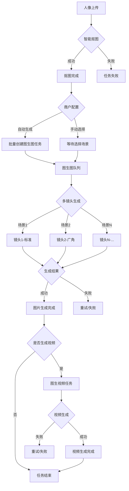
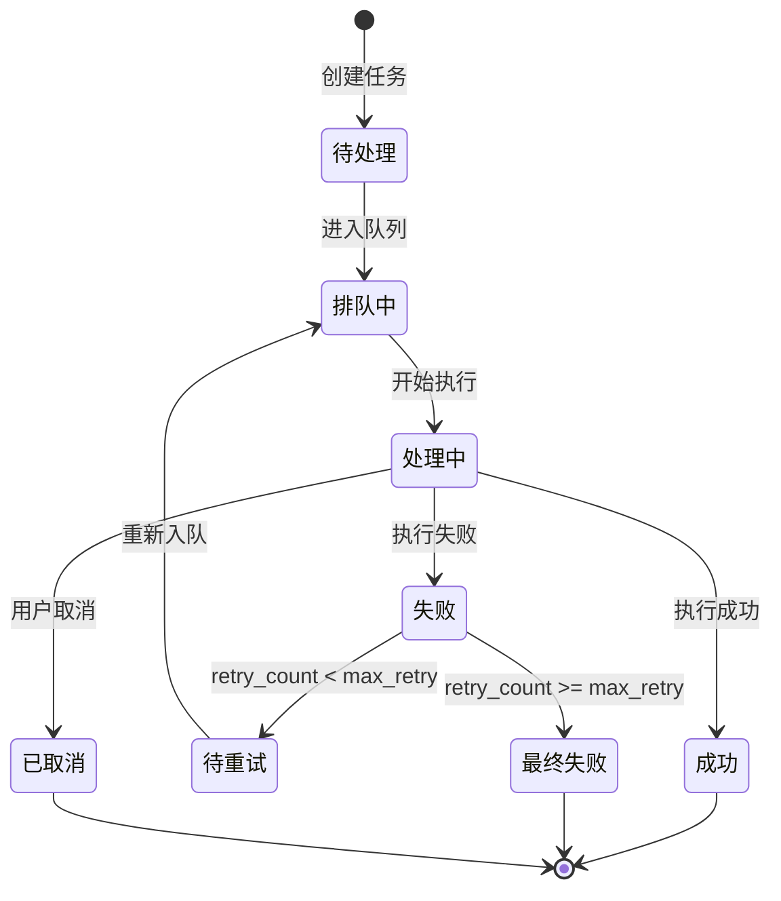
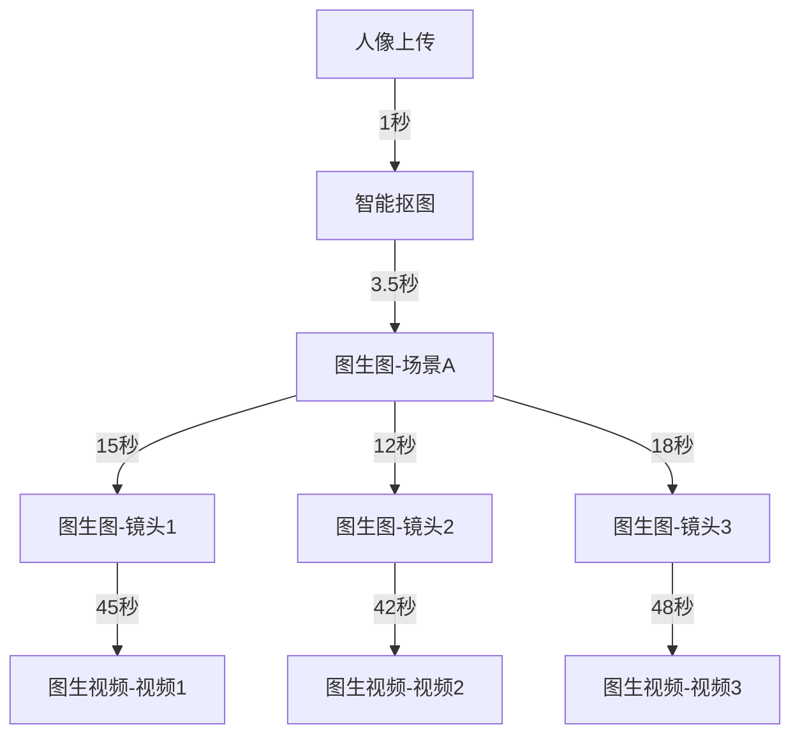
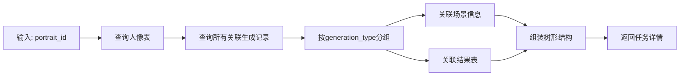

# AI旅拍任务列表功能设计

## 1. 概述

### 1.1 功能定位
任务列表是位于人像管理与订单管理之间的核心功能模块，提供从人像上传到AI生成全流程的任务进度可视化追踪能力。

### 1.2 核心价值
- **全流程可视化**：展示从人像上传、智能抠图、图生图（多镜头）、到图生视频的完整任务链路
- **实时进度监控**：商户可实时查看每个任务的执行状态、耗时、成功率等关键指标
- **异常任务识别**：快速定位失败、超时、异常的任务，支持重试或人工干预
- **多维度筛选**：支持按人像、时间、状态、任务类型等多维度查询

### 1.3 适用用户
- 商户后台管理员
- 门店运营人员

## 2. 架构设计

### 2.1 数据源映射

任务数据来源于现有数据表：

| 数据表 | 用途 | 关键字段 |
|--------|------|----------|
| ddwx_ai_travel_photo_portrait | 人像基础信息 | id, original_url, cutout_status, cutout_url, md5, file_name |
| ddwx_ai_travel_photo_generation | 任务生成记录 | id, portrait_id, scene_id, generation_type, status, retry_count, cost_time |
| ddwx_ai_travel_photo_result | 生成结果 | id, generation_id, portrait_id, scene_id, type, result_url |
| ddwx_ai_travel_photo_device | 设备信息 | device_name, device_id |

### 2.2 任务流程图



### 2.3 任务类型定义

| 任务类型 | 类型标识 | 说明 | 队列名称 |
|---------|---------|------|---------|
| 智能抠图 | cutout | 从原始人像中分离主体 | ai_cutout |
| 图生图（单场景） | image_generation | 单个场景的图像合成 | ai_image_generation |
| 多镜头批量生成 | multi_generation | 同一场景多个镜头批量生成 | ai_image_generation |
| 图生视频 | video_generation | 从生成图片转换为动态视频 | ai_video_generation |

### 2.4 任务状态机



## 3. 功能模块设计

### 3.1 任务列表页面

#### 3.1.1 页面布局

页面采用卡片式布局，每条任务记录包含：

**顶部区域**
- 人像缩略图（左侧，尺寸：80px × 80px）
- 文件信息（中间）：文件名、MD5、上传时间、上传设备
- 任务统计（右侧）：总任务数、成功数、失败数、进行中

**任务链路区域**（可折叠展开）
- 阶段式进度展示
- 每个阶段显示：状态图标、任务类型、耗时、重试次数
- 支持点击查看子任务详情

**操作区域**
- 查看详情按钮
- 重试失败任务按钮（仅失败任务可见）
- 取消任务按钮（仅进行中任务可见）

#### 3.1.2 筛选条件

| 筛选项 | 类型 | 选项 |
|--------|------|------|
| 时间范围 | 日期区间选择器 | 今天、昨天、最近7天、最近30天、自定义 |
| 任务状态 | 多选下拉框 | 全部、进行中、已完成、部分失败、全部失败 |
| 任务类型 | 多选下拉框 | 抠图、图生图、视频生成 |
| 门店 | 下拉框 | 全部门店、具体门店 |
| 设备 | 下拉框 | 全部设备、具体设备 |
| 关键词搜索 | 文本输入框 | 文件名、MD5（支持模糊匹配） |

#### 3.1.3 排序规则

默认按创建时间倒序，支持以下排序方式：

- 创建时间（升序/降序）
- 更新时间（升序/降序）
- 任务数量（升序/降序）
- 完成进度（升序/降序）

### 3.2 任务详情页面

#### 3.2.1 详情内容结构

**人像基础信息**
| 字段 | 说明 |
|------|------|
| 原始图片 | 展示原始上传图片（支持点击放大） |
| 抠图结果 | 展示抠图后图片（若已完成） |
| 文件名称 | 原始文件名 |
| 文件大小 | KB/MB |
| 图片尺寸 | 宽×高 |
| MD5值 | 文件唯一标识 |
| 上传时间 | 精确到秒 |
| 上传设备 | 设备名称 + 设备ID |
| 所属门店 | 门店名称 |

**任务链路详情**

采用时间轴形式展示：



每个节点展示信息：
- 任务ID
- 任务类型
- 开始时间
- 结束时间
- 总耗时
- 当前状态
- 重试次数
- 错误信息（若失败）
- 关联场景（若为图生图/视频）
- 结果预览（若成功）

**异常日志**

若任务失败，展示：
- 失败时间
- 失败阶段
- 错误代码
- 错误描述
- 重试历史

#### 3.2.2 任务详情数据查询逻辑



### 3.3 任务管理操作

#### 3.3.1 重试失败任务

**触发条件**
- 任务状态为"失败"
- 重试次数未超过最大限制（默认3次）

**执行流程**
1. 校验任务状态和重试次数
2. 重置任务状态为"待处理"
3. 增加重试计数器
4. 重新推送到队列
5. 记录操作日志

**重试策略**

| 任务类型 | 最大重试次数 | 延迟时间 |
|---------|------------|---------|
| 智能抠图 | 3次 | 60秒 |
| 图生图 | 2次 | 120秒 |
| 图生视频 | 1次 | 180秒 |

#### 3.3.2 取消任务

**触发条件**
- 任务状态为"待处理"或"排队中"

**执行流程**
1. 校验任务状态
2. 从队列中移除任务
3. 更新任务状态为"已取消"
4. 记录取消原因和操作人
5. 通知关联任务（如取消图生图，级联取消对应视频生成）

#### 3.3.3 批量操作

支持批量操作类型：
- 批量重试失败任务
- 批量取消待处理任务
- 批量删除历史任务（超过保留期）

### 3.4 任务统计看板

#### 3.4.1 概览指标卡片

展示最近24小时/7天/30天的关键指标：

| 指标名称 | 计算规则 | 展示方式 |
|---------|---------|---------|
| 总任务数 | 统计所有任务记录 | 数值+环比 |
| 成功率 | 成功任务数 / 总任务数 × 100% | 百分比+趋势图 |
| 平均耗时 | 所有成功任务的平均cost_time | 秒+对比上期 |
| 失败任务数 | status=失败的任务数 | 数值+占比 |
| 排队任务数 | status=待处理/排队中 | 数值（实时） |
| 正在执行 | status=处理中 | 数值（实时） |

#### 3.4.2 任务类型分布图

饼图展示不同任务类型的数量分布：
- 智能抠图
- 图生图
- 图生视频

#### 3.4.3 任务耗时分析

柱状图展示不同任务类型的平均耗时：
- X轴：任务类型
- Y轴：平均耗时（秒）
- 支持切换时间范围

#### 3.4.4 成功率趋势图

折线图展示最近N天的任务成功率：
- X轴：日期
- Y轴：成功率（%）
- 支持按任务类型分组

## 4. 数据模型设计

### 4.1 核心查询视图定义

为提升查询效率，设计任务统计视图：

**视图名称**: `view_ai_travel_task_summary`

**字段定义**:

| 字段名 | 数据类型 | 说明 |
|--------|---------|------|
| portrait_id | INT | 人像ID（主键） |
| portrait_md5 | VARCHAR(32) | 人像MD5 |
| file_name | VARCHAR(255) | 文件名 |
| device_name | VARCHAR(100) | 设备名称 |
| create_time | INT | 创建时间 |
| total_tasks | INT | 总任务数 |
| success_tasks | INT | 成功任务数 |
| failed_tasks | INT | 失败任务数 |
| processing_tasks | INT | 处理中任务数 |
| pending_tasks | INT | 待处理任务数 |
| cutout_status | TINYINT | 抠图状态 |
| has_image_result | TINYINT | 是否有图片结果 |
| has_video_result | TINYINT | 是否有视频结果 |
| latest_update_time | INT | 最新更新时间 |
| task_status_summary | VARCHAR(50) | 任务状态摘要 |

**聚合逻辑**:

```
SELECT 
    p.id AS portrait_id,
    p.md5 AS portrait_md5,
    p.file_name,
    d.device_name,
    p.create_time,
    COUNT(g.id) AS total_tasks,
    SUM(CASE WHEN g.status = 2 THEN 1 ELSE 0 END) AS success_tasks,
    SUM(CASE WHEN g.status = 3 THEN 1 ELSE 0 END) AS failed_tasks,
    SUM(CASE WHEN g.status = 1 THEN 1 ELSE 0 END) AS processing_tasks,
    SUM(CASE WHEN g.status = 0 THEN 1 ELSE 0 END) AS pending_tasks,
    p.cutout_status,
    MAX(CASE WHEN r.content_type = 1 THEN 1 ELSE 0 END) AS has_image_result,
    MAX(CASE WHEN r.content_type = 2 THEN 1 ELSE 0 END) AS has_video_result,
    MAX(g.update_time) AS latest_update_time
FROM ddwx_ai_travel_photo_portrait p
LEFT JOIN ddwx_ai_travel_photo_generation g ON p.id = g.portrait_id
LEFT JOIN ddwx_ai_travel_photo_result r ON g.id = r.generation_id
LEFT JOIN ddwx_ai_travel_photo_device d ON p.device_id = d.id
GROUP BY p.id
```

### 4.2 任务详情数据结构

任务详情接口返回的数据结构：

```json
{
  "portrait_info": {
    "portrait_id": 123,
    "file_name": "IMG_20240315_143025.jpg",
    "file_size": 2048000,
    "width": 1920,
    "height": 1080,
    "md5": "abc123def456...",
    "original_url": "https://...",
    "thumbnail_url": "https://...",
    "cutout_url": "https://...",
    "cutout_status": 2,
    "cutout_status_text": "成功",
    "device_name": "设备001",
    "mdid": 10,
    "mdname": "旗舰店",
    "create_time": 1710485425,
    "create_time_text": "2024-03-15 14:30:25"
  },
  "task_summary": {
    "total_tasks": 10,
    "success_tasks": 8,
    "failed_tasks": 1,
    "processing_tasks": 1,
    "pending_tasks": 0,
    "cancelled_tasks": 0,
    "total_cost_time": 245000,
    "avg_cost_time": 24500
  },
  "task_chain": [
    {
      "stage": "cutout",
      "stage_name": "智能抠图",
      "task_id": 0,
      "status": 2,
      "status_text": "成功",
      "start_time": 1710485426,
      "finish_time": 1710485429,
      "cost_time": 3500,
      "retry_count": 0,
      "error_msg": ""
    },
    {
      "stage": "image_generation",
      "stage_name": "图生图",
      "children": [
        {
          "scene_id": 5,
          "scene_name": "巴黎铁塔",
          "tasks": [
            {
              "task_id": 101,
              "generation_type": 1,
              "generation_type_text": "标准镜头",
              "status": 2,
              "status_text": "成功",
              "start_time": 1710485430,
              "finish_time": 1710485445,
              "cost_time": 15000,
              "retry_count": 0,
              "result_id": 201,
              "result_url": "https://...",
              "thumbnail_url": "https://..."
            },
            {
              "task_id": 102,
              "generation_type": 3,
              "generation_type_text": "广角镜头",
              "status": 2,
              "status_text": "成功",
              "start_time": 1710485446,
              "finish_time": 1710485458,
              "cost_time": 12000,
              "retry_count": 0,
              "result_id": 202,
              "result_url": "https://...",
              "thumbnail_url": "https://..."
            }
          ]
        }
      ]
    },
    {
      "stage": "video_generation",
      "stage_name": "图生视频",
      "children": [
        {
          "scene_id": 5,
          "scene_name": "巴黎铁塔",
          "tasks": [
            {
              "task_id": 301,
              "generation_type": 3,
              "generation_type_text": "图生视频",
              "status": 1,
              "status_text": "处理中",
              "start_time": 1710485460,
              "finish_time": 0,
              "cost_time": 0,
              "retry_count": 0,
              "result_id": 0,
              "source_result_id": 201
            }
          ]
        }
      ]
    }
  ]
}
```

## 5. 界面交互设计

### 5.1 列表页交互

#### 5.1.1 任务卡片展开/折叠
- 默认状态：卡片收起，仅显示概览信息
- 点击卡片或展开按钮：展开显示任务链路
- 再次点击：收起卡片

#### 5.1.2 状态颜色规范

| 状态 | 颜色代码 | 图标 |
|------|---------|------|
| 待处理 | #909399（灰色） | 时钟图标 |
| 排队中 | #E6A23C（橙色） | 队列图标 |
| 处理中 | #409EFF（蓝色） | 加载动画 |
| 成功 | #67C23A（绿色） | 对勾图标 |
| 失败 | #F56C6C（红色） | 叉号图标 |
| 已取消 | #909399（灰色） | 禁止图标 |

#### 5.1.3 实时更新机制

- 每10秒自动刷新"处理中"状态的任务
- 使用WebSocket推送任务状态变化（可选）
- 页面顶部显示最后更新时间

### 5.2 详情页交互

#### 5.2.1 图片预览
- 点击人像缩略图：弹窗放大显示原图
- 点击结果缩略图：弹窗放大显示生成结果
- 支持左右切换查看同一人像的多个结果

#### 5.2.2 时间轴交互
- 鼠标悬停任务节点：显示详细信息气泡
- 点击任务节点：定位到详细信息区域
- 失败节点显示错误提示

### 5.3 操作确认

#### 5.3.1 重试确认
弹窗提示：
```
确认重试该任务？
任务类型：图生图
重试次数：1/3
预计耗时：约15秒
```

#### 5.3.2 取消确认
弹窗提示：
```
确认取消该任务？
任务类型：图生视频
说明：取消后无法恢复，已消耗的资源不会退还
```

#### 5.3.3 批量操作确认
弹窗提示：
```
确认批量重试？
选中任务数：5个
预计耗时：约1分钟
```

## 6. 性能优化策略

### 6.1 查询优化

#### 6.1.1 索引设计

**ddwx_ai_travel_photo_generation 表索引**:
- `idx_portrait_id_status` (portrait_id, status)
- `idx_bid_create_time` (bid, create_time)
- `idx_status_update_time` (status, update_time)

**ddwx_ai_travel_photo_portrait 表索引**:
- `idx_bid_create_time` (bid, create_time)
- `idx_md5` (md5)
- `idx_device_id` (device_id)

#### 6.1.2 分页策略

- 默认每页20条
- 支持调整为10/20/50/100条
- 使用游标分页（基于主键）提升大数据量查询性能

#### 6.1.3 缓存策略

| 缓存项 | 缓存时长 | 更新机制 |
|--------|---------|---------|
| 任务统计数据 | 60秒 | 定时刷新 |
| 门店列表 | 5分钟 | 手动清除 |
| 设备列表 | 5分钟 | 手动清除 |
| 场景列表 | 10分钟 | 手动清除 |

### 6.2 前端优化

#### 6.2.1 虚拟滚动
- 当任务列表超过100条时，启用虚拟滚动
- 仅渲染可视区域及前后缓冲区的卡片

#### 6.2.2 图片懒加载
- 缩略图默认加载占位图
- 进入可视区域后异步加载真实图片

#### 6.3.3 数据预加载
- 鼠标悬停任务卡片时，预加载任务详情数据
- 提升详情页打开速度

## 7. 权限控制

### 7.1 菜单权限

**菜单位置**: 旅拍 > 任务列表

**权限标识**: `AiTravelPhoto/tasklist`

### 7.2 操作权限

| 操作 | 权限标识 | 说明 |
|------|---------|------|
| 查看列表 | `AiTravelPhoto/tasklist` | 基础权限 |
| 查看详情 | `AiTravelPhoto/taskdetail` | 查看任务详情 |
| 重试任务 | `AiTravelPhoto/taskretry` | 重试失败任务 |
| 取消任务 | `AiTravelPhoto/taskcancel` | 取消待处理任务 |
| 批量操作 | `AiTravelPhoto/taskbatch` | 批量管理任务 |

### 7.3 数据隔离

- 平台管理员：查看所有商户任务
- 商户管理员：仅查看本商户任务
- 门店管理员：仅查看本门店任务

## 8. 异常处理

### 8.1 任务异常类型

| 异常类型 | 错误码 | 处理策略 |
|---------|-------|---------|
| 网络超时 | NETWORK_TIMEOUT | 自动重试 |
| API调用失败 | API_ERROR | 记录日志，暂停任务 |
| 图片格式错误 | INVALID_FORMAT | 标记失败，不重试 |
| 存储空间不足 | STORAGE_FULL | 通知管理员 |
| 并发限制 | RATE_LIMIT | 延迟重试 |
| 模型服务异常 | MODEL_ERROR | 自动重试 |

### 8.2 降级策略

#### 8.2.1 队列阻塞处理
当队列积压超过1000条时：
- 暂停新任务提交
- 优先处理高优先级任务
- 增加队列消费者数量

#### 8.2.2 数据查询降级
当数据库负载过高时：
- 延长缓存时间
- 返回精简数据字段
- 限制复杂查询

### 8.3 告警机制

#### 8.3.1 告警规则

| 告警项 | 阈值 | 告警级别 |
|--------|------|---------|
| 任务失败率 | >20% | 警告 |
| 任务平均耗时 | >60秒 | 警告 |
| 队列积压 | >500条 | 严重 |
| API调用失败率 | >10% | 严重 |

#### 8.3.2 告警通知

- 系统内消息通知
- 短信通知（严重级别）
- 邮件通知（可选）

## 9. 测试验证要点

### 9.1 功能测试

- 任务列表正确展示各类任务状态
- 筛选条件准确生效
- 排序功能正常
- 分页加载正确
- 详情页数据完整
- 重试操作成功
- 取消操作生效
- 批量操作正确执行

### 9.2 性能测试

- 1000条任务数据加载时间 < 2秒
- 10000条数据分页查询 < 1秒
- 详情页打开时间 < 1秒
- 并发100用户访问响应正常

### 9.3 兼容性测试

- 浏览器兼容：Chrome、Firefox、Safari、Edge
- 分辨率适配：1920×1080、1366×768、1280×720
- 响应式：支持平板设备访问

## 10. 关键指标定义

### 10.1 业务指标

| 指标名称 | 计算公式 | 统计周期 |
|---------|---------|---------|
| 任务完成率 | 成功任务数 / 总任务数 | 天/周/月 |
| 平均任务耗时 | Σ(每个任务耗时) / 任务总数 | 天/周/月 |
| 任务失败率 | 失败任务数 / 总任务数 | 天/周/月 |
| 重试成功率 | 重试后成功数 / 重试总数 | 天/周/月 |
| 队列平均等待时长 | Σ(开始时间-创建时间) / 任务数 | 实时 |

### 10.2 技术指标

| 指标名称 | 目标值 | 监控方式 |
|---------|-------|---------|
| 列表页加载时间 | < 2秒 | 前端埋点 |
| 详情页加载时间 | < 1秒 | 前端埋点 |
| API响应时间 | < 500ms | 服务端日志 |
| 缓存命中率 | > 80% | Redis监控 |
| 数据库查询耗时 | < 200ms | 慢查询日志 |

