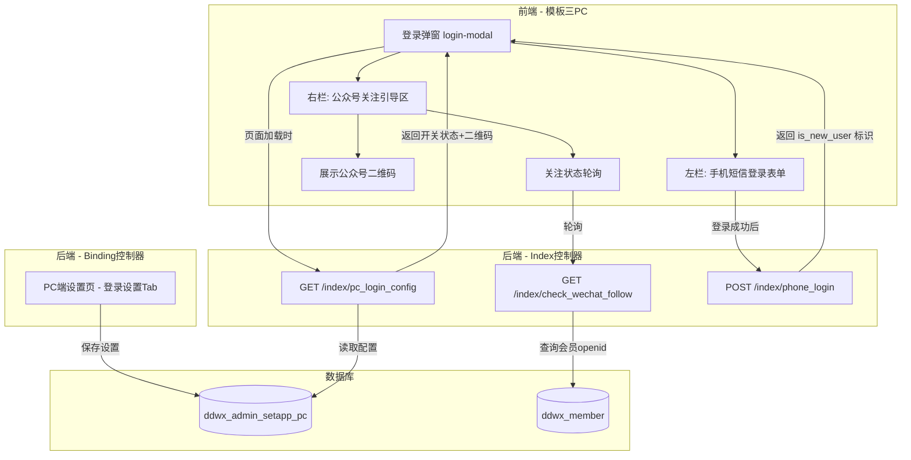
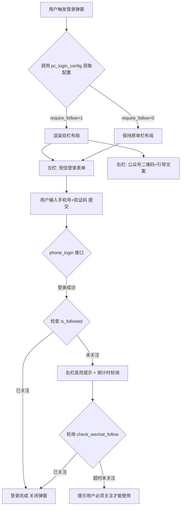
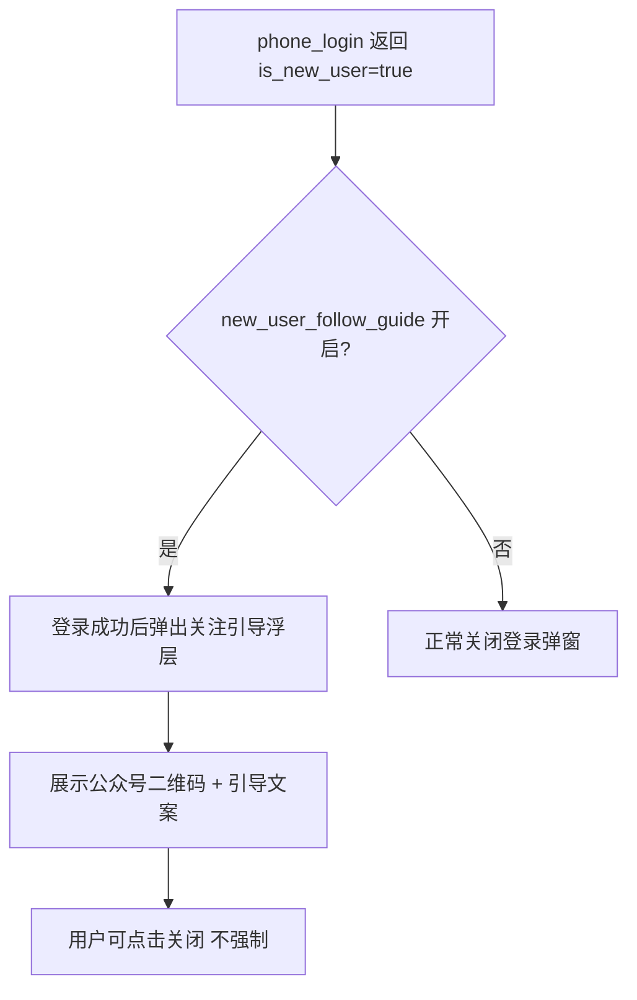
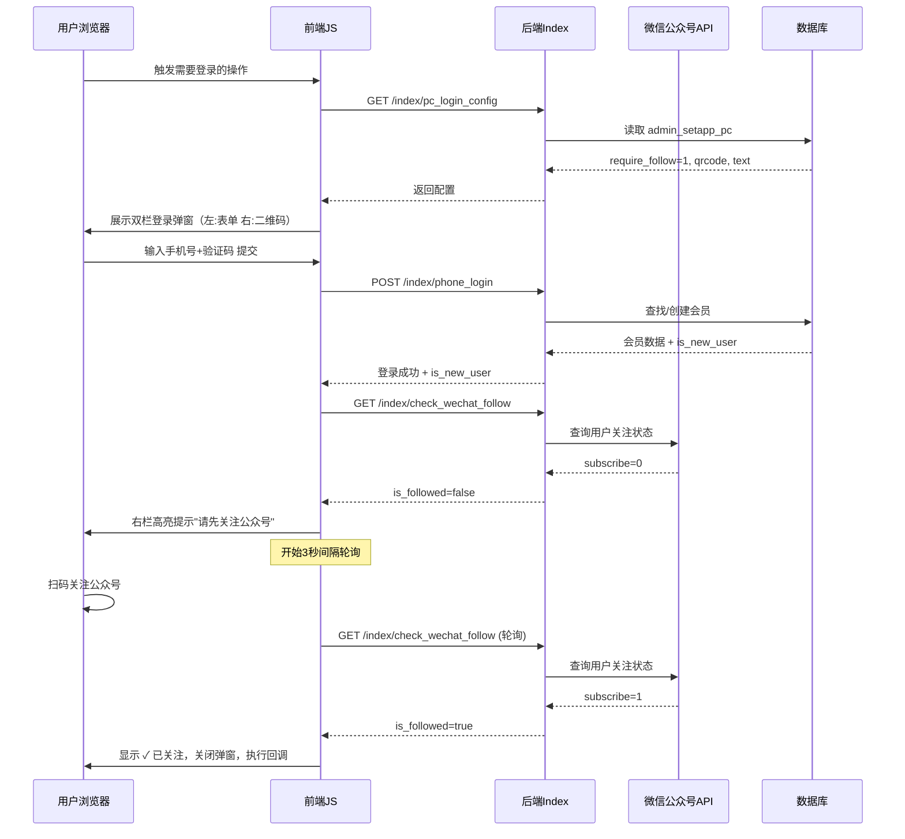
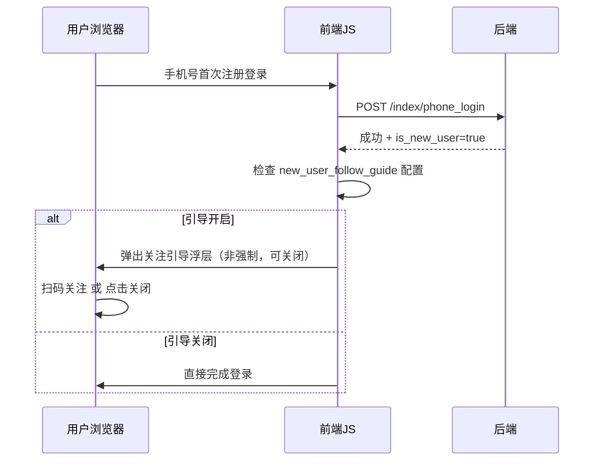

# 模板三登录弹窗优化 — 微信公众号关注引导功能

## 1. 概述

在模板三PC端登录弹窗（毛玻璃弹窗 `#loginModalOverlay`）右侧新增「关注微信公众号」引导区域，要求用户先扫码关注公众号服务号才能完成登录/注册。平台管理员可在后台「平台设置 → PC端 → 登录设置」页面控制该功能的开启/关闭，并配置公众号二维码图片等参数。对于首次通过手机短信注册的新用户，即使功能未全局开启，也需要在注册成功后弹出引导关注弹窗。

---

## 2. 架构

### 2.1 涉及模块总览

| 层级 | 模块 | 职责 |
|------|------|------|
| 前端视图 | `app/view/index3/*.html` 登录弹窗区域 | 登录弹窗 HTML 结构扩展为左右双栏 |
| 前端视图 | `app/view/binding/pc.html` | 新增「登录设置」Tab 页，含公众号关注开关与配置表单 |
| 前端脚本 | `static/index3/js/index.js` | 登录弹窗交互逻辑、双栏渲染、关注状态轮询 |
| 前端脚本 | `static/index3/js/api.js` | 新增获取登录设置、查询关注状态的 API 封装 |
| 前端样式 | `static/index3/css/index.css` | 登录弹窗双栏布局样式、公众号区域样式 |
| 前端样式 | `static/index3/css/responsive.css` | 移动端适配：双栏降级为单栏 |
| 后端控制器 | `app/controller/Index.php` | 新增获取PC登录设置接口、关注状态查询接口；修改 `phone_login` 返回新注册标识 |
| 后端控制器 | `app/controller/Binding.php` → `pc()` | 扩展保存登录设置字段逻辑 |
| 数据模型 | `ddwx_admin_setapp_pc` 表 | 新增登录设置相关字段 |

### 2.2 系统交互架构图



---

## 3. API 端点参考

### 3.1 获取PC端登录配置

| 属性 | 说明 |
|------|------|
| 路径 | `/?s=/index/pc_login_config` |
| 方法 | GET (AJAX) |
| 认证 | 无需登录 |

**响应 Schema**

| 字段 | 类型 | 说明 |
|------|------|------|
| status | int | 1=成功 |
| data.require_follow | int | 0=关闭, 1=开启（登录前必须关注） |
| data.follow_qrcode | string | 公众号二维码图片URL |
| data.follow_guide_text | string | 引导文案，如"请先扫码关注公众号" |
| data.follow_appname | string | 公众号名称，用于展示 |
| data.new_user_follow_guide | int | 0=关闭, 1=开启（新注册用户引导关注） |

### 3.2 查询微信关注状态

| 属性 | 说明 |
|------|------|
| 路径 | `/?s=/index/check_wechat_follow` |
| 方法 | GET (AJAX) |
| 认证 | 需已登录（session 中有 mid） |

**响应 Schema**

| 字段 | 类型 | 说明 |
|------|------|------|
| status | int | 1=成功 |
| data.is_followed | bool | 是否已关注公众号 |

> 判断逻辑：根据当前登录会员的 `openid_gzh` 字段（或等效字段）调用微信公众号接口查询用户关注状态，或通过数据库中 `subscribe` 字段判断。

### 3.3 手机验证码登录（扩展）

在现有 `/?s=/index/phone_login` 接口响应中新增字段：

| 新增字段 | 类型 | 说明 |
|------|------|------|
| data.is_new_user | bool | 本次是否为首次注册的新用户 |

---

## 4. 数据模型

### 4.1 ddwx_admin_setapp_pc 表新增字段

| 字段名 | 类型 | 默认值 | 说明 |
|--------|------|--------|------|
| require_follow | tinyint(1) unsigned | 0 | 登录需关注公众号开关：0=关闭，1=开启 |
| follow_qrcode | varchar(500) | NULL | 公众号二维码图片URL |
| follow_guide_text | varchar(200) | '扫码关注公众号后即可登录' | 引导文案 |
| follow_appname | varchar(100) | NULL | 公众号名称 |
| new_user_follow_guide | tinyint(1) unsigned | 0 | 新用户注册后引导关注：0=关闭，1=开启 |

---

## 5. 业务逻辑层

### 5.1 登录弹窗双栏布局逻辑



### 5.2 新用户注册后引导关注逻辑



> **关键区别**：`require_follow` 开关控制的是强制关注（不关注无法使用），`new_user_follow_guide` 控制的是新用户首次注册后的非强制引导提示。

### 5.3 Index 控制器逻辑

#### pc_login_config 方法
1. 读取 `ddwx_admin_setapp_pc` 表中登录设置字段
2. 组装返回 `require_follow`、`follow_qrcode`、`follow_guide_text`、`follow_appname`、`new_user_follow_guide`

#### check_wechat_follow 方法
1. 从 session 获取当前登录会员 mid
2. 查询会员是否已绑定公众号 openid 且已关注
3. 具体实现方案：
   - **方案A（推荐）**：通过微信公众号接口 `user/info` 查询 subscribe 字段
   - **方案B**：使用带参数二维码（事件推送），在公众号关注事件回调中写入数据库标记，本接口仅查询数据库标记

#### phone_login 方法扩展
1. 在查找会员环节记录 `$isNewUser` 标识（当 `$member` 为 null 时设为 true）
2. 在返回 JSON 中增加 `is_new_user` 字段

### 5.4 Binding 控制器 pc() 方法扩展

在现有支付设置保存逻辑中，增加对登录设置字段的读取与保存：
- 读取 `require_follow`、`follow_qrcode`、`follow_guide_text`、`follow_appname`、`new_user_follow_guide`
- 保存时与支付配置一起写入 `ddwx_admin_setapp_pc`

---

## 6. 前端组件架构

### 6.1 登录弹窗结构变化

**现状**：`login-modal` 宽度为 `min(92vw, 420px)`，单栏布局，仅包含手机号+验证码表单。

**改造后**：

| 场景 | 弹窗宽度 | 布局 |
|------|---------|------|
| require_follow=0（关闭） | `min(92vw, 420px)` 不变 | 单栏：仅左侧表单 |
| require_follow=1（开启） | `min(92vw, 780px)` 扩展 | 左右双栏：左侧表单 + 右侧公众号区 |
| 移动端（<768px） | `calc(100vw - 32px)` | 单栏：表单在上，公众号区在下（竖向堆叠） |

### 6.2 组件层级

```
login-modal-overlay
└── login-modal (根据配置动态添加 .has-follow-panel 类)
    ├── login-modal-close
    ├── login-modal-content (新增 flex 容器)
    │   ├── login-modal-left (原有内容)
    │   │   ├── login-modal-header (logo + 标题)
    │   │   └── login-modal-body (表单)
    │   └── login-modal-right (新增: 公众号关注引导)
    │       ├── follow-divider (竖向分割线)
    │       ├── follow-qr-section
    │       │   ├── follow-title (如"关注公众号")
    │       │   ├── follow-qr-img (二维码图片)
    │       │   └── follow-appname (公众号名称)
    │       ├── follow-guide-text (引导文案)
    │       └── follow-status (关注状态提示)
    └── (新用户引导浮层，动态生成)
```

### 6.3 前端状态管理

在 `index.js` 的 `loginState` 对象中新增以下状态：

| 状态 | 类型 | 说明 |
|------|------|------|
| requireFollow | bool | 是否需要关注公众号 |
| followQrcode | string | 公众号二维码URL |
| followGuideText | string | 引导文案 |
| followAppname | string | 公众号名称 |
| newUserFollowGuide | bool | 是否开启新用户引导 |
| followPollingTimer | timer | 关注状态轮询定时器 |
| isFollowed | bool | 是否已关注 |

### 6.4 关注状态轮询策略

| 参数 | 值 |
|------|-----|
| 轮询间隔 | 3秒 |
| 最大轮询次数 | 60次（3分钟） |
| 触发时机 | 登录成功 + require_follow=1 + 未关注时开始轮询 |
| 终止条件 | 用户已关注 / 超过最大次数 / 用户关闭弹窗 |

### 6.5 Api.js 新增接口封装

| 方法名 | 路由 | 说明 |
|--------|------|------|
| getPcLoginConfig | GET `/?s=/index/pc_login_config` | 获取PC登录配置 |
| checkWechatFollow | GET `/?s=/index/check_wechat_follow` | 查询微信关注状态 |

---

## 7. 后台管理页面

### 7.1 pc.html 页面扩展

在现有 `app/view/binding/pc.html` 中，将页面改造为 Tab 分页结构：

| Tab | 内容 |
|-----|------|
| 支付设置 | 现有微信/支付宝支付配置（不变） |
| 登录设置 | 新增：公众号关注登录配置 |

### 7.2 登录设置 Tab 表单项

| 表单项 | 控件类型 | 字段 | 说明 |
|--------|---------|------|------|
| 登录需关注公众号 | radio（开启/关闭） | require_follow | 开启后登录弹窗右侧显示关注区 |
| 公众号二维码 | 图片上传 | follow_qrcode | 上传公众号关注二维码图片 |
| 公众号名称 | text input | follow_appname | 展示在二维码下方 |
| 引导文案 | text input | follow_guide_text | 展示在引导区域 |
| 新用户引导关注 | radio（开启/关闭） | new_user_follow_guide | 新注册用户弹出非强制关注提示 |

---

## 8. 样式策略

### 8.1 双栏布局样式要点

- `login-modal` 添加 `.has-follow-panel` 修饰类时，宽度扩展为 `min(92vw, 780px)`
- 内部 `login-modal-content` 使用 `display: flex`，左右两栏
- 左栏（登录表单）保持原有 420px 最大宽度
- 右栏（关注区域）占据剩余空间，中间用竖向分割线分隔
- 右栏背景可加微信品牌绿色渐变的微弱点缀
- 二维码图片尺寸建议 180×180px，居中展示
- 关注状态提示使用绿色 ✓ 图标标记

### 8.2 移动端响应式（<768px）

- 双栏降级为单栏竖向堆叠
- 公众号区在登录表单下方展示
- 二维码尺寸缩小至 140×140px
- 竖向分割线改为水平分割线

### 8.3 新用户引导浮层样式

- 使用与登录弹窗一致的毛玻璃遮罩（`backdrop-filter: blur(12px)`）
- 浮层居中，宽度 `min(88vw, 360px)`
- 包含关闭按钮，用户可主动关闭（非强制）
- 动画效果复用登录弹窗的缩放淡入

---

## 9. 交互流程

### 9.1 完整登录流程（开启公众号关注）



### 9.2 新用户注册引导流程（独立于强制关注）



---

## 10. 测试策略

### 10.1 后端接口测试

| 测试场景 | 预期结果 |
|---------|---------|
| pc_login_config 接口在功能关闭时 | 返回 require_follow=0 |
| pc_login_config 接口在功能开启时 | 返回完整配置（二维码URL、文案等） |
| check_wechat_follow 未登录时调用 | 返回 status=0 提示未登录 |
| check_wechat_follow 已关注用户 | 返回 is_followed=true |
| check_wechat_follow 未关注用户 | 返回 is_followed=false |
| phone_login 新用户注册 | 返回 is_new_user=true |
| phone_login 老用户登录 | 返回 is_new_user=false |
| Binding/pc 保存登录设置 | admin_setapp_pc 表字段正确更新 |

### 10.2 前端交互测试

| 测试场景 | 预期结果 |
|---------|---------|
| 功能关闭时打开登录弹窗 | 单栏布局，无右侧区域 |
| 功能开启时打开登录弹窗 | 双栏布局，右侧显示二维码 |
| 功能开启 + 登录成功 + 已关注 | 直接完成登录 |
| 功能开启 + 登录成功 + 未关注 | 轮询提示，关注后自动完成 |
| 轮询超时（3分钟） | 提示用户必须关注 |
| 新用户注册 + 引导开启 | 弹出引导浮层 |
| 新用户注册 + 引导关闭 | 无引导浮层 |
| 移动端（<768px） | 竖向堆叠布局 |
| 后台保存空二维码URL | 提示必填校验 |


