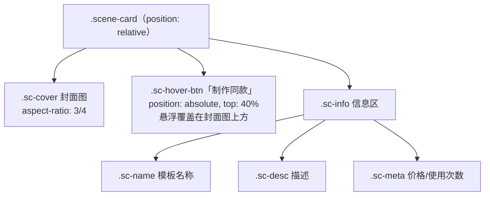
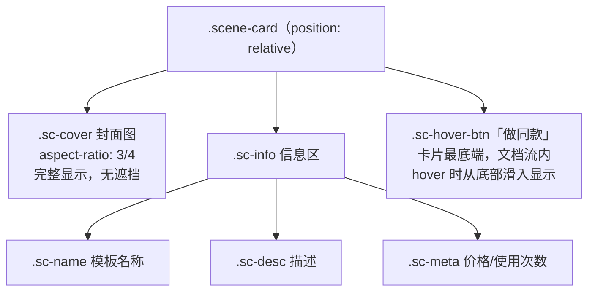
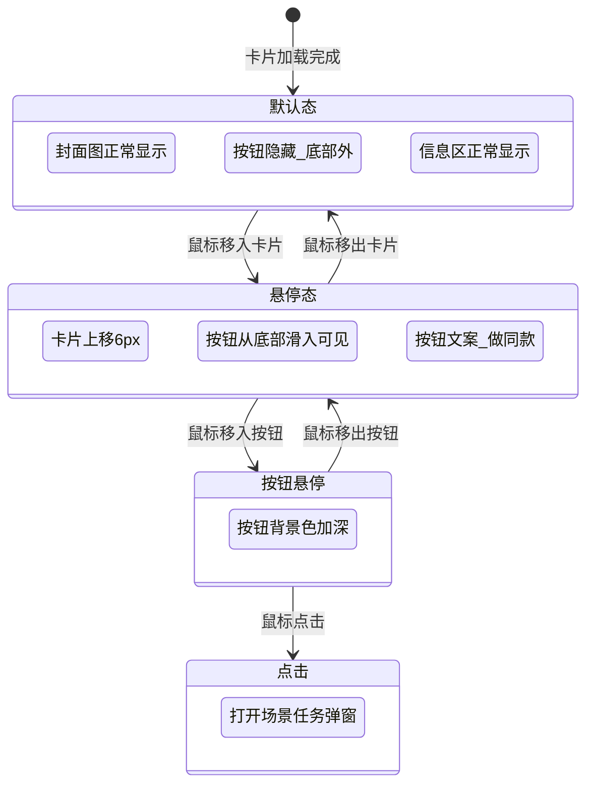

# 模板三场景卡片"做同款"按钮改版设计

## 1. 概述

本次修改针对模板三官网PC端（`/app/view/index3/` 及 `/static/index3/`）的场景卡片组件，实现两项调整：

- **文案变更**：将所有"制作同款"替换为"做同款"
- **位置调整**：将按钮从封面图上方的悬浮叠加层移至卡片最底端，确保封面图（3:4 比例）始终完整显示、不被遮挡

## 2. 现状分析

### 2.1 当前卡片结构



### 2.2 当前按钮行为

| 属性 | 当前值 |
|------|--------|
| 定位方式 | `position: absolute`，叠加在封面图中央偏上（`top: 40%`） |
| 显示时机 | 鼠标悬停卡片时淡入（`opacity: 0` → `1`） |
| 文案 | "制作同款" |
| 问题 | 按钮覆盖在封面图上方，hover 时遮挡封面内容 |

### 2.3 涉及文件清单

| 文件 | 修改内容 |
|------|----------|
| `app/view/index3/index.html` | 服务端渲染的图片模型卡片和视频特效卡片中的按钮文案及 DOM 位置（共 2 处） |
| `static/index3/js/index.js` | 动态加载卡片、搜索结果卡片中的按钮文案拼接及注释（共 3 处） |
| `static/index3/css/index.css` | `.sc-hover-btn` 样式：定位方式、位置、交互效果、注释 |

## 3. 目标设计

### 3.1 改版后卡片结构



### 3.2 按钮布局策略

按钮从 `position: absolute`（叠加在封面上）改为**卡片底部固定区域**，采用以下策略：

| 属性 | 改版后 | 说明 |
|------|--------|------|
| 定位方式 | 绝对定位锚定在卡片底部（`bottom: 0; left: 0; right: 0`） | 不再叠加在封面图区域 |
| 显示位置 | 卡片最底端，位于 `.sc-info` 信息区下方 | 利用卡片的 `position: relative` 容器 |
| 显示效果 | hover 时从底部向上滑入，按钮区域半透明背景 | 与封面图无重叠 |
| 文案 | "做同款" | 精简表述 |
| 封面图保护 | 封面图保持 `aspect-ratio: 3/4`、`object-fit: cover` 不变 | 严格遵循 3:4 比例规范 |

### 3.3 交互状态



### 3.4 视频卡片兼容

视频类型卡片使用 `.sc-cover-wrap` 容器包裹封面（含 GIF 静帧、视频播放、视频角标），改版后按钮仍定位于整个 `.scene-card` 底端，不影响 `.sc-cover-wrap` 内部的视频播放逻辑和角标显示。

## 4. 各文件修改要点

### 4.1 CSS 样式修改（`static/index3/css/index.css`）

| 修改项 | 原始 | 目标 |
|--------|------|------|
| 注释文案 | 悬浮「制作同款」按钮 | 底部「做同款」按钮 |
| `position` | `absolute`（不变） | `absolute`（不变） |
| 定位锚点 | `left: 50%; top: 40%` | `bottom: 0; left: 0; right: 0` |
| `transform` 默认 | `translate(-50%, -50%)` | `translateY(100%)`（初始隐藏在卡片下方外） |
| `transform` hover | `translate(-50%, -50%) scale(1)` | `translateY(0)`（滑入可见） |
| `border-radius` | `20px`（胶囊形） | 取消圆角或仅保留上边圆角，与卡片底部对齐 |
| `padding` | `8px 20px` | 适当增大为全宽条状，居中文字 |
| `text-align` | 无（默认） | `center` |
| `white-space` | `nowrap` | 保留 |
| 背景 | `var(--accent-color)` 纯色 | 可微调为半透明渐变或保持纯色 |

### 4.2 HTML 模板修改（`app/view/index3/index.html`）

共 2 处（图片模型面板和视频特效面板中的服务端渲染卡片），每处修改：

| 修改项 | 说明 |
|--------|------|
| 按钮文案 | "制作同款" → "做同款" |
| DOM 位置 | 将 `.sc-hover-btn` 从 `.sc-cover` 之后、`.sc-info` 之前，移至 `.sc-info` 之后（卡片内最末元素） |

### 4.3 JavaScript 修改（`static/index3/js/index.js`）

共 3 处需修改：

| 位置 | 类型 | 修改内容 |
|------|------|----------|
| 动态加载卡片（`list.forEach` 拼接 HTML） | 文案 + 拼接顺序 | "制作同款" → "做同款"，并将 `.sc-hover-btn` 拼接移到 `.sc-info` 之后 |
| 搜索结果卡片（`doSearch` 拼接 HTML） | 文案 + 拼接顺序 | 同上 |
| 注释"场景卡片点击交互（悬浮"制作同款"按钮）" | 注释文案 | "制作同款" → "做同款" |

## 5. 测试

### 5.1 验证要点

| 验证项 | 预期结果 |
|--------|----------|
| 封面图完整性 | 封面图以 3:4 比例完整显示，hover 时无任何元素遮挡封面区域 |
| 按钮文案 | 所有卡片（服务端渲染 + 动态加载 + 搜索结果）均显示"做同款" |
| 按钮位置 | 按钮位于卡片最底部，信息区下方 |
| hover 动画 | 鼠标悬停时按钮从底部平滑滑入；移出后平滑滑出隐藏 |
| 按钮点击 | 点击后正常打开场景任务弹窗，功能不受影响 |
| 视频卡片 | 视频类型卡片的 GIF/视频播放、视频角标正常，按钮同样在底部 |
| 深色/浅色模式 | 按钮在两种主题下颜色变量正确渲染 |
| 响应式 | 不同屏幕宽度下按钮随卡片自适应，不溢出 |
    D --> E[".sc-name 模板名称"]
    D --> F[".sc-desc 描述"]
    D --> G[".sc-meta 价格/使用次数"]
```

### 2.2 当前按钮行为

| 属性 | 当前值 |
|------|--------|
| 定位方式 | `position: absolute`，叠加在封面图中央偏上（`top: 40%`） |
| 显示时机 | 鼠标悬停卡片时淡入（`opacity: 0` → `1`） |
| 文案 | "制作同款" |
| 问题 | 按钮覆盖在封面图上方，hover 时遮挡封面内容 |

### 2.3 涉及文件清单

| 文件 | 修改内容 |
|------|----------|
| `app/view/index3/index.html` | 服务端渲染的图片模型卡片和视频特效卡片中的按钮文案及 DOM 位置（共 2 处） |
| `static/index3/js/index.js` | 动态加载卡片、搜索结果卡片中的按钮文案拼接及注释（共 3 处） |
| `static/index3/css/index.css` | `.sc-hover-btn` 样式：定位方式、位置、交互效果、注释 |

## 3. 目标设计

### 3.1 改版后卡片结构


### 3.2 按钮布局策略

按钮从 `position: absolute`（叠加在封面上）改为**卡片底部固定区域**，采用以下策略：

| 属性 | 改版后 | 说明 |
|------|--------|------|
| 定位方式 | 绝对定位锚定在卡片底部（`bottom: 0; left: 0; right: 0`） | 不再叠加在封面图区域 |
| 显示位置 | 卡片最底端，位于 `.sc-info` 信息区下方 | 利用卡片的 `position: relative` 容器 |
| 显示效果 | hover 时从底部向上滑入，按钮区域半透明背景 | 与封面图无重叠 |
| 文案 | "做同款" | 精简表述 |
| 封面图保护 | 封面图保持 `aspect-ratio: 3/4`、`object-fit: cover` 不变 | 严格遵循 3:4 比例规范 |

### 3.3 交互状态


### 3.4 视频卡片兼容

视频类型卡片使用 `.sc-cover-wrap` 容器包裹封面（含 GIF 静帧、视频播放、视频角标），改版后按钮仍定位于整个 `.scene-card` 底端，不影响 `.sc-cover-wrap` 内部的视频播放逻辑和角标显示。

## 4. 各文件修改要点

### 4.1 CSS 样式修改（`static/index3/css/index.css`）

| 修改项 | 原始 | 目标 |
|--------|------|------|
| 注释文案 | 悬浮「制作同款」按钮 | 底部「做同款」按钮 |
| `position` | `absolute`（不变） | `absolute`（不变） |
| 定位锚点 | `left: 50%; top: 40%` | `bottom: 0; left: 0; right: 0` |
| `transform` 默认 | `translate(-50%, -50%)` | `translateY(100%)`（初始隐藏在卡片下方外） |
| `transform` hover | `translate(-50%, -50%) scale(1)` | `translateY(0)`（滑入可见） |
| `border-radius` | `20px`（胶囊形） | 取消圆角或仅保留上边圆角，与卡片底部对齐 |
| `padding` | `8px 20px` | 适当增大为全宽条状，居中文字 |
| `text-align` | 无（默认） | `center` |
| `white-space` | `nowrap` | 保留 |
| 背景 | `var(--accent-color)` 纯色 | 可微调为半透明渐变或保持纯色 |

### 4.2 HTML 模板修改（`app/view/index3/index.html`）

共 2 处（图片模型面板和视频特效面板中的服务端渲染卡片），每处修改：

| 修改项 | 说明 |
|--------|------|
| 按钮文案 | "制作同款" → "做同款" |
| DOM 位置 | 将 `.sc-hover-btn` 从 `.sc-cover` 之后、`.sc-info` 之前，移至 `.sc-info` 之后（卡片内最末元素） |

### 4.3 JavaScript 修改（`static/index3/js/index.js`）

共 3 处需修改：

| 位置 | 类型 | 修改内容 |
|------|------|----------|
| 动态加载卡片（`list.forEach` 拼接 HTML） | 文案 + 拼接顺序 | "制作同款" → "做同款"，并将 `.sc-hover-btn` 拼接移到 `.sc-info` 之后 |
| 搜索结果卡片（`doSearch` 拼接 HTML） | 文案 + 拼接顺序 | 同上 |
| 注释"场景卡片点击交互（悬浮"制作同款"按钮）" | 注释文案 | "制作同款" → "做同款" |

## 5. 测试

### 5.1 验证要点

| 验证项 | 预期结果 |
|--------|----------|
| 封面图完整性 | 封面图以 3:4 比例完整显示，hover 时无任何元素遮挡封面区域 |
| 按钮文案 | 所有卡片（服务端渲染 + 动态加载 + 搜索结果）均显示"做同款" |
| 按钮位置 | 按钮位于卡片最底部，信息区下方 |
| hover 动画 | 鼠标悬停时按钮从底部平滑滑入；移出后平滑滑出隐藏 |
| 按钮点击 | 点击后正常打开场景任务弹窗，功能不受影响 |
| 视频卡片 | 视频类型卡片的 GIF/视频播放、视频角标正常，按钮同样在底部 |
| 深色/浅色模式 | 按钮在两种主题下颜色变量正确渲染 |
| 响应式 | 不同屏幕宽度下按钮随卡片自适应，不溢出 |
