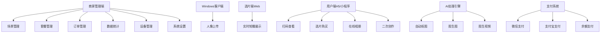

# AI旅拍功能测试与修复方案

## 1. 概览

### 1.1 任务目标
全面测试AI旅拍系统功能，识别并修复所有影响正常使用的问题，确保系统各模块能够正常运行。

### 1.2 系统背景
AI旅拍系统是基于ThinkPHP 6.0框架开发的智能影像处理系统，为景区、影楼、旅拍门店提供AI驱动的照片和视频自动化生成服务。系统支持8个平台（微信、支付宝、百度、头条、QQ、H5、APP、PC客户端）。

### 1.3 技术栈
- 后端框架：ThinkPHP 6.0
- 数据库：MySQL（InnoDB引擎，utf8mb4字符集）
- 队列系统：Redis Queue
- AI服务：阿里百炼通义万相、可灵AI
- 存储服务：阿里云OSS
- 前端技术：Vue 3、Layui、Swiper.js

---

## 2. 功能架构

### 2.1 系统角色划分



### 2.2 核心业务流程

``mermaid
sequenceDiagram
    participant WC as Windows客户端
    participant API as 后端API
    participant Queue as 队列系统
    participant AI as AI服务
    participant OSS as OSS存储
    participant User as 用户端

    WC->>API: 1. 上传人像照片
    API->>OSS: 2. 存储原始图片
    API->>Queue: 3. 投递抠图任务
    Queue->>AI: 4. 调用抠图API
    AI-->>Queue: 5. 返回抠图结果
    Queue->>OSS: 6. 存储抠图后图片
    Queue->>Queue: 7. 投递图生图任务（N个场景）
    Queue->>AI: 8. 批量调用图生图API
    AI-->>Queue: 9. 返回生成结果
    Queue->>OSS: 10. 存储生成的图片/视频
    API->>API: 11. 生成二维码
    User->>API: 12. 扫码查看结果
    User->>API: 13. 选择购买
    User->>API: 14. 完成支付
    API->>User: 15. 解锁高清原图
```

---

## 3. 测试范围

### 3.1 后台管理功能测试矩阵

| 模块 | 功能点 | 测试场景 | 预期结果 |
|------|--------|----------|----------|
| 商家后台登录 | 权限验证 | 使用有效商家账号登录 | 成功进入后台，aid/bid正确 |
| 场景管理-列表 | 数据加载 | 访问场景列表页 | Layui Table正确加载场景数据 |
| 场景管理-列表 | 分页功能 | 切换页码 | 数据正确分页显示 |
| 场景管理-列表 | 筛选功能 | 按分类、状态筛选 | 筛选结果符合条件 |
| 场景管理-添加 | 页面加载 | 点击添加按钮 | 表单页面正确加载，模型列表显示 |
| 场景管理-添加 | 数据提交 | 填写完整信息提交 | 数据成功保存，返回列表 |
| 场景管理-编辑 | 页面加载 | 点击编辑按钮 | 表单回显数据，模型列表显示 |
| 场景管理-编辑 | 数据更新 | 修改信息后提交 | 数据成功更新 |
| 场景管理-删除 | 删除操作 | 删除未使用场景 | 成功删除 |
| 场景管理-删除 | 删除限制 | 删除已使用场景 | 提示不允许删除 |
| 场景管理-批量操作 | 批量启用/禁用 | 勾选多个场景执行操作 | 批量状态更新成功 |
| 套餐管理-列表 | 数据加载 | 访问套餐列表页 | 套餐数据正确显示 |
| 套餐管理-编辑 | 添加套餐 | 创建新套餐 | 套餐保存成功 |
| 套餐管理-编辑 | 价格配置 | 设置价格和包含数量 | 配置正确保存 |
| 人像管理-列表 | 数据加载 | 访问人像列表页 | 人像数据正确显示 |
| 人像管理-列表 | 关联数据 | 显示生成结果数量 | 关联统计正确 |
| 人像管理-筛选 | 门店筛选 | 按门店筛选 | 筛选结果正确 |
| 人像管理-筛选 | 日期筛选 | 按日期范围筛选 | 筛选结果正确 |
| 人像管理-删除 | 删除人像 | 删除人像及关联数据 | 级联删除成功 |
| 订单管理-列表 | 数据加载 | 访问订单列表页 | 订单数据正确显示 |
| 订单管理-列表 | 用户信息 | 显示用户昵称、手机号 | 关联查询正确 |
| 订单管理-筛选 | 状态筛选 | 按订单状态筛选 | 筛选结果正确 |
| 订单管理-详情 | 查看详情 | 点击查看订单详情 | 详情页正确显示 |
| 订单管理-详情 | 商品列表 | 显示订单包含商品 | 商品数据完整 |
| 数据统计-今日 | 今日数据 | 查看今日统计 | 统计数据准确 |
| 数据统计-本月 | 本月数据 | 查看本月汇总 | 汇总数据准确 |
| 数据统计-趋势 | 趋势图表 | 查看近7天趋势 | 图表正确渲染 |
| 数据统计-场景 | 热门场景TOP10 | 查看场景排行 | 排序正确 |
| 设备管理-列表 | 设备列表 | 访问设备管理页 | 设备数据正确显示 |
| 设备管理-生成令牌 | 生成设备令牌 | 创建新设备 | 令牌生成成功，唯一且有效 |
| 设备管理-状态 | 更新设备状态 | 切换在线/离线状态 | 状态更新成功 |
| 设备管理-删除 | 删除设备 | 删除设备记录 | 删除成功 |
| 系统设置-配置 | 查看配置 | 访问设置页 | 配置项正确显示 |
| 系统设置-保存 | 保存配置 | 修改配置后保存 | 配置更新成功 |
| 系统设置-价格 | 价格设置 | 设置单张/视频价格 | 价格保存正确 |
| 系统设置-水印 | 水印配置 | 配置水印位置和透明度 | 水印设置生效 |
| 系统设置-二维码 | 二维码有效期 | 设置过期天数 | 配置保存正确 |

### 3.2 API接口测试矩阵

| 接口路径 | 方法 | 功能 | 测试场景 | 预期响应 |
|----------|------|------|----------|----------|
| /api/ai_travel_photo/device/upload | POST | 上传人像 | 有效token+图片文件 | {status:1, portrait_id:xxx} |
| /api/ai_travel_photo/device/upload | POST | 上传人像 | 无效token | {status:0, msg:token无效} |
| /api/ai_travel_photo/device/upload | POST | 上传人像 | 重复上传（相同MD5） | 自动去重或提示 |
| /api/ai_travel_photo/qrcode/detail | GET | 获取二维码详情 | 有效二维码 | 返回人像和生成结果 |
| /api/ai_travel_photo/qrcode/detail | GET | 获取二维码详情 | 过期二维码 | {code:400, msg:二维码已过期} |
| /api/ai_travel_photo/qrcode/detail | GET | 获取二维码详情 | 不存在的二维码 | {code:404, msg:二维码不存在} |
| /api/ai_travel_photo/qrcode/generate | POST | 生成二维码 | 有效portrait_id | 返回二维码URL |
| /api/ai_travel_photo/scene/list | GET | 场景列表 | 查询商家场景 | 返回场景数组 |
| /api/ai_travel_photo/portrait/result_list | GET | 人像生成结果 | 有效portrait_id | 返回结果列表 |
| /api/ai_travel_photo/order/create | POST | 创建订单 | 单张购买 | 返回订单号和支付参数 |
| /api/ai_travel_photo/order/create | POST | 创建订单 | 套餐购买 | 返回订单号和支付参数 |
| /api/ai_travel_photo/order/detail | GET | 订单详情 | 有效order_no | 返回订单完整信息 |
| /api/ai_travel_photo/order/pay_callback | POST | 支付回调 | 微信支付回调 | 订单状态更新为已支付 |
| /api/ai_travel_photo/order/pay_callback | POST | 支付回调 | 支付宝回调 | 订单状态更新为已支付 |
| /api/ai_travel_photo/album/list | GET | 用户相册 | 登录用户查询 | 返回相册列表 |
| /api/ai_travel_photo/album/download | GET | 下载原图 | 已购买的result_id | 返回原图URL，下载次数+1 |
| /api/ai_travel_photo/album/download | GET | 下载原图 | 未购买的result_id | {code:403, msg:未购买} |

### 3.3 队列任务测试矩阵

| 任务类别 | Job类 | 测试场景 | 预期行为 |
|----------|-------|----------|----------|
| 抠图任务 | CutoutJob | 投递人像抠图任务 | 任务入队，异步处理 |
| 抠图任务 | CutoutJob | 抠图成功 | 更新cutout_url，触发图生图 |
| 抠图任务 | CutoutJob | 抠图失败 | 记录错误，重试3次 |
| 图生图任务 | ImageGenerationJob | 投递图生图任务 | 任务入队，并发控制 |
| 图生图任务 | ImageGenerationJob | 生成成功 | 保存结果，添加水印 |
| 图生图任务 | ImageGenerationJob | 生成失败 | 记录错误，重试机制 |
| 图生视频任务 | VideoGenerationJob | 自动生成视频 | 根据配置自动触发 |
| 图生视频任务 | VideoGenerationJob | 视频生成成功 | 保存视频URL和封面 |
| 水印任务 | WatermarkJob | 添加水印 | 预览图添加水印 |
| 队列监控 | - | 查看队列积压 | 监控队列长度 |
| 队列监控 | - | 失败率告警 | 失败率>5%时告警 |

### 3.4 数据库完整性测试

| 测试项 | 检查内容 | 验证方法 |
|--------|----------|----------|
| 表结构 | 12张AI旅拍表是否存在 | SHOW TABLES LIKE 'ddwx_ai_travel_photo%' |
| 商家扩展字段 | business表是否有ai_travel_photo_enabled字段 | DESC ddwx_business |
| 索引完整性 | 所有外键关联字段是否有索引 | SHOW INDEX FROM 表名 |
| 数据一致性 | 订单商品表与结果表关联完整性 | LEFT JOIN检查孤立数据 |
| 数据一致性 | 二维码与人像表关联完整性 | LEFT JOIN检查孤立数据 |
| 数据一致性 | 统计表数据与实际订单数据一致性 | 对比SUM统计 |
| 字符集 | 所有表是否utf8mb4 | SHOW TABLE STATUS |
| 引擎 | 所有表是否InnoDB | SHOW TABLE STATUS |

### 3.5 前端H5页面测试（如存在）

| 页面 | 测试点 | 预期表现 |
|------|--------|----------|
| 选片端 | 页面加载 | 页面正确渲染 |
| 选片端 | 轮播功能 | 1秒切换图片，5秒切换组 |
| 选片端 | 自动刷新 | 30秒自动获取新数据 |
| 用户查看页 | 扫码跳转 | 正确解析二维码参数 |
| 用户查看页 | 瀑布流展示 | 图片流式加载 |
| 用户查看页 | 勾选购买 | 多选功能正常 |
| 用户查看页 | 套餐购买 | 套餐按钮显示并可点击 |
| 用户查看页 | 支付调起 | 微信/支付宝支付正常调起 |
| 用户相册页 | 相册列表 | 已购买内容正确显示 |
| 用户相册页 | 下载原图 | 点击下载触发下载 |
| 用户相册页 | 分享功能 | 分享到微信/朋友圈 |

---

## 4. 已知问题分析

### 4.1 历史修复记录总结

根据项目文档，系统已经历以下修复：

| 文档名 | 问题描述 | 解决方案 |
|--------|----------|----------|
| AI_TRAVEL_PHOTO_ADD_FIELD.md | business表缺失ai_travel_photo_enabled字段 | 添加字段并初始化数据 |
| AI_TRAVEL_PHOTO_ADMIN_FIX.md | 后台scene_edit页面加载错误 | 修复模型查询逻辑，添加默认值 |
| AI_TRAVEL_PHOTO_FIX_500_ERROR.md | 页面500错误 | 修复路由和视图文件路径 |
| AI_TRAVEL_PHOTO_FIX_CONSTANT_ERROR.md | 常量未定义错误 | 定义缺失的常量 |
| AI_TRAVEL_PHOTO_FIX_SCENE.md | 场景管理功能异常 | 修复AJAX返回格式 |
| AI_TRAVEL_PHOTO_FIX_SETTINGS.md | 设置页面错误 | 修复配置保存逻辑 |
| AI_TRAVEL_PHOTO_INDEX_UPDATE.md | 索引优化 | 添加数据库索引 |

### 4.2 潜在风险点识别

| 风险类别 | 具体风险 | 影响范围 | 风险等级 |
|----------|----------|----------|----------|
| 数据库字段 | 商家表扩展字段可能未全部添加 | 后台设置功能 | 高 |
| 视图文件 | 视图文件可能不存在或路径错误 | 后台所有页面 | 高 |
| Layui Table | AJAX接口返回格式不符合Layui规范 | 所有列表页 | 高 |
| AI配置 | AI模型表可能无数据 | AI生成功能 | 中 |
| OSS配置 | OSS配置未正确填写 | 图片上传和存储 | 中 |
| 队列配置 | Redis队列未配置或未启动消费者 | 异步任务处理 | 中 |
| 路由配置 | API路由可能未正确配置 | 所有API接口 | 中 |
| 支付配置 | 支付回调地址未配置 | 支付功能 | 低 |
| 权限控制 | 菜单权限未配置 | 后台菜单显示 | 低 |

---

## 5. 测试策略

### 5.1 测试顺序

``mermaid
graph TD
    A[第一阶段：基础环境测试] --> B[数据库完整性检查]
    B --> C[配置文件验证]
    C --> D[路由配置测试]
    
    D --> E[第二阶段：后台功能测试]
    E --> F[登录和权限测试]
    F --> G[场景管理测试]
    G --> H[套餐管理测试]
    H --> I[设置功能测试]
    
    I --> J[第三阶段：核心业务流程测试]
    J --> K[人像上传测试]
    K --> L[队列处理测试]
    L --> M[AI生成测试]
    M --> N[二维码生成测试]
    
    N --> O[第四阶段：用户端测试]
    O --> P[扫码查看测试]
    P --> Q[订单创建测试]
    Q --> R[支付流程测试]
    R --> S[相册功能测试]
    
    S --> T[第五阶段：性能和稳定性测试]
    T --> U[并发测试]
    U --> V[队列压力测试]
    V --> W[数据一致性验证]
```

### 5.2 测试方法论

#### 5.2.1 白盒测试
- 代码审查：检查控制器、服务类、模型类的代码逻辑
- 数据库查询优化：分析慢查询，检查索引使用
- 异常处理验证：确保所有异常都被正确捕获和处理

#### 5.2.2 黑盒测试
- 功能测试：按照测试矩阵逐项验证功能
- 边界测试：测试输入边界值和异常值
- 兼容性测试：测试多平台兼容性

#### 5.2.3 集成测试
- 接口联调：测试前后端接口对接
- 支付集成：测试支付接口调用
- AI服务集成：测试AI API调用

#### 5.2.4 回归测试
- 修复验证：每次修复后重新测试相关功能
- 影响评估：评估修复对其他功能的影响

---

## 6. 问题修复策略

### 6.1 修复优先级定义

| 优先级 | 定义 | 修复时限 |
|--------|------|----------|
| P0-致命 | 系统无法启动、核心功能完全不可用 | 立即修复 |
| P1-严重 | 主要功能不可用、数据丢失风险 | 当天修复 |
| P2-重要 | 部分功能受限、用户体验受影响 | 3天内修复 |
| P3-一般 | 次要功能问题、界面显示问题 | 1周内修复 |
| P4-建议 | 优化建议、体验改进 | 纳入后续迭代 |

### 6.2 常见问题修复模式

#### 6.2.1 数据库字段缺失
**问题识别**
- 错误信息：Column 'xxx' not found
- 后台报错或前端显示异常

**修复流程**
1. 确认缺失的字段名称和所在表
2. 编写ALTER TABLE语句添加字段
3. 设置合理的默认值
4. 为已有数据初始化该字段
5. 验证功能恢复正常

#### 6.2.2 Layui Table数据加载失败
**问题识别**
- 表格显示"数据接口请求异常"
- 浏览器控制台显示AJAX错误

**修复流程**
1. 检查接口是否返回标准格式：{code:0, msg:'', count:总数, data:数组}
2. 确认controller中不要使用$this->success()响应AJAX
3. 检查where条件是否正确（aid/bid）
4. 验证分页参数处理
5. 确认字段关联查询正确

#### 6.2.3 视图文件404错误
**问题识别**
- 访问页面显示模板不存在
- 错误日志提示template not exists

**修复流程**
1. 确认控制器方法中View::fetch()的参数
2. 检查视图文件路径：app/view/控制器名小写/方法名.html
3. 确认视图文件确实存在
4. 检查文件权限
5. 清除视图缓存

#### 6.2.4 队列任务不执行
**问题识别**
- 数据长时间停留在"处理中"状态
- 队列积压严重

**修复流程**
1. 检查Redis连接是否正常
2. 确认队列消费者进程是否启动
3. 查看队列消费者日志
4. 检查Job类代码是否有异常
5. 验证队列配置正确性

#### 6.2.5 AI接口调用失败
**问题识别**
- 生成任务状态为"失败"
- 错误信息包含API相关内容

**修复流程**
1. 检查AI模型配置表是否有记录
2. 验证API Key是否正确且有效
3. 测试网络连接到AI服务
4. 检查请求参数格式
5. 查看AI服务返回的错误信息
6. 根据错误信息调整调用逻辑

---

## 7. 测试执行计划

### 7.1 第一阶段：基础环境测试（预计1小时）

#### 7.1.1 数据库完整性检查
测试SQL语句汇总：

**检查表结构**
```sql
SHOW TABLES LIKE 'ddwx_ai_travel_photo%';
-- 预期返回12张表
```

**检查商家表扩展字段**
```sql
DESC ddwx_business;
-- 查看是否包含：ai_travel_photo_enabled, ai_photo_price等字段
```

**检查是否有测试商家启用了旅拍**
```sql
SELECT id, name, ai_travel_photo_enabled 
FROM ddwx_business 
WHERE ai_travel_photo_enabled = 1;
```

**检查AI模型配置**
```sql
SELECT * FROM ddwx_ai_travel_photo_model;
-- 检查是否有配置记录
```

**检查场景数据**
```sql
SELECT aid, bid, COUNT(*) as scene_count 
FROM ddwx_ai_travel_photo_scene 
GROUP BY aid, bid;
```

#### 7.1.2 配置文件验证
检查以下配置是否完整：
- /config/ai_travel_photo.php：OSS配置、AI API配置、队列配置
- /config/queue.php：Redis队列配置
- /config/database.php：数据库连接配置

#### 7.1.3 路由配置测试
访问以下URL检查路由是否正常：
- /ai_travel_photo/index（后台首页）
- /ai_travel_photo/scene_list（场景列表）
- /api/ai_travel_photo/qrcode/detail（API接口示例）

### 7.2 第二阶段：后台功能测试（预计3小时）

#### 7.2.1 场景管理完整测试流程
1. 访问场景列表页，观察是否正常加载
2. 测试分类筛选、状态筛选功能
3. 点击"添加场景"按钮，检查表单页面
4. 填写完整场景信息提交，观察保存结果
5. 编辑已添加的场景，修改部分信息保存
6. 测试批量启用/禁用功能
7. 尝试删除未使用的场景
8. 尝试删除已使用的场景（应提示不允许）

#### 7.2.2 套餐管理测试流程
1. 访问套餐列表页
2. 添加测试套餐：
   - 名称：体验套餐
   - 价格：19.90元
   - 包含图片：5张
   - 包含视频：0个
3. 编辑套餐修改价格
4. 测试删除套餐

#### 7.2.3 系统设置测试流程
1. 访问设置页面
2. 修改以下配置：
   - 单张图片价格：9.90
   - 单个视频价格：29.90
   - 二维码有效期：30天
   - 自动生成视频：开启
   - 最多生成场景数：10
3. 保存配置，刷新页面验证是否保存成功

### 7.3 第三阶段：核心业务流程测试（预计4小时）

#### 7.3.1 完整业务流程模拟

**准备工作**
1. 确保至少配置了1个AI模型
2. 确保至少添加了3个场景
3. 确保商家已启用AI旅拍功能
4. 准备测试用人像照片（清晰的人物照）

**流程1：模拟Windows客户端上传**
1. 使用Postman/curl模拟上传接口
   ```
   POST /api/ai_travel_photo/device/upload
   Headers:
     Content-Type: multipart/form-data
   Body:
     file: 人像照片文件
     aid: 平台ID
     bid: 商家ID
     token: 设备令牌
     md5: 文件MD5值
   ```
2. 观察接口响应，记录portrait_id
3. 后台查看人像管理列表，确认人像已上传

**流程2：队列处理监控**
1. 检查Redis队列中是否有抠图任务
   ```
   redis-cli
   LLEN ai_cutout
   ```
2. 观察队列消费者日志，确认任务被处理
3. 等待抠图完成，刷新人像列表查看cutout_url
4. 检查是否自动投递了图生图任务
5. 等待图生图完成，查看结果表数据
   ```sql
   SELECT * FROM ddwx_ai_travel_photo_result 
   WHERE portrait_id = [上一步的portrait_id]
   ```

**流程3：二维码生成与扫码**
1. 后台人像列表，点击"生成二维码"
2. 获取二维码内容（qrcode字符串）
3. 模拟扫码请求
   ```
   GET /api/ai_travel_photo/qrcode/detail?qrcode=[二维码内容]&uid=[测试用户ID]
   ```
4. 验证响应数据包含人像和生成结果

**流程4：订单创建与支付**
1. 选择1张图片创建单张购买订单
   ```
   POST /api/ai_travel_photo/order/create
   Body:
     uid: 用户ID
     buy_type: 1
     result_ids: [result_id]
   ```
2. 获取订单号和支付参数
3. 模拟支付回调（测试环境）
   ```
   POST /api/ai_travel_photo/order/pay_callback
   Body:
     order_no: 订单号
     transaction_id: 测试交易号
     ... 其他支付参数
   ```
4. 验证订单状态更新为"已支付"
5. 查询用户相册，确认商品已解锁

### 7.4 第四阶段：前端页面测试（预计2小时）

仅当对应H5页面存在时执行

#### 7.4.1 选片端测试
1. 访问选片端URL（如存在）
2. 观察轮播效果
3. 使用开发者工具监控数据刷新

#### 7.4.2 用户查看页测试
1. 使用二维码URL访问
2. 测试瀑布流加载
3. 测试勾选和购买流程

#### 7.4.3 用户相册页测试
1. 登录后访问相册
2. 测试下载功能
3. 测试分享功能

### 7.5 第五阶段：异常和边界测试（预计2小时）

#### 7.5.1 权限和安全测试
- 未登录访问后台页面（应跳转登录）
- 跨商家访问数据（A商家访问B商家数据）
- 无效token上传人像
- 篡改订单金额

#### 7.5.2 数据边界测试
- 上传超大图片（>10MB）
- 上传不支持的格式
- 创建空订单
- 过期二维码访问

#### 7.5.3 并发和性能测试
- 同一人像同时投递多个生成任务
- 短时间内大量上传人像
- 队列积压情况模拟

---

## 8. 问题跟踪与修复记录

### 8.1 问题记录表格模板

| 问题ID | 发现时间 | 问题描述 | 优先级 | 所属模块 | 错误信息 | 修复方案 | 修复状态 | 验证结果 |
|--------|----------|----------|--------|----------|----------|----------|----------|----------|
| - | - | - | - | - | - | - | - | - |

### 8.2 修复验证清单

每次修复后，必须完成以下验证：
- [ ] 问题现象已消失
- [ ] 相关功能正常运行
- [ ] 未引入新的问题
- [ ] 已添加必要的错误处理
- [ ] 已更新相关文档
- [ ] 已通过回归测试

---

## 9. 测试工具和辅助脚本

### 9.1 数据库检查脚本（SQL）

**完整性检查脚本**
```sql
-- 1. 检查表是否完整
SELECT 
    '表结构检查' as 检查项,
    COUNT(*) as 实际表数量,
    12 as 预期表数量,
    CASE WHEN COUNT(*) = 12 THEN '通过' ELSE '失败' END as 结果
FROM information_schema.TABLES 
WHERE TABLE_SCHEMA = DATABASE()
AND TABLE_NAME LIKE 'ddwx_ai_travel_photo%';

-- 2. 检查商家表字段
SELECT 
    '商家表字段检查' as 检查项,
    COUNT(*) as 已有字段数
FROM information_schema.COLUMNS 
WHERE TABLE_SCHEMA = DATABASE()
AND TABLE_NAME = 'ddwx_business'
AND COLUMN_NAME LIKE 'ai_%';

-- 3. 检查启用的商家
SELECT 
    '启用商家检查' as 检查项,
    COUNT(*) as 启用商家数
FROM ddwx_business 
WHERE ai_travel_photo_enabled = 1;

-- 4. 检查AI模型配置
SELECT 
    'AI模型配置检查' as 检查项,
    COUNT(*) as 配置数量
FROM ddwx_ai_travel_photo_model 
WHERE status = 1;

-- 5. 检查场景数据
SELECT 
    '场景数据检查' as 检查项,
    COUNT(*) as 场景总数,
    SUM(CASE WHEN status = 1 THEN 1 ELSE 0 END) as 启用场景数
FROM ddwx_ai_travel_photo_scene;

-- 6. 检查套餐数据
SELECT 
    '套餐数据检查' as 检查项,
    COUNT(*) as 套餐总数,
    SUM(CASE WHEN status = 1 THEN 1 ELSE 0 END) as 启用套餐数
FROM ddwx_ai_travel_photo_package;
```

**数据一致性检查**
```sql
-- 检查孤立的生成记录（人像已删除但记录还在）
SELECT 
    '孤立生成记录检查' as 检查项,
    COUNT(*) as 孤立记录数
FROM ddwx_ai_travel_photo_generation g
LEFT JOIN ddwx_ai_travel_photo_portrait p ON g.portrait_id = p.id
WHERE p.id IS NULL;

-- 检查孤立的结果记录
SELECT 
    '孤立结果记录检查' as 检查项,
    COUNT(*) as 孤立记录数
FROM ddwx_ai_travel_photo_result r
LEFT JOIN ddwx_ai_travel_photo_generation g ON r.generation_id = g.id
WHERE g.id IS NULL;

-- 检查订单与商品的一致性
SELECT 
    '订单商品一致性检查' as 检查项,
    COUNT(*) as 不一致订单数
FROM ddwx_ai_travel_photo_order o
LEFT JOIN ddwx_ai_travel_photo_order_goods og ON o.id = og.order_id
WHERE o.status > 0 AND og.id IS NULL;
```

### 9.2 API测试用Postman Collection描述

建议创建以下Postman Collection结构：
- 文件夹：设备管理API
  - 上传人像（正常）
  - 上传人像（无效token）
  - 上传人像（重复MD5）
- 文件夹：二维码API
  - 生成二维码
  - 获取二维码详情
  - 获取过期二维码
- 文件夹：场景API
  - 场景列表
  - 场景详情
- 文件夹：订单API
  - 创建单张订单
  - 创建套餐订单
  - 查询订单详情
  - 模拟支付回调
- 文件夹：相册API
  - 用户相册列表
  - 下载原图

每个请求需配置环境变量：
- {{base_url}}：系统基础URL
- {{aid}}：平台ID
- {{bid}}：商家ID
- {{uid}}：测试用户ID
- {{device_token}}：设备令牌

### 9.3 队列监控命令

**查看队列长度**
```bash
redis-cli LLEN ai_cutout
redis-cli LLEN ai_image_generation
redis-cli LLEN ai_video_generation
```

**查看队列消费者进程**
```bash
ps aux | grep queue:work
```

**启动队列消费者（如未运行）**
```bash
php think queue:work --queue=ai_cutout,ai_image_generation,ai_video_generation
```

**查看队列消费日志**
```bash
tail -f runtime/log/queue.log
```

---

## 10. 验收标准

### 10.1 功能验收标准

#### 10.1.1 核心功能必须全部通过
- [x] 商家可以正常登录后台
- [x] 场景管理增删改查功能正常
- [x] 套餐管理功能正常
- [x] 设备管理和令牌生成功能正常
- [x] 系统设置保存功能正常
- [x] 人像上传接口响应正常
- [x] 队列任务能够正常处理
- [x] 二维码生成和扫码功能正常
- [x] 订单创建和支付流程正常
- [x] 用户相册功能正常

#### 10.1.2 数据完整性验收
- [x] 所有数据库表存在且结构正确
- [x] 商家表扩展字段完整
- [x] 数据库索引完整
- [x] 关联数据无孤立记录

#### 10.1.3 性能验收标准
- 列表页加载时间 < 2秒
- API接口响应时间 < 1秒
- 队列任务处理及时（积压 < 100）

### 10.2 非功能性验收标准

#### 10.2.1 安全性
- 所有后台页面需要登录才能访问
- API接口有token验证
- 支付回调有签名验证
- 敏感信息不在前端暴露

#### 10.2.2 稳定性
- 无严重异常和错误日志
- 异常情况有友好提示
- 关键操作有二次确认

#### 10.2.3 可维护性
- 代码注释完整
- 错误信息清晰
- 日志记录完整

---

## 11. 测试交付物

### 11.1 测试报告内容
- 测试执行情况总结
- 问题清单及修复情况
- 功能覆盖率统计
- 遗留问题说明
- 改进建议

### 11.2 技术文档
- 系统部署文档
- API接口文档
- 数据库字典
- 常见问题FAQ

### 11.3 验收材料
- 功能演示录屏
- 测试用例执行记录
- 性能测试数据
- 安全测试报告
