# AI旅拍商家Windows客户端 - 界面层设计

## 1. 概述

### 1.1 设计目标

本设计文档定义AI旅拍商家Windows客户端的界面层架构，包括ViewModels（视图模型层）和Views（视图层）的结构设计。界面层采用MVVM设计模式，实现业务逻辑与界面展示的分离，提供友好的用户交互体验。

### 1.2 技术架构

| 技术组件 | 说明 | 用途 |
|---------|------|------|
| WPF (Windows Presentation Foundation) | 微软桌面应用UI框架 | 界面渲染与交互 |
| MVVM Pattern | Model-View-ViewModel设计模式 | 分离UI逻辑与业务逻辑 |
| INotifyPropertyChanged | 属性变更通知接口 | 实现数据双向绑定 |
| ICommand | 命令接口 | 处理用户交互命令 |
| DataBinding | WPF数据绑定机制 | 自动同步UI与数据 |
| XAML | 可扩展应用程序标记语言 | 声明式UI定义 |

### 1.3 界面层职责边界

**ViewModels层职责：**
- 封装界面展示所需的数据属性
- 处理用户交互命令
- 调用Service层执行业务逻辑
- 响应数据变更并通知View更新
- 管理界面状态与导航逻辑

**Views层职责：**
- 定义界面元素的布局与样式
- 绑定ViewModel的数据与命令
- 响应用户输入事件
- 展示数据与状态反馈

**不包含的职责：**
- 业务逻辑处理（由Service层负责）
- 数据持久化（由ConfigService负责）
- 网络通信（由ApiClient负责）
- 文件操作（由FileHelper等工具类负责）

## 2. 架构设计

### 2.1 MVVM架构流程

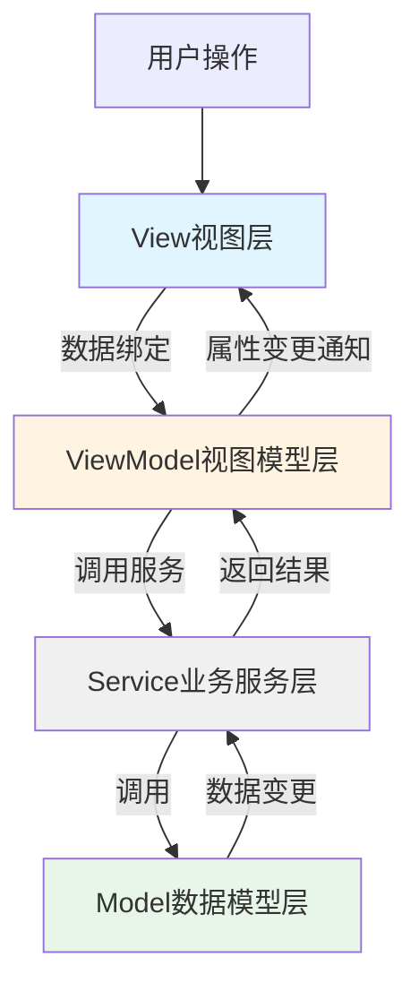

### 2.2 组件层次结构

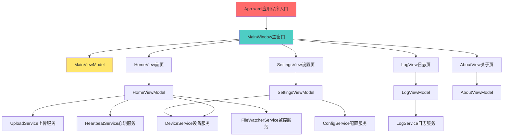

### 2.3 数据流向设计

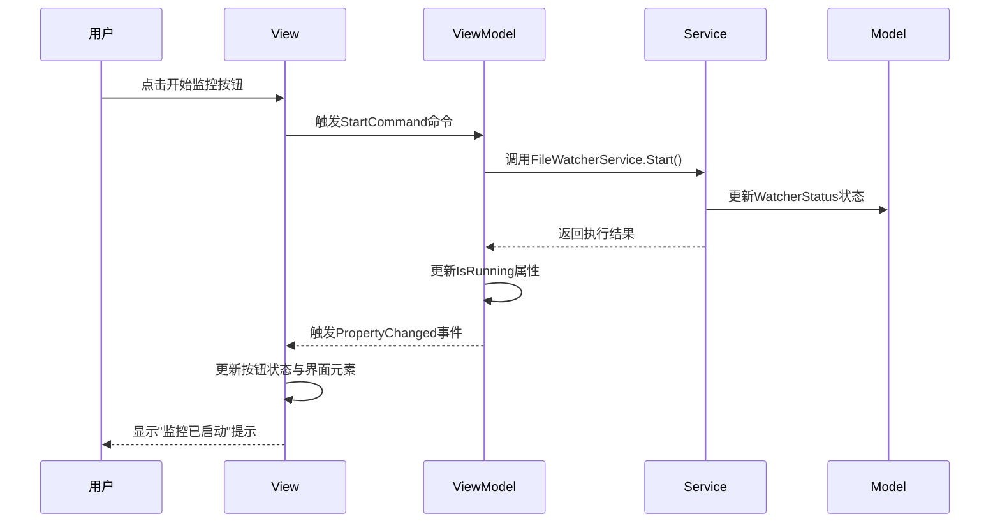

## 3. ViewModels层设计

### 3.1 基础ViewModel

所有ViewModel继承自基类，实现通用功能：

**BaseViewModel设计：**

| 功能模块 | 说明 |
|---------|------|
| 属性变更通知 | 实现INotifyPropertyChanged接口，提供OnPropertyChanged方法 |
| 命令封装 | 提供RelayCommand类封装ICommand实现 |
| 错误处理 | 统一异常捕获与错误消息展示 |
| 忙碌状态 | 提供IsBusy属性标识后台操作状态 |
| 服务注入 | 通过构造函数注入所需Service实例 |

**基类属性定义：**

| 属性名 | 类型 | 说明 |
|-------|------|------|
| IsBusy | bool | 是否正在执行后台操作 |
| ErrorMessage | string | 最近一次错误消息 |
| HasError | bool | 是否存在错误 |

### 3.2 MainViewModel（主窗口视图模型）

**职责：**
- 管理应用程序主窗口状态
- 处理页面导航逻辑
- 管理全局服务生命周期
- 处理窗口关闭事件

**数据属性：**

| 属性名 | 类型 | 说明 | 默认值 |
|-------|------|------|--------|
| CurrentView | object | 当前显示的视图内容 | HomeViewModel |
| WindowTitle | string | 窗口标题 | AI旅拍商家客户端 |
| IsLoggedIn | bool | 设备是否已注册 | false |
| DeviceName | string | 设备名称 | 未注册 |
| ConnectionStatus | NetworkStatus | 网络连接状态 | Disconnected |
| StatusText | string | 状态栏文本 | 就绪 |
| StatusColor | string | 状态栏颜色 | #808080 |

**命令定义：**

| 命令名 | 参数 | 说明 | 执行逻辑 |
|-------|------|------|---------|
| NavigateToHomeCommand | 无 | 导航到首页 | 切换CurrentView为HomeViewModel |
| NavigateToSettingsCommand | 无 | 导航到设置页 | 切换CurrentView为SettingsViewModel |
| NavigateToLogCommand | 无 | 导航到日志页 | 切换CurrentView为LogViewModel |
| NavigateToAboutCommand | 无 | 导航到关于页 | 切换CurrentView为AboutViewModel |
| WindowClosingCommand | CancelEventArgs | 窗口关闭前处理 | 停止所有服务，保存配置 |
| MinimizeToTrayCommand | 无 | 最小化到系统托盘 | 隐藏窗口，显示托盘图标 |

**初始化流程：**

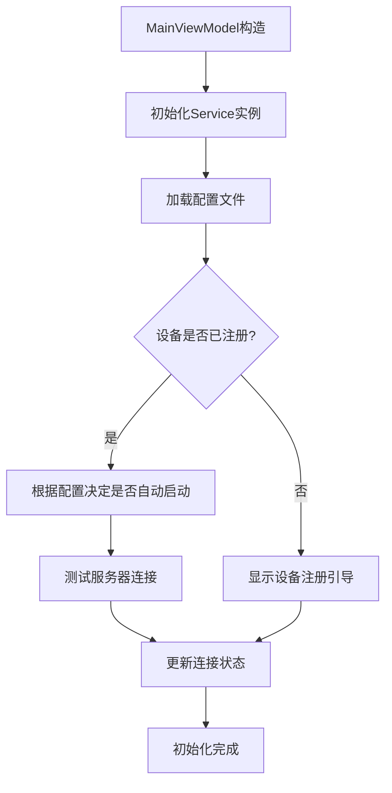

### 3.3 HomeViewModel（首页视图模型）

**职责：**
- 展示设备运行状态
- 展示上传统计信息
- 控制监控与上传开关
- 实时更新上传队列状态

**数据属性：**

| 属性名 | 类型 | 说明 | 更新时机 |
|-------|------|------|---------|
| IsMonitoring | bool | 是否正在监控 | FileWatcherService状态变更时 |
| IsUploading | bool | 是否正在上传 | UploadService状态变更时 |
| DeviceStatus | string | 设备状态文本 | 心跳成功/失败时更新 |
| LastHeartbeatTime | DateTime? | 最后心跳时间 | 每次心跳成功后更新 |
| TodaySuccessCount | int | 今日上传成功数 | 每次上传成功后累加 |
| TodayFailedCount | int | 今日上传失败数 | 每次上传失败后累加 |
| TotalSuccessCount | int | 累计上传成功数 | 从配置加载或累加 |
| TotalFailedCount | int | 累计上传失败数 | 从配置加载或累加 |
| QueuePendingCount | int | 队列待上传数 | UploadService队列变化时 |
| UploadingCount | int | 正在上传数 | UploadService状态变化时 |
| TodaySuccessRate | double | 今日成功率（百分比） | 计算属性：成功数/总数*100 |
| UploadSpeed | string | 上传速度 | 根据上传任务计算 |
| RunningTime | string | 运行时长 | 定时器每分钟更新 |

**命令定义：**

| 命令名 | 参数 | 说明 | 执行逻辑 |
|-------|------|------|---------|
| StartMonitoringCommand | 无 | 开始监控 | 调用FileWatcherService.Start() |
| StopMonitoringCommand | 无 | 停止监控 | 调用FileWatcherService.Stop() |
| PauseUploadCommand | 无 | 暂停上传 | 调用UploadService.Pause() |
| ResumeUploadCommand | 无 | 恢复上传 | 调用UploadService.Resume() |
| ClearStatisticsCommand | 无 | 清除统计 | 重置今日统计数据 |
| RefreshStatusCommand | 无 | 刷新状态 | 手动刷新所有状态信息 |

**事件订阅：**

| 服务 | 事件 | 处理逻辑 |
|------|------|---------|
| FileWatcherService | StatusChanged | 更新IsMonitoring状态 |
| UploadService | TaskCompleted | 更新统计计数 |
| UploadService | QueueChanged | 更新队列计数 |
| HeartbeatService | HeartbeatSuccess | 更新心跳时间与设备状态 |
| HeartbeatService | HeartbeatFailed | 显示连接异常警告 |
| LogService | LogAdded | 可选：显示最新日志 |

### 3.4 SettingsViewModel（设置页视图模型）

**职责：**
- 展示与编辑应用配置
- 设备注册与重新注册
- 测试服务器连接
- 配置验证与保存

**数据属性：**

| 分组 | 属性名 | 类型 | 说明 | 验证规则 |
|------|-------|------|------|---------|
| 服务器配置 | ApiBaseUrl | string | API服务器地址 | 必填，URL格式 |
| 服务器配置 | Timeout | int | 请求超时时间（秒） | 30-300 |
| 服务器配置 | RetryTimes | int | 重试次数 | 0-10 |
| 设备配置 | DeviceId | string | 设备ID（只读） | 自动获取 |
| 设备配置 | DeviceName | string | 设备名称 | 必填，1-50字符 |
| 设备配置 | IsRegistered | bool | 是否已注册 | 只读 |
| 设备配置 | Aid | int | 应用ID | 必填，大于0 |
| 设备配置 | Bid | int | 商家ID | 必填，大于0 |
| 设备配置 | Mdid | int | 门店ID | 必填，大于0 |
| 监控配置 | WatchPaths | ObservableCollection<string> | 监控路径列表 | 至少一个有效路径 |
| 监控配置 | ScanInterval | int | 轮询间隔（秒） | 5-300 |
| 监控配置 | FileStableTime | int | 文件稳定等待时间（秒） | 1-60 |
| 监控配置 | AllowedExtensions | string | 允许的扩展名（逗号分隔） | 必填 |
| 监控配置 | MinFileSize | int | 最小文件大小（KB） | 1-10240 |
| 监控配置 | MaxFileSize | int | 最大文件大小（MB） | 1-100 |
| 上传配置 | ConcurrentUploads | int | 并发上传数 | 1-10 |
| 上传配置 | MaxQueueSize | int | 最大队列长度 | 100-10000 |
| 上传配置 | AutoUpload | bool | 自动上传 | - |
| 上传配置 | MaxRetry | int | 最大重试次数 | 0-10 |
| 心跳配置 | HeartbeatInterval | int | 心跳间隔（秒） | 30-600 |
| 心跳配置 | HeartbeatTimeout | int | 心跳超时（秒） | 5-60 |

**命令定义：**

| 命令名 | 参数 | 说明 | 执行逻辑 |
|-------|------|------|---------|
| SaveConfigCommand | 无 | 保存配置 | 验证配置项，调用ConfigService.SaveConfig() |
| ResetConfigCommand | 无 | 恢复默认配置 | 加载默认配置值 |
| TestConnectionCommand | 无 | 测试连接 | 调用ApiClient.TestConnectionAsync() |
| RegisterDeviceCommand | 无 | 注册设备 | 调用DeviceService.RegisterAsync() |
| UnregisterDeviceCommand | 无 | 注销设备 | 清除Token，重置注册状态 |
| AddWatchPathCommand | 无 | 添加监控路径 | 打开文件夹选择对话框 |
| RemoveWatchPathCommand | string | 移除监控路径 | 从WatchPaths集合移除 |
| BrowseFolderCommand | 无 | 浏览文件夹 | 打开文件夹选择对话框 |

**配置验证流程：**

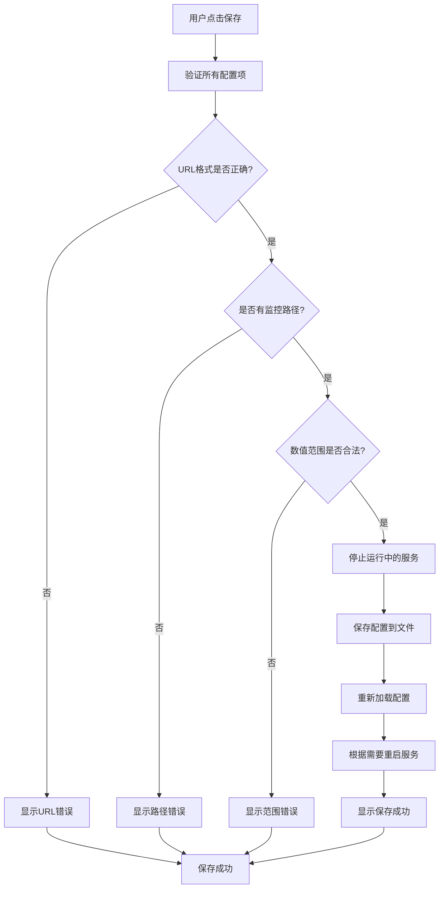

### 3.5 LogViewModel（日志页视图模型）

**职责：**
- 展示实时日志信息
- 日志级别过滤
- 日志搜索与导出
- 日志自动滚动

**数据属性：**

| 属性名 | 类型 | 说明 |
|-------|------|------|
| LogItems | ObservableCollection<LogItem> | 日志项集合 |
| FilteredLogItems | ObservableCollection<LogItem> | 过滤后的日志项 |
| SelectedLogLevel | LogLevel | 选中的日志级别 |
| SearchKeyword | string | 搜索关键词 |
| AutoScroll | bool | 是否自动滚动到底部 |
| MaxDisplayItems | int | 最大显示条数（性能优化） |
| LogLevels | List<LogLevel> | 可选日志级别列表 |

**LogItem数据结构：**

| 字段 | 类型 | 说明 |
|------|------|------|
| Timestamp | DateTime | 日志时间 |
| Level | LogLevel | 日志级别 |
| Message | string | 日志内容 |
| LevelColor | string | 级别对应颜色 |
| FormattedTime | string | 格式化的时间字符串 |

**命令定义：**

| 命令名 | 参数 | 说明 | 执行逻辑 |
|-------|------|------|---------|
| ClearLogsCommand | 无 | 清空日志 | 清空LogItems集合 |
| ExportLogsCommand | 无 | 导出日志 | 将日志导出为文本文件 |
| FilterByLevelCommand | LogLevel | 按级别过滤 | 更新FilteredLogItems |
| SearchLogsCommand | 无 | 搜索日志 | 根据关键词过滤 |
| OpenLogFolderCommand | 无 | 打开日志文件夹 | 使用资源管理器打开日志目录 |
| RefreshLogsCommand | 无 | 刷新日志 | 从日志文件重新加载 |

**日志级别与颜色映射：**

| 级别 | 颜色 | 图标 | 显示文本 |
|------|------|------|---------|
| DEBUG | #808080 | 🔍 | 调试 |
| INFO | #2196F3 | ℹ️ | 信息 |
| WARN | #FF9800 | ⚠️ | 警告 |
| ERROR | #F44336 | ❌ | 错误 |

**事件订阅：**

| 服务 | 事件 | 处理逻辑 |
|------|------|---------|
| LogService | LogAdded | 将新日志添加到LogItems，限制最大显示数量 |

### 3.6 AboutViewModel（关于页视图模型）

**职责：**
- 展示应用程序信息
- 展示版本更新信息
- 提供帮助文档链接
- 展示设备信息

**数据属性：**

| 属性名 | 类型 | 说明 |
|-------|------|------|
| AppName | string | 应用程序名称 |
| AppVersion | string | 应用程序版本 |
| Copyright | string | 版权信息 |
| CompanyName | string | 公司名称 |
| SupportUrl | string | 技术支持链接 |
| DeviceId | string | 设备ID |
| OSVersion | string | 操作系统版本 |
| DotNetVersion | string | .NET版本 |
| StartTime | DateTime | 启动时间 |
| RunningTime | string | 运行时长 |

**命令定义：**

| 命令名 | 参数 | 说明 | 执行逻辑 |
|-------|------|------|---------|
| OpenSupportUrlCommand | 无 | 打开技术支持页面 | 使用浏览器打开URL |
| CheckUpdateCommand | 无 | 检查更新 | 调用更新检查API |
| CopyDeviceIdCommand | 无 | 复制设备ID | 复制到剪贴板 |
| ViewLicenseCommand | 无 | 查看许可协议 | 打开许可协议窗口 |

## 4. Views层设计

### 4.1 MainWindow（主窗口）

**窗口属性：**

| 属性 | 值 | 说明 |
|------|-----|------|
| 标题 | AI旅拍商家客户端 | 显示在标题栏 |
| 初始宽度 | 1200px | 默认窗口宽度 |
| 初始高度 | 720px | 默认窗口高度 |
| 最小宽度 | 800px | 最小可调整宽度 |
| 最小高度 | 600px | 最小可调整高度 |
| 窗口状态 | Normal | 正常显示 |
| 启动位置 | CenterScreen | 屏幕中央 |
| 是否可调整大小 | 是 | 允许用户调整 |

**布局结构：**

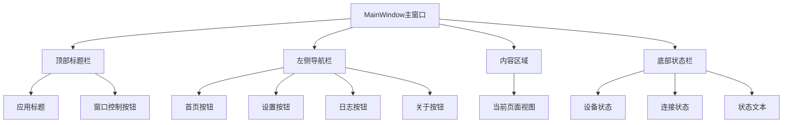

**左侧导航栏设计：**

| 导航项 | 图标 | 文本 | 绑定命令 |
|-------|------|------|---------|
| 首页 | 🏠 | 首页 | NavigateToHomeCommand |
| 设置 | ⚙️ | 设置 | NavigateToSettingsCommand |
| 日志 | 📄 | 日志 | NavigateToLogCommand |
| 关于 | ℹ️ | 关于 | NavigateToAboutCommand |

**底部状态栏设计：**

| 区域 | 内容 | 数据绑定 |
|------|------|---------|
| 左侧 | 设备状态：[已注册/未注册] | DeviceName |
| 中间 | 连接状态：[已连接/未连接] 🟢/🔴 | ConnectionStatus |
| 右侧 | 状态文本：[就绪/监控中/上传中] | StatusText |

### 4.2 HomeView（首页视图）

**布局分区：**

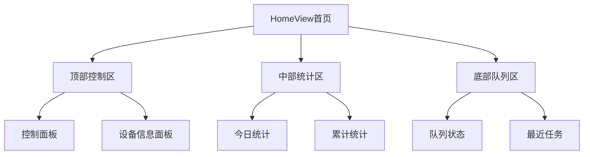

**顶部控制面板：**

| 元素 | 类型 | 说明 | 绑定 |
|------|------|------|------|
| 开始监控按钮 | Button | 启动文件监控 | StartMonitoringCommand |
| 停止监控按钮 | Button | 停止文件监控 | StopMonitoringCommand |
| 暂停上传按钮 | Button | 暂停文件上传 | PauseUploadCommand |
| 恢复上传按钮 | Button | 恢复文件上传 | ResumeUploadCommand |
| 监控状态指示灯 | Ellipse | 显示监控状态 | IsMonitoring (绿/灰) |
| 上传状态指示灯 | Ellipse | 显示上传状态 | IsUploading (蓝/灰) |

**按钮状态逻辑：**

| 按钮 | 显示条件 | 启用条件 |
|------|---------|---------|
| 开始监控 | !IsMonitoring | IsRegistered && !IsBusy |
| 停止监控 | IsMonitoring | true |
| 暂停上传 | IsUploading | true |
| 恢复上传 | !IsUploading && QueuePendingCount > 0 | true |

**设备信息面板：**

| 信息项 | 数据源 | 格式 |
|-------|--------|------|
| 设备名称 | DeviceName | 文本 |
| 设备状态 | DeviceStatus | 文本+颜色 |
| 最后心跳 | LastHeartbeatTime | yyyy-MM-dd HH:mm:ss |
| 运行时长 | RunningTime | X小时Y分钟 |

**今日统计卡片：**

| 指标 | 数据源 | 样式 |
|------|--------|------|
| 今日成功 | TodaySuccessCount | 大字号，绿色 |
| 今日失败 | TodayFailedCount | 大字号，红色 |
| 成功率 | TodaySuccessRate | 百分比，进度环 |
| 上传速度 | UploadSpeed | 文件/分钟 |

**累计统计卡片：**

| 指标 | 数据源 | 样式 |
|------|--------|------|
| 累计成功 | TotalSuccessCount | 大字号，蓝色 |
| 累计失败 | TotalFailedCount | 大字号，橙色 |
| 总计 | TotalSuccessCount + TotalFailedCount | 常规字号 |

**队列状态区域：**

| 信息项 | 数据源 | 展示方式 |
|-------|--------|---------|
| 队列待上传 | QueuePendingCount | 数字徽章 |
| 正在上传 | UploadingCount | 数字徽章+进度动画 |

### 4.3 SettingsView（设置页视图）

**布局结构：**

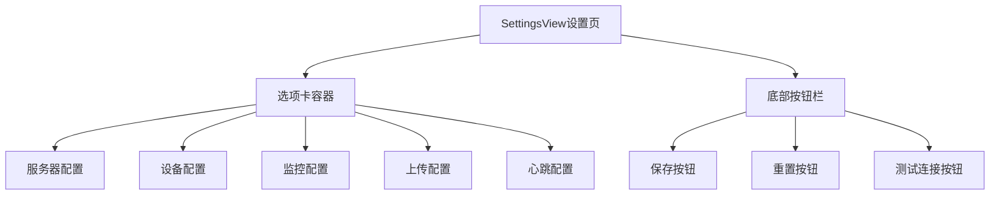

**服务器配置选项卡：**

| 配置项 | 控件类型 | 验证规则 |
|-------|---------|---------|
| API服务器地址 | TextBox | 必填，URL格式 |
| 请求超时时间 | NumericUpDown | 30-300秒 |
| 网络重试次数 | NumericUpDown | 0-10次 |

**设备配置选项卡：**

| 配置项 | 控件类型 | 说明 |
|-------|---------|------|
| 设备ID | TextBox (只读) | 自动获取MAC地址 |
| 设备名称 | TextBox | 可编辑，显示在服务端 |
| 注册状态 | Label | 显示"已注册"或"未注册" |
| 应用ID | NumericUpDown | 必填，大于0 |
| 商家ID | NumericUpDown | 必填，大于0 |
| 门店ID | NumericUpDown | 必填，大于0 |
| 注册按钮 | Button | 执行设备注册 |
| 注销按钮 | Button | 清除注册信息 |

**监控配置选项卡：**

| 配置项 | 控件类型 | 说明 |
|-------|---------|------|
| 监控路径列表 | ListBox | 显示所有监控路径 |
| 添加路径按钮 | Button | 打开文件夹选择对话框 |
| 移除路径按钮 | Button | 移除选中的路径 |
| 轮询间隔 | NumericUpDown | 5-300秒 |
| 文件稳定时间 | NumericUpDown | 1-60秒 |
| 允许的扩展名 | TextBox | 逗号分隔，如：.jpg,.png |
| 最小文件大小 | NumericUpDown | 1-10240KB |
| 最大文件大小 | NumericUpDown | 1-100MB |

**上传配置选项卡：**

| 配置项 | 控件类型 | 说明 |
|-------|---------|------|
| 并发上传数 | NumericUpDown | 1-10 |
| 最大队列长度 | NumericUpDown | 100-10000 |
| 自动上传 | CheckBox | 是否自动上传 |
| 最大重试次数 | NumericUpDown | 0-10次 |

**心跳配置选项卡：**

| 配置项 | 控件类型 | 说明 |
|-------|---------|------|
| 心跳间隔 | NumericUpDown | 30-600秒 |
| 心跳超时 | NumericUpDown | 5-60秒 |

**底部按钮行为：**

| 按钮 | 命令 | 确认对话框 | 成功提示 |
|------|------|-----------|---------|
| 保存 | SaveConfigCommand | 是（如果服务运行中） | 配置已保存 |
| 重置 | ResetConfigCommand | 是 | 已恢复默认配置 |
| 测试连接 | TestConnectionCommand | 否 | 连接成功/失败 |

### 4.4 LogView（日志页视图）

**布局结构：**

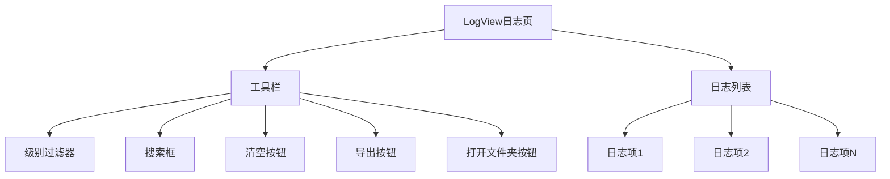

**工具栏控件：**

| 控件 | 类型 | 说明 |
|------|------|------|
| 级别过滤下拉框 | ComboBox | 选择日志级别：全部/DEBUG/INFO/WARN/ERROR |
| 搜索文本框 | TextBox | 输入关键词搜索 |
| 搜索按钮 | Button | 执行搜索 |
| 清空按钮 | Button | 清空当前显示的日志 |
| 导出按钮 | Button | 导出日志到文本文件 |
| 打开文件夹按钮 | Button | 打开日志文件所在目录 |
| 自动滚动开关 | ToggleButton | 是否自动滚动到最新日志 |

**日志列表展示：**

| 列 | 宽度 | 数据绑定 | 格式 |
|-----|------|---------|------|
| 时间 | 160px | Timestamp | yyyy-MM-dd HH:mm:ss |
| 级别 | 80px | Level | 图标+文本+颜色 |
| 消息 | 自适应 | Message | 多行文本，支持换行 |

**日志项样式：**

| 级别 | 背景色 | 前景色 | 图标 |
|------|--------|--------|------|
| DEBUG | #FAFAFA | #616161 | 🔍 |
| INFO | #E3F2FD | #1976D2 | ℹ️ |
| WARN | #FFF3E0 | #F57C00 | ⚠️ |
| ERROR | #FFEBEE | #D32F2F | ❌ |

**性能优化策略：**

| 策略 | 说明 |
|------|------|
| 虚拟化 | 使用VirtualizingStackPanel虚拟化长列表 |
| 限制条数 | 最多显示1000条，超出后移除旧日志 |
| 异步加载 | 从文件加载日志时使用异步方法 |
| 防抖搜索 | 搜索框输入延迟300ms后再执行 |

### 4.5 AboutView（关于页视图）

**布局结构：**

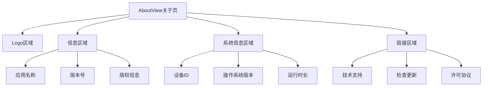

**内容展示：**

| 区域 | 内容 | 样式 |
|------|------|------|
| Logo | 应用图标（128x128） | 居中显示 |
| 应用名称 | AI旅拍商家客户端 | 大字号，粗体 |
| 版本号 | v1.0.0 | 中等字号 |
| 版权信息 | © 2024 公司名称 | 小字号，灰色 |
| 设备ID | [自动获取] | 可复制 |
| 操作系统 | [自动检测] | 只读 |
| 运行时长 | [实时更新] | 每分钟刷新 |

**按钮定义：**

| 按钮 | 命令 | 说明 |
|------|------|------|
| 技术支持 | OpenSupportUrlCommand | 打开技术支持网站 |
| 检查更新 | CheckUpdateCommand | 检查是否有新版本 |
| 查看许可 | ViewLicenseCommand | 显示软件许可协议 |
| 复制设备ID | CopyDeviceIdCommand | 复制设备ID到剪贴板 |

## 5. 交互流程设计

### 5.1 首次启动流程

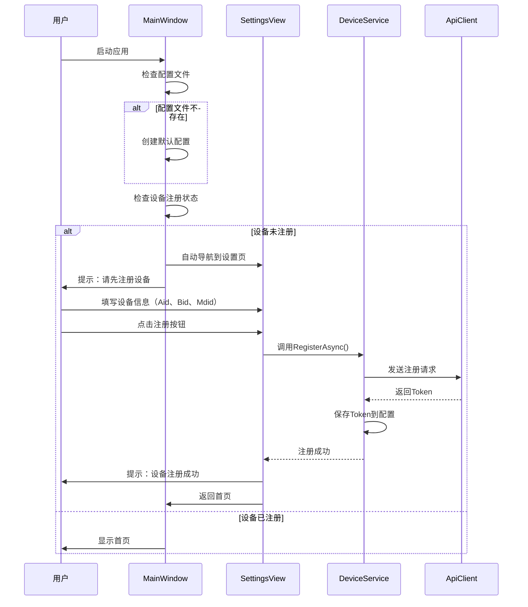

### 5.2 开始监控流程

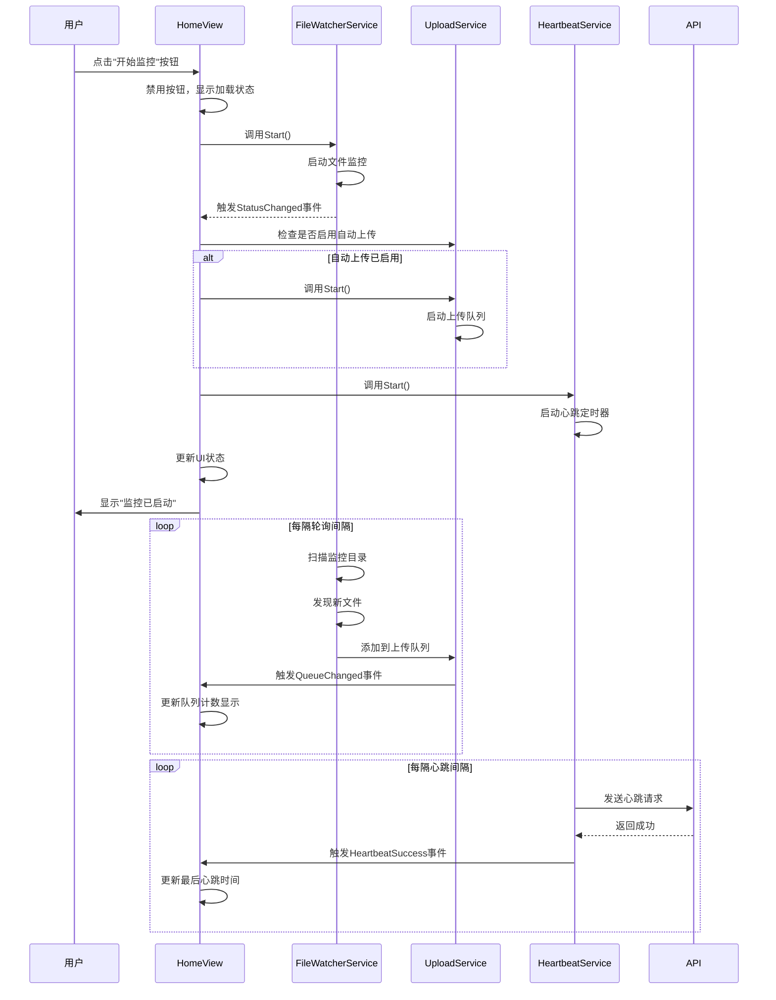

### 5.3 文件上传流程

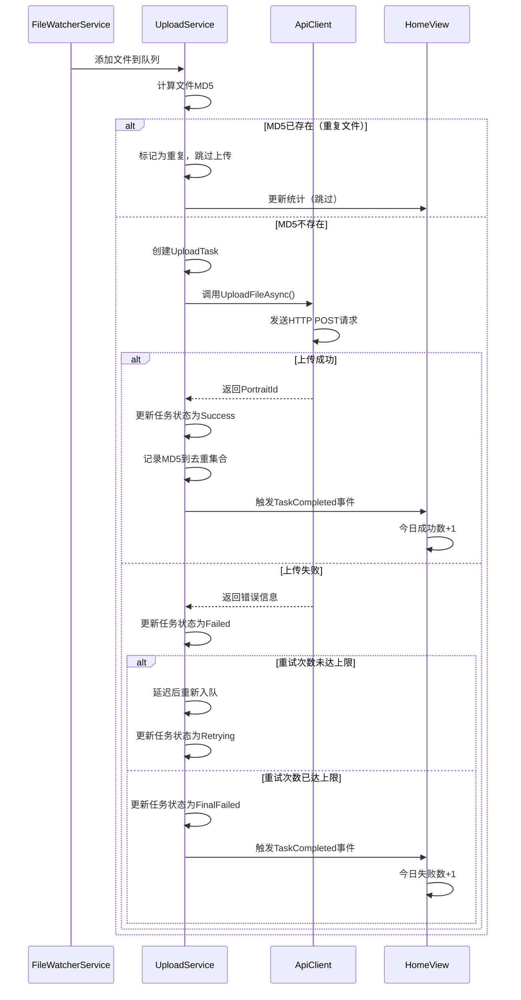

### 5.4 配置修改流程

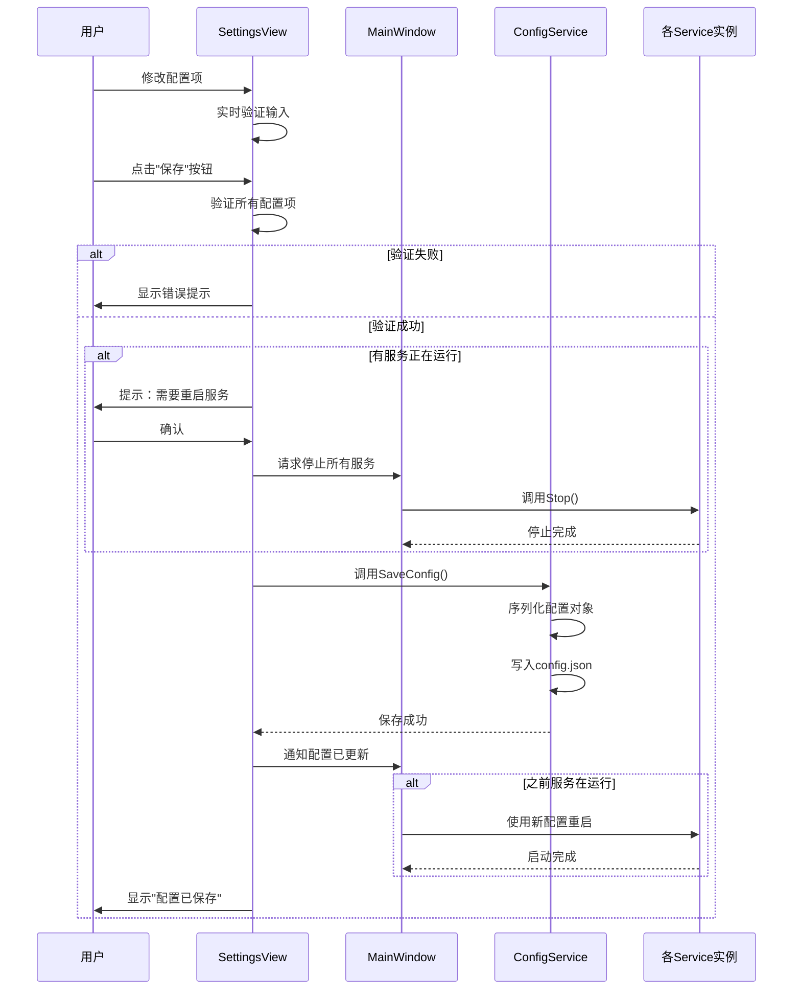

### 5.5 设备注册流程

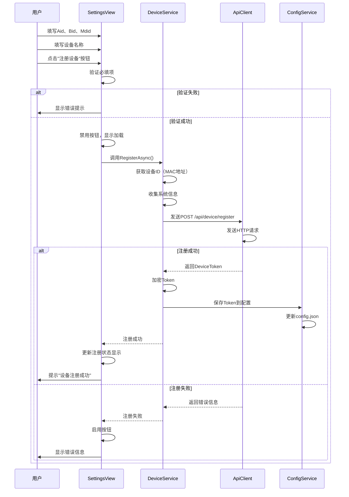

## 6. 数据绑定设计

### 6.1 绑定模式说明

| 绑定模式 | 说明 | 使用场景 |
|---------|------|---------|
| OneWay | 单向绑定（源→目标） | 只读显示数据 |
| TwoWay | 双向绑定（源↔目标） | 可编辑的输入控件 |
| OneTime | 一次性绑定 | 初始化后不变的数据 |
| OneWayToSource | 反向单向绑定（目标→源） | 事件反馈到ViewModel |

### 6.2 主要绑定关系

**MainWindow绑定：**

| UI元素 | 绑定属性 | 模式 | 数据源 |
|--------|---------|------|--------|
| 窗口标题 | Title | OneWay | WindowTitle |
| 内容区域 | Content | OneWay | CurrentView |
| 设备名称标签 | Text | OneWay | DeviceName |
| 连接状态图标 | Fill | OneWay | ConnectionStatus（转换器） |
| 状态文本 | Text | OneWay | StatusText |

**HomeView绑定：**

| UI元素 | 绑定属性 | 模式 | 数据源 |
|--------|---------|------|--------|
| 开始监控按钮 | Command | - | StartMonitoringCommand |
| 开始监控按钮 | IsEnabled | OneWay | !IsMonitoring |
| 停止监控按钮 | Command | - | StopMonitoringCommand |
| 停止监控按钮 | IsEnabled | OneWay | IsMonitoring |
| 监控状态灯 | Fill | OneWay | IsMonitoring（转换器） |
| 今日成功数 | Text | OneWay | TodaySuccessCount |
| 今日失败数 | Text | OneWay | TodayFailedCount |
| 成功率环形图 | Value | OneWay | TodaySuccessRate |
| 队列待上传 | Text | OneWay | QueuePendingCount |
| 正在上传 | Text | OneWay | UploadingCount |

**SettingsView绑定：**

| UI元素 | 绑定属性 | 模式 | 数据源 |
|--------|---------|------|--------|
| API地址输入框 | Text | TwoWay | ApiBaseUrl |
| 超时时间输入框 | Value | TwoWay | Timeout |
| 设备ID文本框 | Text | OneWay | DeviceId |
| 设备名称输入框 | Text | TwoWay | DeviceName |
| 注册按钮 | Command | - | RegisterDeviceCommand |
| 注册按钮 | IsEnabled | OneWay | !IsRegistered |
| 监控路径列表 | ItemsSource | OneWay | WatchPaths |
| 添加路径按钮 | Command | - | AddWatchPathCommand |
| 保存按钮 | Command | - | SaveConfigCommand |

**LogView绑定：**

| UI元素 | 绑定属性 | 模式 | 数据源 |
|--------|---------|------|--------|
| 日志列表 | ItemsSource | OneWay | FilteredLogItems |
| 级别过滤下拉框 | SelectedItem | TwoWay | SelectedLogLevel |
| 搜索框 | Text | TwoWay | SearchKeyword |
| 清空按钮 | Command | - | ClearLogsCommand |
| 导出按钮 | Command | - | ExportLogsCommand |
| 自动滚动开关 | IsChecked | TwoWay | AutoScroll |

### 6.3 值转换器设计

**需要实现的转换器：**

| 转换器名称 | 输入类型 | 输出类型 | 转换逻辑 |
|-----------|---------|---------|---------|
| BoolToColorConverter | bool | Brush | true→Green, false→Gray |
| NetworkStatusToColorConverter | NetworkStatus | Brush | Connected→Green, Error→Red, Disconnected→Gray |
| LogLevelToColorConverter | LogLevel | Brush | ERROR→Red, WARN→Orange, INFO→Blue, DEBUG→Gray |
| BoolToVisibilityConverter | bool | Visibility | true→Visible, false→Collapsed |
| InverseBoolConverter | bool | bool | true→false, false→true |
| FileCountToTextConverter | int | string | 0→"无文件", n→"n个文件" |
| BytesToSizeConverter | long | string | 字节→格式化大小（KB/MB） |
| SecondsToTimeSpanConverter | int | string | 秒→"X小时Y分钟" |

## 7. 样式与主题设计

### 7.1 颜色方案

**主色调：**

| 颜色名称 | 十六进制值 | 用途 |
|---------|-----------|------|
| 主色 | #2196F3 | 按钮、强调元素 |
| 主色（深） | #1976D2 | 按钮悬停、选中状态 |
| 主色（浅） | #BBDEFB | 背景、分隔线 |
| 成功色 | #4CAF50 | 成功状态、成功数据 |
| 警告色 | #FF9800 | 警告状态、警告信息 |
| 错误色 | #F44336 | 错误状态、失败数据 |
| 背景色 | #FAFAFA | 主背景 |
| 卡片背景 | #FFFFFF | 卡片、面板背景 |
| 文本主色 | #212121 | 主要文本 |
| 文本次色 | #757575 | 次要文本 |
| 边框色 | #E0E0E0 | 边框、分隔线 |

**状态颜色：**

| 状态 | 颜色 | 说明 |
|------|------|------|
| 运行中 | #4CAF50 | 绿色，表示正常运行 |
| 已暂停 | #FF9800 | 橙色，表示已暂停 |
| 已停止 | #9E9E9E | 灰色，表示未启动 |
| 异常 | #F44336 | 红色，表示错误 |
| 已连接 | #4CAF50 | 绿色，网络已连接 |
| 未连接 | #9E9E9E 灰色，网络未连接 |

### 7.2 字体规范

| 用途 | 字体大小 | 字重 | 颜色 |
|------|---------|------|------|
| 页面标题 | 24px | Bold | #212121 |
| 区块标题 | 18px | Medium | #212121 |
| 正文 | 14px | Regular | #212121 |
| 次要文本 | 12px | Regular | #757575 |
| 数据大号 | 32px | Bold | 根据类型 |
| 按钮文字 | 14px | Medium | #FFFFFF |

### 7.3 控件样式

**按钮样式：**

| 按钮类型 | 背景色 | 前景色 | 圆角 | 内边距 |
|---------|--------|--------|------|--------|
| 主要按钮 | #2196F3 | #FFFFFF | 4px | 12px 24px |
| 次要按钮 | #E0E0E0 | #212121 | 4px | 12px 24px |
| 危险按钮 | #F44336 | #FFFFFF | 4px | 12px 24px |
| 文本按钮 | Transparent | #2196F3 | 0 | 8px 16px |

**输入框样式：**

| 状态 | 边框色 | 背景色 | 圆角 |
|------|--------|--------|------|
| 正常 | #E0E0E0 | #FFFFFF | 4px |
| 聚焦 | #2196F3 | #FFFFFF | 4px |
| 错误 | #F44336 | #FFEBEE | 4px |
| 只读 | #E0E0E0 | #FAFAFA | 4px |

**卡片样式：**

| 属性 | 值 |
|------|-----|
| 背景色 | #FFFFFF |
| 圆角 | 8px |
| 阴影 | 0 2px 4px rgba(0,0,0,0.1) |
| 内边距 | 16px |
| 外边距 | 8px |

### 7.4 布局规范

**间距规范：**

| 类型 | 值 | 说明 |
|------|-----|------|
| 页面边距 | 24px | 页面四周留白 |
| 卡片间距 | 16px | 卡片之间的间距 |
| 元素间距 | 8px | 小元素之间的间距 |
| 组间距 | 16px | 不同功能组之间的间距 |
| 标签间距 | 4px | 标签与输入框的间距 |

**网格布局：**

| 容器 | 列数 | 行高 | 间距 |
|------|------|------|------|
| 统计卡片区 | 2-4（响应式） | Auto | 16px |
| 配置表单 | 2 | Auto | 8px |
| 日志列表 | 1 | 48px | 0 |

## 8. 响应式设计

### 8.1 窗口尺寸适配

| 窗口宽度 | 布局调整 |
|---------|---------|
| < 800px | 最小宽度限制，不支持更小 |
| 800-1024px | 统计卡片2列布局，压缩间距 |
| 1024-1440px | 统计卡片3列布局，正常间距 |
| > 1440px | 统计卡片4列布局，宽松间距 |

### 8.2 DPI缩放支持

| DPI | 缩放比例 | 调整策略 |
|-----|---------|---------|
| 96 (100%) | 1.0 | 默认尺寸 |
| 120 (125%) | 1.25 | 自动缩放 |
| 144 (150%) | 1.5 | 自动缩放 |
| 192 (200%) | 2.0 | 自动缩放 |

**应对策略：**
- 使用矢量图标（SVG或字体图标）
- 使用相对单位（如Grid的*权重）
- 测试不同DPI下的显示效果

## 9. 错误处理与用户反馈

### 9.1 错误提示方式

| 错误类型 | 提示方式 | 示例 |
|---------|---------|------|
| 验证错误 | 输入框下方红色文字 | "请输入有效的URL地址" |
| 操作失败 | 弹窗提示（MessageBox） | "保存配置失败：文件被占用" |
| 网络错误 | 状态栏提示 + 日志 | "服务器连接失败" |
| 致命错误 | 错误对话框 + 日志 | "应用程序异常，请查看日志" |

### 9.2 成功反馈方式

| 操作类型 | 反馈方式 | 示例 |
|---------|---------|------|
| 配置保存 | Toast通知 | "配置已保存" |
| 设备注册 | 弹窗提示 | "设备注册成功" |
| 文件上传 | 统计数字变化 | 成功数+1 |
| 连接测试 | 弹窗提示 | "连接成功" |

### 9.3 加载状态指示

| 场景 | 指示方式 |
|------|---------|
| 初始化应用 | 启动画面（Splash Screen） |
| 保存配置 | 按钮禁用 + 旋转图标 |
| 测试连接 | 按钮禁用 + "测试中..." |
| 上传文件 | 进度条 + 百分比 |
| 加载日志 | 列表上方进度条 |

### 9.4 确认对话框

| 操作 | 是否需要确认 | 提示文本 |
|------|------------|---------|
| 保存配置（服务运行中） | 是 | "保存配置需要重启服务，是否继续？" |
| 重置配置 | 是 | "确定要恢复默认配置吗？当前配置将丢失" |
| 注销设备 | 是 | "确定要注销设备吗？注销后需要重新注册" |
| 清空日志 | 是 | "确定要清空所有日志吗？" |
| 清除统计 | 是 | "确定要清除今日统计数据吗？" |
| 关闭窗口（服务运行中） | 是 | "服务正在运行，确定要退出吗？" |

## 10. 无障碍访问设计

### 10.1 键盘导航

| 功能 | 快捷键 | 说明 |
|------|--------|------|
| 切换到首页 | Alt+1 | 导航到首页 |
| 切换到设置页 | Alt+2 | 导航到设置页 |
| 切换到日志页 | Alt+3 | 导航到日志页 |
| 切换到关于页 | Alt+4 | 导航到关于页 |
| 开始/停止监控 | Ctrl+M | 切换监控状态 |
| 暂停/恢复上传 | Ctrl+U | 切换上传状态 |
| 保存配置 | Ctrl+S | 保存设置 |
| 清空日志 | Ctrl+L | 清空日志显示 |

### 10.2 Tab顺序

- 按照视觉上从上到下、从左到右的顺序
- 导航栏 → 页面内容 → 底部按钮
- 跳过不可交互元素
- 可用Tab键和Shift+Tab键前后切换

### 10.3 辅助功能

| 功能 | 说明 |
|------|------|
| AutomationProperties.Name | 为所有控件设置名称 |
| ToolTip | 为图标按钮提供文字说明 |
| 高对比度支持 | 适配Windows高对比度主题 |
| 屏幕阅读器支持 | 提供必要的ARIA属性 |

## 11. 系统托盘设计

### 11.1 托盘图标

**图标状态：**

| 状态 | 图标 | 说明 |
|------|------|------|
| 正常运行 | 蓝色图标 | 监控和上传正常 |
| 已暂停 | 灰色图标 | 服务已暂停 |
| 有错误 | 红色图标 | 出现错误 |

### 11.2 托盘菜单

| 菜单项 | 说明 | 快捷键 |
|-------|------|--------|
| 显示主窗口 | 恢复窗口显示 | - |
| 开始监控 | 启动监控（未运行时显示） | - |
| 停止监控 | 停止监控（运行时显示） | - |
| 今日统计 | 显示今日上传统计 | - |
| 查看日志 | 打开日志窗口 | - |
| 退出程序 | 关闭应用 | - |

### 11.3 托盘气泡提示

| 场景 | 标题 | 内容 | 图标 |
|------|------|------|------|
| 上传成功（每10个） | 上传提醒 | 已成功上传10个文件 | Info |
| 上传失败 | 上传失败 | [文件名]上传失败 | Warning |
| 网络异常 | 连接异常 | 无法连接到服务器 | Error |
| 监控启动 | 监控已启动 | 文件监控已启动 | Info |

## 12. 测试策略

### 12.1 单元测试重点

| 测试对象 | 测试内容 |
|---------|---------|
| ViewModel属性变更 | 验证PropertyChanged事件正确触发 |
| 命令可执行性 | 验证CanExecute逻辑正确 |
| 数据验证 | 验证配置验证规则正确 |
| 值转换器 | 验证转换逻辑正确 |

### 12.2 集成测试重点

| 测试场景 | 验证内容 |
|---------|---------|
| 页面导航 | 验证页面切换正确 |
| 服务生命周期 | 验证服务启停正确 |
| 配置保存加载 | 验证配置持久化正确 |
| 数据绑定 | 验证UI与数据同步 |

### 12.3 UI测试重点

| 测试项 | 验证内容 |
|-------|---------|
| 按钮状态 | 验证按钮根据条件正确启用/禁用 |
| 数据显示 | 验证数据正确显示在UI上 |
| 用户交互 | 验证用户操作产生预期效果 |
| 错误提示 | 验证错误提示正确显示 |

### 12.4 兼容性测试

| 测试项 | 测试范围 |
|-------|---------|
| 操作系统 | Windows 7 SP1, Windows 10, Windows 11 |
| DPI | 100%, 125%, 150%, 200% |
| 分辨率 | 1366x768, 1920x1080, 2560x1440 |
| 主题 | 亮色主题、暗色主题、高对比度主题 |
