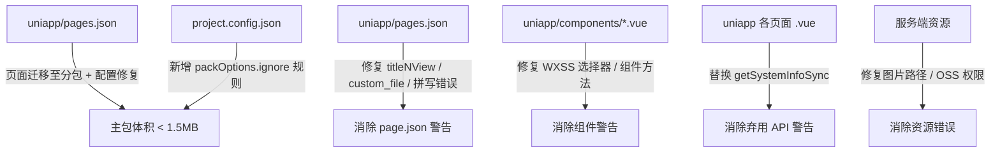
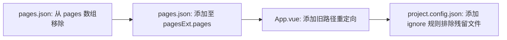
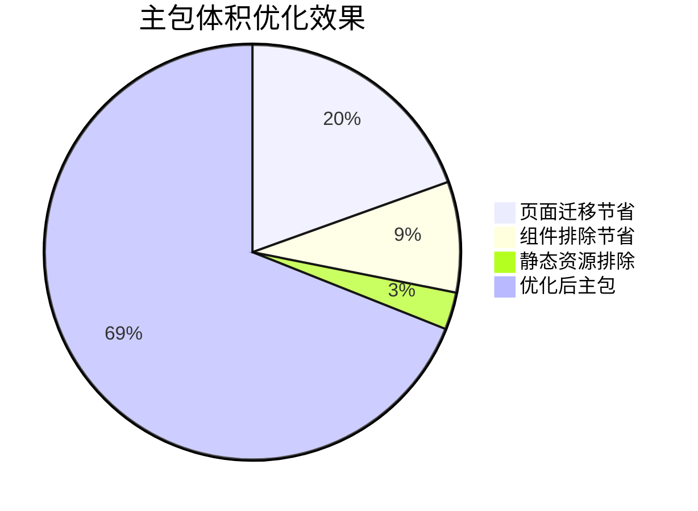
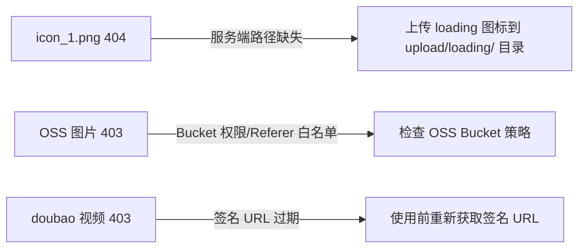
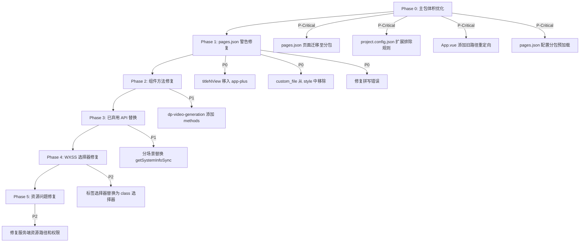

# 微信小程序控制台警告修复 + 主包体积优化设计

## 1. 概述

本设计解决两大问题：
1. 微信小程序开发者工具控制台的 **全部类型** 警告和错误
2. **主包体积超限**（当前 2204KB，系统限制 2048KB，目标压缩至 1.5MB / 1536KB 以内）

项目采用 uni-app 框架开发，源码 `uniapp/`，编译输出 `mp-weixin/`。

### 问题分类与优先级

| 优先级 | 问题类型 | 影响范围 | 严重程度 |
|--------|----------|----------|----------|
| **P-Critical** | **主包体积超限 2204KB > 2048KB** | **编译部署阻断** | **无法上传发布** |
| P0 | `titleNView` 无效属性 | ~70 个页面 | 警告 |
| P0 | `custom_file` 泄漏到 style | 9 个 hotel 页面 | 警告 |
| P0 | `navigationBarTistleText` 拼写错误 | 1 个页面 | 标题不生效 |
| P1 | `dp-video-generation` 缺少 `__l` 方法 | 首页组件 | 运行时错误 |
| P1 | `wx.getSystemInfoSync` 已弃用 | ~20+ 处调用 | 弃用警告 |
| P2 | 组件 WXSS 选择器不规范 | ~16 个组件 | 样式警告 |
| P2 | 图片资源加载失败 | 3 类资源 | 渲染层错误 |

## 2. 架构

### 主包体积分析

当前主包 2204KB 的体积构成（编译产物 `mp-weixin/`）：

| 区域 | 主要内容 | 估算体积 |
|------|----------|----------|
| `common/` | vendor.js(231KB) + main.js(40KB) + main.wxss(30KB) + runtime.js(19KB) | ~320KB |
| `pages/shop/product` | 商品详情页（js:40KB + wxml:78KB + wxss:29KB） | ~147KB |
| `pages/` 其他主包页面 | index、shop、my、pay、order、coupon、maidan 共 25 个页面 | ~400KB |
| `components/` | dp 元组件引用 ~50 个子组件，加上 buydialog 等 | ~1100KB |
| `static/` | img(151 文件) + font + peisong | ~170KB |
| 配置/其他 | app.json(34KB) + project.config.json + sitemap.json | ~40KB |
| **合计（packOptions.ignore 排除后）** | | **~2204KB** |

> `common/vendor.js`(231KB) 为 uni-app 框架运行时，无法进一步压缩。优化重点在 **页面迁移** 和 **组件排除**。

### 修改范围

### 修改文件范围

| 修改目标 | 文件 | 说明 |
|----------|------|------|
| 页面配置 | `uniapp/pages.json` | 页面迁移至分包 + 修复 titleNView、custom_file、拼写错误 |
| 打包排除 | `mp-weixin/project.config.json` | 新增组件/静态资源排除规则 |
| 路径重定向 | `uniapp/App.vue` | 为迁移页面添加旧路径重定向 |
| 组件源码 | `uniapp/components/dp-video-generation/dp-video-generation.vue` | 补充 methods |
| 组件样式 | `uniapp/components/` 下 16 个组件 vue 文件 | 替换标签名/ID/属性选择器 |
| 页面/组件 JS | 散布在多个 .vue 文件中 | 替换已弃用 API |
| 服务端 | 后台配置 / OSS 配置 | 修复资源可访问性 |

## 3. P-Critical: 主包体积优化（2204KB → < 1536KB）

### 3.1 策略一：页面迁移至分包（预计节省 ~530KB）

将非必留页面从主包迁移至 `pagesExt` 分包。项目已有成熟的迁移模式：通过 `App.vue` 路径重定向机制兼容旧路径。

#### 必须保留在主包的页面（10 个，标记为"不可移除"或入口页）

| 页面 | 保留原因 | 估算体积 |
|------|----------|----------|
| `pages/index/index` | 首页入口 | ~46KB |
| `pages/index/main` | 备用首页 | ~7KB |
| `pages/my/usercenter` | 不可移除（个人中心） | ~12KB |
| `pages/pay/pay` | 不可移除（收银台） | ~4KB |
| `pages/order/orderlist` | 不可移除（订单列表） | ~4KB |
| `pages/coupon/couponlist` | 不可移除（领券中心） | ~3KB |
| `pages/coupon/mycoupon` | 不可移除（我的优惠券） | ~4KB |
| `pages/maidan/pay` | 不可移除（买单付款） | ~8KB |
| `pages/index/webView` | 内嵌 H5 页面 | ~4KB |
| `pages/index/webView2` | 内嵌 H5 页面 | ~3KB |
| **合计** | | **~95KB** |

#### 迁移至 pagesExt 分包的页面（15 个）

| 迁移页面 | JS | WXML | WXSS | 合计 | 迁移目标路径 |
|----------|-----|------|------|------|-------------|
| `pages/shop/product` | 40KB | 78KB | 29KB | **~147KB** | `pagesExt/shop/product` |
| `pages/index/reg` | 16KB | 21KB | 7KB | ~44KB | `pagesExt/index/reg` |
| `pages/index/login` | 16KB | 17KB | 4KB | ~37KB | `pagesExt/index/login` |
| `pages/shop/fastbuy2` | 8KB | 15KB | 11KB | ~35KB | `pagesExt/shop/fastbuy2` |
| `pages/shop/classify` | 8KB | 15KB | 5KB | ~28KB | `pagesExt/shop/classify` |
| `pages/shop/prolist` | 11KB | 10KB | 3KB | ~24KB | `pagesExt/shop/prolist` |
| `pages/shop/search` | 9KB | 9KB | 3KB | ~23KB | `pagesExt/shop/search` |
| `pages/shop/cart` | 10KB | 8KB | 4KB | ~23KB | `pagesExt/shop/cart` |
| `pages/shop/fastbuy` | 6KB | 10KB | 6KB | ~22KB | `pagesExt/shop/fastbuy` |
| `pages/shop/category1` | 2KB | 1KB | 0.3KB | ~4KB | `pagesExt/shop/category1` |
| `pages/shop/category2` | 3KB | 3KB | 2KB | ~8KB | `pagesExt/shop/category2` |
| `pages/shop/category3` | 3KB | 3KB | 2KB | ~8KB | `pagesExt/shop/category3` |
| `pages/shop/category4` | 2KB | 3KB | 2KB | ~8KB | `pagesExt/shop/category4` |
| `pages/shop/mendian` | 3KB | 2KB | 2KB | ~8KB | `pagesExt/shop/mendian` |
| **合计（14 个页面）** | | | | **~430KB** | |

#### 迁移操作要点

- 在 `uniapp/pages.json` 中，将页面定义从 `pages` 数组移至 `pagesExt` 分包的 `pages` 数组
- 在 `uniapp/App.vue` 的重定向映射中，添加旧路径到新路径的映射（如 `pages/shop/product` → `pagesExt/shop/product`）
- 在 `mp-weixin/project.config.json` 的 `packOptions.ignore` 中，添加规则排除编译残留的幽灵文件

#### 分包预加载配置

为减少页面迁移对用户体验的影响，在 `pages.json` 中配置分包预加载：

| 触发页面 | 预加载分包 | 场景 |
|----------|-----------|------|
| `pages/index/index` | `pagesExt` | 首页加载后即预加载，覆盖商品详情、购物车等高频页面 |
| `pages/my/usercenter` | `pagesExt` | 个人中心预加载设置、订单相关分包 |

---

### 3.2 策略二：组件排除扩展（预计节省 ~190KB）

利用已启用的 `lazyCodeLoading: "requiredComponents"` 特性，通过 `packOptions.ignore` 排除仅由特定功能模块使用、不影响核心页面渲染的组件。

> **安全性验证**：现有配置已排除 `dp-hotel-room` 和 `dp-carhailing`，虽然它们被 `dp.json` 引用，但由于组件懒加载机制，排除后不会产生运行时错误，仅在需要渲染时才加载。

#### 新增排除组件清单

| 组件目录 | 体积 | 排除原因 |
|----------|------|----------|
| `components/buydialog` | ~32KB | 所有使用页面均已迁至分包 |
| `components/buydialog-pifa` | ~8KB | 同上 |
| `components/buydialog-pifa2` | ~8KB | 同上 |
| `components/buydialog-purchase` | ~8KB | 同上 |
| `components/buydialog-show` | ~9KB | 同上 |
| `components/couponlist` | ~4KB | 仅 product 页使用，已迁至分包 |
| `components/dp-restaurant-product` | ~4KB | 餐饮功能专用 |
| `components/dp-restaurant-product-item` | ~7KB | 餐饮功能专用 |
| `components/dp-restaurant-product-itemlist` | ~6KB | 餐饮功能专用 |
| `components/dp-restaurant-product-itemline` | ~6KB | 餐饮功能专用 |
| `components/dp-tour` | ~3KB | 旅游功能专用 |
| `components/dp-tour-item` | ~9KB | 旅游功能专用 |
| `components/dp-livepay` | ~4KB | 生活缴费功能 |
| `components/dp-liveroom` | ~4KB | 直播功能 |
| `components/dp-channelslive` | ~4KB | 视频号直播功能 |
| `components/dp-photo-generation` | ~6KB | AI 写真功能（分包专属） |
| `components/dp-video-generation` | ~4KB | AI 视频功能（分包专属） |
| `components/dp-formdata` | ~4KB | 表单数据功能 |
| `components/dp-jidian` | ~4KB | 集点功能 |
| `components/dp-hotel` | ~4KB | 酒店功能（分包专属） |
| `components/dp-sharegive` | ~4KB | 分享赠送功能 |
| `components/dp-cycle` | ~4KB | 周期购功能 |
| `components/dp-product-yx-itemlist` | ~8KB | 营销商品列表 |
| `components/buydialog-tuangou` | ~8KB | 团购购买弹窗 |
| `components/uni-drawer` | ~4KB | 抽屉组件（主包未使用） |
| `components/uni-countdown` | ~4KB | 倒计时（主包未使用） |
| `components/waterfall-article` | ~4KB | 文章瀑布流（分包专属） |
| **合计** | **~190KB** | |

#### packOptions.ignore 新增规则

在 `mp-weixin/project.config.json` 中新增以下 `ignore` 规则（type 均为 `"folder"`）：

需新增的 folder 排除：`buydialog`、`buydialog-purchase`、`buydialog-show`、`couponlist`、`dp-restaurant-product`、`dp-restaurant-product-item`、`dp-restaurant-product-itemlist`、`dp-restaurant-product-itemline`、`dp-tour`、`dp-tour-item`、`dp-livepay`、`dp-liveroom`、`dp-channelslive`、`dp-photo-generation`、`dp-video-generation`、`dp-formdata`、`dp-jidian`、`dp-hotel`、`dp-sharegive`、`dp-cycle`、`dp-product-yx-itemlist`、`buydialog-tuangou`、`uni-drawer`、`uni-countdown`、`waterfall-article`

---

### 3.3 策略三：静态资源排除（预计节省 ~65KB）

| 排除目标 | 规则类型 | 体积 | 原因 |
|----------|----------|------|------|
| `static/peisong` | folder | ~27KB | 仅配送分包使用 |
| `static/img/shortvideo_*` | glob | ~7KB | 仅短视频分包使用 |
| `static/img/exp_*` | glob | ~5KB | 仅快递分包使用 |
| `static/img/scratch_*` | glob | ~4KB | 仅刮刮卡分包使用 |
| `static/img/ag_*` | glob | ~4KB | 仅分销分包使用 |
| `static/img/pintuan_*` | glob | ~3KB | 仅拼团分包使用 |
| `static/img/default.mp3` | glob | ~9KB | 音频文件，改为线上加载 |
| `static/img/reg-*` | glob | ~5KB | 注册页已迁至分包 |
| **合计** | | **~64KB** | |

---

### 3.4 体积优化效果预估

| 优化措施 | 节省体积 |
|----------|----------|
| 策略一：页面迁移至分包 | ~430KB |
| 策略二：组件排除扩展 | ~190KB |
| 策略三：静态资源排除 | ~64KB |
| **总计节省** | **~684KB** |
| **优化后主包预估** | **~1520KB (< 1536KB ✓)** |

---

## 4. 控制台警告修复方案

### 4.1 P0: `titleNView` 无效属性修复

#### 根因分析

`titleNView` 是 uni-app **App 端** 的原生导航栏配置（用于搜索框、自定义按钮等），不被微信小程序平台识别。当前配置直接写在 `style` 根层级，导致编译器将其原样输出到微信小程序的 `page.json` 中。

#### 修复策略

将所有 `titleNView` 配置嵌套到 `"app-plus"` 平台条件键中，使其仅在 App 端生效，微信小程序编译时自动忽略。

修复前后对比（以 `scoreshop/orderlist` 为例）：

| 修复前 | 修复后 |
|--------|--------|
| `"style": {"enablePullDownRefresh": true, "titleNView": {...}}` | `"style": {"enablePullDownRefresh": true, "app-plus": {"titleNView": {...}}}` |

#### 受影响页面清单

分为两种 `titleNView` 使用模式：

**模式 A：titleNView 为搜索框对象（~65 个页面）**

涉及分包：`activity`、`pagesExt`、`admin`、`adminExt`、`restaurant`、`carhailing`、`pagesA`、`pagesB`、`pagesC`、`pagesD`、`yuyue`

需将 `"titleNView":{...}` 移入 `"app-plus"` 键内。

**模式 B：titleNView 为 false（3 个页面）**

| 页面路径 | 说明 |
|----------|------|
| `pages/index/webView` | 隐藏导航栏 |
| `pages/index/webView2` | 隐藏导航栏 |
| `activity/shortvideo/detail` | 隐藏导航栏 |

需将 `"titleNView":false` 移入 `"app-plus"` 键内。

> **注意**：部分页面（如 `pagesC/yingxiao/jipinOrder`）的 `titleNView` 被错误放在了 `style` 外层（页面路由级别），也需修正到 `"style"` 内的 `"app-plus"` 中。

---

### 4.2 P0: `custom_file` 泄漏到 style 修复

#### 根因分析

`custom_file` 是项目自定义的页面级属性（用于标记功能定制文件），应仅存在于页面路由级别。但 hotel 分包中 9 个页面将其同时写入了 `style` 对象内部，导致编译后出现在 `page.json` 中。

#### 受影响页面

| 页面路径 | style 中的多余属性 |
|----------|-------------------|
| `hotel/index/index` | `"custom_file":"hotel"` |
| `hotel/index/hotellist` | `"custom_file":"hotel"` |
| `hotel/index/hoteldetails` | `"custom_file":"hotel"` |
| `hotel/index/buy` | `"custom_file":"hotel"` |
| `hotel/index/signature` | `"custom_file":"hotel"` |
| `hotel/order/orderlist` | `"custom_file":"hotel"` |
| `hotel/order/orderdetail` | `"custom_file":"hotel"` |
| `hotel/order/comment` | `"custom_file":"hotel"` |
| `hotel/order/refund` | `"custom_file":"hotel"` |

#### 修复策略

从每个页面的 `style` 对象中移除 `"custom_file":"hotel"`，保留页面路由级别的 `custom_file`。

修复前后对比（以 `hotel/index/index` 为例）：

| 修复前 | 修复后 |
|--------|--------|
| `"style": {"custom_file":"hotel", "enablePullDownRefresh": false}` | `"style": {"enablePullDownRefresh": false}` |

---

### 4.3 P0: 拼写错误修复

#### 根因分析

`pagesC/jipin/detail` 页面中 `navigationBarTitleText` 被误写为 `navigationBarTistleText`（缺少字母 `l`），导致微信小程序无法识别该属性，页面标题不会生效。

#### 修复策略

| 文件 | 行号 | 修复内容 |
|------|------|----------|
| `uniapp/pages.json` | L1138 | `navigationBarTistleText` → `navigationBarTitleText` |

---

### 4.4 P1: `dp-video-generation` 缺少 `__l` 方法

#### 根因分析

`dp-video-generation` 组件仅定义了 `props` 和 `computed`，没有 `methods` 块。uni-app 编译为微信小程序时，框架内部需要在组件上注入 `__l` 方法用于生命周期管理。当组件缺少 `methods` 时，注入可能失败。

该组件被 `dp.vue` 和 `dp-tab.vue` 引用，在首页渲染时触发错误。

#### 修复策略

在 `dp-video-generation.vue` 的 `export default` 中补充空的 `methods` 块：

| 文件 | 修改内容 |
|------|----------|
| `uniapp/components/dp-video-generation/dp-video-generation.vue` | 在 `computed` 之后添加 `methods: {}` |

---

### 4.5 P1: `wx.getSystemInfoSync` 已弃用 API 替换

#### 根因分析

微信基础库从 2.20.1 起，`wx.getSystemInfoSync` 被标记为弃用，建议拆分使用以下新 API：

| 旧 API | 新 API | 获取信息 |
|--------|--------|----------|
| `uni.getSystemInfoSync().windowWidth` | `uni.getWindowInfo().windowWidth` | 窗口尺寸 |
| `uni.getSystemInfoSync().windowHeight` | `uni.getWindowInfo().windowHeight` | 窗口尺寸 |
| `uni.getSystemInfoSync().statusBarHeight` | `uni.getWindowInfo().statusBarHeight` | 状态栏高度 |
| `uni.getSystemInfoSync().platform` | `uni.getDeviceInfo().platform` | 设备平台 |
| `uni.getSystemInfoSync().uniPlatform` | 条件编译判断 | 运行平台 |

#### 修复策略

**分阶段替换**，按使用场景分类处理：

**场景一：获取窗口尺寸（最常见）**

涉及文件：`dp-guanggao.vue`、`dp-location.vue`、`l-echart.vue`、`uni-popup/popup.js`、`gk-city.vue`、多个页面的 `onLoad`/`onReady` 等。

替换方式：`uni.getSystemInfoSync()` → `uni.getWindowInfo()`

**场景二：获取设备信息**

涉及文件：`h5zb/manage/main.vue` 中的 `uni.getDeviceInfo()`（已正确使用）。

**场景三：三方库内部调用**

涉及文件：`vendor.js`（编译后的框架代码）中的调用。

处理方式：此类警告来自 uni-app 框架运行时和组件库内部（如 `uni-load-more`、`l-echart`），需要升级对应依赖版本来消除，不做手动修改。

#### 受影响文件一览

| 分类 | 文件路径 | 使用目的 |
|------|----------|----------|
| 组件 | `components/dp-guanggao/dp-guanggao.vue` | windowHeight |
| 组件 | `components/dp-location/dp-location.vue` | statusBarHeight |
| 组件 | `components/uni-popup/popup.js` | windowWidth/windowHeight |
| 组件 | `components/gk-city/gk-city.vue` | windowWidth |
| 组件 | `echarts/l-echart/l-echart.vue` | platform |
| 页面 | `hotel/index/buy.vue` | statusBarHeight |
| 页面 | `hotel/index/hoteldetails.vue` | statusBarHeight |
| 页面 | 多个 admin/pagesA-D 页面 | statusBarHeight/windowHeight |
| 框架 | `vendor.js`（编译产物） | 框架内部调用 — 升级依赖解决 |

---

### 4.6 P2: 组件 WXSS 选择器不规范

#### 根因分析

微信小程序自定义组件的 WXSS 中不允许使用 **标签名选择器**（如 `image`、`video`）、**ID 选择器**（如 `#id`）和 **属性选择器**（如 `[attr]`）。这些选择器在编译后被微信开发者工具检测并发出警告。

#### 受影响组件清单

| 组件 | 问题选择器类型 |
|------|---------------|
| `dp-guanggao` | 标签名选择器 `image` |
| `dp-tabbar` | 标签名选择器 `image`、`view` |
| `dp-hotel-room` | 标签名选择器 |
| `dp-hotel` | 标签名选择器 |
| `dp-carhailing` | 标签名选择器 |
| `dp-userinfo` | 标签名选择器 |
| `dp-form-log` | 标签名选择器 |
| `parse/wxParseTable` | 标签名选择器 `table`、`td` 等 |
| `dp-seckill` | 标签名选择器 |
| `dp-luckycollage` | 标签名选择器 |
| `dp-collage` | 标签名选择器 |
| `buydialog` | 标签名选择器 |
| `buydialog-pifa2` | 标签名选择器 |
| `buydialog-pifa` | 标签名选择器 |
| `dp-location` | 标签名选择器 |
| `uni-load-more` | 标签名选择器 |

#### 修复策略

在每个组件的 `<style>` 中，将标签名选择器替换为对应的 class 选择器。

修复示例（以 `dp-guanggao` 为例）：

| 修复前 | 修复后 |
|--------|--------|
| `.advert_close image { ... }` | `.advert_close .advert_close-icon { ... }` |

同时在模板中为对应元素添加相应的 class。

> **注意**：`uni-load-more` 和 `parse/wxParseTable` 为第三方组件，建议优先检查是否有更新版本可用；若无，则手动修复。

---

### 4.7 P2: 图片资源加载失败

#### 问题分析

| 资源 | 错误码 | 根因 | 修复策略 |
|------|--------|------|----------|
| `ai.eivie.cn/upload/loading/icon_1.png` | 404 | 服务器上 `upload/loading/` 目录或文件不存在 | 在服务端创建该目录并上传图标文件，或修改后台配置中的图片路径为有效路径 |
| `huameiqinqu.oss-cn-chengdu.aliyuncs.com/...` | 403 | 阿里云 OSS Bucket 访问权限受限（可能是 Referer 白名单或 Bucket 策略变更） | 检查 OSS Bucket 的访问控制策略、防盗链 Referer 白名单设置 |
| `ark-content-generation-cn-beijing.tos-cn-beijing.volces.com/...` | 403 | 火山引擎 TOS 签名 URL 已过期（签名有效期 86400 秒） | 视频展示前应重新请求后端获取最新的签名 URL，不应缓存过期的签名链接 |

## 5. 执行顺序

> Phase 0 必须最先执行，否则项目无法编译上传。

## 6. 测试策略

### 主包体积验证

| 验证项 | 验证方法 | 预期结果 |
|--------|----------|----------|
| 主包体积 | 微信开发者工具 → 详情 → 本地代码 → 主包大小 | < 1536KB（1.5MB） |
| 编译上传 | 微信开发者工具 → 上传 | 不再出现「代码包大小超过限制」错误 |
| 页面迁移正确性 | 从首页点击进入商品详情、购物车、分类等页面 | 通过 App.vue 重定向正确跳转至 pagesExt 分包页面 |
| 分包预加载 | 首页加载后观察网络请求 | pagesExt 分包在首页加载后即被预加载 |
| 排除组件无报错 | 完整浏览首页各装修模块 | 不使用的功能模块不报组件缺失错误 |

### 警告修复验证

| 验证项 | 验证方法 | 预期结果 |
|--------|----------|----------|
| page.json 无效属性 | 编译后检查控制台 | 无 `titleNView`、`custom_file`、`navigationBarTistleText` 警告 |
| 组件 `__l` 方法 | 首页加载含 `dp-video-generation` 模块 | 无 `does not have a method "__l"` 错误 |
| 弃用 API | 微信开发者工具控制台 | 无 `getSystemInfoSync is deprecated` 警告 |
| WXSS 选择器 | 编译后检查控制台 | 无 `Some selectors are not allowed` 警告 |
| 图片资源 | 访问首页 | 无 404/403 渲染层网络错误 |

### 回归验证

| 验证场景 | 说明 |
|----------|------|
| 商品详情页 | 从首页、分类、搜索等多入口进入商品详情，确认页面功能完整 |
| 购物车/下单 | 确认加购、购物车、下单流程在分包迁移后正常 |
| App 端导航栏 | 确认 `titleNView` 移入 `app-plus` 后 App 端功能正常 |
| hotel 模块 | 确认 `custom_file` 修复后功能不受影响 |
| 多平台编译 | 确认修改不影响支付宝、百度、头条等其他小程序平台 |
