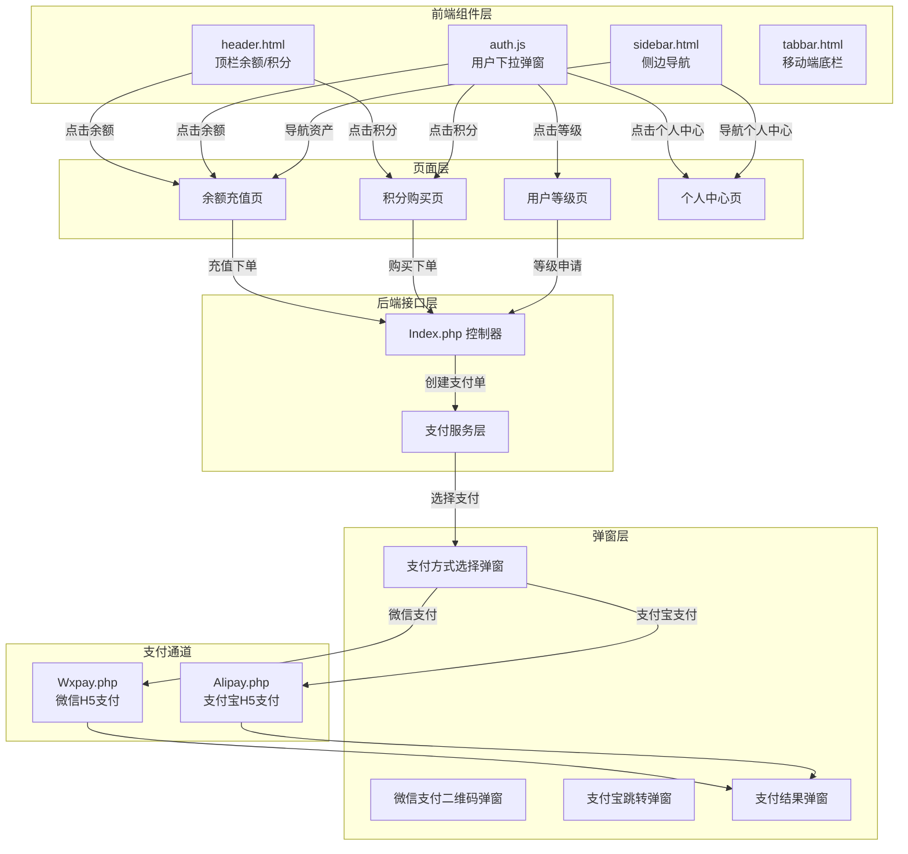
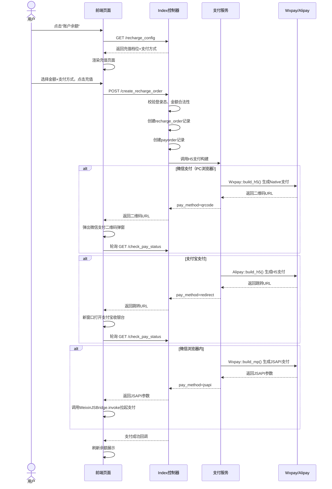
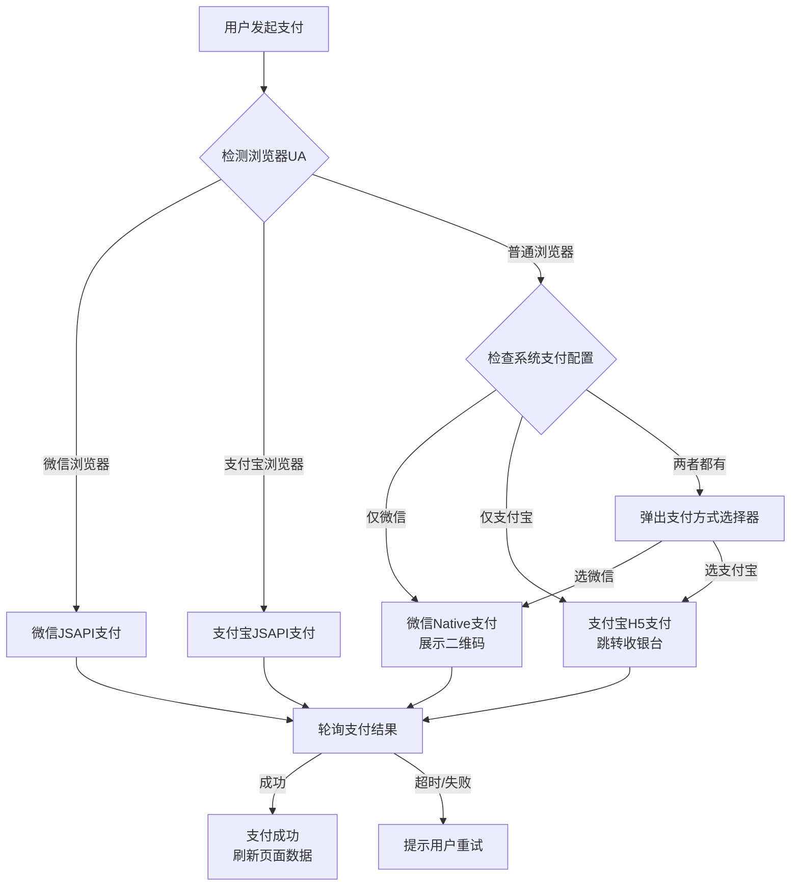
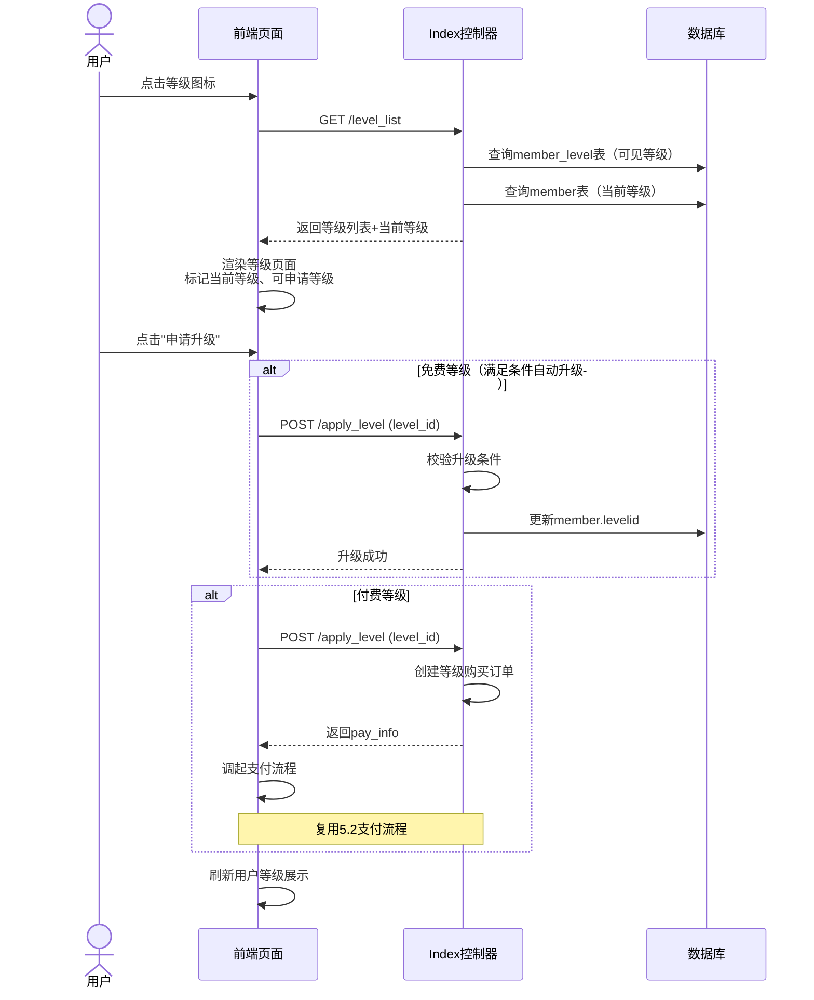
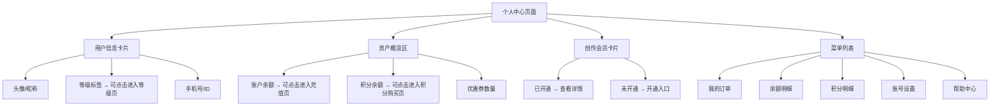
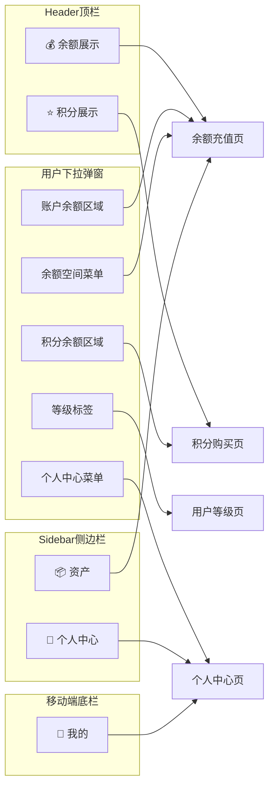
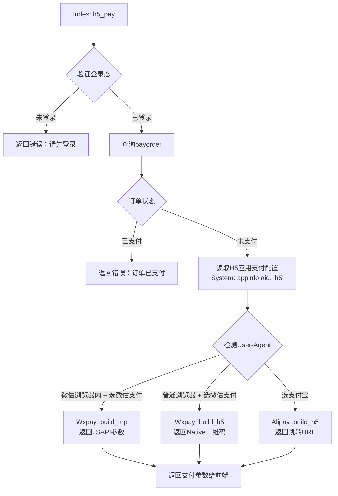

# H5用户交互流程与支付功能完善设计

## 1. 概述

本设计针对 index3（AI创作平台PC/H5官网）的用户交互流程进行完善，涵盖以下核心功能：

- **账户余额** → 点击进入余额充值页面
- **等级图标** → 点击进入用户等级页面，引导申请会员等级
- **积分余额** → 点击进入积分购买页面
- **个人中心** → 点击进入用户个人中心页面
- **支付功能** → 所有充值/订阅/购买操作调用H5系统配置的微信支付、支付宝支付

### 1.1 现状分析

| 组件 | 当前状态 | 问题 |
|------|---------|------|
| header.html 余额/积分摘要 | 仅静态展示 `¥0.00` / `0分` | 无点击交互，无跳转 |
| auth.js 用户下拉弹窗 | 余额/积分/等级仅展示 | 资产区域不可点击；"余额空间"标记为"即将上线" |
| sidebar.html 导航菜单 | "资产"/"个人中心"/"创作中心" | 全部 `href="javascript:;"` 无实际链接 |
| 支付功能 | buy_creative_member 创建订单后跳转 `/Backstage/index` | 未集成H5微信支付/支付宝支付，依赖后台管理页面 |
| api.js 接口层 | 仅有 checkLogin/logout/创作会员相关 | 缺少充值、积分购买、等级申请、支付相关接口 |
| Index.php 控制器 | 仅有 check_login/创作会员接口 | 缺少充值下单、积分购买、等级查询、H5支付调起 |

## 2. 架构

### 2.1 整体交互架构

### 2.2 页面路由规划

| 路由路径 | 控制器方法 | 页面描述 | 模板文件 |
|---------|-----------|---------|---------|
| `/?s=/index/recharge` | `Index::recharge()` | 余额充值页 | `index3/recharge.html` |
| `/?s=/index/member_level` | `Index::member_level()` | 用户等级页 | `index3/member_level.html` |
| `/?s=/index/score_shop` | `Index::score_shop()` | 积分购买页 | `index3/score_shop.html` |
| `/?s=/index/user_center` | `Index::user_center()` | 个人中心页 | `index3/user_center.html` |

## 3. API接口参考

### 3.1 新增接口清单

| 接口路径 | 方法 | 功能 | 认证要求 |
|---------|------|------|---------|
| `/?s=/index/recharge_config` | GET | 获取充值配置（档位、支付方式） | 需登录 |
| `/?s=/index/create_recharge_order` | POST | 创建余额充值订单 | 需登录 |
| `/?s=/index/score_config` | GET | 获取积分购买配置（档位、支付方式） | 需登录 |
| `/?s=/index/create_score_order` | POST | 创建积分购买订单 | 需登录 |
| `/?s=/index/level_list` | GET | 获取会员等级列表及当前等级 | 需登录 |
| `/?s=/index/apply_level` | POST | 申请/升级会员等级 | 需登录 |
| `/?s=/index/h5_pay` | POST | H5支付调起（微信/支付宝） | 需登录 |
| `/?s=/index/check_pay_status` | GET | 轮询支付结果 | 需登录 |
| `/?s=/index/user_center_data` | GET | 获取个人中心综合数据 | 需登录 |
| `/?s=/index/pay_config` | GET | 获取可用支付方式列表 | 需登录 |

### 3.2 接口契约详情

#### 3.2.1 获取充值配置

**请求**：`GET /?s=/index/recharge_config`

**响应**：

| 字段 | 类型 | 说明 |
|------|------|------|
| status | int | 1=成功 |
| data.levels | array | 充值档位列表 |
| data.levels[].money | float | 充值金额 |
| data.levels[].give_money | float | 赠送金额 |
| data.levels[].give_score | int | 赠送积分 |
| data.pay_types | array | 可用支付方式 |
| data.pay_types[].id | string | 支付方式标识（wxpay/alipay） |
| data.pay_types[].name | string | 支付方式名称 |
| data.custom_amount | bool | 是否允许自定义金额 |
| data.min_amount | float | 最低充值金额 |

#### 3.2.2 创建充值订单

**请求**：`POST /?s=/index/create_recharge_order`

| 参数 | 类型 | 必填 | 说明 |
|------|------|------|------|
| money | float | 是 | 充值金额 |
| pay_type | string | 是 | 支付方式（wxpay/alipay） |

**响应**：

| 字段 | 类型 | 说明 |
|------|------|------|
| status | int | 1=成功 |
| data.ordernum | string | 订单号 |
| data.pay_info | object | 支付调起参数 |
| data.pay_info.type | string | 支付类型（qrcode/redirect/jsapi） |
| data.pay_info.url | string | 支付跳转URL或二维码内容 |

#### 3.2.3 H5支付调起

**请求**：`POST /?s=/index/h5_pay`

| 参数 | 类型 | 必填 | 说明 |
|------|------|------|------|
| ordernum | string | 是 | 订单号 |
| pay_type | string | 是 | 支付方式（wxpay/alipay） |
| order_type | string | 是 | 订单类型（recharge/score/level/creative_member） |

**响应**：

| 字段 | 类型 | 说明 |
|------|------|------|
| status | int | 1=成功 |
| data.pay_method | string | 支付方式（qrcode/redirect/jsapi） |
| data.qrcode_url | string | 微信Native支付二维码链接（pay_method=qrcode时） |
| data.redirect_url | string | 支付宝H5跳转URL（pay_method=redirect时） |
| data.jsapi_params | object | JSAPI调起参数（在微信浏览器内时） |

#### 3.2.4 获取用户等级列表

**请求**：`GET /?s=/index/level_list`

**响应**：

| 字段 | 类型 | 说明 |
|------|------|------|
| status | int | 1=成功 |
| data.current_level | object | 当前等级信息 |
| data.current_level.id | int | 等级ID |
| data.current_level.name | string | 等级名称 |
| data.current_level.icon | string | 等级图标URL |
| data.levels | array | 全部可见等级列表 |
| data.levels[].id | int | 等级ID |
| data.levels[].name | string | 等级名称 |
| data.levels[].icon | string | 等级图标 |
| data.levels[].condition_text | string | 升级条件描述 |
| data.levels[].discount | float | 折扣率 |
| data.levels[].can_apply | int | 是否可申请（0=不可/1=可） |
| data.levels[].need_pay | int | 是否需要付费（0=免费/1=付费） |
| data.levels[].price | float | 付费金额（need_pay=1时） |

#### 3.2.5 获取个人中心数据

**请求**：`GET /?s=/index/user_center_data`

**响应**：

| 字段 | 类型 | 说明 |
|------|------|------|
| status | int | 1=成功 |
| data.userinfo | object | 用户基本信息 |
| data.userinfo.nickname | string | 昵称 |
| data.userinfo.headimg | string | 头像URL |
| data.userinfo.tel | string | 手机号（脱敏） |
| data.userinfo.realname | string | 真实姓名 |
| data.money | string | 账户余额 |
| data.score | int | 积分余额 |
| data.level_name | string | 等级名称 |
| data.level_icon | string | 等级图标 |
| data.creative_member | object | 创作会员状态 |
| data.order_stats | object | 订单统计 |
| data.order_stats.total | int | 总订单数 |
| data.order_stats.pending | int | 待支付数 |
| data.recent_generations | array | 最近生成记录 |

## 4. 数据模型

### 4.1 涉及的已有数据表

| 表名 | 用途 | 关键字段 |
|------|------|---------|
| member | 会员主表 | id, money, score, levelid, tel, nickname, headimg |
| member_level | 会员等级 | id, name, icon, sort, can_apply, need_pay, price |
| member_moneylog | 余额变更日志 | mid, money, after, remark, createtime |
| member_scorelog | 积分变更日志 | mid, score, after, remark, createtime |
| recharge_order | 充值订单 | mid, money, give_money, give_score, status, payorderid |
| payorder | 支付订单 | mid, ordernum, type, totalprice, paytypeid, status |
| admin_set | 系统配置 | aid, 各支付配置字段 |
| creative_member_subscription | 创作会员订阅 | mid, plan_id, status, expire_time |

### 4.2 系统配置依赖

H5支付需从 `admin_set` + `admin_setapp`（platform='h5'）读取以下配置：

| 配置项 | 说明 | 必要性 |
|--------|------|--------|
| wxpay_mchid | 微信商户号 | 微信支付必需 |
| wxpay_mchkey | 微信商户密钥 | 微信支付必需 |
| wxpay_type | 微信支付模式（0=普通/1=服务商等） | 微信支付必需 |
| ali_appid | 支付宝AppID | 支付宝必需 |
| ali_privatekey | 支付宝私钥 | 支付宝必需 |
| ali_publickey | 支付宝公钥 | 支付宝必需 |
| alipay_type | 支付宝支付模式 | 支付宝必需 |

## 5. 业务逻辑层

### 5.1 余额充值流程

### 5.2 支付方式智能选择策略

### 5.3 用户等级申请流程

### 5.4 积分购买流程

积分购买流程与余额充值流程结构一致，差异点如下：

| 对比项 | 余额充值 | 积分购买 |
|--------|---------|---------|
| 配置接口 | `recharge_config` | `score_config` |
| 下单接口 | `create_recharge_order` | `create_score_order` |
| 订单表 | recharge_order | score_order（或复用payorder） |
| 变更记录 | member_moneylog | member_scorelog |
| 赠送机制 | 充值送积分/余额 | 购买积分可赠送额外积分 |

### 5.5 个人中心页面结构

### 5.6 支付配置校验清单

在调起支付前，后端需进行以下系统配置完整性检查：

| 检查项 | 验证内容 | 失败提示 |
|--------|---------|---------|
| H5应用配置 | `admin_setapp` 中 platform='h5' 的记录存在 | "H5应用未配置" |
| 微信支付配置 | wxpay_mchid 和 wxpay_mchkey 非空 | "微信支付未配置" |
| 支付宝配置 | ali_appid / ali_privatekey / ali_publickey 非空 | "支付宝支付未配置" |
| 充值功能开关 | 系统设置中充值功能已开启 | "充值功能暂未开放" |
| 积分购买开关 | 系统设置中积分购买功能已开启 | "积分购买功能暂未开放" |
| 支付回调地址 | notify_url 可正常访问 | 日志记录，不阻断 |

## 6. 前端组件架构

### 6.1 需新增/修改的组件

| 文件 | 变更类型 | 变更内容 |
|------|---------|---------|
| `app/view/index3/public/header.html` | 修改 | 余额/积分元素添加可点击跳转 |
| `static/index3/js/auth.js` | 修改 | 下拉弹窗中余额/积分/等级/个人中心添加跳转；完善支付流程 |
| `static/index3/js/api.js` | 修改 | 新增充值、积分、等级、支付相关API封装 |
| `app/view/index3/public/sidebar.html` | 修改 | "资产"/"个人中心"导航链接指向实际页面 |
| `app/view/index3/recharge.html` | 新增 | 余额充值页面模板 |
| `app/view/index3/member_level.html` | 新增 | 用户等级页面模板 |
| `app/view/index3/score_shop.html` | 新增 | 积分购买页面模板 |
| `app/view/index3/user_center.html` | 新增 | 个人中心页面模板 |
| `static/index3/js/pay.js` | 新增 | 统一支付模块（弹窗、二维码、轮询） |
| `static/index3/css/pay.css` | 新增 | 支付弹窗样式 |

### 6.2 交互入口映射

### 6.3 支付弹窗组件设计

支付方式选择弹窗（pay.js）是一个全局复用的毛玻璃遮罩弹窗，结构如下：

| 区域 | 内容 |
|------|------|
| 标题栏 | "选择支付方式" + 关闭按钮 |
| 订单信息 | 订单类型名称 + 应付金额 |
| 支付选项 | 根据系统配置动态展示：微信支付图标+名称、支付宝支付图标+名称 |
| 确认按钮 | "确认支付 ¥XX.XX" |
| 状态区域 | 加载中/二维码/支付结果 |

弹窗内的微信支付二维码区域：当选择微信支付且在非微信浏览器时，展示Native支付二维码图片，下方提示"请使用微信扫码支付"，并启动轮询检测支付状态。

## 7. 后端接口层

### 7.1 Index.php 控制器新增方法

| 方法名 | 功能 | 关键逻辑 |
|--------|------|---------|
| `recharge()` | 渲染充值页面 | 检查登录态，获取系统充值配置，渲染index3/recharge模板 |
| `recharge_config()` | AJAX获取充值配置 | 从admin_set读取充值档位、赠送规则、可用支付方式 |
| `create_recharge_order()` | AJAX创建充值订单 | 校验金额，创建recharge_order和payorder记录 |
| `score_shop()` | 渲染积分购买页面 | 检查登录态，获取积分商品配置 |
| `score_config()` | AJAX获取积分配置 | 从admin_set读取积分购买档位 |
| `create_score_order()` | AJAX创建积分订单 | 校验数量，创建订单和payorder记录 |
| `member_level()` | 渲染等级页面 | 读取member_level表，展示所有可见等级 |
| `level_list()` | AJAX获取等级列表 | 返回等级列表和用户当前等级 |
| `apply_level()` | AJAX申请等级 | 校验条件，免费直接升级/付费创建订单 |
| `user_center()` | 渲染个人中心页面 | 聚合用户信息、资产、订单统计 |
| `user_center_data()` | AJAX获取个人中心数据 | 返回综合用户数据 |
| `h5_pay()` | AJAX统一支付入口 | 根据订单类型和支付方式调用对应支付通道 |
| `check_pay_status()` | AJAX轮询支付状态 | 查询payorder表状态 |
| `pay_config()` | AJAX获取可用支付方式 | 检测H5应用的微信/支付宝配置是否完整 |

### 7.2 H5支付调用链路

### 7.3 支付回调处理

支付回调沿用现有 `notify.php` → `Notify.php` 通道，由 `payorder.type` 字段区分订单类型（recharge/score/level 等），回调成功后：

| 订单类型 | 回调后业务处理 |
|---------|---------------|
| recharge | 增加会员余额(member.money)，记录member_moneylog |
| score | 增加会员积分(member.score)，记录member_scorelog |
| level | 更新会员等级(member.levelid)，记录升级日志 |
| creative_member | 激活订阅记录，发放创作积分 |

## 8. 测试策略

### 8.1 接口测试

| 测试场景 | 预期结果 |
|---------|---------|
| 未登录访问充值配置接口 | 返回 status=0，msg="请先登录" |
| 充值金额为0或负数 | 返回 status=0，msg="请输入正确的充值金额" |
| 充值金额低于系统最低限额 | 返回 status=0，msg="最低充值金额为X元" |
| 微信支付配置为空时选择微信支付 | 返回 status=0，msg="微信支付未配置" |
| 支付宝配置为空时选择支付宝 | 返回 status=0，msg="支付宝支付未配置" |
| 正常创建充值订单 | 返回 status=1，包含ordernum和pay_info |
| 轮询未支付订单 | 返回 status=1，data.paid=false |
| 轮询已支付订单 | 返回 status=1，data.paid=true |
| 申请已达到条件的免费等级 | 直接升级成功 |
| 申请未达到条件的等级 | 返回 status=0，提示不满足条件 |
| 申请付费等级 | 创建支付订单，返回支付参数 |

### 8.2 前端交互测试

| 测试场景 | 预期结果 |
|---------|---------|
| PC端点击header余额 | 跳转到充值页面 |
| PC端点击header积分 | 跳转到积分购买页面 |
| PC端下拉弹窗点击等级标签 | 跳转到用户等级页面 |
| PC端下拉弹窗点击个人中心 | 跳转到个人中心页面 |
| 移动端下拉弹窗点击余额 | 跳转到充值页面 |
| 充值页面选择微信支付 | PC浏览器弹出二维码；微信浏览器调起JSAPI |
| 充值页面选择支付宝 | 新窗口跳转到支付宝收银台 |
| 支付成功后返回 | 余额自动刷新，提示充值成功 |
| 侧边栏点击"资产" | 跳转到充值页面 |
| 侧边栏点击"个人中心" | 跳转到个人中心页面 |
| recharge | 增加会员余额(member.money)，记录member_moneylog |
| score | 增加会员积分(member.score)，记录member_scorelog |
| level | 更新会员等级(member.levelid)，记录升级日志 |
| creative_member | 激活订阅记录，发放创作积分 |

## 8. 测试策略

### 8.1 接口测试

| 测试场景 | 预期结果 |
|---------|---------|
| 未登录访问充值配置接口 | 返回 status=0，msg="请先登录" |
| 充值金额为0或负数 | 返回 status=0，msg="请输入正确的充值金额" |
| 充值金额低于系统最低限额 | 返回 status=0，msg="最低充值金额为X元" |
| 微信支付配置为空时选择微信支付 | 返回 status=0，msg="微信支付未配置" |
| 支付宝配置为空时选择支付宝 | 返回 status=0，msg="支付宝支付未配置" |
| 正常创建充值订单 | 返回 status=1，包含ordernum和pay_info |
| 轮询未支付订单 | 返回 status=1，data.paid=false |
| 轮询已支付订单 | 返回 status=1，data.paid=true |
| 申请已达到条件的免费等级 | 直接升级成功 |
| 申请未达到条件的等级 | 返回 status=0，提示不满足条件 |
| 申请付费等级 | 创建支付订单，返回支付参数 |

### 8.2 前端交互测试

| 测试场景 | 预期结果 |
|---------|---------|
| PC端点击header余额 | 跳转到充值页面 |
| PC端点击header积分 | 跳转到积分购买页面 |
| PC端下拉弹窗点击等级标签 | 跳转到用户等级页面 |
| PC端下拉弹窗点击个人中心 | 跳转到个人中心页面 |
| 移动端下拉弹窗点击余额 | 跳转到充值页面 |
| 充值页面选择微信支付 | PC浏览器弹出二维码；微信浏览器调起JSAPI |
| 充值页面选择支付宝 | 新窗口跳转到支付宝收银台 |
| 支付成功后返回 | 余额自动刷新，提示充值成功 |
| 侧边栏点击"资产" | 跳转到充值页面 |
| 侧边栏点击"个人中心" | 跳转到个人中心页面 |
