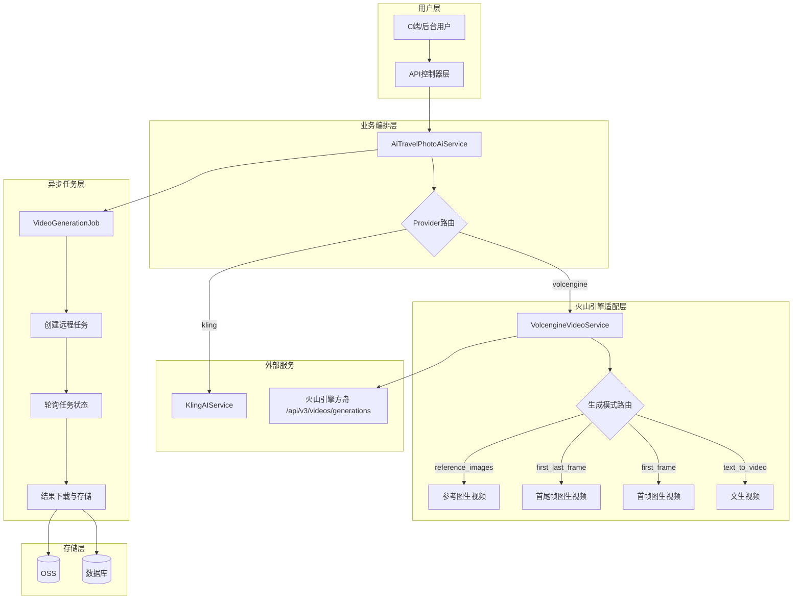
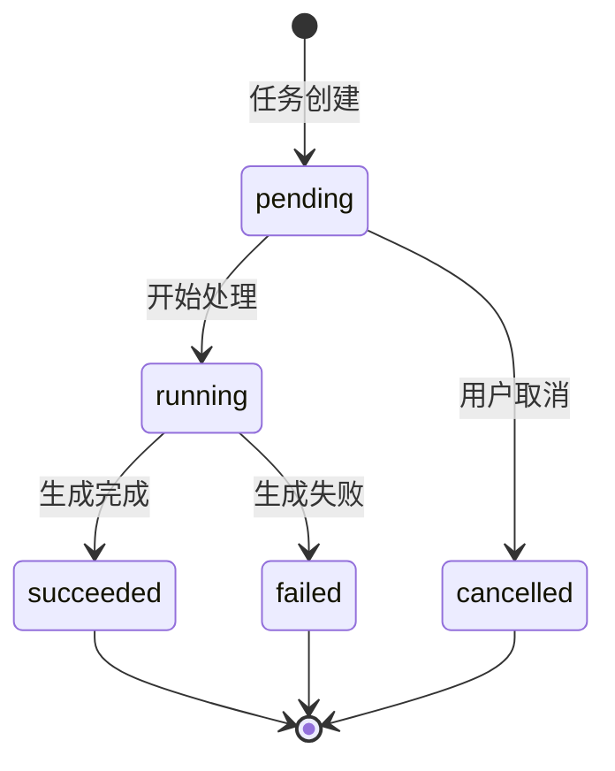
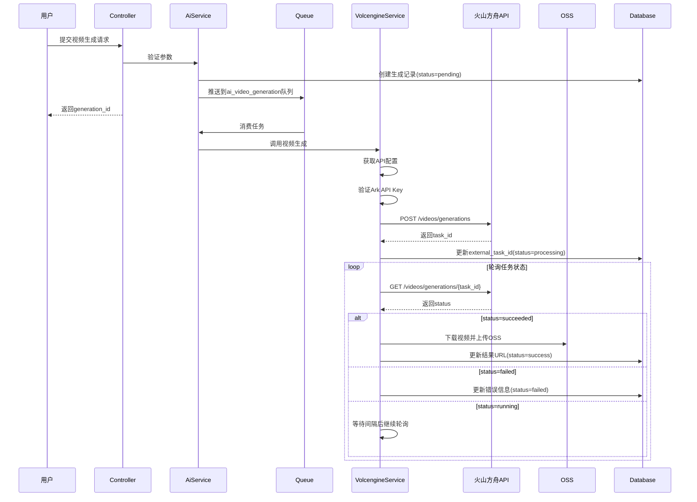
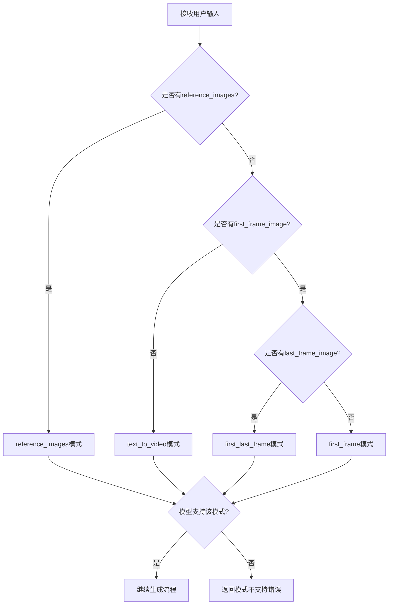
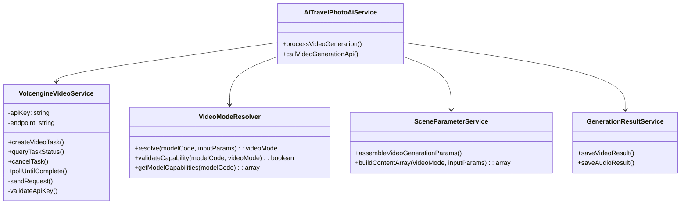

# 火山引擎方舟视频生成能力重构设计文档

## 1. 概述

### 1.1 背景与目标

当前系统的视频生成功能依赖可灵AI服务（KlingAIService），但存在以下问题：

| 问题类型 | 具体描述 |
|---------|---------|
| 服务依赖 | 视频生成强耦合可灵AI，缺少火山引擎方舟Seedance模型支持 |
| API未实现 | 数据库已预置doubao-seedance-2-0模型配置，但API调用逻辑为空 |
| 认证问题 | 火山方舟需使用Ark API Key（非IAM Access Key），当前未区分处理 |
| 任务管理 | 异步任务的创建、查询、轮询机制需要针对火山方舟API重新设计 |

**重构目标**：实现火山引擎方舟平台Seedance全系列视频生成模型的完整集成，覆盖Seedance 1.5 Pro、1.0 Pro、1.0 Pro Fast、1.0 Lite共5个模型代码（model_code），支持文生视频、首帧图生视频、首尾帧图生视频、参考图生视频及有声视频等多种生成模式。

### 1.2 涉及模型

| 模型代码 | 模型名称 | 支持的生成模式 |
|---------|---------|---------------|
| doubao-seedance-1-5-pro | Seedance 1.5 Pro | 文生视频、首帧图生视频、首尾帧图生视频、有声视频 |
| doubao-seedance-1-0-pro | Seedance 1.0 Pro | 文生视频、首帧图生视频、首尾帧图生视频 |
| doubao-seedance-1-0-pro-fast | Seedance 1.0 Pro Fast | 文生视频、首帧图生视频 |
| doubao-seedance-1-0-lite-t2v | Seedance 1.0 Lite (文生) | 文生视频 |
| doubao-seedance-1-0-lite-i2v | Seedance 1.0 Lite (图生) | 首帧图生视频、首尾帧图生视频、参考图生视频(1-4张) |

### 1.3 视频生成模式定义

| 生成模式 | 模式标识 | 必需输入 | 可选输入 | 说明 |
|---------|---------|---------|---------|------|
| 文生视频 | text_to_video | prompt | duration, resolution等 | 纯文本描述生成视频 |
| 首帧图生视频 | first_frame | first_frame_image, prompt(可选) | duration等 | 首帧图片驱动生成 |
| 首尾帧图生视频 | first_last_frame | first_frame_image, last_frame_image, prompt(可选) | duration等 | 首帧+尾帧过渡视频 |
| 参考图生视频 | reference_images | reference_images(1-4张), prompt(可选) | duration等 | 参考图片驱动生成（仅1.0 Lite i2v） |
| 有声视频 | with_audio | 同上述任一模式 | with_audio=true | 1.5 Pro独有，输出包含音频的视频 |

---

## 2. 架构设计

### 2.1 整体架构

### 2.2 服务分层

| 层级 | 组件 | 职责 |
|------|------|------|
| 控制器层 | ApiAiTravelPhoto / AdminAivideo | 接收请求、参数验证、返回响应 |
| 业务服务层 | AiTravelPhotoAiService | 任务编排、Provider路由、结果处理 |
| 适配服务层 | VolcengineVideoService | 火山引擎全系列模型API调用封装 |
| 能力路由层 | VideoModeResolver | 根据model_code+用户输入推断生成模式 |
| 任务队列层 | VideoGenerationJob | 异步任务执行、状态轮询 |
| 参数服务层 | SceneParameterService | 按生成模式组装请求参数 |
| 结果服务层 | GenerationResultService | 视频/音频结果存储与格式化 |

---

## 3. API端点设计

### 3.1 火山方舟视频生成API规范

**API基础信息**

| 项目 | 说明 |
|------|------|
| 端点URL | `https://ark.cn-beijing.volces.com/api/v3/videos/generations` |
| 请求方法 | POST |
| 认证方式 | Bearer Token (Ark API Key) |
| Content-Type | application/json |
| 任务模式 | 异步 (async) |

### 3.2 创建视频任务接口

**请求参数（顶层）**

| 参数名 | 类型 | 必填 | 说明 |
|--------|------|------|------|
| model | string | 是 | 模型代码，如 doubao-seedance-1-5-pro |
| content | array | 是 | 多模态内容数组，按生成模式组装（见下方规则） |
| with_audio | boolean | 否 | 是否生成有声视频（仅Seedance 1.5 Pro支持） |
| duration | integer | 否 | 视频时长(秒) |
| resolution | string | 否 | 分辨率，如720p/1080p |
| seed | integer | 否 | 随机种子，用于结果复现 |

**content数组组装规则（按生成模式）**

| 生成模式 | content数组元素构成 |
|---------|--------------------|
| 文生视频 | [text元素] |
| 首帧图生视频 | [first_frame_image元素, text元素(可选)] |
| 首尾帧图生视频 | [first_frame_image元素, last_frame_image元素, text元素(可选)] |
| 参考图生视频 | [image_url元素×1-4张, text元素(可选)] |

每个content元素包含 type 字段标识类型，以及对应的数据字段（text字段承载提示词，image_url字段承载图像URL）。

**响应结构**

| 字段 | 类型 | 说明 |
|------|------|------|
| id | string | 任务唯一标识符 |
| model | string | 使用的模型代码 |
| status | string | 任务状态（pending/running/succeeded/failed） |
| content | array | 成功时包含视频URL，有声视频同时包含音频URL |
| created_at | integer | 创建时间戳 |
| error | object | 失败时的错误信息（code + message） |

### 3.3 查询任务状态接口

**请求方式**：GET `/api/v3/videos/generations/{task_id}`

**任务状态流转**

**状态码对照**

| 状态值 | 含义 | 系统处理 |
|--------|------|---------|
| pending | 等待处理 | 继续轮询 |
| running | 生成中 | 继续轮询 |
| succeeded | 成功 | 获取结果URL，保存到OSS |
| failed | 失败 | 记录错误信息，更新任务状态 |
| cancelled | 已取消 | 更新任务状态 |

---

## 4. 数据模型

### 4.1 视频生成记录扩展字段

在 `ddwx_ai_travel_photo_generation` 表增加字段：

| 字段名 | 类型 | 说明 |
|--------|------|------|
| external_task_id | VARCHAR(128) | 火山方舟返回的任务ID |
| provider | VARCHAR(32) | 服务提供商（volcengine / kling） |
| model_code | VARCHAR(64) | 实际使用的模型代码 |
| video_mode | VARCHAR(32) | 生成模式（text_to_video / first_frame / first_last_frame / reference_images） |
| with_audio | TINYINT(1) | 是否有声视频，默认0 |
| video_duration | INT | 请求的视频时长（秒） |
| video_resolution | VARCHAR(16) | 请求的分辨率 |
| api_request | TEXT | 发送的完整API请求JSON |
| api_response | TEXT | 收到的API响应JSON |
| result_video_url | VARCHAR(512) | 生成结果视频URL |
| result_audio_url | VARCHAR(512) | 有声视频的音频URL |

### 4.2 模型注册表（ddwx_model_info）

每个Seedance模型需在模型注册表中维护，关键字段映射：

| 模型代码 | endpoint_url | task_type | capability_tags |
|---------|-------------|-----------|----------------|
| doubao-seedance-1-5-pro | /api/v3/videos/generations | async | 文生视频, 首帧图生视频, 首尾帧图生视频, 有声视频 |
| doubao-seedance-1-0-pro | /api/v3/videos/generations | async | 文生视频, 首帧图生视频, 首尾帧图生视频 |
| doubao-seedance-1-0-pro-fast | /api/v3/videos/generations | async | 文生视频, 首帧图生视频 |
| doubao-seedance-1-0-lite-t2v | /api/v3/videos/generations | async | 文生视频 |
| doubao-seedance-1-0-lite-i2v | /api/v3/videos/generations | async | 首帧图生视频, 首尾帧图生视频, 参考图生视频 |

---

## 5. 业务逻辑设计

### 5.1 视频生成流程

### 5.2 API Key验证规则

火山方舟Ark API Key的验证逻辑：

| 验证项 | 规则 | 错误处理 |
|--------|------|---------|
| 格式检查 | 不以 "AKLT" 开头 | 拒绝使用IAM Access Key |
| 长度检查 | UUID格式，约36字符 | 提示Key格式不正确 |
| 有效性 | 调用前无法验证 | 捕获401错误提示更换Key |

### 5.3 Provider路由策略

根据API配置中的provider字段路由到对应服务：

| Provider | 服务类 | API端点 | 认证方式 |
|----------|--------|---------|---------|
| volcengine | VolcengineVideoService | ark.cn-beijing.volces.com | Bearer Token |
| kling | KlingAIService | api-beijing.klingai.com | JWT Token |

### 5.4 生成模式自动推断

VideoModeResolver根据用户输入自动推断生成模式：

### 5.5 模型-模式兼容性矩阵

| 模型代码 | text_to_video | first_frame | first_last_frame | reference_images | with_audio |
|---------|:---:|:---:|:---:|:---:|:---:|
| doubao-seedance-1-5-pro | ✓ | ✓ | ✓ | ✗ | ✓ |
| doubao-seedance-1-0-pro | ✓ | ✓ | ✓ | ✗ | ✗ |
| doubao-seedance-1-0-pro-fast | ✓ | ✓ | ✗ | ✗ | ✗ |
| doubao-seedance-1-0-lite-t2v | ✓ | ✗ | ✗ | ✗ | ✗ |
| doubao-seedance-1-0-lite-i2v | ✗ | ✓ | ✓ | ✓ | ✗ |

---

## 6. 服务类设计

### 6.1 VolcengineVideoService 类结构

**类职责**

| 方法 | 功能 | 返回 |
|------|------|------|
| createVideoTask | 创建视频生成任务 | task_id |
| queryTaskStatus | 查询任务状态 | status, video_url |
| cancelTask | 取消任务 | boolean |
| pollUntilComplete | 轮询直到完成 | result array |

**依赖关系**

### 6.2 参数转换映射

系统内部参数到火山方舟API参数的映射：

| 系统参数 | content元素type | 转换规则 |
|---------|----------------|--------|
| prompt | text | 组装为text类型content元素 |
| image_url (首帧) | first_frame_image | 组装为首帧图像content元素 |
| last_frame_image_url | last_frame_image | 组装为尾帧图像content元素 |
| reference_images[] | image_url | 每张图组装为image_url类型content元素，最多4张 |
| with_audio | 顶层参数 | 布尔值，仅doubao-seedance-1-5-pro时有效 |
| duration | 顶层参数 | 范围校验，按模型能力限定 |
| resolution | 顶层参数 | 枚举校验 720p/1080p |

---

## 7. 错误处理设计

### 7.1 错误码定义

| 错误码 | 错误类型 | 描述 | 处理策略 |
|--------|---------|------|--------|
| LOCAL_001 | ModeNotSupportedError | 所选模型不支持该生成模式 | 本地拦截，提示用户切换模型或模式 |
| LOCAL_002 | AudioNotSupportedError | 非1.5 Pro模型不支持有声视频 | 本地拦截，提示仅1.5 Pro支持 |
| 401 | AuthenticationError | API Key无效或格式错误 | 检查是否误用IAM Key（AKLT开头） |
| 429 | RateLimitError | 请求频率超限 | 退避重试（指数退避） |
| 500 | InternalError | 服务端错误 | 记录日志，标记失败 |
| TIMEOUT | TimeoutError | 轮询超时（>600秒） | 任务标记为超时失败 |

### 7.2 重试机制

| 场景 | 重试次数 | 重试间隔 | 退避策略 |
|------|---------|---------|---------|
| 网络超时 | 3次 | 5秒 | 固定间隔 |
| 429限流 | 5次 | 30秒 | 指数退避 |
| 任务轮询 | 60次 | 10秒 | 固定间隔（总10分钟） |

---

## 8. 配置管理

### 8.1 服务配置项

在 `config/aivideo.php` 增加火山引擎配置：

| 配置项 | 说明 | 默认值 |
|--------|------|--------|
| volcengine.api_url | API基础地址 | https://ark.cn-beijing.volces.com |
| volcengine.videos_endpoint | 视频生成端点 | /api/v3/videos/generations |
| volcengine.timeout | 请求超时时间 | 30秒 |
| volcengine.poll_interval | 轮询间隔 | 10秒 |
| volcengine.max_poll_time | 最大轮询时间 | 600秒 |

### 8.2 模型能力配置

| 模型代码 | 文生视频 | 首帧 | 首尾帧 | 参考图 | 有声 |
|---------|:---:|:---:|:---:|:---:|:---:|
| doubao-seedance-1-5-pro | ✓ | ✓ | ✓ | ✗ | ✓ |
| doubao-seedance-1-0-pro | ✓ | ✓ | ✓ | ✗ | ✗ |
| doubao-seedance-1-0-pro-fast | ✓ | ✓ | ✗ | ✗ | ✗ |
| doubao-seedance-1-0-lite-t2v | ✓ | ✗ | ✗ | ✗ | ✗ |
| doubao-seedance-1-0-lite-i2v | ✗ | ✓ | ✓ | ✓ | ✗ |

---

## 9. 安全设计

| 安全措施 | 说明 |
|---------|------|
| Ark API Key加密存储 | 数据库中使用AES加密，不以明文存储 |
| Key格式预检 | 调用前检查，拒绝AKLT开头的IAM Access Key |
| HTTPS强制 | 所有火山方舟API通信走HTTPS |
| 商家数据隔离 | 按bid查询API配置，商家间完全隔离 |
| 频率限制 | 遵守IPM 500次/分钟上限，单商家限100次/分钟 |
| 并发控制 | 单商家最多5个视频生成任务并行 |

---

## 10. 测试策略

### 10.1 单元测试

| 测试项 | 测试内容 |
|--------|--------|
| content数组组装 | SceneParameterService.buildContentArray() 按5种模式分别验证content数组结构 |
| 模式推断 | VideoModeResolver.resolve() 覆盖全部模型×输入参数组合 |
| 能力校验 | VideoModeResolver.validateCapability() 确保不支持的模型-模式组合被拦截 |
| Key验证 | VolcengineVideoService.validateApiKey() 拒绝AKLT开头Key |
| 状态映射 | 任务状态到系统状态的转换（pending/running/succeeded/failed） |

### 10.2 集成测试

| 测试场景 | 模型 | 预期结果 |
|---------|------|--------|
| 文生视频 | doubao-seedance-1-5-pro | 提交prompt，获得视频URL + 音频URL |
| 首帧图生视频 | doubao-seedance-1-0-pro | 提交首帧图像+prompt，获得视频URL |
| 首尾帧图生视频 | doubao-seedance-1-0-pro | 提交首尾帧图像，获得过渡视频URL |
| 参考图生视频 | doubao-seedance-1-0-lite-i2v | 提交1-4张参考图，获得视频URL |
| 有声视频 | doubao-seedance-1-5-pro | with_audio=true，结果同时包含视频和音频 |
| 模式不支持拦截 | doubao-seedance-1-0-pro-fast | 提交首尾帧请求，返回LOCAL_001错误 |
| 任务超时处理 | 任意模型 | 超过600秒标记为失败 |
| API Key错误 | 任意模型 | 捕获401错误，提示检查Ark API Key |

---

## 11. 变更影响分析

### 11.1 文件变更清单

| 文件路径 | 变更类型 | 变更内容 |
|---------|---------|--------|
| app/service/VolcengineVideoService.php | 新增 | 火山引擎视频服务类，封装全系列Seedance API调用 |
| app/service/VideoModeResolver.php | 新增 | 视频生成模式推断与模型能力校验服务 |
| app/service/AiTravelPhotoAiService.php | 修改 | 增加volcengine路由分支，集成VideoModeResolver |
| app/service/SceneParameterService.php | 修改 | 增加buildContentArray方法，按模式组装content数组 |
| app/common/Aivideo.php | 修改 | processTask增加volcengine Provider分支处理 |
| app/job/VideoGenerationJob.php | 修改 | 集成VolcengineVideoService调用 |
| config/aivideo.php | 修改 | 增加火山引擎配置节及5个模型能力注册 |

### 11.2 数据库变更

| 表名 | 变更类型 | 变更内容 |
|------|---------|---------|
| ddwx_ai_travel_photo_generation | ALTER | 增加provider、model_code等字段 |
| ddwx_api_config | 数据 | 确保火山引擎API配置记录存在 |

### 11.3 兼容性

| 项目 | 兼容性说明 |
|------|-----------|
| 现有可灵AI任务 | 通过provider字段区分，不影响现有任务 |
| 现有API接口 | 接口签名不变，内部路由逻辑调整 |
| 队列消费者 | 复用现有VideoGenerationJob，增加provider判断 |
