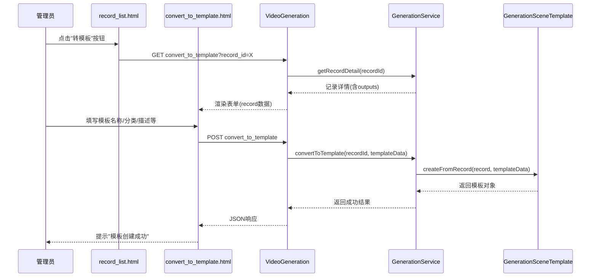
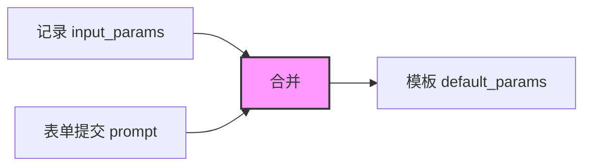
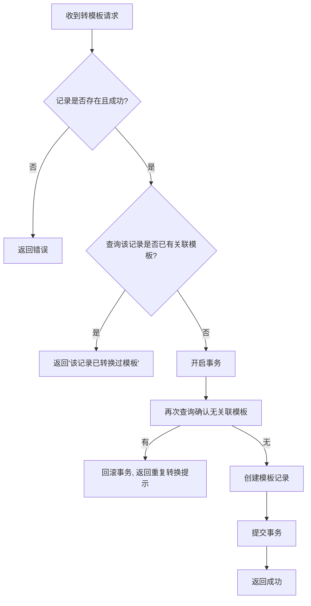

# 视频生成记录-转模板功能优化设计

## 1. 概述

本次优化针对视频生成记录中"转模板"功能的三个改进点：
- 转模板时需要携带并展示原始提示词（prompt），支持编辑后保存到模板
- 封面图直接使用生成成品的输出URL（output_url），不再优先使用缩略图
- 强化每条记录仅允许执行一次模板转换的限制

涉及模块：视频生成控制器（VideoGeneration）、照片生成控制器（PhotoGeneration）、通用生成服务（GenerationService）、场景模板模型（GenerationSceneTemplate）、转模板表单页面（convert_to_template.html）。

## 2. 架构

### 2.1 现有转模板流程

### 2.2 现有问题分析

| 序号 | 问题描述 | 现状 | 影响 |
|------|---------|------|------|
| 1 | 转模板时无提示词字段 | 表单仅含模板名称、分类、封面图、描述、是否公开 | 创建的模板缺少关键的提示词信息，使用模板时无法自动填充prompt |
| 2 | 封面图使用缩略图 | `createFromRecord`方法中优先取`thumbnail_url`，再回退到`output_url` | 封面图可能是低质量缩略图，不够清晰 |
| 3 | 单次转换限制已实现但可加固 | 后端通过查询`source_record_id`判断；前端通过`is_template_converted`字段控制按钮状态 | 基本可用，但可在后端增加防并发保护 |

## 3. 业务逻辑层设计

### 3.1 优化点一：转模板携带提示词

#### 3.1.1 数据流设计

提示词（prompt）存储在生成记录的 `input_params` JSON字段中，键名为 `prompt`。转模板时需要：

1. **表单页渲染阶段**：控制器从记录的 `input_params` 中提取 `prompt` 值，传递给表单页面展示
2. **表单页展示**：在表单中增加"提示词"文本域，预填来源记录的 prompt 值，允许用户编辑
3. **提交保存阶段**：将表单中提交的 prompt 值写入模板的 `default_params` JSON字段中

#### 3.1.2 表单页面变更

在转模板表单（video_generation/convert_to_template.html 和 photo_generation/convert_to_template.html）中，在"来源记录"与"模板名称"之间插入提示词表单项：

| 表单项 | 字段名 | 类型 | 必填 | 默认值 | 说明 |
|--------|--------|------|------|--------|------|
| 提示词 | prompt | textarea（多行文本） | 否 | 来源记录 input_params.prompt | 预填原始提示词，可编辑修改 |

#### 3.1.3 控制器变更

VideoGeneration 和 PhotoGeneration 控制器的 `convert_to_template` 方法（GET请求分支）需要从记录的 `input_params` 中提取 prompt，赋值给视图变量，供表单预填。

#### 3.1.4 服务层变更

GenerationService 的 `convertToTemplate` 方法需在接收 `templateData` 时，将提交的 prompt 字段合并到 `default_params` 中。

#### 3.1.5 模型层变更

GenerationSceneTemplate 的 `createFromRecord` 方法保存 `default_params` 时，需确保 prompt 字段被正确写入。当前逻辑已将 `record->input_params` 作为默认值赋给 `default_params`，需要额外支持用户在表单中编辑后覆盖 prompt 值。

数据合并策略：以记录原始 `input_params` 为基础，用表单提交的 prompt 值覆盖其中的 prompt 键。

### 3.2 优化点二：封面图使用成品URL

#### 3.2.1 变更位置

GenerationSceneTemplate 模型的 `createFromRecord` 方法中封面图获取逻辑。

#### 3.2.2 变更前后对比

| 阶段 | 封面图获取逻辑 |
|------|---------------|
| 变更前 | 优先使用 `thumbnail_url`，若为空则回退到 `output_url` |
| 变更后 | 直接使用 `output_url` 作为封面图 |

#### 3.2.3 影响范围

此变更同时影响视频生成和照片生成两个模块的转模板功能，因为它们共用 `createFromRecord` 方法。

转模板表单页面中封面图的隐藏字段和预览图也应保持一致，使用 `output_url` 作为默认值。

### 3.3 优化点三：每条记录仅转一次模板

#### 3.3.1 现有实现状态

| 层级 | 已有机制 | 状态 |
|------|---------|------|
| 后端服务层 | `convertToTemplate` 中通过 `source_record_id` 查重 | ✅ 已实现 |
| 前端列表页 | 通过 `is_template_converted` 字段判断，已转换则显示灰色"已转模板"按钮 | ✅ 已实现 |
| 前端表单页 | 无额外防护 | ⚠️ 可加固 |

#### 3.3.2 加固方案

1. **后端控制器层（GET请求分支）**：在渲染转模板表单前，增加前置检查——若该记录已关联模板，直接返回错误提示并阻止表单渲染
2. **后端服务层防并发**：在 `convertToTemplate` 方法的重复检查与模板创建之间，考虑使用数据库唯一索引或事务锁防止并发请求导致重复创建

#### 3.3.3 防并发保护流程

## 4. 数据模型

### 4.1 涉及数据表

| 表名 | 用途 | 关键字段 |
|------|------|---------|
| ddwx_generation_record | 生成记录 | id, input_params(JSON, 含prompt), status |
| ddwx_generation_output | 生成输出 | record_id, output_url, thumbnail_url |
| ddwx_generation_scene_template | 场景模板 | source_record_id, default_params(JSON), cover_image |

### 4.2 数据表变更

本次优化**无需新增数据表字段**。所有改动均在现有字段的数据流转逻辑层面：

| 字段 | 所在表 | 变更说明 |
|------|--------|---------|
| default_params | generation_scene_template | 转模板时确保包含 prompt 键值 |
| cover_image | generation_scene_template | 数据来源由 thumbnail_url 改为 output_url |

### 4.3 default_params 字段结构

转模板后 default_params 应包含的关键参数示例：

| 参数键 | 来源 | 说明 |
|--------|------|------|
| prompt | 表单提交值（默认为来源记录的input_params.prompt） | 提示词，用户可编辑 |
| 其他参数 | 来源记录 input_params 中的其余键值 | 如 size、duration、model 等保持原值 |

## 5. API端点

### 5.1 GET /VideoGeneration/convert_to_template

**变更说明**：视图数据中增加提取的 prompt 值；增加前置检查阻止已转换记录的表单渲染。

请求参数：

| 参数 | 类型 | 必填 | 说明 |
|------|------|------|------|
| record_id | int | 是 | 生成记录ID |

响应行为变更：

| 场景 | 变更前 | 变更后 |
|------|--------|--------|
| 记录已转换过模板 | 正常渲染表单（用户提交时才报错） | 直接返回错误提示，不渲染表单 |
| 正常渲染 | 视图数据含 record 对象 | 视图数据额外传递 prompt 变量（从 record.input_params.prompt 提取） |

### 5.2 POST /VideoGeneration/convert_to_template

**变更说明**：接收新增的 prompt 字段，合并到 default_params。

请求参数变更：

| 参数 | 类型 | 必填 | 变更 | 说明 |
|------|------|------|------|------|
| record_id | int | 是 | 无变更 | 记录ID |
| template_name | string | 是 | 无变更 | 模板名称 |
| prompt | string | 否 | **新增** | 提示词，预填来源记录值 |
| category | string | 否 | 无变更 | 分类标签 |
| cover_image | string | 否 | 无变更 | 封面图URL |
| description | string | 否 | 无变更 | 模板描述 |
| is_public | int | 否 | 无变更 | 0=私有 1=公开 |

## 6. 组件变更清单

### 6.1 前端页面

| 文件 | 变更内容 |
|------|---------|
| app/view/video_generation/convert_to_template.html | 新增提示词textarea表单项（预填record的prompt值）；封面图字段取output_url |
| app/view/photo_generation/convert_to_template.html | 同上，保持两个模块表单一致 |

### 6.2 后端控制器

| 文件 | 变更内容 |
|------|---------|
| app/controller/VideoGeneration.php | convert_to_template方法GET分支：提取prompt传给视图，增加已转换检查；POST分支：接收prompt字段 |
| app/controller/PhotoGeneration.php | 同上 |

### 6.3 服务层

| 文件 | 变更内容 |
|------|---------|
| app/service/GenerationService.php | convertToTemplate方法：将prompt合并到default_params中；增加事务保护 |

### 6.4 模型层

| 文件 | 变更内容 |
|------|---------|
| app/model/GenerationSceneTemplate.php | createFromRecord方法：封面图获取逻辑改为直接使用output_url；default_params合并逻辑支持prompt覆盖 |

## 7. 测试策略

### 7.1 单元测试

| 测试场景 | 验证点 | 预期结果 |
|---------|--------|---------|
| 转模板携带提示词 | 创建模板后检查 default_params 中是否包含 prompt 字段 | default_params.prompt 等于表单提交值 |
| 提示词为空时转模板 | 不填写prompt直接提交 | 使用记录原始input_params中的prompt值 |
| 编辑提示词后转模板 | 修改预填的prompt后提交 | default_params.prompt 为修改后的值 |
| 封面图使用成品URL | 创建模板后检查 cover_image 字段值 | 等于生成输出的 output_url，而非 thumbnail_url |
| 首次转换 | 状态为成功且未转换的记录执行转模板 | 成功创建模板，记录关联正确 |
| 重复转换-后端拦截 | 已转换的记录再次提交转模板请求 | 返回错误提示"该记录已经转换过模板" |
| 重复转换-前端拦截 | 已转换记录在列表页的按钮状态 | 显示灰色"已转模板"按钮，不可点击 |
| 重复转换-表单页拦截 | 直接通过URL访问已转换记录的转模板页面 | 返回错误提示，不渲染表单 |
| 并发转换保护 | 模拟两个并发请求同时转换同一条记录 | 仅一个成功，另一个返回重复提示 |
