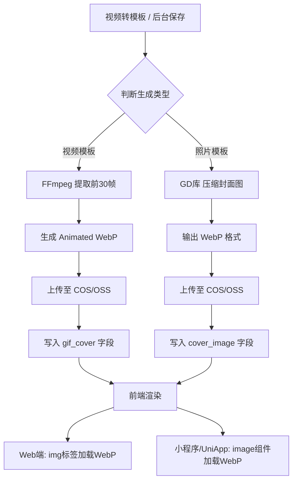
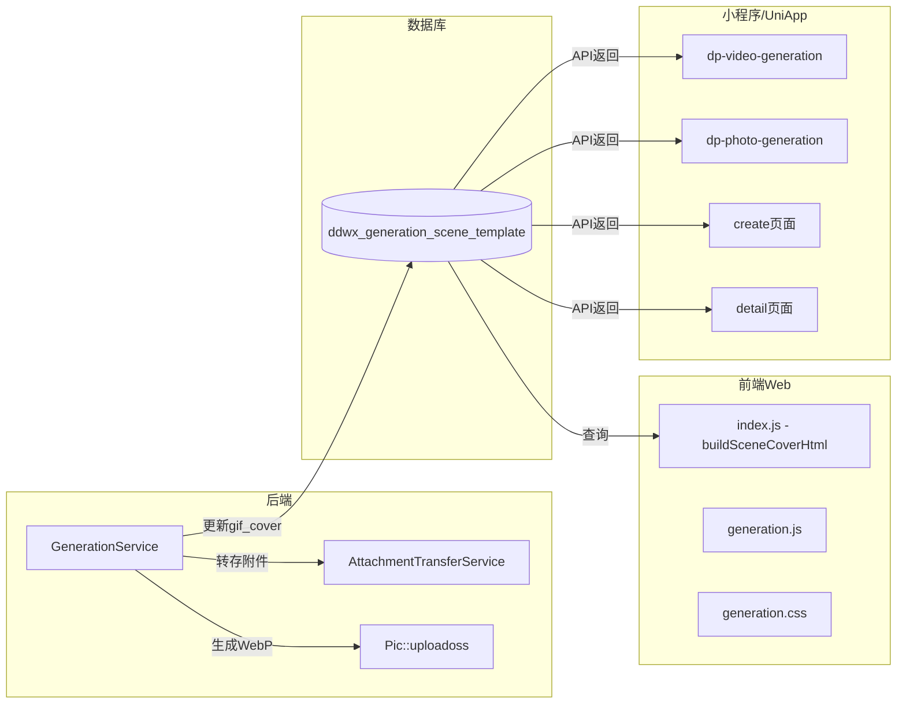
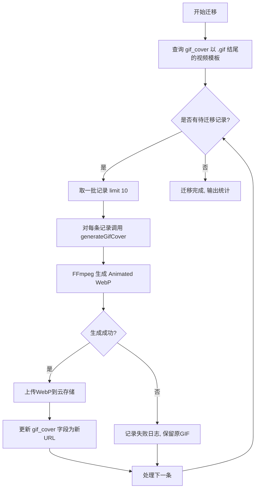

# 视频场景模板封面 WebP 格式优化设计

## 1. 概述

当前视频场景模板的封面预览图使用 GIF 格式（`gif_cover` 字段），存在文件体积大（30帧GIF可达数MB）、色彩仅256色、加载慢等问题。本方案将视频模板封面的 **动态预览图由 GIF 转换为 Animated WebP**，同时将照片类型封面的压缩输出也统一为 WebP 格式，以提升加载速度、降低带宽消耗并改善画质。

### 1.1 优化目标

| 维度 | 当前状态 | 优化后 |
|------|---------|--------|
| 视频模板动态预览 | GIF，300px宽，~1-5MB | Animated WebP，300px宽，预计减小60-80% |
| 照片模板封面压缩 | JPEG，800px宽，质量85 | WebP，800px宽，质量85，预计减小25-35% |
| 色彩深度 | GIF仅256色 | WebP支持24位真彩色 |
| 数据库字段 | `gif_cover`（仅存GIF） | 复用 `gif_cover` 字段存储WebP URL |

### 1.2 影响范围

涉及后端服务、前端Web页面、UniApp/小程序组件、数据库存量数据迁移四个层面。

## 2. 架构

### 2.1 整体数据流



### 2.2 组件影响关系



## 3. 后端业务逻辑

### 3.1 动态封面生成（GIF → Animated WebP）

**所在服务**：`GenerationService::generateGifCover()`

**当前行为**：使用 FFmpeg 的 palettegen + paletteuse 方案生成 GIF，输出文件名为 `gif_cover_*.gif`。

**优化策略**：

将 FFmpeg 输出格式从 GIF 改为 WebP。FFmpeg 原生支持 `libwebp_anim` 编码器生成 Animated WebP。

| 参数 | 当前值（GIF） | 优化后值（WebP） |
|------|-------------|-----------------|
| 输出格式 | GIF（palettegen + paletteuse） | WebP（libwebp_anim） |
| 帧率 | 10fps | 10fps（不变） |
| 帧数 | 30帧 | 30帧（不变） |
| 输出宽度 | 300px | 300px（不变） |
| 质量参数 | max_colors=128, dither=bayer | `-quality 75 -lossless 0` |
| 循环 | `-loop 0` | `-loop 0` |
| 文件后缀 | `.gif` | `.webp` |
| 临时文件名 | `cover_*.gif` | `cover_*.webp` |
| 上传后文件名 | `gif_cover_*.gif` | `webp_cover_*.webp` |

**FFmpeg 命令变更逻辑**（抽象描述）：
- 移除调色板生成步骤（palettegen），WebP 不需要
- 直接使用 FFmpeg 的 `fps + scale + libwebp_anim` 滤镜链，输出 Animated WebP
- 保持下载视频 → 提取帧 → 编码 → 上传 → 清理的整体流程不变

**容错机制**：
- 若 FFmpeg 不支持 `libwebp_anim` 编码器，回退到当前 GIF 生成方案
- 在方法入口通过执行 `ffmpeg -encoders` 检测 `libwebp_anim` 是否可用
- 回退时保留完整的 GIF 生成路径，日志标记为 warning

### 3.2 照片封面压缩（JPEG → WebP）

**所在服务**：`GenerationService::compressCoverImage()`

**当前行为**：使用 GD 库将超过 800px 宽的封面缩放后输出为 JPEG（质量85）。

**优化策略**：

| 维度 | 当前 | 优化后 |
|------|------|--------|
| 输出函数 | `imagejpeg($thumbnail, $path, 85)` | 改用 `imagewebp($thumbnail, $path, 85)` |
| 文件后缀 | `.jpg` | `.webp` |
| GD函数依赖 | `imagejpeg` | `imagewebp`（需PHP 5.5+且编译时启用WebP支持） |

**前置检测**：
- 调用前检查 `function_exists('imagewebp')` 是否为 true
- 若不支持，回退为当前 JPEG 压缩方案

### 3.3 批量迁移已有数据

**所在服务**：`GenerationService::batchGenerateGifCovers()`

**优化策略**：

- 复用现有批量生成方法的框架
- 查询条件调整：查找 `gif_cover` 字段值以 `.gif` 结尾的记录，重新生成 WebP 版本
- 新增批量方法 `batchMigrateToWebpCovers()`，逐条调用优化后的 `generateGifCover()`
- 生成成功后更新 `gif_cover` 字段为新的 WebP URL
- 旧 GIF 文件可保留，通过定时任务异步清理

### 3.4 数据库策略

**字段复用**：继续使用 `gif_cover` 字段（VARCHAR 500）存储 WebP URL，不新增字段。

| 字段 | 类型 | 说明 |
|------|------|------|
| `cover_image` | VARCHAR(500) | 主封面（视频类型为视频URL，照片类型为WebP静态图） |
| `gif_cover` | VARCHAR(500) | 动态预览封面（由 `.gif` 变为 `.webp`） |

**兼容性说明**：`gif_cover` 字段名虽包含"gif"语义，但实际存储的是URL字符串，不影响功能。避免改字段名以减少改动面。

## 4. 前端渲染适配

### 4.1 Web端（index3）

**涉及文件**：`static/index3/js/index.js` 中的 `buildSceneCoverHtml()` 函数

**当前行为**：

```
视频模板 + 有gif_cover → 显示 GIF img + 隐藏 video（hover播放）
视频模板 + 无gif_cover → 直接显示 video 元素
照片模板 → 显示普通 img
```

**适配说明**：

- `buildSceneCoverHtml()` 无需改动渲染逻辑：`` 标签天然支持 WebP 格式，只要 `gif_cover` 字段返回 `.webp` URL，浏览器原生渲染
- Animated WebP 在 img 标签中自动播放动画，与 GIF 行为一致
- 视频 hover 播放交互（`bindVideoCardHover`）保持不变

**浏览器兼容性**：

| 浏览器 | WebP支持 |
|--------|---------|
| Chrome 32+ | ✅ |
| Firefox 65+ | ✅ |
| Safari 16+ | ✅（含iOS Safari） |
| Edge 18+ | ✅ |
| IE 11 | ❌（已停止维护，不考虑） |

### 4.2 小程序端

**涉及组件**：
- `dp-video-generation` / `dp-photo-generation`
- `pagesZ/generation/detail.wxml` / `create.wxml`

**适配说明**：
- 微信小程序 `<image>` 组件原生支持 WebP 格式
- 支付宝/百度/头条等平台的 image 组件同样支持 WebP
- 无需修改组件模板或样式代码

### 4.3 UniApp端

**涉及组件**：
- `uniapp/components/dp-video-generation/dp-video-generation.vue`
- `uniapp/components/dp-photo-generation/dp-photo-generation.vue`
- `uniapp/pagesZ/generation/create.vue` / `detail.vue`

**适配说明**：
- UniApp 的 `<image>` 组件在所有目标平台均支持 WebP
- 无需修改 Vue 模板或 computed 属性

### 4.4 模板三官网

**涉及文件**：
- `app/view/index3/video_generation.html`
- `static/index3/css/generation.css`

**适配说明**：
- 与 Web 端一致，img 标签天然兼容 WebP
- 无需修改 HTML 结构或 CSS 样式

## 5. 数据迁移流程



**迁移策略**：
- 以限流方式批量处理（每批10条），避免 FFmpeg 并发过高影响服务器
- 迁移期间新旧 URL 混存，前端无感知（img 标签同时支持 GIF 和 WebP）
- 迁移完成后可通过定时任务清理云存储中的旧 GIF 文件

## 6. 测试策略

### 6.1 单元测试

| 测试场景 | 验证点 |
|---------|--------|
| `generateGifCover` 正常流程 | 输出文件为 `.webp` 格式，文件大小 > 0 |
| `generateGifCover` 编码器不可用 | 回退为 GIF 方案，`gif_cover` 仍有有效值 |
| `compressCoverImage` 正常流程 | 输出为 WebP 格式，宽度 ≤ 800px |
| `compressCoverImage` GD不支持WebP | 回退为 JPEG 方案 |
| `batchMigrateToWebpCovers` | 正确更新指定数量的记录，统计结果准确 |
| 前端 img 渲染 WebP | 浏览器正确显示 Animated WebP 封面 |
| 小程序 image 渲染 WebP | 各平台小程序正确显示 WebP 封面 |

### 6.2 回归验证

| 验证项 | 预期结果 |
|--------|---------|
| 转模板流程（视频） | 新模板 `gif_cover` 为 `.webp` URL |
| 转模板流程（照片） | 新模板 `cover_image` 为 `.webp` URL（当宽度>800px时） |
| 模板列表 API | 正确返回 `gif_cover` 和 `cover_image` |
| Web端场景卡片 | Animated WebP 自动播放，hover 切视频正常 |
| 小程序模板详情页 | 封面正常显示 |
| 旧GIF封面模板 | 前端仍可正常渲染（向下兼容） |


