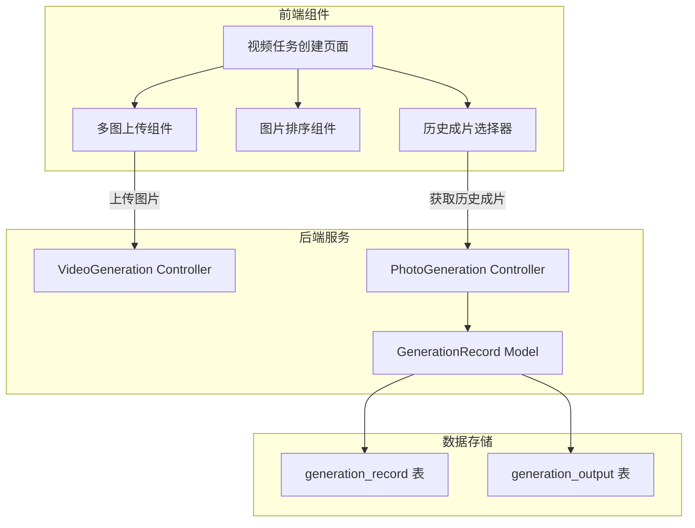
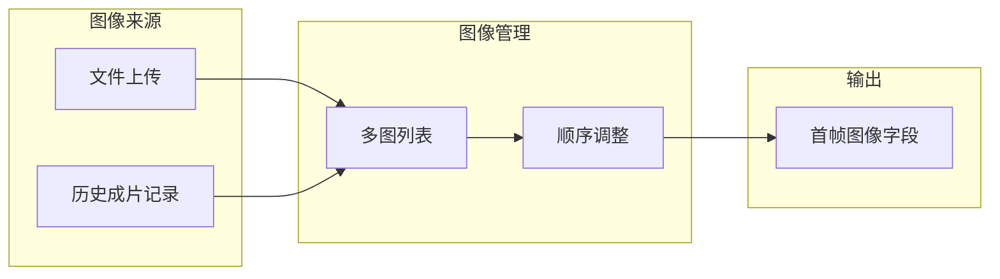
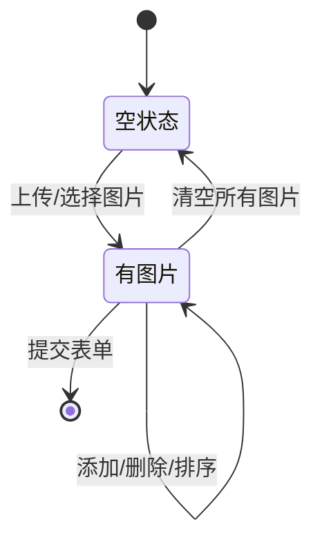
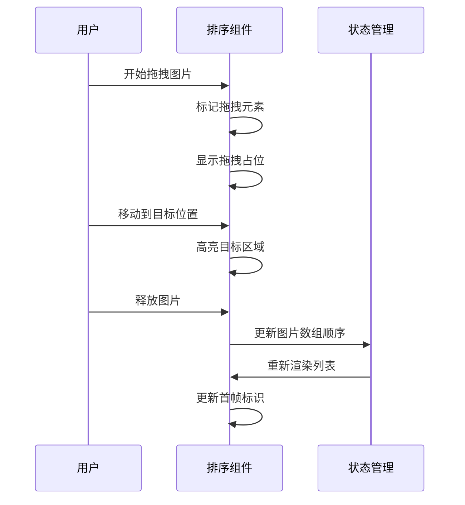
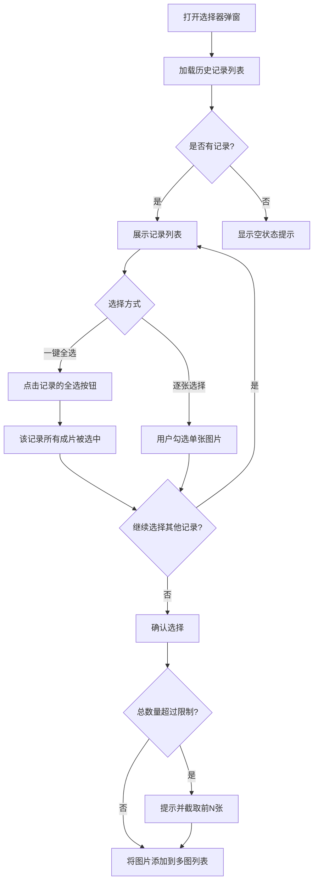
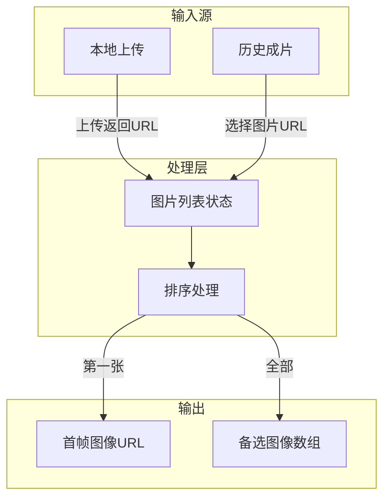
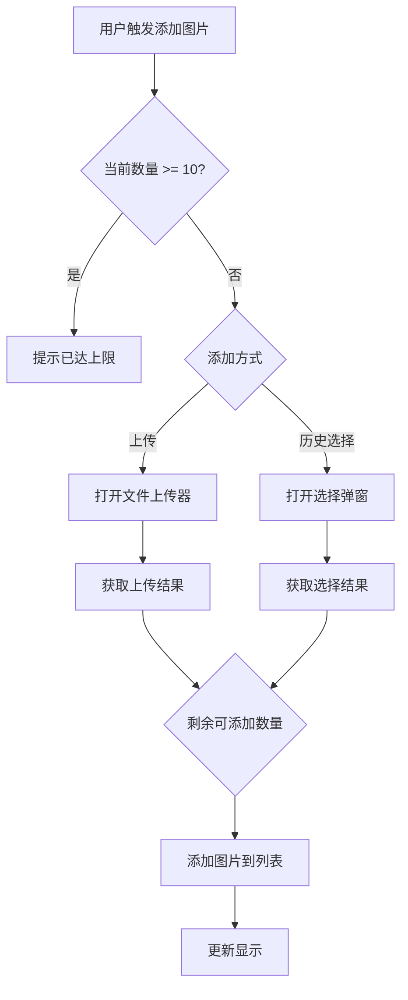

# 视频生成任务首帧图像多图上传功能设计文档

## 1. 概述

### 1.1 功能背景
当前视频生成任务（`VideoGeneration/task_create`）的首帧图像上传功能仅支持单图上传。用户希望一次可上传多张图片，支持调整排列顺序，并能够从照片生成记录中选择已有成片作为首帧图像素材。

### 1.2 功能目标
| 目标项 | 描述 |
|--------|------|
| 多图上传 | 支持一次上传多张图片（最多10张） |
| 顺序调整 | 通过拖拽方式调整图片排列顺序 |
| 首帧默认 | 排列第一张图片自动作为首帧图像 |
| 历史成片 | 支持从照片生成记录选择已生成的成片 |

---

## 2. 架构设计

### 2.1 整体架构



### 2.2 组件关系



---

## 3. 组件架构设计

### 3.1 多图上传组件

#### 组件职责
| 职责 | 说明 |
|------|------|
| 图片上传 | 调用现有 `fileUploader` 组件完成图片上传 |
| 图片预览 | 显示已上传图片的缩略图 |
| 图片删除 | 支持删除单张已上传图片 |
| 数量限制 | 控制最大上传数量（默认10张） |

#### 组件状态管理



### 3.2 图片排序组件

#### 交互行为
| 交互方式 | 行为描述 |
|----------|----------|
| 拖拽移动 | 长按图片拖拽到目标位置 |
| 视觉反馈 | 拖拽时显示占位提示，目标位置高亮 |
| 排序更新 | 释放后自动更新数组顺序 |
| 首帧标识 | 第一张图片显示"首帧"角标 |

#### 排序逻辑流程



### 3.3 历史成片选择器

#### 功能设计
| 功能项 | 描述 |
|--------|------|
| 记录筛选 | 按时间、状态、模型筛选历史记录 |
| 成片预览 | 显示每条记录的输出图片列表 |
| 一键全选 | 支持一键选择某条记录的所有成片 |
| 多选支持 | 支持从多条记录中选择多张图片 |
| 分页加载 | 支持分页或滚动加载更多记录 |

#### 选择交互方式
| 交互方式 | 说明 |
|----------|------|
| 一键全选 | 点击记录卡片的「全选」按钮，选中该记录所有成片 |
| 单张选择 | 点击单张图片进行勾选/取消勾选 |
| 批量取消 | 点击「取消全选」清除该记录的所有勾选 |

#### 选择流程



---

## 4. 数据流设计

### 4.1 数据结构

#### 多图列表数据结构
| 字段名 | 类型 | 说明 |
|--------|------|------|
| id | string | 图片唯一标识（UUID） |
| url | string | 图片完整URL |
| thumbnail | string | 缩略图URL（可选） |
| source | string | 来源类型：upload/history |
| sourceId | number | 来源记录ID（历史成片时有值） |
| order | number | 排序序号 |

#### 历史记录查询参数
| 参数名 | 类型 | 说明 |
|--------|------|------|
| page | number | 页码，默认1 |
| limit | number | 每页数量，默认20 |
| status | number | 状态筛选：2=成功 |
| date_start | string | 开始日期（可选） |
| date_end | string | 结束日期（可选） |

### 4.2 数据流转过程



---

## 5. 接口设计

### 5.1 获取历史成片记录接口

#### 接口定义
| 属性 | 值 |
|------|-----|
| 路径 | PhotoGeneration/get_output_images |
| 方法 | GET |
| 说明 | 获取照片生成记录的输出图片列表 |

#### 请求参数
| 参数名 | 类型 | 必填 | 说明 |
|--------|------|------|------|
| page | number | 否 | 页码，默认1 |
| limit | number | 否 | 每页数量，默认20 |
| status | number | 否 | 状态筛选，默认2（成功） |

#### 响应结构
| 字段 | 类型 | 说明 |
|------|------|------|
| code | number | 状态码：0=成功 |
| msg | string | 提示信息 |
| count | number | 总记录数 |
| data | array | 记录列表 |
| data[].id | number | 记录ID |
| data[].create_time | string | 创建时间 |
| data[].model_name | string | 使用的模型名称 |
| data[].outputs | array | 输出图片列表 |
| data[].outputs[].url | string | 图片URL |
| data[].outputs[].thumbnail | string | 缩略图URL |

---

## 6. 用户界面设计

### 6.1 多图上传区域布局

```
┌─────────────────────────────────────────────────────────────┐
│  首帧图像 *                                                  │
├─────────────────────────────────────────────────────────────┤
│  ┌─────┐ ┌─────┐ ┌─────┐ ┌─────┐ ┌─────┐ ┌───────┐        │
│  │ 首帧 │ │     │ │     │ │     │ │     │ │   +   │        │
│  │ img1│ │ img2│ │ img3│ │ img4│ │ img5│ │ 添加  │        │
│  │  ×  │ │  ×  │ │  ×  │ │  ×  │ │  ×  │ │       │        │
│  └─────┘ └─────┘ └─────┘ └─────┘ └─────┘ └───────┘        │
│                                                             │
│  [上传本地图片]  [从历史成片选择]                            │
│                                                             │
│  提示：拖拽调整顺序，第一张将作为视频首帧                     │
└─────────────────────────────────────────────────────────────┘
```

### 6.2 历史成片选择弹窗布局

```
┌─────────────────────────────────────────────────────────────┐
│  选择历史成片                                         [关闭] │
├─────────────────────────────────────────────────────────────┤
│  筛选：[时间范围 ▼]  [模型选择 ▼]         [搜索...]        │
├─────────────────────────────────────────────────────────────┤
│  ┌─────────────────────────────────────────────────────┐   │
│  │ 2026-02-27 15:30 | 豆包SeeDream 4.5 | 6张   [全选] │   │
│  │ ┌────┐ ┌────┐ ┌────┐ ┌────┐ ┌────┐ ┌────┐        │   │
│  │ │ ☑ │ │ ☑ │ │ ☑ │ │ ☑ │ │ ☑ │ │ ☑ │        │   │
│  │ └────┘ └────┘ └────┘ └────┘ └────┘ └────┘        │   │
│  └─────────────────────────────────────────────────────┘   │
│  ┌─────────────────────────────────────────────────────┐   │
│  │ 2026-02-27 14:15 | 通义万相 | 4张           [全选] │   │
│  │ ┌────┐ ┌────┐ ┌────┐ ┌────┐                      │   │
│  │ │ ☐ │ │ ☐ │ │ ☐ │ │ ☐ │                      │   │
│  │ └────┘ └────┘ └────┘ └────┘                      │   │
│  └─────────────────────────────────────────────────────┘   │
│                                                             │
│  已选择 6 张图片                    [取消]  [确认选择]      │
└─────────────────────────────────────────────────────────────┘
```

**「全选」按钮交互说明**：每条记录卡片右上角显示「全选」按钮，点击后该条记录的所有成片被选中；按钮文字切换为「取消全选」，再次点击可取消所有勾选。

### 6.3 交互状态

| 状态 | 视觉表现 |
|------|----------|
| 首帧标识 | 第一张图片左上角显示"首帧"角标 |
| 拖拽中 | 被拖拽图片半透明，目标位置显示虚线框 |
| 选中状态 | 图片边框高亮，显示勾选图标 |
| 删除悬停 | 删除按钮显示，鼠标变为手型 |
| 数量限制 | 达到上限时添加按钮置灰并提示 |

---

## 7. 业务逻辑设计

### 7.1 图片数量限制逻辑



### 7.2 首帧图像确定逻辑

| 场景 | 处理方式 |
|------|----------|
| 添加首张图片 | 自动设为首帧 |
| 删除首帧图片 | 第二张自动晋升为首帧 |
| 拖拽调整顺序 | 新的第一张成为首帧 |
| 清空所有图片 | 首帧字段清空 |

### 7.3 表单提交数据结构

| 字段 | 类型 | 说明 |
|------|------|------|
| params[image] 或 params[first_frame] | string | 首帧图像URL（第一张图） |
| params[image_list] | array | 所有图片URL数组（可选，用于后续扩展） |

---

## 8. 技术实现要点

### 8.1 前端技术选型

| 功能 | 技术方案 |
|------|----------|
| 拖拽排序 | HTML5 Drag & Drop API 或 Sortable.js |
| 图片上传 | 复用现有 fileUploader 组件 |
| 弹窗组件 | Layui layer 组件 |
| 状态管理 | JavaScript 对象数组 |

### 8.2 兼容性考虑

| 方面 | 处理方式 |
|------|----------|
| 现有参数 | 保持 params[image]、params[first_frame] 等字段兼容 |
| 单图场景 | 只有一张图时行为与原有功能一致 |
| 模型适配 | 根据模型 input_schema 判断是否支持多图输入 |

### 8.3 性能优化

| 优化点 | 方案 |
|--------|------|
| 图片预览 | 优先使用缩略图URL |
| 历史记录加载 | 分页加载，首次加载20条 |
| 拖拽性能 | 使用 CSS transform 实现平滑动画 |

---

## 9. 测试策略

### 9.1 功能测试用例

| 测试场景 | 预期结果 |
|----------|----------|
| 上传单张图片 | 图片显示，自动标记为首帧 |
| 上传多张图片 | 按上传顺序显示，第一张为首帧 |
| 拖拽排序 | 顺序更新，首帧标识跟随第一张 |
| 删除首帧 | 第二张晋升为首帧 |
| 从历史逐张选择 | 选中图片添加到列表末尾 |
| 历史记录一键全选 | 该记录所有成片被选中，按钮变为「取消全选」 |
| 历史记录取消全选 | 该记录所有成片取消勾选，按钮恢复为「全选」 |
| 达到上限 | 添加按钮禁用，显示提示 |
| 提交表单 | 首帧URL正确传递到后端 |

### 9.2 边界测试

| 测试场景 | 预期结果 |
|----------|----------|
| 上传超过10张 | 阻止并提示 |
| 历史记录为空 | 显示空状态提示 |
| 一键全选导致超过上限 | 提示并截取前N张，或仅添加剩余可用数量 |
| 网络异常 | 显示错误提示，保留已有数据 |
| 图片URL无效 | 显示占位图或错误提示 |
