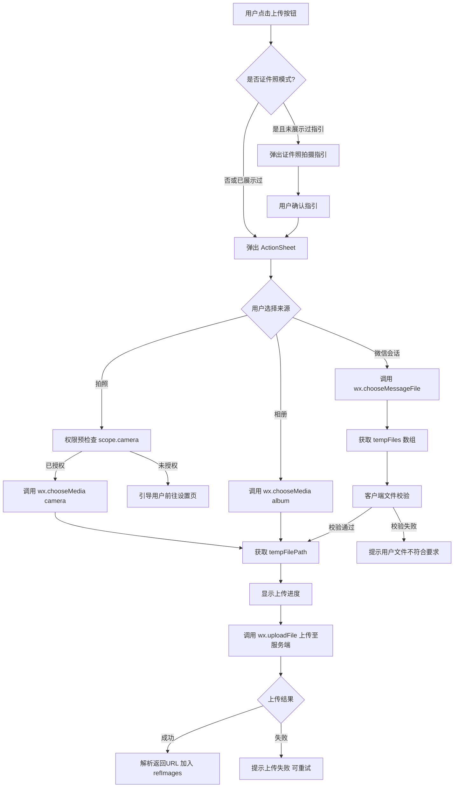
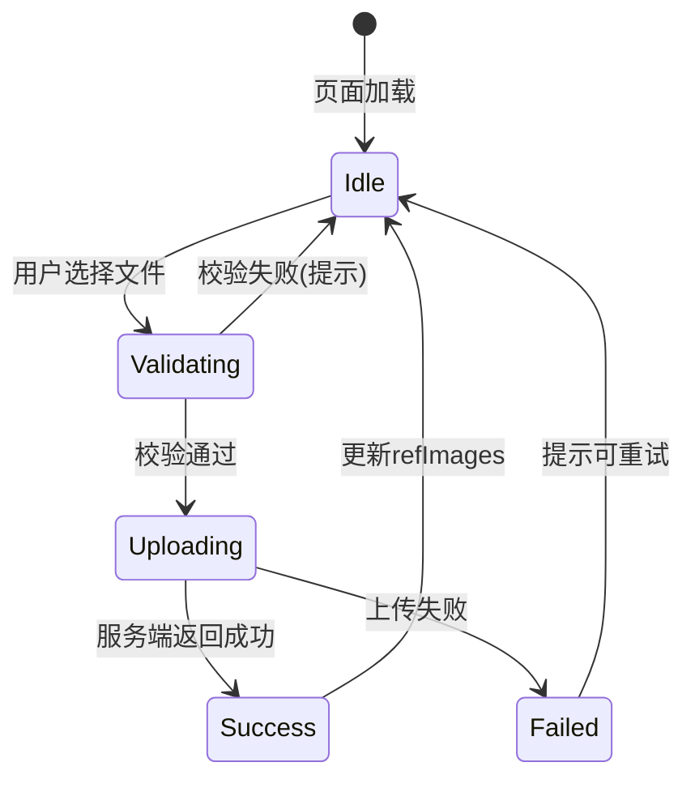
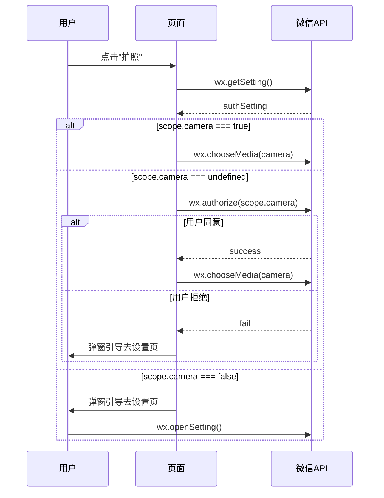
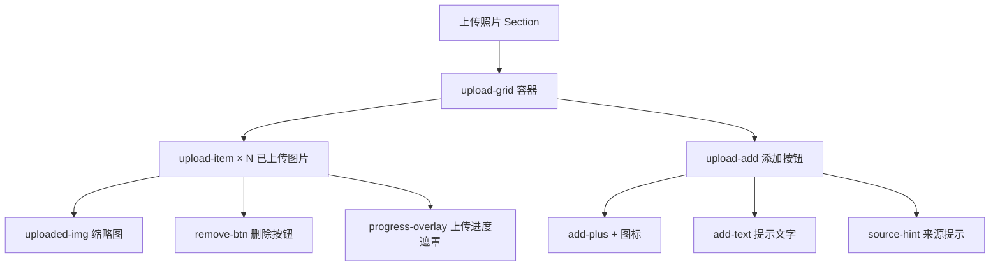
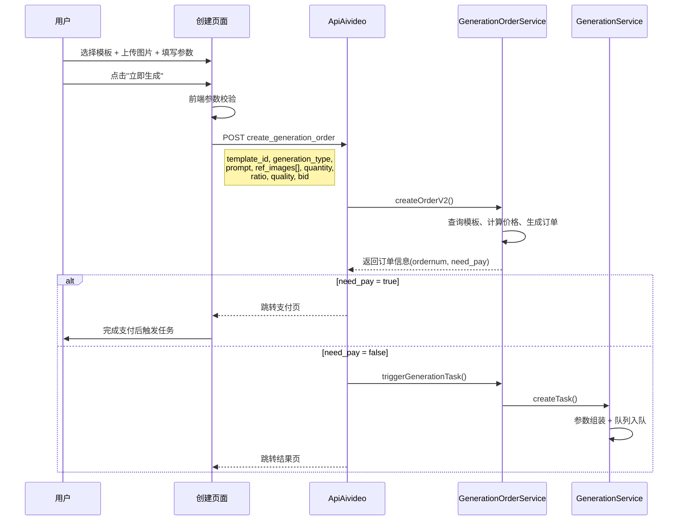

# 微信会话文件上传功能重构设计

## 1. 概述

本设计旨在重构"创建图片任务"与"创建视频任务"页面中的文件上传功能。核心目标是将 `wx.chooseMessageFile`（微信会话文件选择）作为一等来源深度集成，统一三种文件来源（拍照、相册、微信会话）的上传体验，并解决当前两套代码（mp-weixin 原生版 与 uniapp 跨平台版）之间的行为不一致问题。

### 1.1 现状分析

| 维度 | mp-weixin 原生版 (`create.js`) | uniapp 跨平台版 (`create.vue`) |
|------|------|------|
| 文件来源 | 拍照 / 相册 / 微信会话（三项已接入） | 微信端同左；非微信端仅相册+拍照 |
| 图片数量 | 仅存储1张（`setData({ refImages: [url] })`） | 支持多张（`refImages.push(url)`） |
| 视频任务上传 | 会话选择仅限 `type: 'image'` | 同左，未区分任务类型 |
| 文件校验 | 无客户端大小/格式校验 | 同左 |
| 上传进度 | 仅 showLoading | 同左 |
| 错误处理 | 已覆盖取消/隐私/授权 | 同左 |

### 1.2 涉及文件

| 文件路径 | 角色 |
|---------|------|
| `mp-weixin/pagesZ/generation/create.js` | 微信原生版页面逻辑 |
| `mp-weixin/pagesZ/generation/create.wxml` | 微信原生版页面模板 |
| `mp-weixin/pagesZ/generation/create.wxss` | 微信原生版页面样式 |
| `uniapp/pagesZ/generation/create.vue` | uniapp 跨平台版页面（含模板+逻辑+样式） |
| `app/controller/Upload.php` | 后端文件上传控制器 |
| `app/service/GenerationService.php` | 生成任务服务（含封面图压缩） |
| `app/service/GenerationOrderService.php` | 生成订单服务（任务创建入口） |

## 2. 架构

### 2.1 整体上传流程



### 2.2 文件来源选择策略

根据任务类型（`generationType`）动态调整可选来源和文件类型参数：

| 任务类型 | ActionSheet 选项 | chooseMedia 参数 | chooseMessageFile 参数 |
|---------|-----------------|-----------------|----------------------|
| 图片生成 (`generationType=1`) | 拍照 / 从相册选择 / 从微信会话选择 | `mediaType: ['image']` | `type: 'image'` |
| 视频生成 (`generationType=2`) | 拍照 / 从相册选择 / 从微信会话选择 | `mediaType: ['image']`（视频任务的参考图仍为图片） | `type: 'image'`（若模板需要视频素材则改为 `'video'` 或 `'all'`） |

> 说明：当前场景模板的 `ref_images` 字段均用于传递参考图，因此默认限制为图片类型。若后续模板支持视频素材输入，需根据模板的 `input_type` 字段动态切换 `type` 参数。

## 3. 业务逻辑层

### 3.1 客户端文件校验模块

在获取到用户选择的文件后、上传之前，需执行前置校验：

**校验规则表：**

| 校验项 | 图片文件 | 视频文件 | 校验失败提示 |
|-------|---------|---------|------------|
| 文件大小上限 | 10 MB | 50 MB | "文件大小超过限制，图片不超过10MB" |
| 文件格式（扩展名） | jpg, jpeg, png, gif, bmp, webp | mp4, mov | "不支持该文件格式，请选择 JPG/PNG 格式图片" |
| 文件数量上限 | 由 `maxImages` 控制（当前为9张，mp-weixin 原生版为1张） | 同左 | "最多上传 N 张图片" |

**校验时机：** `wx.chooseMessageFile` 的 `success` 回调中，遍历 `tempFiles` 数组逐一校验，仅对通过校验的文件调用 `uploadImage`。

### 3.2 上传进度交互

当前实现仅使用 `wx.showLoading` 显示"上传中"文字。重构后应改为更友好的进度反馈：

**进度状态机：**



**进度展示方案：**

| 状态 | 展示形式 |
|------|---------|
| Validating | wx.showLoading("校验中") |
| Uploading | 上传区域内对应图片位显示半透明遮罩 + 百分比文字，利用 `wx.uploadFile` 返回的 `uploadTask.onProgressUpdate` 获取实时进度 |
| Success | 移除遮罩，显示已上传图片缩略图 |
| Failed | 图片位显示重试图标，点击可重新上传 |

### 3.3 mp-weixin 原生版与 uniapp 版行为统一

当前两个版本在图片存储行为上存在关键差异，需统一：

| 行为 | 重构目标 |
|------|---------|
| 图片存储数量 | 两个版本均支持多张上传，数量上限由模板配置的 `max_ref_images` 字段控制，默认值为 1 |
| 上传后文件路径字段 | 统一使用 `tempFiles[i].path` 字段（chooseMessageFile 返回 `path`，chooseMedia 返回 `tempFilePath`，需分别取值） |
| 移除图片 | 两个版本均通过索引移除指定图片（mp-weixin 版当前整体清空需改为按索引删除） |

### 3.4 错误处理规范

所有文件选择 API 的 `fail` 回调需遵循统一处理逻辑：

```mermaid
flowchart TD
    A[fail 回调触发] --> B{errMsg 包含 'cancel'?}
    B -->|是| C[静默忽略 - 用户主动取消]
    B -->|否| D{errMsg 包含 'privacy' 或 'authorize'?}
    D -->|是| E[提示"请先同意隐私协议后重试"]
    D -->|否| F{是 scope.camera 权限问题?}
    F -->|是| G[调用 guideToSetting 引导设置页]
    F -->|否| H[通用提示"选择文件失败，请重试"]
```

### 3.5 权限管理

**相机权限预检查流程：**



**权限声明要求（app.json）：**

| 权限 scope | desc 描述文案 | 用途 |
|-----------|-------------|------|
| `scope.camera` | "用于拍摄照片、扫码" | 拍照上传 |
| `scope.writePhotosAlbum` | "用于保存图片到相册" | 结果页保存图片 |

### 3.6 上传至服务端

**请求端点：** `POST /Upload/upload`

**请求参数：**

| 参数 | 类型 | 必填 | 说明 |
|------|------|------|------|
| file | File | 是 | 文件二进制数据 |
| aid | string | 否 | 应用 ID |

**响应格式：**

| 字段 | 类型 | 说明 |
|------|------|------|
| status | int | 1=成功, 0=失败 |
| url | string | 上传后的文件访问 URL |
| msg | string | 错误时返回错误信息 |
| info.extension | string | 文件扩展名 |
| info.bsize | int | 文件大小(bytes) |

**服务端处理流程：**

上传控制器（`Upload.php`）接收文件后执行以下步骤：文件扩展名白名单校验 → 存储到本地目录 → 图片类型执行缩略图压缩 → 若配置了 OSS 则转存至对象存储 → 返回最终 URL。

### 3.7 服务端封面图压缩

在 `GenerationService::transferAttachments` 中对照片类型封面图进行压缩：

| 条件 | 处理方式 |
|------|---------|
| 照片类型且宽度 > 800px | 使用 GD 库按比例缩放至 800px 宽，JPEG 质量 85 |
| 视频封面或宽度 ≤ 800px | 跳过压缩，保持原图 |

## 4. 组件架构

### 4.1 上传区域组件结构



### 4.2 页面数据模型

| 字段 | 类型 | 默认值 | 说明 |
|------|------|-------|------|
| refImages | Array\<string\> | [] | 已上传图片 URL 列表 |
| uploadingFiles | Array\<Object\> | [] | 正在上传的文件列表，每项含 `{tempPath, progress, status}` |
| maxImages | number | 9（uniapp）/ 1（mp-weixin） | 最大上传数量，重构后统一由模板配置控制 |
| generationType | number | 1 | 任务类型：1=图片生成, 2=视频生成 |
| showIdPhotoGuide | boolean | false | 是否显示证件照指引弹窗 |

### 4.3 提交任务数据流



## 5. 测试策略

### 5.1 单元测试

| 测试模块 | 测试场景 | 验证要点 |
|---------|---------|---------|
| 文件校验函数 | 输入超过 10MB 的图片文件信息 | 返回校验失败，提示文件过大 |
| 文件校验函数 | 输入 .doc 格式文件信息 | 返回校验失败，提示格式不支持 |
| 文件校验函数 | 输入 5MB 的 .jpg 文件信息 | 返回校验通过 |
| chooseImage 分支 | generationType=1 时 chooseMessageFile 的 type 参数 | 应为 'image' |
| chooseImage 分支 | generationType=2 且模板需要视频素材时 chooseMessageFile 的 type 参数 | 应为 'video' 或 'all' |
| 错误处理 | fail 回调中 errMsg 包含 'cancel' | 不弹出任何错误提示 |
| 错误处理 | fail 回调中 errMsg 包含 'privacy' | 提示同意隐私协议 |
| uploadImage | 服务端返回 status=0 | 提示上传失败信息 |
| uploadImage | 网络异常 | 提示上传失败 |
| 图片数量控制 | refImages 已达 maxImages 上限时点击添加 | 不触发任何选择操作 |

### 5.2 集成测试

| 测试场景 | 操作步骤 | 预期结果 |
|---------|---------|---------|
| 微信会话选择图片上传 | 点击上传 → 选择"从微信会话选择" → 选择1张图片 | 图片上传成功并显示缩略图 |
| 拍照上传（首次授权） | 点击上传 → 选择"拍照" → 允许相机权限 → 拍照 | 照片上传成功 |
| 拍照上传（权限被拒） | 点击上传 → 选择"拍照" → 拒绝权限 | 弹出引导去设置页的弹窗 |
| 多张图片上传 | 点击上传 → 选择"从相册选择" → 选择3张图片 | 3张图片依次上传并显示 |
| 删除已上传图片 | 点击某张已上传图片的删除按钮 | 对应图片被移除，可继续上传 |
| 超大文件拦截 | 从微信会话选择一张 15MB 的图片 | 前端拦截并提示文件过大 |
| mp-weixin 与 uniapp 一致性 | 在两个版本中执行相同操作 | 行为和结果一致 |
