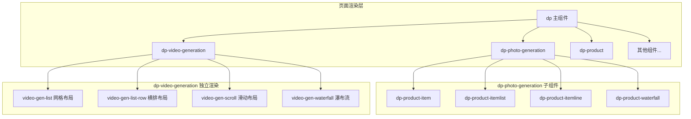
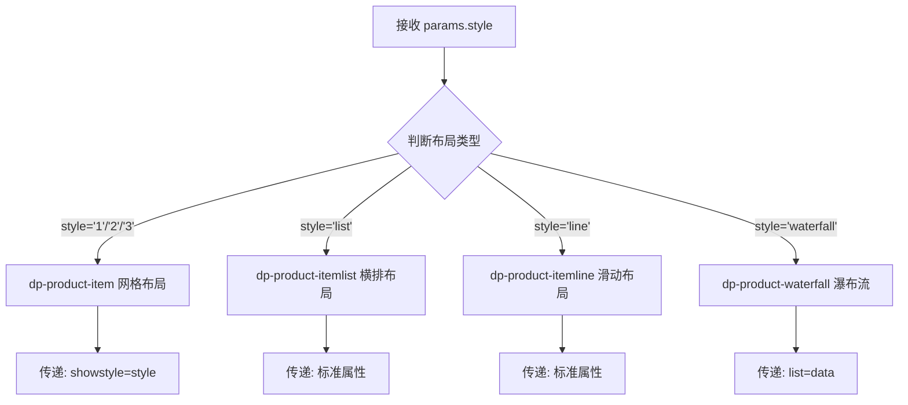
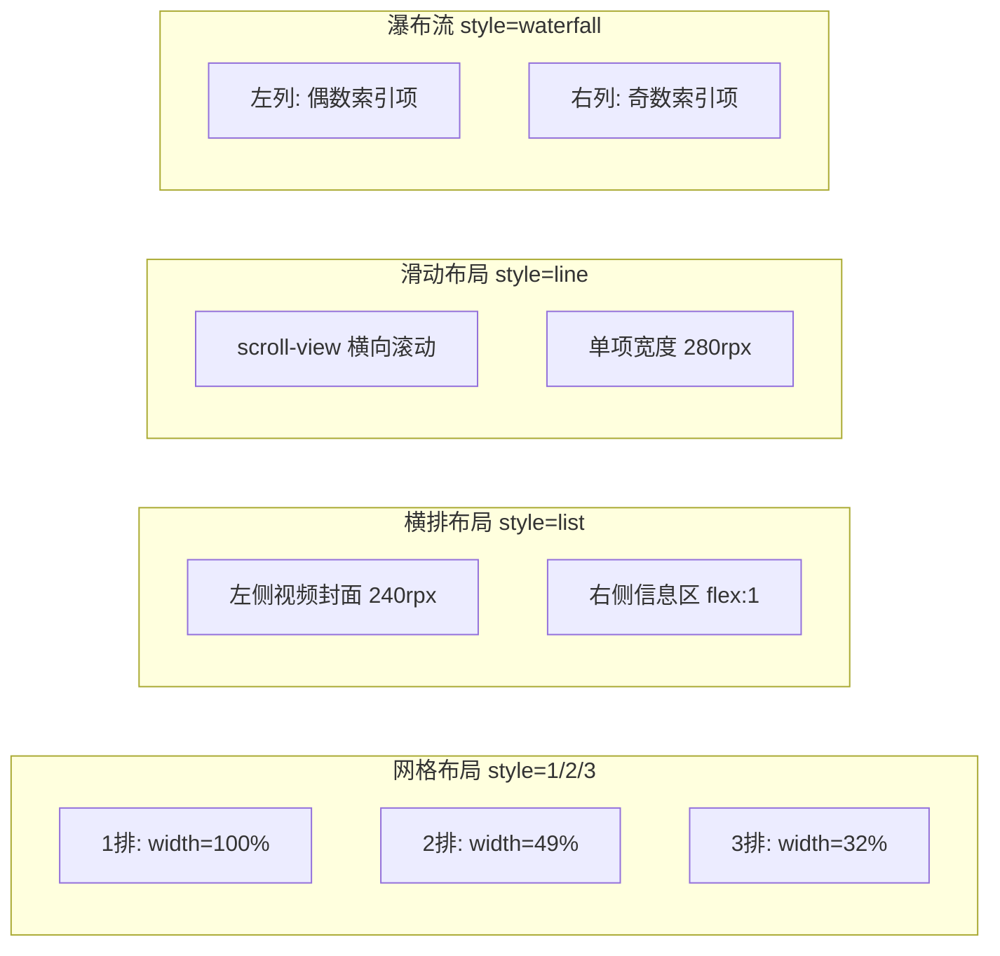
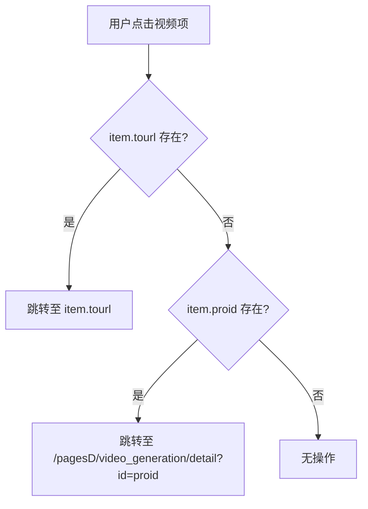
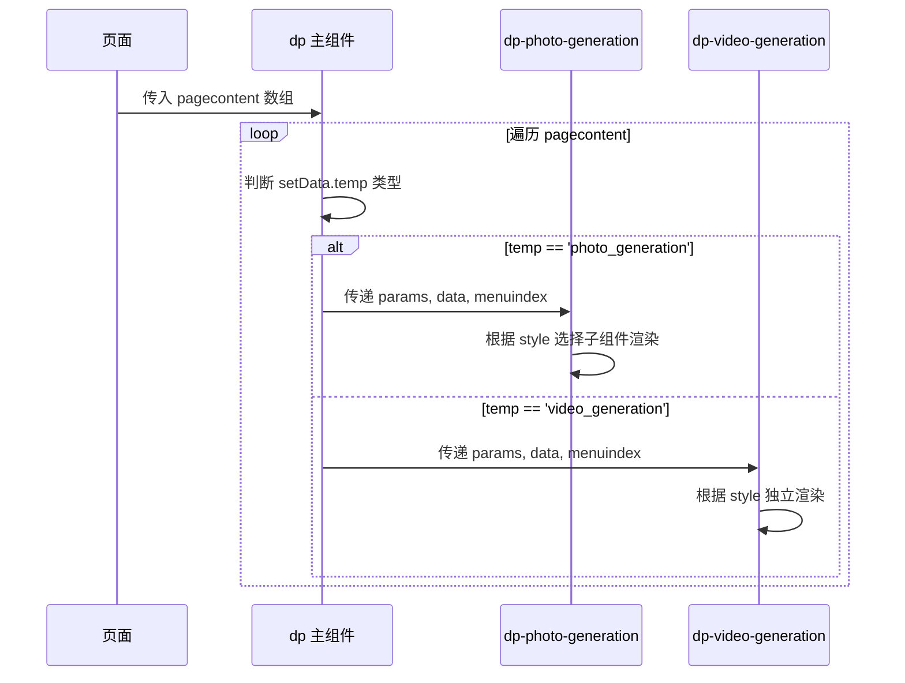
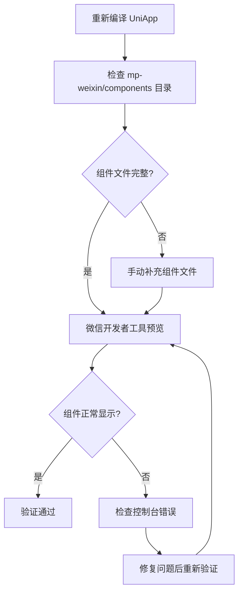

# 微信小程序照片生成与视频生成组件构建设计

## 1. 概述

### 1.1 问题背景

在页面设计器中已添加的 `photo_generation`（照片生成）和 `video_generation`（视频生成）组件，在微信小程序端编译后无法正常显示。

### 1.2 问题原因分析

| 层级 | 位置 | 现状 | 问题 |
|------|------|------|------|
| UniApp 源码层 | `uniapp/components/dp-photo-generation/` | ✅ 存在 | - |
| UniApp 源码层 | `uniapp/components/dp-video-generation/` | ✅ 存在 | - |
| UniApp 渲染器 | `uniapp/components/dp/dp.vue` | ✅ 已注册渲染块 | - |
| 微信小程序层 | `mp-weixin/components/dp-photo-generation/` | ❌ 不存在 | 组件目录缺失 |
| 微信小程序层 | `mp-weixin/components/dp-video-generation/` | ❌ 不存在 | 组件目录缺失 |
| 微信小程序层 | `mp-weixin/components/dp/dp.json` | ❌ 未注册 | 组件引用缺失 |
| 微信小程序层 | `mp-weixin/components/dp/dp.wxml` | ❌ 无模板块 | 渲染模板缺失 |

### 1.3 设计目标

按照现有商城商品组件（dp-product）的构建结构，完成照片生成和视频生成组件在微信小程序端的完整构建。

---

## 2. 架构设计

### 2.1 组件层次结构

### 2.2 微信小程序组件文件结构

每个组件需要 4 个标准文件：

| 文件类型 | 文件名 | 职责描述 |
|---------|--------|----------|
| JSON | `{component-name}.json` | 组件配置，声明子组件依赖 |
| WXML | `{component-name}.wxml` | 组件模板结构 |
| WXSS | `{component-name}.wxss` | 组件样式定义 |
| JS | `{component-name}.js` | 组件逻辑与 webpack 打包入口 |

---

## 3. 组件详细设计

### 3.1 dp-photo-generation 组件

#### 3.1.1 组件配置（JSON）

| 配置项 | 值 | 说明 |
|--------|-----|------|
| component | true | 声明为组件 |
| 子组件依赖 | dp-product-item | 网格布局子组件 |
| 子组件依赖 | dp-product-itemlist | 横排布局子组件 |
| 子组件依赖 | dp-product-itemline | 左右滑动子组件 |
| 子组件依赖 | dp-product-waterfall | 瀑布流子组件 |

#### 3.1.2 组件属性（Props）

| 属性名 | 类型 | 默认值 | 说明 |
|--------|------|--------|------|
| menuindex | Number | -1 | 菜单索引 |
| params | Object | {} | 显示参数配置 |
| data | Array | [] | 模板数据列表 |

#### 3.1.3 Params 参数详情

| 参数 | 类型 | 说明 |
|------|------|------|
| style | String | 布局样式：'1'/'2'/'3'/'list'/'line'/'waterfall' |
| bgcolor | String | 背景颜色 |
| probgcolor | String | 商品项背景色 |
| margin_x | Number | 水平外边距 |
| margin_y | Number | 垂直外边距 |
| padding_x | Number | 水平内边距 |
| padding_y | Number | 垂直内边距 |
| showname | String | 是否显示名称：'1'/'0' |
| showprice | String | 是否显示价格：'1'/'0' |
| showsales | String | 是否显示销量：'1'/'0' |
| showcart | String | 是否显示购物车：'1'/'0'/'2' |
| cartimg | String | 购物车图标路径 |
| saleimg | String | 销售标签图片 |

#### 3.1.4 布局渲染逻辑

---

### 3.2 dp-video-generation 组件

#### 3.2.1 组件配置（JSON）

| 配置项 | 值 | 说明 |
|--------|-----|------|
| component | true | 声明为组件 |
| 子组件依赖 | 无 | 独立渲染，不依赖子组件 |

#### 3.2.2 组件属性（Props）

| 属性名 | 类型 | 默认值 | 说明 |
|--------|------|--------|------|
| menuindex | Number | -1 | 菜单索引 |
| params | Object | {} | 显示参数配置 |
| data | Array | [] | 视频模板数据列表 |

#### 3.2.3 视频封面渲染规范

> **重要约束**：视频生成模板的封面必须使用 `<video>` 标签进行展示

| 属性 | 值 | 说明 |
|------|-----|------|
| autoplay | false | 禁止自动播放 |
| loop | false | 禁止循环 |
| muted | true | 静音 |
| controls | false | 隐藏控制条 |
| show-center-play-btn | false | 隐藏中心播放按钮 |
| show-play-btn | false | 隐藏播放按钮 |
| show-fullscreen-btn | false | 隐藏全屏按钮 |
| enable-progress-gesture | false | 禁用进度手势 |
| object-fit | cover | 填充模式 |

#### 3.2.4 播放图标叠加设计

| 元素 | 样式描述 |
|------|----------|
| 容器 | position: absolute, 居中定位 |
| 尺寸 | 60rpx × 60rpx |
| 背景 | rgba(0,0,0,0.5) 半透明黑色 |
| 形状 | 圆形 (border-radius: 50%) |
| 图标 | 使用 image 标签加载 /static/img/play.png |

#### 3.2.5 四种布局样式设计

#### 3.2.6 瀑布流数据分割逻辑

| 数据集 | 计算方式 | 说明 |
|--------|----------|------|
| leftData | data.filter((item, index) => index % 2 === 0) | 偶数索引项 |
| rightData | data.filter((item, index) => index % 2 === 1) | 奇数索引项 |

#### 3.2.7 点击跳转逻辑

---

## 4. dp 主组件改造设计

### 4.1 组件注册（dp.json）

需要在 `usingComponents` 中添加以下注册：

| 组件名 | 路径 |
|--------|------|
| dp-photo-generation | /components/dp-photo-generation/dp-photo-generation |
| dp-video-generation | /components/dp-video-generation/dp-video-generation |

### 4.2 渲染模板（dp.wxml）

需要在循环渲染块中添加两个条件渲染块：

| 组件 | 条件判断 | 传递属性 |
|------|----------|----------|
| dp-photo-generation | temp=='photo_generation' | params, data, menuindex |
| dp-video-generation | temp=='video_generation' | params, data, menuindex |

### 4.3 模板渲染流程

---

## 5. 文件改动清单

### 5.1 需要新建的文件

| 文件路径 | 文件类型 | 说明 |
|----------|----------|------|
| mp-weixin/components/dp-photo-generation/dp-photo-generation.json | JSON | 组件配置 |
| mp-weixin/components/dp-photo-generation/dp-photo-generation.wxml | WXML | 组件模板 |
| mp-weixin/components/dp-photo-generation/dp-photo-generation.wxss | WXSS | 组件样式 |
| mp-weixin/components/dp-photo-generation/dp-photo-generation.js | JS | 组件逻辑 |
| mp-weixin/components/dp-video-generation/dp-video-generation.json | JSON | 组件配置 |
| mp-weixin/components/dp-video-generation/dp-video-generation.wxml | WXML | 组件模板 |
| mp-weixin/components/dp-video-generation/dp-video-generation.wxss | WXSS | 组件样式 |
| mp-weixin/components/dp-video-generation/dp-video-generation.js | JS | 组件逻辑 |

### 5.2 需要修改的文件

| 文件路径 | 修改内容 |
|----------|----------|
| mp-weixin/components/dp/dp.json | 添加两个组件的引用声明 |
| mp-weixin/components/dp/dp.wxml | 添加两个组件的条件渲染块 |

---

## 6. 数据模型

### 6.1 照片生成模板数据结构

| 字段名 | 类型 | 说明 |
|--------|------|------|
| id | Number | 模板ID |
| proid | Number | 产品ID（用于跳转） |
| name | String | 模板名称 |
| pic | String | 封面图片URL |
| price | Number | 价格 |
| market_price | Number | 市场价 |
| sales | Number | 使用次数 |
| tourl | String | 自定义跳转链接（可选） |

### 6.2 视频生成模板数据结构

| 字段名 | 类型 | 说明 |
|--------|------|------|
| id | Number | 模板ID |
| proid | Number | 产品ID（用于跳转） |
| name | String | 模板名称 |
| pic | String | 视频封面URL |
| sell_price | Number | 销售价格 |
| sales | Number | 使用次数 |
| tourl | String | 自定义跳转链接（可选） |

---

## 7. 测试验证

### 7.1 测试场景

| 场景 | 预期结果 |
|------|----------|
| 照片生成 - 1排布局 | 单列显示，宽度100% |
| 照片生成 - 2排布局 | 双列显示，宽度各49% |
| 照片生成 - 3排布局 | 三列显示，宽度各32% |
| 照片生成 - 横排布局 | 左图右文横向排列 |
| 照片生成 - 滑动布局 | 支持左右滑动浏览 |
| 照片生成 - 瀑布流 | 双列瀑布流错落排列 |
| 视频生成 - 封面显示 | video标签正确加载，播放图标居中 |
| 视频生成 - 点击跳转 | 跳转至详情页正确 |

### 7.2 验证流程

