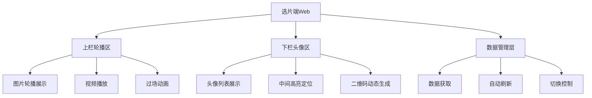
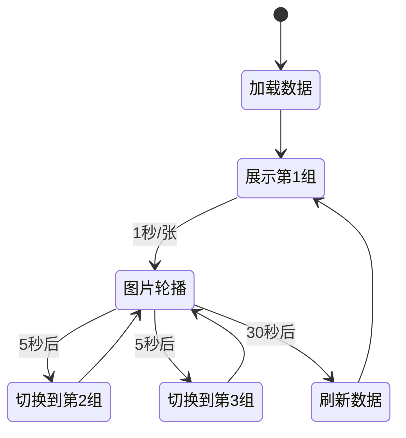
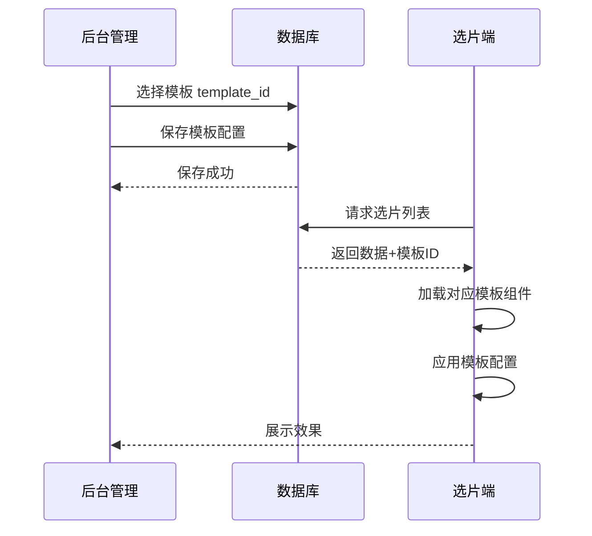
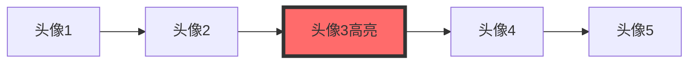
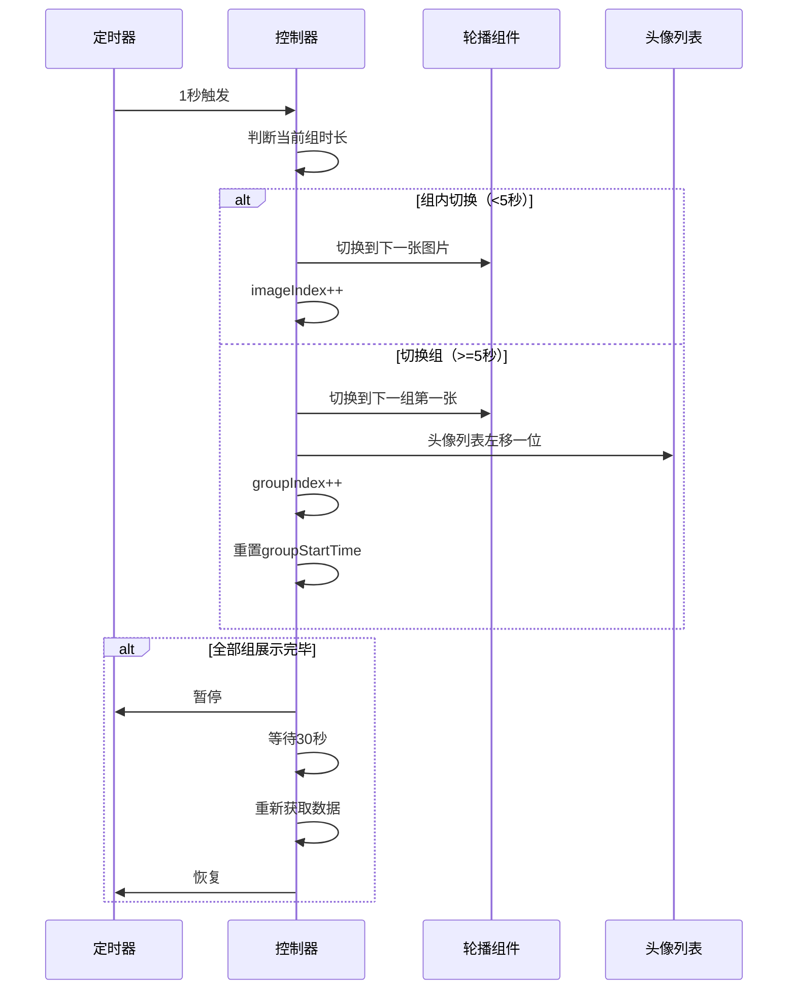
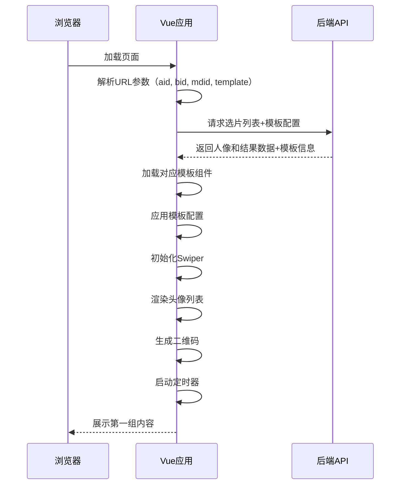

# AI旅拍选片端Web开发设计文档

## 1. 概述

### 1.1 系统定位

选片端Web是AI旅拍系统的核心展示终端，部署在商户门店的大屏显示设备上，用于实时展示AI生成的旅拍照片和视频成果，吸引游客关注并引导扫码购买。

### 1.2 核心目标

| 目标维度 | 描述 |
|---------|------|
| 视觉冲击力 | 通过动态轮播和精美展示吸引游客注意力 |
| 实时性 | 展示最新生成的照片和视频，保持内容新鲜度 |
| 引导转化 | 通过二维码引导游客扫码查看和购买 |
| 稳定运行 | 支持7x24小时不间断运行，自动刷新数据 |

### 1.3 技术栈

| 技术分类 | 选型 | 说明 |
|---------|------|------|
| 前端框架 | Vue 3 | 响应式数据绑定，组件化开发 |
| 轮播组件 | Swiper.js | 高性能图片轮播，支持多种切换效果 |
| HTTP客户端 | Axios | 异步数据请求 |
| 二维码生成 | QRCode.js | 动态生成二维码 |
| 样式方案 | CSS3 + Flexbox | 响应式布局，适配不同屏幕尺寸 |

### 1.4 部署位置

文件存放目录：`/www/wwwroot/eivie/xpd/`

访问URL：`https://域名/xpd/index.html`

### 1.5 模板化展示支持

系统支持多种幻灯展示模板，门店可根据品牌风格和展示需求选择不同的展示模板，实现差异化视觉呈现。

| 支持维度 | 说明 |
|---------|------|
| 模板选择 | 每个门店可独立配置展示模板 |
| 模板切换 | 支持在线预览和一键切换 |
| 参数配置 | 模板支持自定义配置项 |
| 扩展性 | 便于后续新增模板类型 |

## 2. 功能架构

### 2.1 功能模块划分



### 2.2 界面布局结构

| 区域 | 占比 | 作用 | 内容 |
|-----|------|------|------|
| 上栏轮播区 | 90% | 主展示区 | 展示AI生成的照片H1和视频V1 |
| 下栏头像区 | 10% | 导航索引 | 展示人像列表，中间位置为当前展示的人像 |

### 2.3 展示逻辑



## 3. 核心功能设计

### 3.0 模板系统设计

#### 3.0.1 模板类型定义

系统提供多种预置幻灯展示模板，满足不同场景和风格需求。

| 模板名称 | 模板ID | 布局特点 | 适用场景 |
|---------|---------|---------|----------|
| 经典上下布局 | template_1 | 上90%轮播+下10%头像 | 通用场景，默认模板 |
| 全屏沉浸式 | template_2 | 100%轮播，无头像栏 | 高端影楼，追求视觉冲击力 |
| 左右分屏 | template_3 | 左70%轮播+右30%信息 | 信息展示丰富场景 |
| 栅格多屏 | template_4 | 2x2或3x3栅格布局 | 大屏幕，多人像同时展示 |
| 轮播卡片 | template_5 | 卡片式轮播，3D翻转效果 | 时尚风格，年轻人群 |

#### 3.0.2 模板配置项

每个模板支持的通用配置项：

| 配置项 | 类型 | 说明 | 默认值 | 支持模板 |
|-------|------|------|--------|----------|
| imageDuration | int | 单张图片展示时长（毫秒） | 1000 | 所有模板 |
| groupDuration | int | 单组展示时长（毫秒） | 5000 | 所有模板 |
| transitionEffect | string | 过场动画效果 | fade | 所有模板 |
| showAvatar | boolean | 是否显示头像栏 | true | template_1, template_3, template_5 |
| showQrcode | boolean | 是否显示二维码 | true | 所有模板 |
| autoRefresh | int | 自动刷新间隔（毫秒） | 30000 | 所有模板 |
| bgColor | string | 背景颜色 | #000000 | 所有模板 |
| accentColor | string | 主题色 | #ff6b6b | 所有模板 |

#### 3.0.3 模板切换机制



#### 3.0.4 模板文件组织

```
模板目录结构：
/www/wwwroot/eivie/xpd/
├── templates/
│   ├── template_1/
│   │   ├── index.html
│   │   ├── style.css
│   │   └── script.js
│   ├── template_2/
│   │   ├── index.html
│   │   ├── style.css
│   │   └── script.js
│   ├── template_3/
│   └── ...
├── index.html          # 模板路由入口
├── css/
├── js/
└── assets/
```

### 3.1 上栏轮播展示

#### 3.1.1 轮播规则

| 规则项 | 说明 | 配置参数 |
|-------|------|---------|
| 单张图片展示时长 | 每张图片展示1秒后自动切换到下一张 | `imageDuration: 1000` |
| 单组展示时长 | 同一人像的所有图片循环展示5秒后切换到下一组 | `groupDuration: 5000` |
| 总循环时长 | 所有人像组循环完毕后，30秒后重新获取数据 | `refreshInterval: 30000` |
| 切换动画 | 使用淡入淡出效果 | `effect: 'fade'` |

#### 3.1.2 展示内容类型

| 类型 | 说明 | 展示方式 | 数据来源字段 |
|-----|------|---------|------------|
| 图片H1 | 图生图结果 | Swiper轮播展示 | `watermark_url` (type=1) |
| 视频V1 | 图生视频结果 | Video标签自动播放 | `watermark_url` (type=19) |

#### 3.1.3 视频播放策略

| 策略项 | 配置 | 说明 |
|-------|------|------|
| 自动播放 | autoplay | 视频到达时自动播放 |
| 静音播放 | muted | 避免干扰店内环境 |
| 循环播放 | loop | 单个视频循环播放 |
| 播放完成后行为 | 继续展示5秒 | 与图片组时长保持一致 |

### 3.2 下栏头像展示

#### 3.2.1 布局结构



#### 3.2.2 交互规则

| 规则项 | 说明 |
|-------|------|
| 头像数量 | 默认显示15个最新人像 |
| 高亮位置 | 中间位置（第8个）始终为当前展示的人像 |
| 滚动方式 | 当切换到下一组时，列表向左滚动一个位置 |
| 二维码显示 | 高亮头像下方显示对应的二维码 |
| 头像样式 | 圆形头像，直径80px，高亮头像增加边框和阴影 |

### 3.3 数据获取与刷新

#### 3.3.1 API接口

**接口地址**：`/api/ai-travel-photo/selection-list`

**请求方法**：GET

**请求参数**：

| 参数名 | 类型 | 必填 | 说明 |
|-------|------|------|------|
| aid | int | 是 | 平台ID，从URL参数获取 |
| bid | int | 是 | 商家ID，从URL参数获取 |
| mdid | int | 否 | 门店ID，从URL参数获取 |
| limit | int | 否 | 获取数量，默认15 |
| template | string | 否 | 模板ID，从URL参数获取 |

**响应数据结构**：

```
响应格式：JSON
{
  status: 1,
  data: {
    template: 模板ID,
    config: {
      imageDuration: 1000,
      groupDuration: 5000,
      transitionEffect: "fade",
      showAvatar: true,
      showQrcode: true,
      autoRefresh: 30000,
      bgColor: "#000000",
      accentColor: "#ff6b6b"
    },
    list: [
      {
        id: 人像ID,
        original_url: 原始人像URL,
        thumbnail_url: 缩略图URL,
        results: [
          {
            id: 结果ID,
            type: 类型（1=图片，19=视频）,
            watermark_url: 带水印的预览图或视频URL,
            video_duration: 视频时长（秒）
          }
        ],
        qrcode: 二维码内容
      }
    ]
  }
}
```

#### 3.3.2 数据刷新策略

| 触发时机 | 行为 | 目的 |
|---------|------|------|
| 页面首次加载 | 立即请求数据 | 获取初始数据 |
| 全部组展示完毕 | 等待30秒后重新请求 | 获取最新生成的内容 |
| 请求失败 | 重试3次，间隔5秒 | 保证数据获取成功 |
| 数据为空 | 显示等待提示，10秒后重试 | 引导商户上传人像 |

### 3.4 切换控制逻辑

#### 3.4.1 状态管理

| 状态变量 | 类型 | 说明 |
|---------|------|------|
| currentGroupIndex | int | 当前展示的组索引（0开始） |
| currentImageIndex | int | 当前组内图片索引（0开始） |
| groupStartTime | timestamp | 当前组开始展示的时间 |
| totalGroups | int | 总组数 |
| isPlaying | boolean | 是否正在播放 |

#### 3.4.2 切换流程



## 4. 页面结构设计

### 4.1 HTML结构

```
页面结构：
- #app（Vue根容器）
  - .selection-container（选片容器）
    - .top-swiper-area（上栏轮播区 90%）
      - .swiper-container
        - .swiper-wrapper
          - .swiper-slide（每个人像一组）
            - .media-item（图片或视频）
    - .bottom-avatar-area（下栏头像区 10%）
      - .avatar-list
        - .avatar-item（头像项）
          - img（头像）
          - .avatar-highlight（高亮标识）
        - .qrcode-container（二维码）
          - canvas（二维码画布）
```

### 4.2 样式设计

#### 4.2.1 布局样式

| 类名 | 样式定义 | 说明 |
|-----|---------|------|
| .selection-container | width: 100vw; height: 100vh; overflow: hidden | 全屏容器，隐藏滚动条 |
| .top-swiper-area | height: 90vh; background: #000 | 上栏黑色背景 |
| .bottom-avatar-area | height: 10vh; background: #1a1a1a | 下栏深灰背景 |
| .media-item | width: 100%; height: 100%; object-fit: contain | 图片/视频适配容器 |

#### 4.2.2 头像列表样式

| 类名 | 样式定义 | 说明 |
|-----|---------|------|
| .avatar-list | display: flex; justify-content: center; align-items: center | 水平居中排列 |
| .avatar-item | width: 80px; height: 80px; margin: 0 10px; border-radius: 50% | 圆形头像 |
| .avatar-highlight | border: 4px solid #ff6b6b; box-shadow: 0 0 20px rgba(255,107,107,0.6) | 高亮效果 |
| .qrcode-container | position: absolute; bottom: 120px; right: 20px | 二维码固定右下角 |

## 5. 数据交互设计

### 5.1 初始化流程



### 5.2 异常处理

| 异常场景 | 处理策略 | 用户提示 |
|---------|---------|---------|
| 网络请求失败 | 重试3次，每次间隔5秒 | "正在加载数据..." |
| 数据为空 | 每10秒重新请求 | "暂无内容，请上传人像照片" |
| 图片加载失败 | 显示默认占位图 | 无 |
| 视频播放失败 | 跳过该视频，继续下一张 | 无 |
| 二维码生成失败 | 使用文本链接 | 无 |

## 6. 性能优化

### 6.1 图片优化

| 优化项 | 方案 | 效果 |
|-------|------|------|
| 懒加载 | 仅预加载当前组和下一组图片 | 减少初始加载时间 |
| 图片压缩 | 使用OSS缩略图服务，宽度限制1920px | 减少带宽消耗 |
| 图片格式 | 优先使用WebP格式 | 减少40%文件大小 |
| 缓存策略 | 设置HTTP缓存头，缓存24小时 | 避免重复下载 |

### 6.2 内存管理

| 管理项 | 方案 | 说明 |
|-------|------|------|
| DOM清理 | 每次切换组时销毁上一组的媒体元素 | 避免内存泄漏 |
| 事件监听 | 使用事件委托，减少监听器数量 | 提升性能 |
| 定时器管理 | 页面隐藏时暂停定时器 | 节省资源 |

### 6.3 渲染优化

| 优化项 | 方案 |
|-------|------|
| 使用CSS3动画 | 启用硬件加速 |
| 避免重排重绘 | 使用transform和opacity |
| 虚拟滚动 | 头像列表使用虚拟滚动技术 |

## 7. 配置管理

### 7.1 门店独立URL机制

#### 7.1.1 URL生成规则

每个门店拥有独立的选片端展示URL，确保数据隔离和精准定位。

| URL类型 | 格式 | 说明 |
|--------|------|------|
| 门店独立URL | `https://域名/xpd/index.html?aid={aid}&bid={bid}&mdid={mdid}` | 每个门店唯一的展示地址 |
| 商家通用URL | `https://域名/xpd/index.html?aid={aid}&bid={bid}` | 展示该商家所有门店的照片 |

#### 7.1.2 URL参数说明

| 参数名 | 必填 | 说明 | 默认值 | 取值来源 |
|-------|------|------|--------|----------|
| aid | 是 | 平台ID | 无 | 系统常量 |
| bid | 是 | 商家ID | 无 | 门店所属商家ID |
| mdid | 否 | 门店ID | 0 | 门店表主键ID |

#### 7.1.3 数据过滤逻辑

```
数据过滤流程：
1. 如果URL中有mdid参数且mdid > 0
   → 仅展示该门店上传的人像和生成结果
   
2. 如果URL中没有mdid参数或mdid = 0
   → 展示该商家(bid)下所有门店的人像和生成结果
   
3. 数据查询条件构建：
   WHERE aid = {aid} 
   AND bid = {bid} 
   AND (mdid = {mdid} OR {mdid} = 0)
```

### 7.2 后台门店管理集成

### 7.2 后台门店管理集成

#### 7.2.1 菜单位置规划

在后台"系统 - 门店管理"编辑页面中，新增"选片URL"字段，插入位置如下：

```
表单结构顺序：
1. 门店名称
2. 【新增】选片URL
3. 【新增】展示模板选择
4. 门店图片
5. 其他字段...
```

#### 7.2.2 UI布局设计

| 组件 | 样式 | 功能 |
|-----|------|------|
| 只读输入框 | 显示完整URL，宽度700px | 展示门店专属选片URL |
| 复制按钮 | 主按钮样式，位于输入框右侧 | 一键复制URL到剪贴板 |
| 预览按钮 | 次要按钮样式，位于复制按钮右侧 | 新窗口打开选片页面预览 |
| 二维码图标 | 小图标按钮，显示门店选片二维码 | 弹窗展示二维码供扫描 |
| 模板选择下拉框 | 下拉菜单，宽度200px | 选择幻灯展示模板 |
| 模板预览图 | 缩略图展示，150x100px | 展示所选模板的效果图 |

#### 7.2.3 表单HTML结构设计

```
表单项结构：
<div class="layui-form-item">
  <label class="layui-form-label">门店名称：</label>
  <div class="layui-input-inline" style="width:200px">
    <input type="text" name="info[name]" class="layui-input" value="{门店名称}">
  </div>
</div>

<!-- 【新增】选片URL字段 -->
<div class="layui-form-item">
  <label class="layui-form-label">选片URL：</label>
  <div class="layui-input-inline" style="width:700px">
    <input type="text" id="xpd_url" readonly class="layui-input" value="">
  </div>
  <button type="button" class="layui-btn layui-btn-normal" onclick="copyXpdUrl()">复制链接</button>
  <button type="button" class="layui-btn layui-btn-primary" onclick="previewXpdUrl()">预览</button>
  <button type="button" class="layui-btn layui-btn-sm" onclick="showXpdQrcode()"><i class="fa fa-qrcode"></i> 二维码</button>
  <div class="layui-form-mid layui-word-aux">在门店大屏浏览器中打开此链接，展示AI旅拍选片页面</div>
</div>

<!-- 【新增】展示模板选择 -->
<div class="layui-form-item">
  <label class="layui-form-label">展示模板：</label>
  <div class="layui-input-inline" style="width:200px">
    <select name="info[xpd_template]" lay-filter="xpd_template">
      <option value="template_1" {if !$info['xpd_template'] OR $info['xpd_template']=='template_1'}selected{/if}>经典上下布局</option>
      <option value="template_2" {if $info['xpd_template']=='template_2'}selected{/if}>全屏沉浸式</option>
      <option value="template_3" {if $info['xpd_template']=='template_3'}selected{/if}>左右分屏</option>
      <option value="template_4" {if $info['xpd_template']=='template_4'}selected{/if}>栅格多屏</option>
      <option value="template_5" {if $info['xpd_template']=='template_5'}selected{/if}>轮播卡片</option>
    </select>
  </div>
  <div class="layui-input-inline">
    <button type="button" class="layui-btn layui-btn-primary" onclick="previewTemplate()">预览模板</button>
  </div>
  <div class="layui-form-mid layui-word-aux">选择适合的展示模板，修改后需重新打开选片页面生效</div>
</div>

<!-- 模板预览缩略图 -->
<div class="layui-form-item" id="template_preview_box" style="display:none;">
  <label class="layui-form-label">模板预览：</label>
  <div class="layui-input-block">
    
  </div>
</div>

<div class="layui-form-item">
  <label class="layui-form-label">门店图片：</label>
  <button type="button" class="layui-btn layui-btn-primary" upload-input="pic" onclick="uploader(this)">上传图片</button>
  ...
</div>
```

### 7.3 前端JavaScript逻辑

#### 7.3.1 URL生成函数

```
功能说明：
函数名：generateXpdUrl()
触发时机：页面加载时、门店ID存在时
执行逻辑：
  1. 获取当前页面域名
  2. 读取门店ID (info[id])
  3. 拼接完整URL
  4. 填充到只读输入框中

伪代码：
function generateXpdUrl() {
    var domain = window.location.protocol + '//' + window.location.host;
    var aid = {平台ID};
    var bid = {商家ID};
    var mdid = document.querySelector('input[name="info[id]"]').value;
    
    if (mdid) {
        var url = domain + '/xpd/index.html?aid=' + aid + '&bid=' + bid + '&mdid=' + mdid;
        document.getElementById('xpd_url').value = url;
    }
}
```

#### 7.3.2 复制功能实现

```
功能说明：
函数名：copyXpdUrl()
执行逻辑：
  1. 获取输入框的URL值
  2. 使用Clipboard API或兼容方案复制到剪贴板
  3. 显示成功提示

伪代码：
function copyXpdUrl() {
    var url = document.getElementById('xpd_url').value;
    
    if (!url) {
        layer.msg('请先保存门店信息生成URL');
        return;
    }
    
    // 复制到剪贴板
    navigator.clipboard.writeText(url).then(function() {
        layer.msg('复制成功');
    }).catch(function() {
        // 降级方案
        var input = document.getElementById('xpd_url');
        input.select();
        document.execCommand('copy');
        layer.msg('复制成功');
    });
}
```

#### 7.3.3 预览功能实现

```
功能说明：
函数名：previewXpdUrl()
执行逻辑：
  1. 获取URL
  2. 新窗口打开选片页面

伪代码：
function previewXpdUrl() {
    var url = document.getElementById('xpd_url').value;
    
    if (!url) {
        layer.msg('请先保存门店信息生成URL');
        return;
    }
    
    window.open(url, '_blank');
}
```

#### 7.3.4 二维码展示功能

```
功能说明：
函数名：showXpdQrcode()
执行逻辑：
  1. 获取URL
  2. 调用二维码生成库（QRCode.js）
  3. 弹出层展示二维码
  4. 提供下载按钮

伪代码：
function showXpdQrcode() {
    var url = document.getElementById('xpd_url').value;
    
    if (!url) {
        layer.msg('请先保存门店信息生成URL');
        return;
    }
    
    layer.open({
        type: 1,
        title: '选片端二维码',
        content: '<div id="qrcode_container" style="padding:20px;text-align:center;"></div>',
        success: function() {
            new QRCode(document.getElementById('qrcode_container'), {
                text: url,
                width: 256,
                height: 256
            });
        }
    });
}
```

#### 7.3.5 模板选择于动效果

```
功能说明：
函数名：onTemplateChange()
触发时机：模板下拉框变化时
执行逻辑：
  1. 获取选中的模板ID
  2. 加载对应模板的预览图
  3. 显示模板缩略图
  4. 更新URL参数中的template参数

伪代码：
// Layui表单监听
layui.form.on('select(xpd_template)', function(data) {
    var templateId = data.value;
    var previewImages = {
        'template_1': '/xpd/assets/preview/template_1.jpg',
        'template_2': '/xpd/assets/preview/template_2.jpg',
        'template_3': '/xpd/assets/preview/template_3.jpg',
        'template_4': '/xpd/assets/preview/template_4.jpg',
        'template_5': '/xpd/assets/preview/template_5.jpg'
    };
    
    if (previewImages[templateId]) {
        document.getElementById('template_preview_img').src = previewImages[templateId];
        document.getElementById('template_preview_box').style.display = 'block';
    }
    
    // 更新URL中的模板参数
    updateXpdUrlTemplate(templateId);
});

function updateXpdUrlTemplate(templateId) {
    var url = document.getElementById('xpd_url').value;
    if (url) {
        // 添加或更新template参数
        if (url.indexOf('template=') > -1) {
            url = url.replace(/template=[^&]*/, 'template=' + templateId);
        } else {
            url += (url.indexOf('?') > -1 ? '&' : '?') + 'template=' + templateId;
        }
        document.getElementById('xpd_url').value = url;
    }
}
```

#### 7.3.6 模板预览功能

```
功能说明：
函数名：previewTemplate()
执行逻辑：
  1. 获取当前选中的模板ID
  2. 生成带模板参数的预览URL
  3. 新窗口打开预览页面

伪代码：
function previewTemplate() {
    var templateId = document.querySelector('select[name="info[xpd_template]"]').value;
    var url = document.getElementById('xpd_url').value;
    
    if (!url) {
        layer.msg('请先保存门店信息生成URL');
        return;
    }
    
    // 添加模板参数
    if (url.indexOf('template=') === -1) {
        url += (url.indexOf('?') > -1 ? '&' : '?') + 'template=' + templateId;
    }
    
    window.open(url, '_blank');
}
```

### 7.4 数据库设计说明

#### 7.4.1 门店表字段

门店表（`ddwx_mendian`）需要新增以下字段：

| 字段名 | 类型 | 默认值 | 说明 | 用途 |
|-------|------|---------|------|------|
| id | int | - | 门店ID | URL参数mdid |
| aid | int | - | 平台ID | URL参数aid |
| bid | int | - | 商家ID | URL参数bid |
| name | varchar | - | 门店名称 | 展示标识 |
| status | tinyint | 1 | 门店状态 | 1=启用，0=禁用 |
| xpd_template | varchar(50) | template_1 | 选片模板ID | 幻灯展示模板 |
| xpd_config | text | NULL | 模板配置参数 | JSON格式存储 |

#### 7.4.2 新增字段SQL语句

```
SQL语句说明：
在ddwx_mendian表中增加两个新字段

ALTER TABLE `ddwx_mendian` 
ADD COLUMN `xpd_template` varchar(50) DEFAULT 'template_1' COMMENT '选片模板ID' AFTER `status`,
ADD COLUMN `xpd_config` text NULL COMMENT '模板配置参数(JSON)' AFTER `xpd_template`;

字段说明：
- xpd_template: 存储门店选择的模板ID，默认为template_1
- xpd_config: 存储模板的自定义配置参数，JSON格式
```

#### 7.4.3 配置参数示例

xpd_config字段存储的JSON数据结构：

```
JSON数据格式：
{
  "imageDuration": 1000,
  "groupDuration": 5000,
  "transitionEffect": "fade",
  "showAvatar": true,
  "showQrcode": true,
  "autoRefresh": 30000,
  "bgColor": "#000000",
  "accentColor": "#ff6b6b"
}

字段说明：
- imageDuration: 单张图片展示时长（毫秒）
- groupDuration: 单组展示时长（毫秒）
- transitionEffect: 过场动画效果（fade/slide/cube/flip）
- showAvatar: 是否显示头像栏
- showQrcode: 是否显示二维码
- autoRefresh: 自动刷新间隔（毫秒）
- bgColor: 背景颜色
- accentColor: 主题色
```

#### 7.4.4 数据查询优化

为提升选片端数据查询性能，需确保以下索引存在：

| 表名 | 索引字段 | 索引类型 | 说明 |
|-----|---------|---------|------|
| ddwx_ai_travel_photo_portrait | (aid, bid, mdid, status) | 联合索引 | 加速人像列表查询 |
| ddwx_ai_travel_photo_result | (portrait_id, type) | 联合索引 | 加速结果关联查询 |
| ddwx_ai_travel_photo_qrcode | (portrait_id, status, expire_time) | 联合索引 | 加速二维码查询 |
| ddwx_mendian | (aid, bid, status) | 联合索引 | 加速门店查询 |

### 7.5 URL访问权限控制

#### 7.5.1 安全策略

| 验证项 | 规则 | 处理方式 |
|-------|------|----------|
| 参数合法性 | aid、bid、mdid必须为正整数 | 前端校验+后端过滤 |
| 门店状态 | 仅展示status=1的门店数据 | SQL查询条件过滤 |
| 数据隔离 | 严格按aid、bid、mdid过滤 | WHERE条件强制绑定 |
| 跨域访问 | 允许同域及授权域名访问 | CORS配置 |

#### 7.5.2 异常URL处理

| 异常场景 | 处理策略 |
|---------|----------|
| mdid不存在或已删除 | 提示"门店不存在"，显示空数据 |
| 门店status=0（已禁用） | 提示"门店已暂停服务"，不展示数据 |
| aid或bid不匹配 | 提示"参数错误"，拒绝访问 |
| URL参数缺失 | 提示"缺少必要参数"，引导检查链接 |

### 7.6 前端配置项

| 配置项 | 默认值 | 说明 | 可调整范围 |
|-------|--------|------|-----------|
| imageDuration | 1000ms | 单张图片展示时长 | 500-3000ms |
| groupDuration | 5000ms | 单组展示时长 | 3000-10000ms |
| refreshInterval | 30000ms | 数据刷新间隔 | 10000-60000ms |
| avatarLimit | 15 | 头像显示数量 | 10-30 |
| retryCount | 3 | 请求重试次数 | 1-5 |
| retryDelay | 5000ms | 重试间隔 | 3000-10000ms |

## 8. 兼容性要求

### 8.1 浏览器兼容性

| 浏览器 | 最低版本 | 说明 |
|-------|---------|------|
| Chrome | 90+ | 推荐使用 |
| Edge | 90+ | 推荐使用 |
| Firefox | 88+ | 支持 |
| Safari | 14+ | 支持 |

### 8.2 设备兼容性

| 设备类型 | 分辨率 | 说明 |
|---------|-------|------|
| 横屏显示器 | 1920x1080 | 主要目标设备 |
| 竖屏显示器 | 1080x1920 | 自动适配布局 |
| 平板电脑 | 1024x768+ | 基本支持 |

## 9. 测试验证

### 9.1 功能测试

| 测试项 | 验证内容 | 预期结果 |
|-------|---------|---------|
| 页面加载 | 打开URL后是否正常加载 | 3秒内显示内容 |
| 数据获取 | API请求是否成功 | 返回正确数据结构 |
| 图片轮播 | 1秒自动切换 | 切换流畅无卡顿 |
| 组切换 | 5秒切换到下一组 | 头像列表同步更新 |
| 数据刷新 | 30秒后重新获取数据 | 显示最新内容 |
| 视频播放 | 视频自动播放 | 无声播放，循环展示 |
| 二维码显示 | 二维码清晰可扫 | 微信可正常扫描 |
| 异常处理 | 断网后恢复 | 自动重试并恢复 |

### 9.2 性能测试

| 测试项 | 验证方法 | 性能标准 |
|-------|---------|---------|
| 首屏加载 | Chrome DevTools | <3秒 |
| 内存占用 | 连续运行8小时 | <500MB |
| CPU使用率 | 持续监控 | <20% |
| 动画流畅度 | FPS监测 | 稳定60fps |

## 10. 部署说明

### 10.1 文件组织

```
/www/wwwroot/eivie/xpd/
├── index.html          # 主页面
├── css/
│   └── style.css      # 样式文件
├── js/
│   ├── vue.js         # Vue 3框架
│   ├── axios.js       # HTTP客户端
│   ├── swiper.js      # 轮播组件
│   ├── qrcode.js      # 二维码生成
│   └── app.js         # 应用主逻辑
└── assets/
    ├── loading.gif    # 加载动画
    └── placeholder.png # 占位图
```

### 10.2 服务器配置

| 配置项 | 配置值 | 说明 |
|-------|--------|------|
| Nginx配置 | gzip on | 启用压缩 |
| 缓存策略 | Cache-Control: max-age=86400 | 静态资源缓存24小时 |
| CORS | Access-Control-Allow-Origin | 允许跨域请求 |

### 10.3 后台集成访问

#### 10.3.1 商户访问方式

| 访问入口 | 路径 | 说明 |
|---------|------|------|
| 后台菜单 | 系统 > 门店管理 > 编辑门店 | 查看和复制选片URL |
| 直接访问 | https://域名/xpd/index.html?aid=1&bid=商家ID&mdid=门店ID | 直接打开选片页 |

#### 10.3.2 后台修改说明

需要修改的文件：`/www/wwwroot/eivie/app/view/mendian/edit.html`

修改位置：在"门店名称"字段与"门店图片"字段之间插入新字段。

具体插入位置参考：
```
原结构：
- 门店名称 (name)
- 门店图片 (pic)
- 联系电话 (tel)

新结构：
- 门店名称 (name)
- 【新增】选片URL (xpd_url) 
- 门店图片 (pic)
- 联系电话 (tel)
```

#### 10.3.3 后台功能说明

| 功能 | 实现方式 | 交互效果 |
|-----|----------|----------|
| URL自动生成 | 页面加载时自动执行 | 显示完整的选片URL |
| 复制链接 | 点击复制按钮 | 弹出提示"复制成功" |
| 预览页面 | 点击预览按钮 | 新窗口打开选片页面 |
| 查看二维码 | 点击二维码按钮 | 弹窗展示可扫描的二维码 |
| 门店保存后 | 自动刷新URL | 确俚mdid正确 |

## 11. 维护与监控

### 11.1 日志记录

| 日志类型 | 记录内容 | 存储位置 |
|---------|---------|---------|
| 访问日志 | 页面打开、参数解析 | Console |
| 数据请求日志 | API请求和响应 | Console |
| 错误日志 | 异常堆栈信息 | Console + 上报服务 |

### 11.2 监控指标

| 指标名称 | 监控方式 | 告警阈值 |
|---------|---------|---------|
| 页面可用性 | 定时探测 | 连续3次失败 |
| API响应时间 | 打点统计 | >3秒 |
| 错误率 | 错误上报 | >5% |

## 12. 安全考虑

### 12.1 参数验证

| 验证项 | 验证规则 | 错误处理 |
|-------|---------|---------|
| aid参数 | 必须为正整数 | 提示"缺少平台参数" |
| bid参数 | 必须为正整数 | 提示"缺少商家参数" |
| mdid参数 | 可选，正整数 | 默认为0 |

### 12.2 数据安全

| 安全项 | 措施 |
|-------|------|
| XSS防护 | 对后端返回的文本进行转义 |
| HTTPS | 强制使用HTTPS协议 |
| 内容安全策略 | 设置CSP头，防止注入攻击 |

## 13. 扩展性设计

### 13.1 功能扩展点

| 扩展点 | 说明 | 实现方式 |
|-------|------|---------|
| 自定义轮播效果 | 支持多种切换动画 | 通过配置参数切换Swiper效果 |
| 多语言支持 | 支持中英文切换 | 使用i18n国际化方案 |
| 主题定制 | 支持商户自定义颜色和样式 | CSS变量方式动态修改 |
| 统计埋点 | 记录展示数据和用户行为 | 集成第三方统计SDK |

### 13.2 后续优化方向

| 优化方向 | 价值 | 优先级 |
|---------|------|--------|
| 实时WebSocket推送 | 新照片生成后立即推送到选片端 | 高 |
| 人脸识别高亮 | 检测到游客靠近时高亮相关人像 | 中 |
| 语音播报 | 新照片生成时语音提示 | 低 |
| 手势控制 | 通过摄像头识别手势切换照片 | 低 |
