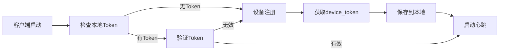

# AI旅拍 - 前端API对接文档汇总

> **项目**：AI旅拍Windows客户端  
> **更新时间**：2026-02-02  
> **文档版本**：v1.0

---

## 📚 文档目录

本目录包含AI旅拍系统所有前端对接API的完整文档。

### 核心API文档

1. **[设备注册API](./前端对接文档-设备注册API.md)** ⭐
   - 首次启动必须调用
   - 获取设备令牌（device_token）
   - 包含JavaScript、Python、C#示例

2. **[设备心跳API](./前端对接文档-设备心跳API.md)** ⭐
   - 定期发送心跳保持连接
   - **重要**：Token必须放在请求头中
   - 包含完整的重试和错误处理机制

3. **[心跳401错误解决方案](./心跳API-401错误解决方案.md)** 🔧
   - 快速解决"缺少设备Token"错误
   - 对比错误和正确的实现方式
   - 包含完整的排查步骤

### 规范文档

4. **[设备注册规范](./设备注册规范.md)**
   - 完整的设备注册生命周期规范
   - 设备信息采集标准
   - 令牌管理和安全规范

---

## 🚀 快速开始

### 第一步：设备注册

首次启动时，必须先注册设备获取令牌：

```javascript
async function registerDevice() {
  const response = await axios.post(
    'http://192.168.11.222/api/ai_travel_photo/device/register',
    {
      device_code: 'DEVICE_001',
      device_id: getHardwareId(),
      bid: 1,
      aid: 1,  // 强制必填
      device_name: '前台拍摄设备1号'
    }
  );
  
  if (response.data.code === 200) {
    const deviceToken = response.data.data.device_token;
    localStorage.setItem('device_token', deviceToken);
    console.log('设备注册成功');
    return true;
  }
  
  return false;
}
```

### 第二步：启动心跳

注册成功后，启动心跳服务：

```javascript
async function sendHeartbeat() {
  const deviceToken = localStorage.getItem('device_token');
  
  const response = await axios.post(
    'http://192.168.11.222/api/ai_travel_photo/device/heartbeat',
    {
      status: 'online',
      timestamp: Math.floor(Date.now() / 1000)
    },
    {
      headers: {
        'Device-Token': deviceToken  // ⚠️ 必须放在请求头中
      }
    }
  );
  
  return response.data.code === 200;
}

// 每60秒发送一次心跳
setInterval(sendHeartbeat, 60000);
```

---

## ⚠️ 常见问题速查

### 问题1：401错误 - "缺少设备Token"

**原因**：Token 位置错误

**解决方案**：
```javascript
// ❌ 错误：Token 放在请求体
{ device_token: 'xxx' }

// ✅ 正确：Token 放在请求头
headers: { 'Device-Token': 'xxx' }
```

📖 详见：[心跳401错误解决方案](./心跳API-401错误解决方案.md)

### 问题2：400错误 - "应用ID不能为空"

**原因**：缺少 `aid` 参数

**解决方案**：
```javascript
// ✅ aid 是强制必填参数
{
  device_code: 'DEVICE_001',
  device_id: 'xxx',
  bid: 1,
  aid: 1  // 必须提供
}
```

### 问题3：请求头名称错误

**正确的请求头名称（大小写敏感）：**
```javascript
✅ 'Device-Token'     // 正确
❌ 'device_token'     // 错误
❌ 'device-token'     // 错误
❌ 'DEVICE-TOKEN'     // 错误
```

### 问题4：Token 格式不正确

**正确的 Token 格式：**
- 32位MD5字符串
- 小写字母（a-f）+ 数字（0-9）
- 示例：`f6a02fbf7682ec1eada81df66e9deeb7`

---

## 📋 API 接口清单

### 设备管理

| 接口 | 方法 | 路径 | 需要Token | 文档 |
|------|------|------|----------|------|
| 设备注册 | POST | /api/ai_travel_photo/device/register | ❌ | [查看](./前端对接文档-设备注册API.md) |
| 设备心跳 | POST | /api/ai_travel_photo/device/heartbeat | ✅ | [查看](./前端对接文档-设备心跳API.md) |
| 获取配置 | GET | /api/ai_travel_photo/device/config | ✅ | 待补充 |
| 设备信息 | GET | /api/ai_travel_photo/device/info | ✅ | 待补充 |
| 上传文件 | POST | /api/ai_travel_photo/device/upload | ✅ | 待补充 |

### 其他模块

| 模块 | 状态 | 说明 |
|------|------|------|
| 二维码 | 📝 待补充 | 二维码生成和验证 |
| 场景 | 📝 待补充 | 场景列表和管理 |
| 相册 | 📝 待补充 | 相册管理 |
| 订单 | 📝 待补充 | 订单处理 |

---

## 🔐 认证机制说明

### Token 获取流程



### Token 使用规则

1. **注册接口**：不需要Token
2. **心跳接口**：需要Token（放在请求头）
3. **其他接口**：需要Token（放在请求头）

### Token 传递方式

```http
POST /api/ai_travel_photo/device/heartbeat HTTP/1.1
Host: 192.168.11.222
Content-Type: application/json
Device-Token: f6a02fbf7682ec1eada81df66e9deeb7  ← Token在这里

{
  "status": "online"
}
```

---

## 🛠️ 开发工具

### cURL 测试命令

#### 1. 测试设备注册

```bash
curl -X POST \
  'http://192.168.11.222/api/ai_travel_photo/device/register' \
  -H 'Content-Type: application/json' \
  -d '{
    "device_code": "TEST001",
    "device_id": "1BC577A32515",
    "bid": 1,
    "aid": 1,
    "device_name": "测试设备"
  }'
```

#### 2. 测试设备心跳

```bash
curl -X POST \
  'http://192.168.11.222/api/ai_travel_photo/device/heartbeat' \
  -H 'Content-Type: application/json' \
  -H 'Device-Token: YOUR_TOKEN_HERE' \
  -d '{
    "status": "online",
    "timestamp": 1738482460
  }'
```

### 在线测试工具

项目中提供了完整的测试工具：

- **API测试页面**：`http://192.168.11.222/test_api_endpoints.html`
- **设备注册测试脚本**：`php /www/wwwroot/eivie/test_device_register_api.php`

---

## 📊 最佳实践

### 1. 统一API客户端封装

```javascript
class AiTravelApiClient {
  constructor(baseURL) {
    this.baseURL = baseURL;
    this.client = axios.create({
      baseURL: baseURL,
      timeout: 10000
    });
    
    // 自动添加 Device-Token
    this.client.interceptors.request.use(config => {
      const token = localStorage.getItem('device_token');
      if (token && config.url !== '/api/ai_travel_photo/device/register') {
        config.headers['Device-Token'] = token;
      }
      return config;
    });
    
    // 统一错误处理
    this.client.interceptors.response.use(
      response => response,
      error => {
        if (error.response?.data?.code === 401) {
          console.error('设备未授权，需要重新注册');
          this.reRegister();
        }
        return Promise.reject(error);
      }
    );
  }
  
  // 设备注册
  async register(data) {
    const response = await this.client.post('/api/ai_travel_photo/device/register', data);
    if (response.data.code === 200) {
      localStorage.setItem('device_token', response.data.data.device_token);
    }
    return response.data;
  }
  
  // 设备心跳
  async heartbeat(data) {
    const response = await this.client.post('/api/ai_travel_photo/device/heartbeat', data);
    return response.data;
  }
  
  // 获取配置
  async getConfig() {
    const response = await this.client.get('/api/ai_travel_photo/device/config');
    return response.data;
  }
  
  // 重新注册
  async reRegister() {
    localStorage.removeItem('device_token');
    // 触发重新注册逻辑
    window.location.reload();
  }
}

// 使用示例
const api = new AiTravelApiClient('http://192.168.11.222');
await api.register({ device_code: 'DEVICE_001', ... });
await api.heartbeat({ status: 'online' });
```

### 2. 心跳服务封装

```javascript
class HeartbeatService {
  constructor(apiClient, interval = 60000) {
    this.api = apiClient;
    this.interval = interval;
    this.timer = null;
    this.failedCount = 0;
    this.maxFailed = 3;
  }
  
  start() {
    this.send();
    this.timer = setInterval(() => this.send(), this.interval);
    console.log('心跳服务已启动');
  }
  
  stop() {
    if (this.timer) {
      clearInterval(this.timer);
      this.timer = null;
    }
    console.log('心跳服务已停止');
  }
  
  async send() {
    try {
      const result = await this.api.heartbeat({
        status: 'online',
        timestamp: Math.floor(Date.now() / 1000)
      });
      
      if (result.code === 200) {
        this.failedCount = 0;
        console.log('心跳成功');
      } else {
        this.failedCount++;
      }
    } catch (error) {
      this.failedCount++;
      console.error('心跳失败:', error.message);
    }
    
    if (this.failedCount >= this.maxFailed) {
      console.error('心跳连续失败，触发告警');
      this.onFailed();
    }
  }
  
  onFailed() {
    // 通知用户
    alert('设备连接异常，请检查网络');
  }
}
```

### 3. 错误处理建议

```javascript
// 统一错误处理函数
function handleApiError(error, context = '') {
  console.error(`[${context}] API错误:`, error);
  
  if (error.response) {
    const { code, msg } = error.response.data;
    
    switch (code) {
      case 400:
        console.error('参数错误:', msg);
        alert(`参数错误：${msg}`);
        break;
        
      case 401:
        console.error('设备未授权:', msg);
        // 重新注册
        localStorage.removeItem('device_token');
        window.location.reload();
        break;
        
      case 500:
        console.error('服务器错误:', msg);
        alert(`服务器错误：${msg}`);
        break;
        
      default:
        console.error('未知错误:', msg);
        alert(`错误：${msg}`);
    }
  } else if (error.request) {
    console.error('网络错误: 无响应');
    alert('网络连接失败，请检查网络');
  } else {
    console.error('请求错误:', error.message);
    alert(`请求失败：${error.message}`);
  }
}

// 使用示例
try {
  await api.heartbeat({ status: 'online' });
} catch (error) {
  handleApiError(error, '心跳服务');
}
```

---

## 🔍 调试技巧

### 1. 浏览器开发者工具

打开 F12 → Network 标签：

1. **查看请求头**：确认 `Device-Token` 是否存在
2. **查看请求体**：确认参数是否正确
3. **查看响应**：分析错误信息

### 2. 添加请求日志

```javascript
// Axios 拦截器
axios.interceptors.request.use(config => {
  console.group('🚀 API请求');
  console.log('URL:', config.url);
  console.log('Method:', config.method);
  console.log('Headers:', config.headers);
  console.log('Data:', config.data);
  console.groupEnd();
  return config;
});

axios.interceptors.response.use(
  response => {
    console.group('✅ API响应');
    console.log('URL:', response.config.url);
    console.log('Status:', response.status);
    console.log('Data:', response.data);
    console.groupEnd();
    return response;
  },
  error => {
    console.group('❌ API错误');
    console.log('URL:', error.config?.url);
    console.log('Error:', error.message);
    console.log('Response:', error.response?.data);
    console.groupEnd();
    return Promise.reject(error);
  }
);
```

### 3. Token 验证

```javascript
// 验证 Token 格式
function validateToken(token) {
  if (!token) {
    console.error('Token为空');
    return false;
  }
  
  if (token.length !== 32) {
    console.error('Token长度错误，应为32位');
    return false;
  }
  
  if (!/^[a-f0-9]{32}$/.test(token)) {
    console.error('Token格式错误，应为32位小写MD5');
    return false;
  }
  
  console.log('Token格式正确 ✅');
  return true;
}

// 使用
const token = localStorage.getItem('device_token');
validateToken(token);
```

---

## 📞 技术支持

### 获取帮助

- **后端开发人员**：[联系方式]
- **问题反馈**：[问题跟踪系统]
- **文档目录**：`/www/wwwroot/eivie/khd/docs/`

### 文档更新

如发现文档问题或需要补充，请联系：
- 技术负责人：[联系方式]
- 文档维护者：[联系方式]

---

## 📝 更新日志

### v1.0 (2026-02-02)
- ✅ 创建设备注册API文档
- ✅ 创建设备心跳API文档
- ✅ 创建心跳401错误解决方案
- ✅ 添加快速开始指南
- ✅ 添加常见问题速查
- ✅ 添加最佳实践示例

---

## 🎯 后续计划

### 待补充的API文档

- [ ] 获取设备配置 API
- [ ] 设备信息查询 API
- [ ] 文件上传 API
- [ ] 二维码生成 API
- [ ] 场景管理 API
- [ ] 相册管理 API
- [ ] 订单处理 API

### 待完善的内容

- [ ] 完整的错误码列表
- [ ] 性能优化建议
- [ ] 安全最佳实践
- [ ] 离线处理方案
- [ ] 数据同步机制

---

**文档汇总完成** 🎉

**建议阅读顺序**：
1. 本汇总文档（快速了解）
2. 设备注册API文档（首次开发）
3. 设备心跳API文档（日常使用）
4. 心跳401错误解决方案（问题排查）
