系统授权后台设计文档

## 1. 概述

本系统是为"点大商城" ThinkPHP 6 项目量身打造的商用软件授权管理后台，部署于 `sysadmin` 目录下，作为独立的授权管控中心运行。核心目标是实现对所有已部署商城实例的域名授权、授权码颁发、有效期管控、自动升级推送、盗版行为检测、域名拉黑、以及通信防篡改签名验证的全链路管理能力。

**系统定位**：授权方（本后台）为"管控端"，被授权的各商城部署实例为"客户端"。管控端独立部署，客户端通过心跳机制定期向管控端请求授权验证。

## 2. 架构

### 2.1 整体架构

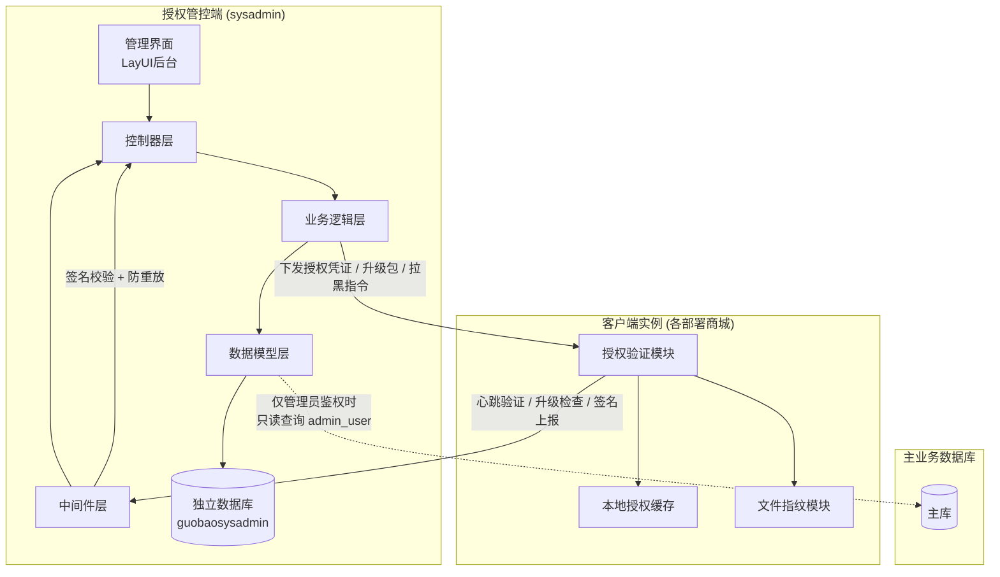

> **数据库隔离策略**：授权系统使用完全独立的 MySQL 数据库 `guobaosysadmin`，与主业务库物理隔离，所有授权数据模型均通过 ThinkPHP 的多数据库连接配置指向该独立库。仅在管理员登录鉴权时只读访问主库的 `admin_user` 表。

### 2.2 目录结构规划

以下目录均位于项目根目录 `sysadmin/` 下，遵循现有项目 ThinkPHP 6 的分层约定：

| 层级 | 路径 | 职责 |
|------|------|------|
| 控制器 | `sysadmin/controller/` | 处理请求路由与响应，包含管理后台页面和 API 接口 |
| 服务层 | `sysadmin/service/` | 核心业务逻辑（授权签发、盗版检测、升级管理等） |
| 模型层 | `sysadmin/model/` | ORM 数据模型定义与数据访问 |
| 中间件 | `sysadmin/middleware/` | 请求签名校验、管理员鉴权、防重放攻击 |
| 视图层 | `sysadmin/view/` | LayUI 管理后台页面模板 |
| 配置 | `config/sysadmin.php` | 授权系统专属配置（密钥对、签名算法、心跳周期等） |
| 数据库配置 | `config/database.php` 新增连接 | 在现有数据库配置中新增 `sysadmin` 连接，指向独立数据库 |

### 2.3 核心模块划分

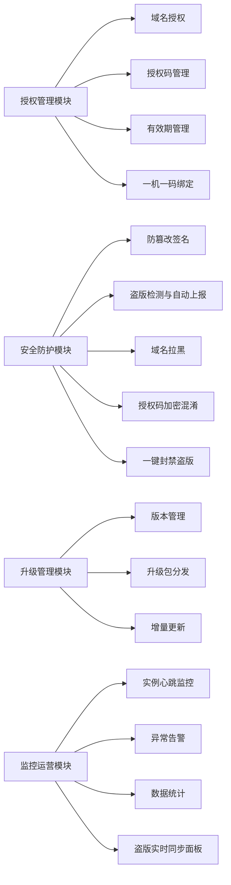

## 3. API 端点参考

### 3.1 管理后台接口（内部管理用）

管理后台接口需经过 `SysadminAuth` 中间件校验管理员身份（独立 Session 鉴权，基于 `guobaosysadmin` 库中的 `sa_admin` 表验证），授权后台拥有完全独立的登录入口和管理员体系。

| 方法 | 端点 | 说明 |
|------|------|------|
| GET | `SysadminLicense/index` | 授权列表页面（支持按域名、状态、到期时间筛选） |
| POST | `SysadminLicense/create` | 创建新授权（生成授权码，绑定域名） |
| POST | `SysadminLicense/update` | 编辑授权信息（续期、修改域名、调整套餐等级） |
| POST | `SysadminLicense/revoke` | 吊销授权（立即失效） |
| POST | `SysadminLicense/renew` | 授权续期 |
| GET | `SysadminBlacklist/index` | 黑名单域名列表 |
| POST | `SysadminBlacklist/add` | 添加域名到黑名单 |
| POST | `SysadminBlacklist/remove` | 从黑名单移除域名 |
| GET | `SysadminUpgrade/index` | 版本管理列表 |
| POST | `SysadminUpgrade/publish` | 发布新版本（上传升级包，填写变更日志） |
| POST | `SysadminUpgrade/withdraw` | 撤回已发布版本 |
| GET | `SysadminMonitor/index` | 实例监控仪表盘 |
| GET | `SysadminMonitor/detail` | 单个实例详情（心跳历史、文件指纹、异常记录） |
| GET | `SysadminMonitor/alerts` | 异常告警列表（盗版疑似、签名异常等） |
| GET | `SysadminPiracy/index` | 盗版管理页面（所有已发现盗版实例列表，支持筛选状态） |
| POST | `SysadminPiracy/banAll` | 一键封禁所有未处理盗版（批量拉黑域名+IP+吊销关联授权） |
| POST | `SysadminPiracy/ban` | 封禁单个盗版实例 |
| POST | `SysadminPiracy/ignore` | 标记为误报 |
| GET | `SysadminDashboard/index` | 总览面板（授权统计、到期预警、活跃实例数、盗版数） |
| GET | `SysadminLogin/index` | 独立登录页面 |
| POST | `SysadminLogin/login` | 管理员登录验证 |
| GET | `SysadminLogin/logout` | 退出登录 |
| GET | `SysadminSetting/index` | 系统设置（密钥管理、心跳配置、告警阈值等） |
| POST | `SysadminSetting/save` | 保存系统设置 |

### 3.2 客户端验证接口（对外公开）

客户端接口需携带 HMAC 签名 + 时间戳 + 随机数，经 `LicenseSignatureVerify` 中间件验证后放行。

| 方法 | 端点 | 说明 |
|------|------|------|
| POST | `SysadminApi/verify` | 授权心跳验证（客户端定期调用） |
| POST | `SysadminApi/activate` | 首次激活授权（提交授权码 + 域名） |
| POST | `SysadminApi/checkUpgrade` | 检查可用升级版本 |
| POST | `SysadminApi/downloadUpgrade` | 下载升级包（需验证授权有效性） |
| POST | `SysadminApi/reportFingerprint` | 上报文件指纹用于盗版检测 |
| POST | `SysadminApi/reportPiracy` | 客户端主动上报发现的盗版实例（自动同步到后台） |

### 3.3 请求/响应 Schema

#### 心跳验证请求

| 字段 | 类型 | 必填 | 说明 |
|------|------|------|------|
| license_code | string | 是 | 加密后的授权码密文（经客户端加密混淆） |
| domain | string | 是 | 当前部署域名 |
| version | string | 是 | 当前系统版本号 |
| file_hash | string | 是 | 核心文件聚合哈希值 |
| server_ip | string | 是 | 服务器公网 IP |
| server_mac | string | 是 | 服务器 MAC 地址（首次激活绑定的网卡 MAC） |
| php_version | string | 否 | PHP 版本 |
| timestamp | integer | 是 | Unix 时间戳 |
| nonce | string | 是 | 随机字符串 |
| signature | string | 是 | HMAC-SHA256 签名 |

#### 心跳验证响应

| 字段 | 类型 | 说明 |
|------|------|------|
| status | integer | 状态：1=有效，0=无效，-1=已拉黑 |
| msg | string | 状态消息 |
| expire_time | integer | 授权到期时间戳（0为永久） |
| edition | string | 授权套餐等级 |
| signature | string | 响应签名（客户端需验证） |
| force_upgrade | boolean | 是否存在强制升级 |
| latest_version | string | 最新可用版本号 |

#### 首次激活请求

| 字段 | 类型 | 必填 | 说明 |
|------|------|------|------|
| license_code | string | 是 | 加密后的授权码密文 |
| domain | string | 是 | 部署域名 |
| server_ip | string | 是 | 服务器公网 IP |
| server_mac | string | 是 | 服务器主网卡 MAC 地址 |
| server_info | object | 否 | 服务器环境信息（PHP版本、数据库版本、CPU序列号等） |

#### 盗版上报请求

| 字段 | 类型 | 必填 | 说明 |
|------|------|------|------|
| license_code | string | 是 | 上报方自身的加密授权码 |
| pirate_domain | string | 是 | 发现的盗版域名 |
| pirate_ip | string | 否 | 盗版服务器 IP |
| evidence_type | int | 是 | 证据类型：1=相同授权码 2=相同文件指纹 3=用户举报 |
| evidence_detail | string | 否 | 证据详情描述 |
| timestamp | integer | 是 | Unix 时间戳 |
| signature | string | 是 | HMAC-SHA256 签名 |

## 4. 数据模型

### 4.1 ER 关系图

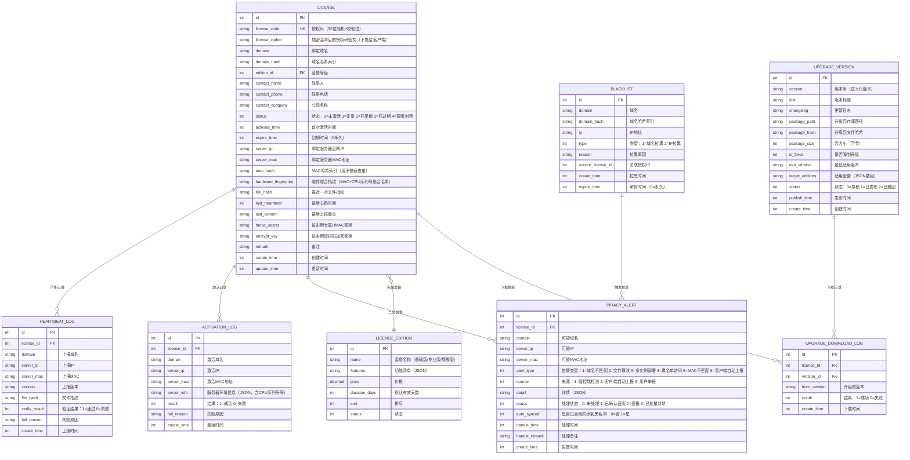

### 4.2 独立数据库连接配置

授权系统使用独立数据库，需在 `config/database.php` 的 `connections` 数组中新增 `sysadmin` 连接：

| 配置项 | 值 | 说明 |
|--------|-----|------|
| 连接名 | `sysadmin` | ThinkPHP 多数据库连接标识 |
| 数据库类型 | mysql | 与主库一致 |
| 数据库名 | `guobaosysadmin` | 独立授权数据库 |
| 用户名 | `guobaosysadmin` | 独立数据库账号 |
| 密码 | `[sysadmin_db_password]` | 独立数据库密码 |
| 字符集 | utf8mb4 | 与主库一致 |
| 表前缀 | `sa_` | 授权库专用前缀，简短且与主库区分 |

所有授权系统的 Model 类需通过 `$connection = 'sysadmin'` 属性指定使用该独立连接。直接使用 Db 门面时需通过 `Db::connect('sysadmin')` 切换连接。

### 4.3 表前缀与命名

授权库使用独立前缀 `sa_`，不再加 `sysadmin_` 长前缀：

| 模型类名 | 物理表名 | 模型所属连接 |
|----------|----------|-------------|
| SysadminLicense | `sa_license` | sysadmin |
| SysadminLicenseEdition | `sa_license_edition` | sysadmin |
| SysadminBlacklist | `sa_blacklist` | sysadmin |
| SysadminHeartbeatLog | `sa_heartbeat_log` | sysadmin |
| SysadminActivationLog | `sa_activation_log` | sysadmin |
| SysadminPiracyAlert | `sa_piracy_alert` | sysadmin |
| SysadminUpgradeVersion | `sa_upgrade_version` | sysadmin |
| SysadminUpgradeDownloadLog | `sa_upgrade_download_log` | sysadmin |
| SysadminAdmin | `sa_admin` | sysadmin |

### 4.4 独立管理员表

由于授权系统使用独立数据库，需在 `guobaosysadmin` 库中维护一张独立管理员表 `sa_admin`，用于授权后台的登录鉴权，不再依赖主库 `admin_user` 表：

| 字段 | 类型 | 说明 |
|------|------|------|
| id | int PK | 主键 |
| username | string UK | 登录账号 |
| password | string | 密码（bcrypt 哈希） |
| nickname | string | 显示昵称 |
| role | int | 角色：1=超级管理员 2=运营 |
| status | int | 状态：0=禁用 1=启用 |
| last_login_time | int | 最后登录时间 |
| last_login_ip | string | 最后登录IP |
| create_time | int | 创建时间 |
| update_time | int | 更新时间 |

## 5. 业务逻辑层

### 5.1 授权码生成与验证

**授权码结构**：32 位字符，由 `前缀(3位)` + `随机体(25位)` + `校验位(4位)` 构成。明文授权码仅存储在管控端数据库，下发给客户端的是经过加密混淆后的密文形式。

授权码生成流程：

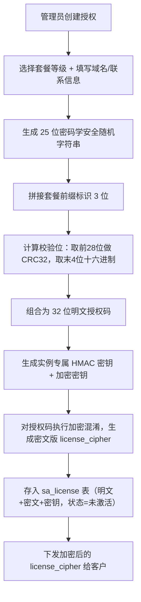

**校验规则**：
- 客户端提交授权码时，传输的是加密后的密文，管控端解密后再做格式校验（长度、前缀、校验位）
- 通过格式校验后再向管控端发起在线验证

### 5.2 授权码加密混淆机制

为防止客户篡改客户端代码中硬编码的授权码或绕过授权校验，授权码在下发、存储和传输全链路均采用加密混淆形式：

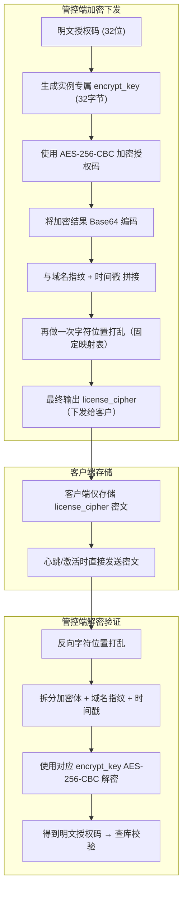

**混淆策略详情**：

| 层级 | 方法 | 目的 |
|------|------|------|
| 第1层：对称加密 | AES-256-CBC，每实例独立密钥 | 防止直接读取明文授权码 |
| 第2层：域名绑定 | 密文中嵌入域名指纹 | 复制密文到其他域名时自动失效 |
| 第3层：时间戳绑定 | 密文含生成时间 | 防止旧密文重放攻击 |
| 第4层：位置打乱 | 固定映射表字符重排 | 增加静态分析难度 |

**客户端反篡改保护**：
- 客户端的授权验证模块自身也纳入文件指纹检测范围，任何篡改将导致指纹变化被管控端检测
- 授权验证逻辑分散在多个文件中，而非集中一处，增加篡改成本
- 关键常量和校验逻辑使用运行时动态生成，而非硬编码字面量

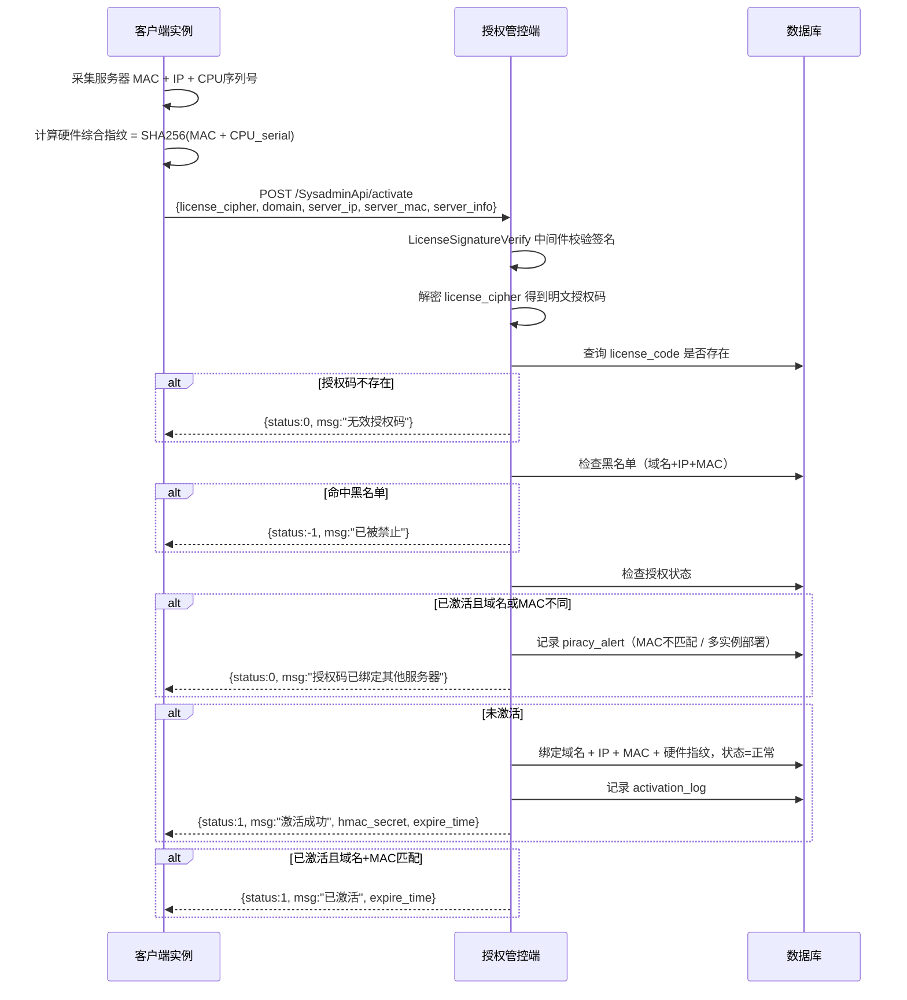

**一机一码绑定策略**：

| 绑定维度 | 采集方式 | 绑定规则 |
|----------|----------|----------|
| MAC 地址 | 读取服务器主网卡 MAC | 首次激活时绑定，后续心跳每次比对 |
| 公网 IP | 服务器出口 IP | 允许变更，但变更时触发中级告警 |
| CPU 序列号 | 读取系统 CPU 信息 | 纳入硬件指纹聚合计算 |
| 硬件综合指纹 | SHA256(MAC + CPU_serial) | 多因子综合防止单一伪造 |

**换机迁移流程**：当客户需要更换服务器时，由管理员在后台执行“重置硬件绑定”操作，清除原 MAC/IP/硬件指纹，客户端在新服务器上重新激活即可

### 5.4 心跳验证机制

客户端每隔固定周期（默认 6 小时）向管控端发送心跳，同时上报 MAC 地址用于一机一码持续校验，管控端返回授权状态。

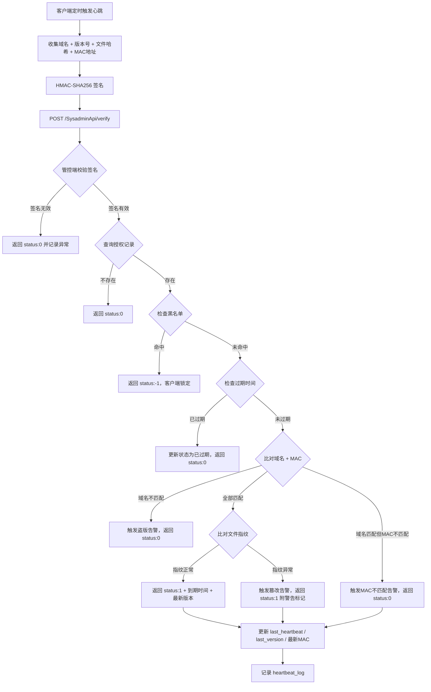

**客户端离线容灾**：
- 客户端本地缓存最近一次成功验证结果，缓存有效期为心跳周期的 3 倍（默认 18 小时）
- 超过缓存有效期且无法连接管控端时，进入降级模式（限制部分高级功能）
- 超过 7 天未成功验证则完全锁定

### 5.5 防篡改签名机制

**签名算法**：HMAC-SHA256

**请求签名流程**：

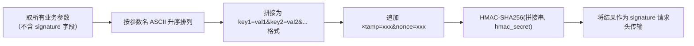

**防重放策略**：
- 时间戳有效窗口：±300 秒（5 分钟）
- nonce 唯一性：管控端缓存已用 nonce 10 分钟，重复则拒绝
- 响应也需签名：管控端返回数据同样携带签名，客户端验证响应真实性（双向签名）

### 5.6 盗版检测引擎

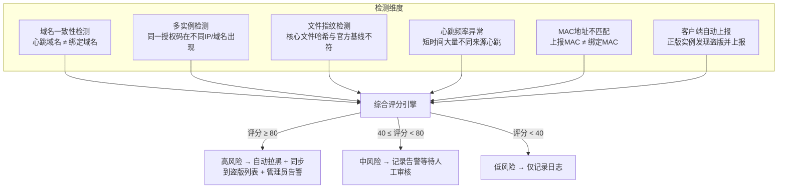

**评分权重分配**：

| 检测维度 | 权重 | 触发条件 |
|----------|------|----------|
| 域名不匹配 | 30分 | 心跳域名与绑定域名不一致 |
| MAC不匹配 | 35分 | 上报MAC与绑定MAC不一致 |
| 多实例部署 | 40分 | 同一授权码在不同服务器出现 |
| 文件篡改 | 25分 | 文件指纹与官方基线不匹配 |
| 心跳频率异常 | 20分 | 1小时内超过10次不同来源心跳 |
| 客户端主动上报 | 50分 | 正版实例上报发现盗版 |

**文件指纹方案**：
- 客户端对指定核心文件列表（如 BaseController、核心中间件、Service 层关键文件）分别计算哈希
- 将各文件哈希排序后做二次聚合哈希，生成单一指纹上报
- 管控端维护每个版本的官方基线指纹，心跳时比对

### 5.7 盗版自动上报与同步机制

已激活的正版客户端实例可以主动发现并上报盗版行为，管控端自动将非法域名同步到盗版列表：

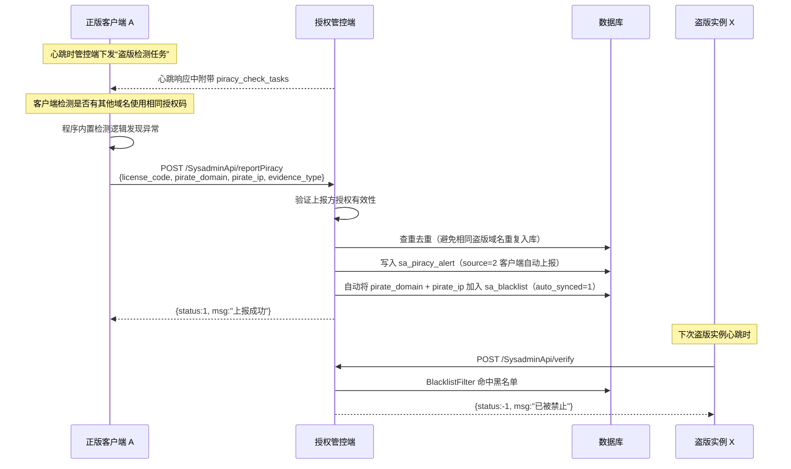

**自动同步规则**：
- 客户端上报的盗版域名自动写入 `sa_piracy_alert` 表，source 标记为“客户端自动上报”
- 高可信度上报（如相同授权码被多个正版实例上报）自动同步到黑名单
- 低可信度上报仅记录，等待管理员审核
- 后台盗版管理面板实时展示所有自动同步的盗版记录

### 5.8 域名拉黑机制

| 拉黑触发方式 | 说明 |
|-------------|------|
| 手动拉黑 | 管理员在后台直接添加域名/IP 到黑名单 |
| 自动拉黑 | 盗版检测评分达到高风险阈值后自动触发 |
| 授权吹销联动 | 吊销授权时可选联动将该域名加入黑名单 |
| 盗版上报自动同步 | 客户端上报的盗版域名自动加入黑名单 |

**拉黑效果**：
- 该域名/IP 的所有心跳请求直接返回 `status:-1`
- 客户端收到拉黑响应后进入锁定状态，清除本地缓存
- 黑名单支持设置过期时间（临时拉黑）或永久拉黑

### 5.9 一键封禁所有盗版

管理员可在盗版管理页面点击“一键封禁所有盗版”，系统批量处理所有未处理的盗版告警：

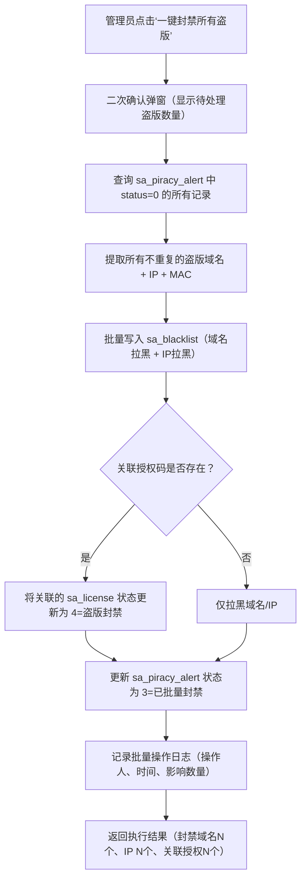

**批量操作安全约束**：
- 必须二次确认，显示即将影响的盗版数量和关联授权数量
- 执行后生成操作报告，记录每一条处理明细
- 支持撤销：在 24 小时内可批量撤销（从黑名单移除 + 恢复告警状态）
- 仅超级管理员（role=1）可执行此操作

### 5.10 自动升级机制

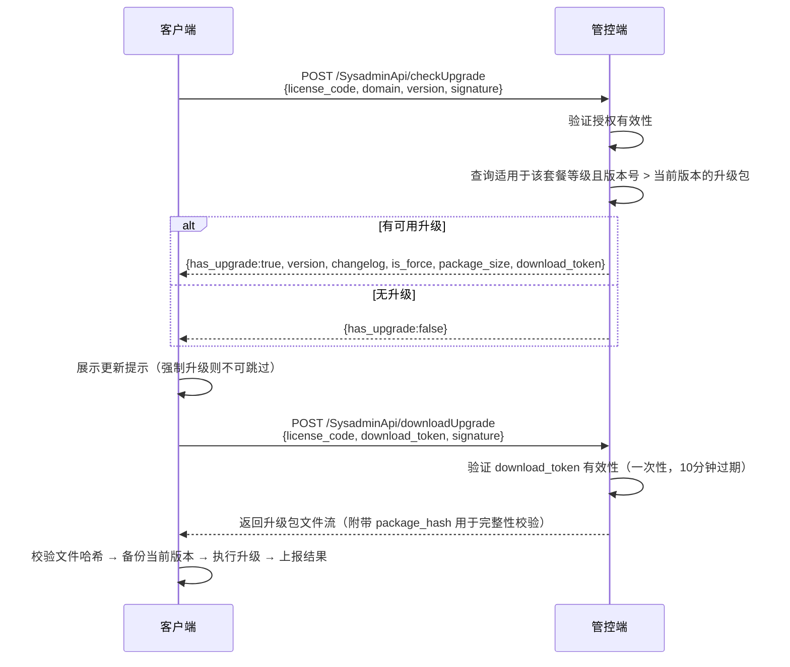

**版本策略**：
- 语义化版本号（主版本.次版本.修订号）
- 支持设置最低适用版本（跨大版本需逐级升级）
- 升级包按套餐等级区分，不同等级可获取不同功能集

### 5.11 过期管理

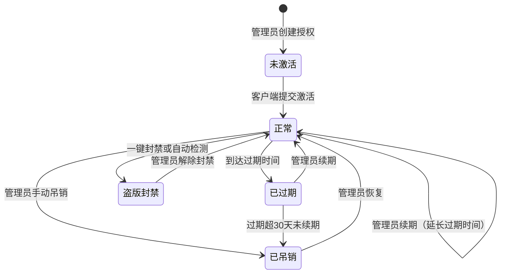

**定时任务**（复用项目现有的 think-queue 机制）：
- 每日凌晨扫描即将过期的授权（提前 7 天、3 天、1 天），触发到期预警通知
- 扫描已过期授权，自动更新状态
- 扫描过期超过 30 天未续费的授权，自动吊销
- 清理 heartbeat_log 中超过 90 天的历史数据

## 6. 中间件与拦截器

### 6.1 中间件清单

| 中间件 | 应用范围 | 职责 |
|--------|---------|------|
| `SysadminAuth` | 管理后台所有页面接口 | 校验管理员登录状态（独立 Session 机制），基于 `sa_admin` 表鉴权 |
| `LicenseSignatureVerify` | 客户端 API 接口 | 验证 HMAC-SHA256 签名 + 时间戳窗口 + nonce 唯一性 |
| `BlacklistFilter` | 客户端 API 接口 | 前置检查请求来源域名/IP 是否在黑名单中，命中则直接拦截 |
| `RequestRateLimiter` | 客户端 API 接口 | 按授权码限流，防止暴力请求（默认每分钟 10 次） |

### 6.2 中间件执行顺序

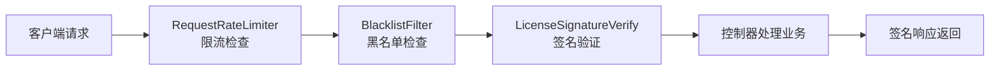

## 7. 测试

### 7.1 单元测试范围

| 测试模块 | 测试重点 |
|----------|---------|
| 授权码生成与校验 | 校验位计算正确性、格式验证（长度、前缀、非法字符）、唯一性保证 |
| 授权码加密混淆 | AES-256-CBC 加解密一致性、域名指纹绑定验证、字符位置打乱可逆性、不同实例密钥隔离 |
| 一机一码绑定 | MAC地址采集准确性、硬件指纹计算一致性、换机重置流程、MAC不匹配告警触发 |
| HMAC 签名 | 签名生成与验证的一致性、参数排序正确性、时间戳过期拒绝、nonce 重复拒绝 |
| 域名匹配 | 精确匹配、www前缀忽略、大小写不敏感、子域名通配模式 |
| 授权状态机 | 各状态间的合法转换（含新增盗版封禁状态）、非法转换拒绝、过期自动流转 |
| 盗版检测评分 | 各检测维度独立评分、权重计算、综合评分计算、阈值触发逻辑（含MAC不匹配、客户端上报维度） |
| 盗版自动上报 | 上报去重逻辑、自动同步黑名单、上报来源标记准确性、无效授权的上报拒绝 |
| 一键封禁 | 批量拉黑完整性、关联授权状态更新、操作日志记录、权限控制、撤销机制 |
| 黑名单过滤 | 域名命中、IP命中、MAC命中、通配符匹配、临时拉黑过期自动解除 |
| 升级版本匹配 | 版本号比较、套餐等级过滤、最低版本限制、强制升级标记 |
| 心跳离线容灾 | 缓存有效期计算、降级模式触发、完全锁定触发 |

### 7.2 测试策略

- 服务层（Service）做完整的单元测试，通过 Mock 数据模型实现与数据库解耦
- 中间件做独立测试，验证各类异常请求的拦截效果
- 控制器做接口级集成测试，验证完整请求链路
- 盗版检测引擎需构造多种边界场景进行评分验证
- 加密混淆模块需测试不同密钥间的隔离性，确保 A 实例的密文无法用 B 实例的密钥解密
- 一键封禁功能需构造大批量盗版告警场景，验证批量操作的原子性和完整性
