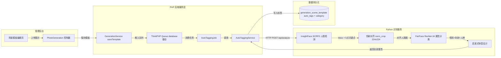
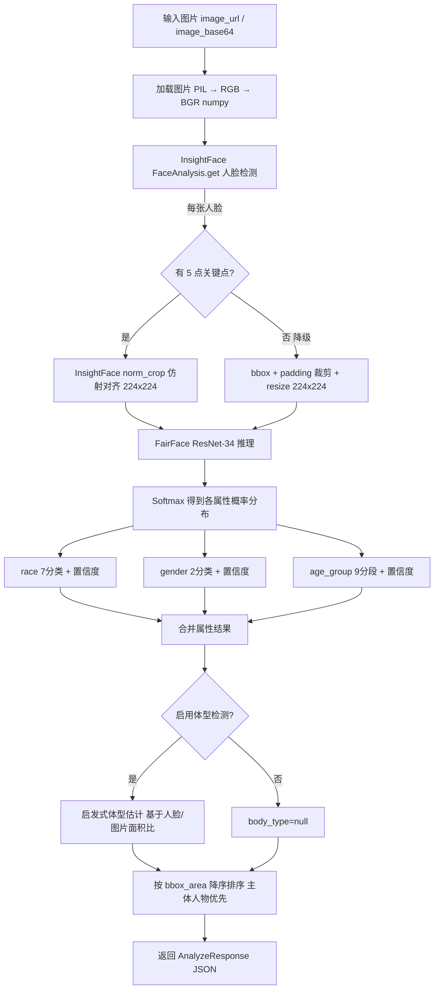
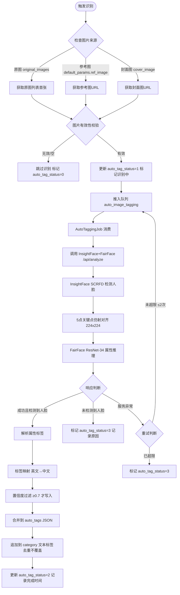
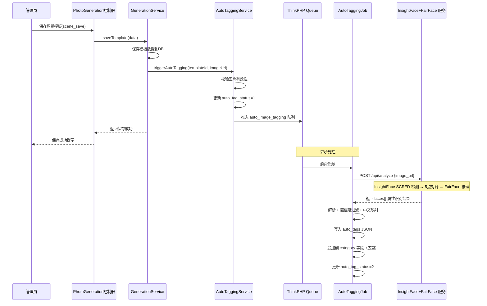

# 场景模板分类标签自动化写入 — 设计文档

> **版本**: v2.0 &nbsp;|&nbsp; **更新日期**: 2026-04-16 &nbsp;|&nbsp; **核心技术**: InsightFace + FairFace 一体化

---

## 1. 概述

本功能为场景模板（`generation_scene_template`）提供基于 **InsightFace（人脸检测 + 对齐）** 与 **FairFace（属性分类）** 的人物图片自动标签识别能力。当管理员上传原始人物图片（原图/参考图）时，系统自动调用识别服务，提取人物的 **性别、年龄分段、人种、体型** 四类属性标签，并自动写入模板的分类标签字段（`category` 文本标签），辅助模板分类与前端筛选。

### 1.1 核心价值

| 价值 | 说明 |
|------|------|
| **降低人工标注成本** | 减少运营人员手动填写分类标签的工作量 |
| **标签标准化** | 通过模型统一识别，确保标签体系一致性 |
| **提升筛选精度** | 用户端可按性别、年龄、人种等维度精确筛选模板 |

### 1.2 触发场景

| 触发入口 | 说明 |
|---------|------|
| 管理后台-场景模板编辑页 | 管理员上传/修改封面图或原图时自动触发识别 |
| 一键转模板 | 生成记录转模板时，对源记录的参考图自动识别 |
| 批量标签补全 | 对已有模板进行批量补全标签的管理操作 |

### 1.3 技术选型变更记录

| 版本 | 变更内容 |
|------|---------|
| v1.0 | 初版设计，人脸检测使用 MTCNN |
| **v2.0** | **升级为 InsightFace（SCRFD/RetinaFace）+ FairFace 一体化方案** |

**v2.0 升级理由**:
- InsightFace 的 SCRFD 检测器在精度和速度上均优于 MTCNN（WiderFace Hard mAP 93.78% vs 84.8%）
- InsightFace 内置高质量 5 点仿射对齐（`norm_crop`），比 MTCNN 的 landmark 对齐更稳定
- InsightFace 使用 ONNX Runtime 推理，可同时利用 GPU/CPU，部署灵活
- 一体化流水线减少组件间数据转换开销

---

## 2. 架构设计

### 2.1 系统架构



### 2.2 InsightFace + FairFace 识别服务内部流水线



### 2.3 一体化流水线关键技术细节

#### 2.3.1 InsightFace 人脸检测层

| 配置项 | 值 | 说明 |
|--------|-----|------|
| 模型包 | `buffalo_l` | 包含 SCRFD-10G 检测 + ArcFace 识别（本方案仅用检测部分） |
| 检测分辨率 | 640×640 | `det_size=(640,640)`，精度/速度平衡 |
| 推理后端 | ONNX Runtime | 优先 CUDAExecutionProvider，降级 CPUExecutionProvider |
| 输出 | `face.bbox` + `face.kps` | 每张人脸的边界框和 5 个关键点坐标 |

#### 2.3.2 人脸对齐层

| 策略 | 条件 | 方法 |
|------|------|------|
| **主策略** | `kps` 存在且 ≥5 点 | `insightface.utils.face_align.norm_crop(img_bgr, kps, image_size=224)` 仿射变换 |
| **降级策略** | `kps` 缺失 | 按 bbox 中心扩展 30% padding 裁剪 + resize 到 224×224 |

对齐后输出 224×224 RGB PIL Image，直接送入 FairFace。

#### 2.3.3 FairFace 属性分类层

| 配置项 | 值 |
|--------|-----|
| 骨干网络 | ResNet-34 (torchvision) |
| 权重文件 | `res34_fair_align_multi_7_20190809.pt` |
| 输入尺寸 | 224×224 |
| 预处理 | `Normalize(mean=[0.485,0.456,0.406], std=[0.229,0.224,0.225])` |
| 输出头 | race(7) + gender(2) + age(9) = 18 维 |

**兼容两种权重格式**：

| 格式 | 检测方式 | 处理 |
|------|---------|------|
| 单 fc 合并模式 | `fc.weight.shape[0] == 18` | 切分 `[:7]`, `[7:9]`, `[9:18]` |
| 多头分离模式 | 存在 `race_fc` / `gender_fc` / `age_fc` | 分别加载三个分类头 |

#### 2.3.4 体型估计层（启发式）

> FairFace 原生不输出体型。仅在全身照中通过人脸占比进行粗略估计。

| 判断条件 | 结果 |
|---------|------|
| 人脸面积占全图 > 15% | 非全身照，返回 `null` |
| 人脸中心 Y 坐标 / 图高 > 0.35 | 非全身照，返回 `null` |
| 人脸宽 / 图宽 < 0.06 | `slim`（纤细），置信度 0.5 |
| 人脸宽 / 图宽 < 0.10 | `average`（匀称），置信度 0.5 |
| 人脸宽 / 图宽 < 0.14 | `muscular`（健壮），置信度 0.4 |
| 人脸宽 / 图宽 ≥ 0.14 | `heavy`（丰满），置信度 0.4 |

---

## 3. API 端点参考

### 3.1 InsightFace + FairFace 识别服务接口

部署文件：`deploy/fairface_server.py`

| 端点 | 方法 | 说明 |
|------|------|------|
| `/api/health` | GET | 健康检查（返回两个模型的加载状态） |
| `/api/info` | GET | 模型信息与能力枚举 |
| `/api/analyze` | POST | 人物图片属性识别（一体化全流程） |

#### GET /api/health 响应

```json
{
  "status": "ok",
  "insightface_loaded": true,
  "fairface_loaded": true,
  "model": "InsightFace + FairFace"
}
```

#### GET /api/info 响应

```json
{
  "status": "ok",
  "model": {
    "name": "InsightFace + FairFace",
    "version": "1.0.0",
    "detection": "InsightFace (SCRFD/RetinaFace)",
    "classification": "FairFace ResNet-34",
    "capabilities": [
      "face_detection",
      "face_alignment",
      "gender_classification",
      "age_classification",
      "race_classification",
      "body_type_estimation"
    ]
  },
  "labels": {
    "gender": ["Male", "Female"],
    "age_group": ["0-2","3-9","10-19","20-29","30-39","40-49","50-59","60-69","70+"],
    "race": ["White","Black","Latino_Hispanic","East Asian","Southeast Asian","Indian","Middle Eastern"],
    "body_type": ["slim","average","muscular","heavy"]
  }
}
```

#### POST /api/analyze 请求参数

| 参数 | 类型 | 必填 | 说明 |
|------|------|------|------|
| image_url | string | 二选一 | 图片远程URL |
| image_base64 | string | 二选一 | 图片Base64编码（兼容 `data:image/...;base64,` 前缀） |
| detect_body_type | boolean | 否 | 是否启用体型检测，默认 `true` |

#### POST /api/analyze 响应结构

```json
{
  "status": "success",
  "faces": [
    {
      "bbox": [102.3, 85.1, 245.7, 289.4],
      "bbox_area": 29287.5,
      "gender": "Female",
      "gender_confidence": 0.9521,
      "age_group": "20-29",
      "age_confidence": 0.8734,
      "race": "East Asian",
      "race_confidence": 0.9182,
      "body_type": "slim",
      "body_type_confidence": 0.5
    }
  ],
  "face_count": 1,
  "analysis_time": 0.342
}
```

> **排序规则**：`faces` 数组按 `bbox_area` 降序排列，索引 0 即面积最大的主体人物。

### 3.2 后端内部接口

管理后台新增以下内部接口：

| 端点 | 控制器方法 | 说明 |
|------|-----------|------|
| `PhotoGeneration/auto_tag` | `auto_tag()` | 手动触发单个模板的标签识别 |
| `PhotoGeneration/batch_auto_tag` | `batch_auto_tag()` | 批量触发标签识别 |
| `PhotoGeneration/get_auto_tags` | `get_auto_tags()` | 获取模板的自动标签结果 |

---

## 4. 数据模型

### 4.1 generation_scene_template 表扩展字段

在现有 `ddwx_generation_scene_template` 表基础上新增以下字段（已通过 `migrate_auto_tagging.php` 迁移）：

| 字段名 | 类型 | 默认值 | 说明 |
|--------|------|--------|------|
| `auto_tags` | JSON | NULL | 自动识别的标签数据（结构化JSON） |
| `auto_tag_status` | TINYINT(1) | 0 | 自动标签状态：0=未识别，1=识别中，2=已完成，3=识别失败 |
| `auto_tag_time` | INT(11) | 0 | 最后一次自动标签识别时间戳 |
| `auto_tag_source_url` | VARCHAR(500) | '' | 用于识别的源图片URL |

**索引**：`idx_auto_tag_status` (`auto_tag_status`, `status`) — 加速批量补全查询。

### 4.2 auto_tags JSON 结构

```json
{
  "faces": [
    {
      "gender": "Female",
      "gender_label": "女性",
      "age_group": "20-29",
      "age_label": "青年",
      "race": "East Asian",
      "race_label": "东亚",
      "body_type": "slim",
      "body_type_label": "纤细"
    }
  ],
  "primary_tags": ["女性", "青年", "东亚", "纤细"],
  "tag_string": "女性,青年,东亚,纤细",
  "face_count": 1,
  "confidence": {
    "gender": 0.95,
    "age_group": 0.87,
    "race": 0.92,
    "body_type": 0.50
  }
}
```

### 4.3 标签枚举定义

#### 性别标签

| 模型输出值 | 中文标签 |
|-----------|---------|
| Male | 男性 |
| Female | 女性 |

#### 年龄分段标签

| 模型输出值 | 中文标签 |
|-----------|---------|
| 0-2 | 婴幼儿 |
| 3-9 | 儿童 |
| 10-19 | 少年 |
| 20-29 | 青年 |
| 30-39 | 中青年 |
| 40-49 | 中年 |
| 50-59 | 中老年 |
| 60-69 | 老年 |
| 70+ | 高龄 |

#### 人种标签

| 模型输出值 | 中文标签 |
|-----------|---------|
| East Asian | 东亚 |
| Southeast Asian | 东南亚 |
| Indian | 南亚 |
| Black | 非裔 |
| White | 欧美 |
| Middle Eastern | 中东 |
| Latino_Hispanic | 拉丁裔 |

#### 体型标签

| 模型输出值 | 中文标签 |
|-----------|---------|
| slim | 纤细 |
| average | 匀称 |
| muscular | 健壮 |
| heavy | 丰满 |

> **注**：体型为启发式估计，仅在全身照（人脸占全图 < 15% 且位于上部 1/3）时输出，置信度上限为 0.5。

---

## 5. 业务逻辑层

### 5.1 核心业务流程



### 5.2 标签写入策略

| 策略 | 说明 |
|------|------|
| 追加不覆盖 | 自动标签追加到 `category` 字段末尾，不删除管理员手动输入的标签 |
| 去重处理 | 写入前检查 `category` 中是否已存在相同标签，避免重复 |
| 主人物优先 | 多人脸时取 `bbox_area` 最大的人脸（主体人物）的属性作为主标签 |
| 置信度阈值 | 仅当单项属性置信度 ≥ 0.7 时才写入对应标签（配置项 `auto_tag_confidence_threshold`） |
| 可手动覆盖 | 管理员可在编辑页随时修改/删除自动标签 |

### 5.3 图片来源优先级

| 优先级 | 字段 | 说明 |
|-------|------|------|
| 1 | `original_images` | 原始人物图片列表（JSON数组），取第一张 |
| 2 | `default_params` 中的 `ref_image` / `image` | 默认参数中的参考图 |
| 3 | `cover_image` | 封面图（可能已经过AI生成处理） |

### 5.4 自动触发时机



### 5.5 批量标签补全逻辑

管理后台提供批量补全入口，对 `auto_tag_status=0` 且有可用图片的模板批量推入识别队列：

| 步骤 | 说明 |
|------|------|
| 1 | 筛选条件：`auto_tag_status=0`，`status=1`（启用），有可用图片 |
| 2 | 每批次限制数量（默认50条，配置项 `batch_limit`），避免队列堆积 |
| 3 | 逐条推入 `auto_image_tagging` 队列 |
| 4 | 返回推入数量统计 |

---

## 6. 服务层设计

### 6.1 AutoTaggingService

文件：`app/service/AutoTaggingService.php`

| 方法 | 职责 |
|------|------|
| `triggerAutoTagging($templateId, $imageUrl)` | 触发单模板识别，推入队列 |
| `batchTrigger($where, $limit)` | 批量触发识别 |
| `callFairFaceApi($imageUrl)` | 调用 InsightFace+FairFace 识别服务 |
| `parseAndMapTags($apiResponse)` | 解析API响应并映射为中文标签 |
| `mergeTagsToTemplate($templateId, $tags)` | 将标签合并写入模板 |
| `getTaggingStatus($templateId)` | 获取识别状态 |
| `getSourceImageUrl($templateData)` | 按优先级获取源图片URL |

### 6.2 AutoTaggingJob

文件：`app/job/AutoTaggingJob.php`

| 行为 | 说明 |
|------|------|
| 队列名称 | `auto_image_tagging` |
| 最大重试 | 2次（配置项 `auto_tag_max_retry`） |
| 重试延迟 | 60秒（配置项 `auto_tag_retry_delay`） |
| 超时时间 | 30秒（配置项 `fairface_timeout`） |
| 失败处理 | 标记 `auto_tag_status=3`，记录错误信息 |

### 6.3 InsightFace + FairFace 识别服务

文件：`deploy/fairface_server.py`

| 配置项 | 说明 |
|--------|------|
| 框架 | FastAPI + Uvicorn |
| 默认端口 | 8867 |
| 人脸检测 | InsightFace `FaceAnalysis(name='buffalo_l')` — 内含 SCRFD-10G |
| 人脸对齐 | InsightFace `norm_crop` 5点仿射对齐到 224×224 |
| 属性分类 | FairFace ResNet-34 (PyTorch)，输出 race(7)+gender(2)+age(9) |
| 体型估计 | 启发式（人脸/图片面积比），非模型输出 |
| GPU 支持 | InsightFace: ONNX CUDAExecutionProvider；FairFace: PyTorch CUDA |
| CPU 降级 | 两者均支持 CPU-only 运行 |

**启动命令**：

```bash
python deploy/fairface_server.py \
    --host 0.0.0.0 \
    --port 8867 \
    --det-model buffalo_l \
    --fairface-weights ./models/res34_fair_align_multi_7_20190809.pt \
    --device auto \
    --gpu-id 0
```

**依赖安装**：

```bash
pip install insightface onnxruntime-gpu fastapi uvicorn python-multipart \
            Pillow numpy requests torch torchvision
# CPU 环境: 将 onnxruntime-gpu 替换为 onnxruntime
```

### 6.4 后端配置

文件：`config/auto_tagging.php`

| 配置项 | 类型 | 默认值 | 说明 |
|--------|------|--------|------|
| `fairface_api_url` | string | `http://127.0.0.1:8867` | InsightFace+FairFace 服务地址 |
| `fairface_timeout` | int | 30 | 请求超时时间（秒） |
| `auto_tag_enabled` | bool | true | 是否启用自动标签功能 |
| `auto_tag_confidence_threshold` | float | 0.7 | 置信度阈值 |
| `auto_tag_queue` | string | `auto_image_tagging` | 队列名称 |
| `auto_tag_max_retry` | int | 2 | 最大重试次数 |
| `auto_tag_retry_delay` | int | 60 | 重试延迟（秒） |
| `batch_limit` | int | 50 | 批量补全每批次限制 |
| `detect_body_type` | bool | true | 是否启用体型检测 |
| `gender_map` | array | Male→男性, Female→女性 | 性别标签映射 |
| `age_group_map` | array | 0-2→婴幼儿 ... 70+→高龄 | 年龄分段标签映射 |
| `race_map` | array | East Asian→东亚 ... | 人种标签映射 |
| `body_type_map` | array | slim→纤细 ... | 体型标签映射 |

---

## 7. 管理后台交互

### 7.1 场景模板编辑页扩展

在现有 `scene_edit.html` 的「分类标签」输入框区域下方新增自动标签展示区：

| UI 元素 | 说明 |
|---------|------|
| 自动标签状态指示器 | 显示当前识别状态（未识别/识别中/已完成/失败） |
| 自动标签 Tag 列表 | 以彩色 Tag 样式展示已识别的标签 |
| 手动触发按钮 | 管理员可点击「重新识别」手动触发 |
| 标签编辑 | 管理员可删除不准确的自动标签 |

### 7.2 场景模板列表页扩展

在 `scene_list.html` 的表格中新增列：

| 列名 | 说明 |
|------|------|
| 自动标签 | 展示已识别的标签 Tag |
| 标签状态 | 显示识别状态图标 |

列表新增功能：
- 按自动标签状态筛选
- 批量自动标签补全按钮

---

## 8. 项目文件清单

| 文件 | 类型 | 说明 |
|------|------|------|
| `deploy/fairface_server.py` | Python | InsightFace+FairFace 一体化识别服务 |
| `config/auto_tagging.php` | PHP 配置 | 自动标签功能配置 |
| `migrate_auto_tagging.php` | PHP 迁移 | 数据库字段迁移脚本（已执行） |
| `app/service/AutoTaggingService.php` | PHP 服务 | 标签识别核心业务逻辑 |
| `app/job/AutoTaggingJob.php` | PHP 队列 | 异步识别队列消费者 |
| `app/controller/PhotoGeneration.php` | PHP 控制器 | 新增 auto_tag/batch_auto_tag/get_auto_tags 方法 |
| `app/service/GenerationService.php` | PHP 服务 | saveTemplate 中集成自动触发 |
| `app/view/photo_generation/scene_edit.html` | HTML | 编辑页新增自动标签 UI |
| `app/view/photo_generation/scene_list.html` | HTML | 列表页新增标签列和批量操作 |

---

## 9. 测试策略

### 9.1 单元测试

| 测试对象 | 测试内容 |
|---------|---------|
| `AutoTaggingService::parseAndMapTags` | 验证各类 API 响应的解析和中文映射正确性 |
| `AutoTaggingService::mergeTagsToTemplate` | 验证标签去重、追加、置信度过滤逻辑 |
| `AutoTaggingService::getSourceImageUrl` | 验证图片来源优先级选择逻辑 |
| `AutoTaggingJob::fire` | 模拟队列消费，验证成功/失败/重试路径 |

### 9.2 测试场景矩阵

| 场景 | 预期行为 |
|------|---------|
| 单人正面照片 | InsightFace 检测 1 脸 → 对齐 → FairFace 返回完整属性 |
| 多人合影 | 检测多脸 → 按 bbox_area 排序 → 取最大脸为主标签 |
| 无人脸图片（风景/物品） | InsightFace 返回空 faces → 标记 auto_tag_status=3 |
| 模糊/低质量图片 | FairFace 置信度低于 0.7 → 对应项不写入 |
| 仅有 bbox 无关键点 | 降级为 bbox+padding 裁剪 → 正常分类 |
| 服务不可用 | 重试 2 次后标记失败，不影响模板保存主流程 |
| 已有手动标签 | 自动标签追加，不覆盖已有标签 |
| 重复触发识别 | 清除旧的 auto_tags 后重新写入 |
| 全身照 | 体型估计返回 slim/average/muscular/heavy |
| 大头照/半身照 | 体型返回 null（人脸占比 >15%） |
| 批量补全 50 条 | 分批推入队列，每条独立处理，互不影响 |

---

## 10. 部署检查清单

- [ ] GPU 服务器安装 Python 3.8+ 环境
- [ ] 安装 InsightFace + ONNX Runtime (GPU/CPU)
- [ ] 安装 PyTorch + torchvision
- [ ] 下载 FairFace 权重 `res34_fair_align_multi_7_20190809.pt`
- [ ] InsightFace 首次运行自动下载 `buffalo_l` 模型包
- [ ] 启动 `deploy/fairface_server.py`，确认 `/api/health` 返回两模型均 loaded
- [ ] 执行 `migrate_auto_tagging.php` 迁移数据库字段
- [ ] 确认 `config/auto_tagging.php` 中 `fairface_api_url` 指向正确地址
- [ ] 启动 ThinkPHP 队列消费：`php think queue:work --queue auto_image_tagging`
- [ ] 在管理后台编辑一个模板，验证自动标签流程端到端跑通
