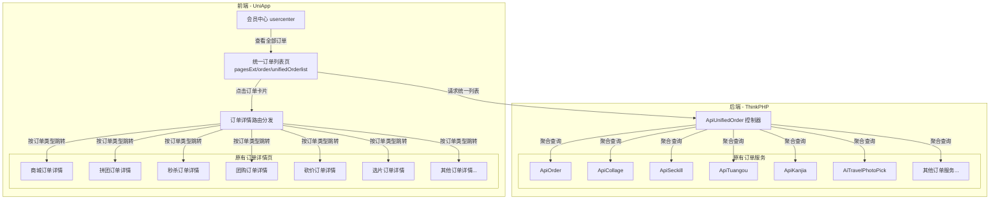
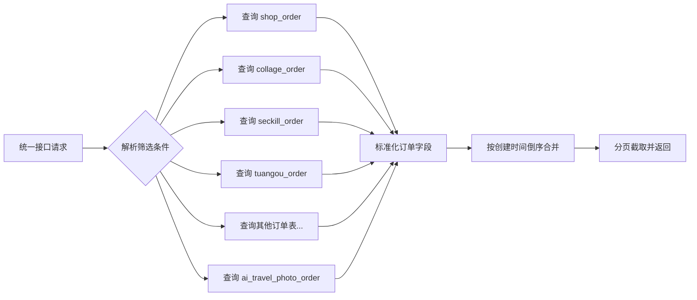
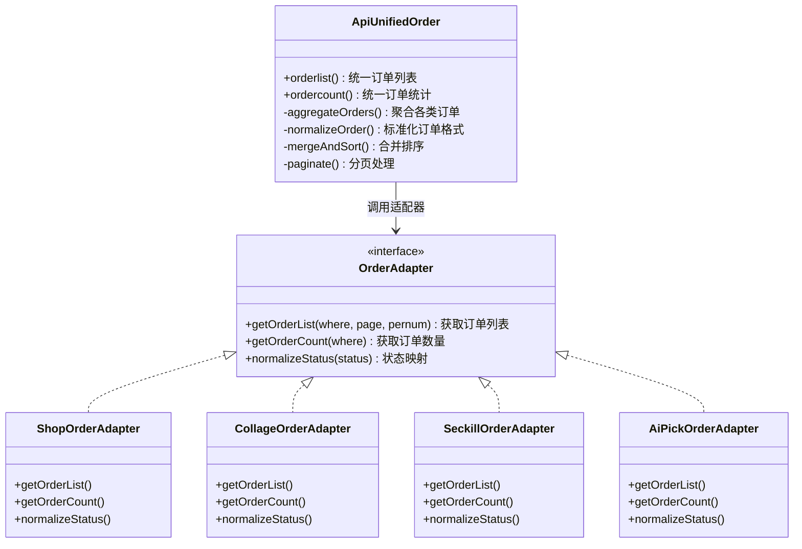
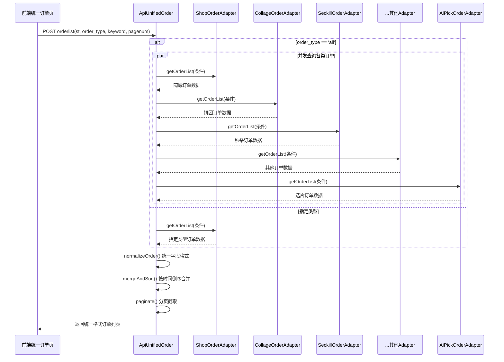
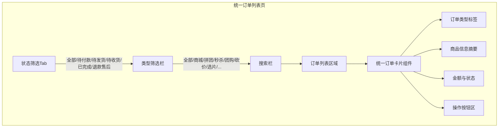

# 会员中心"我的订单"统一管理

## 1. 概述

### 1.1 背景

当前平台存在多种订单类型，各类订单分散在不同页面中，用户查看订单需要分别进入各模块的订单列表页面。这种分散式管理导致用户体验碎片化，无法一站式查看所有消费记录。

### 1.2 目标

将平台所有订单类型统一合并到会员中心的"我的订单"页面，包括但不限于：

| 订单类型 | 当前数据表 | 当前前端页面路径 | 当前后端接口 |
|---------|-----------|----------------|------------|
| 商城订单 | shop_order | pagesExt/order/orderlist | ApiOrder/orderlist |
| 拼团订单 | collage_order | activity/collage/orderlist | ApiCollage/orderlist |
| 秒杀订单 | seckill_order | activity/seckill/orderlist | ApiSeckill/orderlist |
| 团购订单 | tuangou_order | activity/tuangou/orderlist | ApiTuangou/orderlist |
| 砍价订单 | kanjia_order | activity/kanjia/orderlist | ApiKanjia/orderlist |
| 幸运拼团 | lucky_collage_order | activity/luckycollage/orderlist | ApiLuckyCollage/orderlist |
| 积分兑换 | scoreshop_order | activity/scoreshop/orderlist | ApiScoreshop/orderlist |
| 预约订单 | yuyue_order | activity/yuyue/orderlist | ApiYuyue/orderlist |
| 课程订单 | kecheng_order | activity/kecheng/orderlist | ApiKecheng/orderlist |
| 周期购订单 | cycle_order | pagesExt/cycle/orderlist | ApiCycle/orderlist |
| 选片订单 | ai_travel_photo_order | H5独立页面 | AiTravelPhotoPick API |

### 1.3 设计原则

- **非侵入式**：保留各模块原有的独立订单页面和接口不变，新增统一聚合层
- **渐进式**：优先聚合核心订单类型，后续可灵活扩展
- **性能优先**：统一查询使用轻量级聚合策略，避免大量表 JOIN 造成性能瓶颈

## 2. 架构

### 2.1 整体架构

### 2.2 数据聚合策略

采用**应用层聚合**方式，而非数据库层 UNION 查询。后端控制器从各订单表分别查询并标准化输出格式，在应用层按时间排序合并。

## 3. API 端点参考

### 3.1 统一订单列表接口

新增控制器 `ApiUnifiedOrder`，不修改现有各业务控制器。

**接口路径**：`ApiUnifiedOrder/orderlist`

**请求参数**：

| 参数名 | 类型 | 必填 | 说明 |
|-------|------|-----|------|
| st | string | 否 | 状态筛选：all / 0(待付款) / 1(待发货) / 2(待收货) / 3(已完成) / 10(退款/售后) |
| order_type | string | 否 | 订单类型筛选：all / shop / collage / seckill / tuangou / kanjia / lucky_collage / scoreshop / yuyue / kecheng / cycle / ai_pick |
| keyword | string | 否 | 搜索关键字（订单号 / 商品名） |
| pagenum | int | 否 | 页码，默认 1 |

**响应结构**：

| 字段 | 类型 | 说明 |
|-----|------|------|
| datalist | array | 统一格式的订单列表 |
| type_counts | object | 各类型订单数量统计 |
| status_counts | object | 各状态订单数量统计 |

**统一订单项字段规范**：

| 字段 | 类型 | 说明 |
|-----|------|------|
| id | int | 原始订单ID |
| order_type | string | 订单类型标识（shop/collage/seckill/tuangou/kanjia/lucky_collage/scoreshop/yuyue/kecheng/cycle/ai_pick） |
| order_type_name | string | 订单类型中文名（商城/拼团/秒杀/团购/砍价/幸运拼团/积分兑换/预约/课程/周期购/选片） |
| ordernum | string | 订单编号 |
| title | string | 订单标题（首个商品名称） |
| cover_image | string | 订单封面图（首个商品图片） |
| total_price | string | 实付金额 |
| status | int | 统一状态码（0-待付款 1-待发货 2-待收货 3-已完成 4-已关闭） |
| status_text | string | 状态描述文本 |
| item_count | int | 商品件数 |
| create_time | string | 创建时间（格式化） |
| create_timestamp | int | 创建时间戳（用于排序） |
| detail_url | string | 详情页跳转路径 |
| refund_status | int | 退款状态 |
| extra_info | object | 各类型订单特有信息（如拼团的团状态、选片的商品类型等） |

### 3.2 统一订单统计接口

**接口路径**：`ApiUnifiedOrder/ordercount`

**响应结构**：

| 字段 | 类型 | 说明 |
|-----|------|------|
| count0 | int | 待付款总数 |
| count1 | int | 待发货总数 |
| count2 | int | 待收货总数 |
| count3 | int | 已完成总数 |
| count_refund | int | 退款/售后总数 |

## 4. 数据模型与映射

### 4.1 订单状态统一映射

各业务订单状态码映射到统一状态码：

| 统一状态 | 统一码 | shop_order | collage_order | seckill_order | tuangou_order | kanjia_order | ai_travel_photo_order |
|---------|-------|-----------|--------------|--------------|--------------|-------------|---------------------|
| 待付款 | 0 | status=0 | status=0 | status=0 | status=0 | status=0 | status=0 |
| 待发货 | 1 | status=1 | status=1 | status=1 | status=1 | status=1 | status=1(已支付) |
| 待收货 | 2 | status=2 | status=2 | status=2 | status=2 | status=2 | — |
| 已完成 | 3 | status=3 | status=3 | status=3 | status=3 | status=3 | status=2(已完成) |
| 已关闭 | 4 | status=4 | status=4 | status=4 | status=4 | status=4 | status=3(已关闭) |

### 4.2 选片订单字段映射

选片订单（`ai_travel_photo_order`）需要特殊映射以适配统一格式：

| 统一字段 | 选片订单原字段 | 映射说明 |
|---------|-------------|---------|
| ordernum | order_no | 订单编号 |
| title | 关联 order_goods.goods_name | 取首条商品名 |
| cover_image | 关联 order_goods.goods_image | 取首条商品图 |
| total_price | actual_amount | 实付金额 |
| item_count | 关联 order_goods 数量汇总 | 商品件数 |
| create_time | create_time | 时间戳转格式化 |

## 5. 业务逻辑层

### 5.1 后端聚合服务架构

### 5.2 聚合查询流程

### 5.3 分页策略

由于数据来自多张表，采用**多源预取 + 应用层分页**的方式：

1. 每页展示 10 条记录
2. 从每张订单表预取 `pagenum × pernum` 条记录（确保合并后有足够数据）
3. 合并后按 `create_timestamp` 倒序排序
4. 截取目标页的数据返回
5. 当指定了 `order_type` 筛选时，直接走对应适配器的单表分页，性能等同于原有接口

### 5.4 性能优化措施

| 优化项 | 说明 |
|-------|------|
| 类型筛选直通 | 选择特定订单类型时，仅查询对应单表，不做多表聚合 |
| 数量缓存 | 各状态订单数量统计结果短期缓存（数分钟级别），减少重复计数查询 |
| 懒加载类型 | 初始加载仅查询已开启的订单模块，未开通的模块不参与查询 |
| 索引依赖 | 各订单表的 aid + mid + status + createtime 组合索引已存在 |

## 6. 前端组件架构

### 6.1 页面结构

新增统一订单列表页 `pagesExt/order/unifiedOrderlist.vue`，页面结构如下：

### 6.2 组件层级

| 组件 | 职责 |
|-----|------|
| unifiedOrderlist.vue | 页面容器，管理筛选状态、分页加载、调用统一接口 |
| dd-tab | 复用现有状态切换Tab组件 |
| unified-order-card | 新增组件，通用订单卡片，展示统一格式的订单信息 |
| order-type-filter | 新增组件，订单类型横向筛选（可滑动） |

### 6.3 统一订单卡片展示规范

每张订单卡片包含以下信息区域：

| 区域 | 内容 |
|------|------|
| 顶部栏 | 订单类型标签（彩色徽章）+ 订单号 + 订单状态文字 |
| 内容区 | 商品封面图 + 商品名称 + 规格/描述 + 单价 × 数量 |
| 底部栏 | 共计X件商品 实付:￥XX.XX |
| 操作区 | 根据订单类型和状态动态展示按钮（详情、去付款、查看物流、确认收货等） |

### 6.4 操作按钮路由映射

用户点击订单卡片或操作按钮时，根据 `order_type` 跳转到对应的原有详情页：

| order_type | 详情页路径 |
|-----------|-----------|
| shop | /pagesExt/order/detail?id={id} |
| collage | /activity/collage/orderdetail?id={id} |
| seckill | /activity/seckill/orderdetail?id={id} |
| tuangou | /activity/tuangou/orderdetail?id={id} |
| kanjia | /activity/kanjia/orderdetail?id={id} |
| lucky_collage | /activity/luckycollage/orderdetail?id={id} |
| scoreshop | /activity/scoreshop/orderdetail?id={id} |
| yuyue | /activity/yuyue/orderdetail?id={id} |
| kecheng | /activity/kecheng/orderdetail?id={id} |
| cycle | /pagesExt/cycle/orderdetail?id={id} |
| ai_pick | /xpd/order/detail?order_no={order_no}（新增选片订单详情页） |

### 6.5 会员中心入口改造

改造 `dp-userinfo` 组件中"我的订单"区域：

| 改造点 | 当前行为 | 改造后行为 |
|-------|---------|-----------|
| "查看全部订单"链接 | 跳转到 pagesExt/order/orderlist | 跳转到 pagesExt/order/unifiedOrderlist |
| 状态快捷入口 | 跳转到商城订单列表 | 跳转到统一订单列表，带状态参数 |
| 订单数量统计 | 仅统计商城订单 | 统计所有类型订单 |

### 6.6 路由配置

在 `pages.json` 中新增页面注册：

| 页面路径 | 导航栏标题 | 说明 |
|---------|-----------|------|
| pagesExt/order/unifiedOrderlist | 我的订单 | 统一订单列表页 |

## 7. 测试策略

### 7.1 单元测试

| 测试项 | 测试内容 |
|-------|---------|
| 适配器状态映射 | 验证每种订单类型的状态码正确映射到统一状态码 |
| 字段标准化 | 验证各类订单数据正确映射到统一字段格式 |
| 排序逻辑 | 验证多源数据合并后按时间倒序排列的正确性 |
| 分页准确性 | 验证多表聚合分页与预期页数据一致 |
| 类型筛选 | 验证指定类型时仅返回对应类型的订单 |
| 状态筛选 | 验证各状态筛选条件在所有订单类型上正确生效 |
| 关键字搜索 | 验证按订单号、商品名搜索在多种订单类型间均可命中 |
| 选片订单适配 | 验证 ai_travel_photo_order 的字段映射和状态转换正确 |
| 空数据处理 | 验证某些订单类型无数据时不影响其他类型的展示 |
| 模块未开通 | 验证未开通的业务模块不参与查询，不出现异常 |
